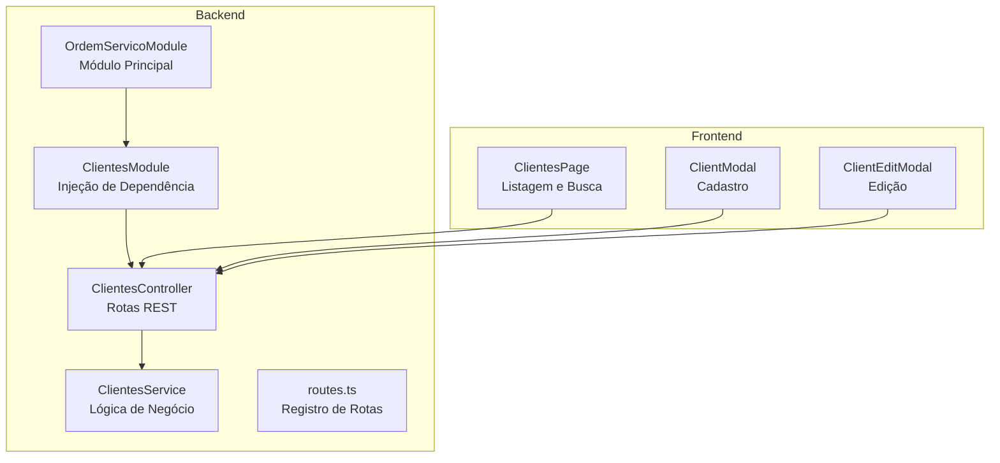
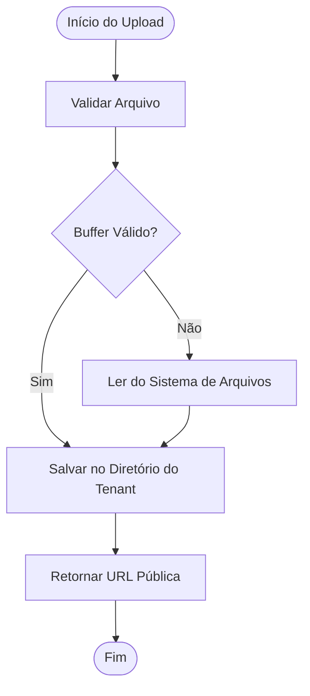
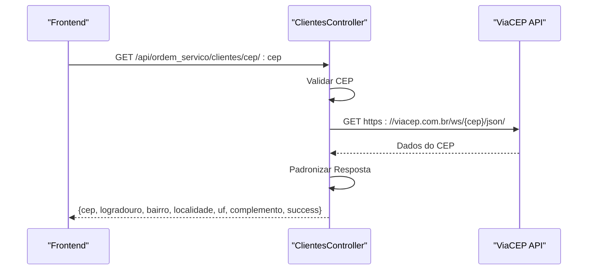

# Endpoints de Clientes

<cite>
**Arquivos Referenciados Neste Documento**
- [clientes.controller.ts](file://backend/clientes/clientes.controller.ts)
- [clientes.service.ts](file://backend/clientes/clientes.service.ts)
- [clientes.module.ts](file://backend/clientes/clientes.module.ts)
- [routes.ts](file://backend/routes.ts)
- [ordem_servico.module.ts](file://backend/ordem_servico.module.ts)
- [001_master.sql](file://backend/migrations/001_master.sql)
- [page.tsx](file://frontend/pages/clientes/page.tsx)
- [ClientModal.tsx](file://frontend/components/ClientModal.tsx)
- [ClientEditModal.tsx](file://frontend/components/ClientEditModal.tsx)
- [module.json](file://backend/module.json)
</cite>

## Sumário
- **Objetivo**: Documentar todos os endpoints REST do módulo de Clientes, incluindo métodos HTTP, URLs, parâmetros, respostas, tratamento de upload de imagens e integração com ViaCEP.
- **URL Base**: `/api/ordem_servico/clientes`
- **Permissões**: Todos os endpoints exigem autenticação JWT e permissão específica (ver seção de permissões).

## Estrutura Geral do Módulo



**Diagrama Fontes**
- [clientes.controller.ts](file://backend/clientes/clientes.controller.ts#L12-L182)
- [clientes.service.ts](file://backend/clientes/clientes.service.ts#L1-L253)
- [clientes.module.ts](file://backend/clientes/clientes.module.ts#L1-L14)
- [routes.ts](file://backend/routes.ts#L9-L17)
- [ordem_servico.module.ts](file://backend/ordem_servico.module.ts#L11-L35)

**Seção Fontes**
- [clientes.controller.ts](file://backend/clientes/clientes.controller.ts#L12-L182)
- [clientes.service.ts](file://backend/clientes/clientes.service.ts#L1-L253)
- [clientes.module.ts](file://backend/clientes/clientes.module.ts#L1-L14)
- [routes.ts](file://backend/routes.ts#L9-L17)
- [ordem_servico.module.ts](file://backend/ordem_servico.module.ts#L11-L35)

## Endpoints REST

### 1. Listar Clientes
- **Método**: GET
- **URL**: `/api/ordem_servico/clientes`
- **Descrição**: Retorna uma lista paginada de clientes com opção de busca textual.
- **Permissões**: `ordem_servico.clientes.view`
- **Parâmetros de Consulta**:
  - `search`: Texto para busca (opcional)
- **Resposta**:
  - Array de objetos representando clientes com campos: id, name, document, phone_primary, phone_secondary, image_url, is_active, email, observations, address_street, address_number, address_neighborhood, address_city, address_state, address_zip, address_complement
- **Exemplo de Requisição**:
  - `GET /api/ordem_servico/clientes?search=joão`
- **Exemplo de Resposta**:
  - ```json
    [
      {
        "id": "uuid",
        "name": "João Silva",
        "document": "123.456.789-00",
        "phone_primary": "(11) 99999-9999",
        "phone_secondary": "(11) 98888-8888",
        "image_url": "/api/ordem_servico/clientes/uploads/tenant1/1719234567890-123456789.jpg",
        "is_active": true,
        "email": "joao.silva@example.com",
        "observations": "Cliente preferencial",
        "address_street": "Rua Exemplo",
        "address_number": "123",
        "address_neighborhood": "Centro",
        "address_city": "São Paulo",
        "address_state": "SP",
        "address_zip": "01310-100",
        "address_complement": "Apto 101"
      }
    ]
    ```
- **Códigos de Status**:
  - 200: Sucesso
  - 401: Não autorizado
  - 403: Acesso negado
  - 500: Erro interno

**Seção Fontes**
- [clientes.controller.ts](file://backend/clientes/clientes.controller.ts#L21-L29)
- [clientes.service.ts](file://backend/clientes/clientes.service.ts#L15-L87)

### 2. Criar Novo Cliente
- **Método**: POST
- **URL**: `/api/ordem_servico/clientes`
- **Descrição**: Cria um novo cliente com os dados fornecidos.
- **Permissões**: `ordem_servico.clientes.create`
- **Parâmetros de Corpo**:
  - `name` (obrigatório): Nome completo
  - `phone_primary` (obrigatório): Telefone principal
  - `document`: CPF/CNPJ
  - `phone_secondary`: Telefone secundário
  - `email`: Email
  - `address_zip`: CEP
  - `address_street`: Rua
  - `address_number`: Número
  - `address_complement`: Complemento
  - `address_neighborhood`: Bairro
  - `address_city`: Cidade
  - `address_state`: UF
  - `observations`: Observações
  - `image_url`: URL da imagem
  - `is_active`: Status ativo (padrão: true)
- **Resposta**:
  - Objeto com o ID gerado e os dados fornecidos
- **Exemplo de Requisição**:
  - ```json
    {
      "name": "Maria Oliveira",
      "phone_primary": "(21) 99999-9999",
      "document": "987.654.321-00",
      "email": "maria.oliveira@example.com",
      "address_zip": "20000-000",
      "address_street": "Av. Brasil",
      "address_number": "456",
      "address_neighborhood": "Copacabana",
      "address_city": "Rio de Janeiro",
      "address_state": "RJ",
      "observations": "Cliente VIP",
      "image_url": "/api/ordem_servico/clientes/uploads/tenant1/1719234567890-987654321.jpg",
      "is_active": true
    }
    ```
- **Exemplo de Resposta**:
  - ```json
    {
      "id": "uuid",
      "name": "Maria Oliveira",
      "phone_primary": "(21) 99999-9999",
      "document": "987.654.321-00",
      "email": "maria.oliveira@example.com",
      "address_zip": "20000-000",
      "address_street": "Av. Brasil",
      "address_number": "456",
      "address_neighborhood": "Copacabana",
      "address_city": "Rio de Janeiro",
      "address_state": "RJ",
      "observations": "Cliente VIP",
      "image_url": "/api/ordem_servico/clientes/uploads/tenant1/1719234567890-987654321.jpg",
      "is_active": true
    }
    ```
- **Códigos de Status**:
  - 201: Criado
  - 400: Dados inválidos
  - 401: Não autorizado
  - 403: Acesso negado
  - 500: Erro interno

**Seção Fontes**
- [clientes.controller.ts](file://backend/clientes/clientes.controller.ts#L42-L52)
- [clientes.service.ts](file://backend/clientes/clientes.service.ts#L96-L149)

### 3. Buscar Cliente Específico
- **Método**: GET
- **URL**: `/api/ordem_servico/clientes/:id`
- **Descrição**: Retorna os detalhes de um cliente específico.
- **Permissões**: `ordem_servico.clientes.view_details`
- **Parâmetros de Caminho**:
  - `id`: UUID do cliente
- **Resposta**:
  - Objeto com todos os campos do cliente
- **Exemplo de Requisição**:
  - `GET /api/ordem_servico/clientes/123e4567-e89b-12d3-a456-426614174000`
- **Exemplo de Resposta**:
  - ```json
    {
      "id": "123e4567-e89b-12d3-a456-426614174000",
      "name": "Carlos Souza",
      "document": "111.222.333-44",
      "phone_primary": "(31) 99999-9999",
      "phone_secondary": "(31) 98888-8888",
      "email": "carlos.souza@example.com",
      "address_zip": "30130-000",
      "address_street": "Rua das Flores",
      "address_number": "789",
      "address_neighborhood": "Funcionários",
      "address_city": "Belo Horizonte",
      "address_state": "MG",
      "observations": "Cliente recorrente",
      "image_url": "/api/ordem_servico/clientes/uploads/tenant1/1719234567890-456789123.jpg",
      "is_active": true
    }
    ```
- **Códigos de Status**:
  - 200: Sucesso
  - 404: Cliente não encontrado
  - 401: Não autorizado
  - 403: Acesso negado
  - 500: Erro interno

**Seção Fontes**
- [clientes.controller.ts](file://backend/clientes/clientes.controller.ts#L31-L40)
- [clientes.service.ts](file://backend/clientes/clientes.service.ts#L88-L94)

### 4. Atualizar Cliente
- **Método**: PUT
- **URL**: `/api/ordem_servico/clientes/:id`
- **Descrição**: Atualiza os dados de um cliente existente.
- **Permissões**: `ordem_servico.clientes.edit`
- **Parâmetros de Caminho**:
  - `id`: UUID do cliente
- **Parâmetros de Corpo**:
  - Mesmos campos do cadastro (exceto ID)
- **Resposta**:
  - Objeto com os dados atualizados
- **Exemplo de Requisição**:
  - ```json
    {
      "name": "Carlos Silva",
      "phone_primary": "(31) 99999-9999",
      "document": "111.222.333-44",
      "email": "carlos.silva@example.com",
      "address_zip": "30130-000",
      "address_street": "Rua das Flores",
      "address_number": "789",
      "address_neighborhood": "Funcionários",
      "address_city": "Belo Horizonte",
      "address_state": "MG",
      "observations": "Cliente recorrente",
      "image_url": "/api/ordem_servico/clientes/uploads/tenant1/1719234567890-456789123.jpg",
      "is_active": false
    }
    ```
- **Exemplo de Resposta**:
  - ```json
    {
      "id": "123e4567-e89b-12d3-a456-426614174000",
      "name": "Carlos Silva",
      "phone_primary": "(31) 99999-9999",
      "document": "111.222.333-44",
      "email": "carlos.silva@example.com",
      "address_zip": "30130-000",
      "address_street": "Rua das Flores",
      "address_number": "789",
      "address_neighborhood": "Funcionários",
      "address_city": "Belo Horizonte",
      "address_state": "MG",
      "observations": "Cliente recorrente",
      "image_url": "/api/ordem_servico/clientes/uploads/tenant1/1719234567890-456789123.jpg",
      "is_active": false
    }
    ```
- **Códigos de Status**:
  - 200: Sucesso
  - 400: Dados inválidos
  - 401: Não autorizado
  - 403: Acesso negado
  - 404: Cliente não encontrado
  - 500: Erro interno

**Seção Fontes**
- [clientes.controller.ts](file://backend/clientes/clientes.controller.ts#L54-L64)
- [clientes.service.ts](file://backend/clientes/clientes.service.ts#L151-L210)

### 5. Deletar Cliente
- **Método**: DELETE
- **URL**: `/api/ordem_servico/clientes/:id`
- **Descrição**: Remove um cliente (soft delete). Impede exclusão se houver Ordens de Serviço associadas.
- **Permissões**: `ordem_servico.clientes.delete`
- **Parâmetros de Caminho**:
  - `id`: UUID do cliente
- **Resposta**:
  - `{ success: true }`
- **Exemplo de Requisição**:
  - `DELETE /api/ordem_servico/clientes/123e4567-e89b-12d3-a456-426614174000`
- **Exemplo de Resposta**:
  - ```json
    { "success": true }
    ```
- **Códigos de Status**:
  - 200: Sucesso
  - 400: Não é possível excluir (existem Ordens de Serviço associadas)
  - 401: Não autorizado
  - 403: Acesso negado
  - 404: Cliente não encontrado
  - 500: Erro interno

**Seção Fontes**
- [clientes.controller.ts](file://backend/clientes/clientes.controller.ts#L66-L72)
- [clientes.service.ts](file://backend/clientes/clientes.service.ts#L212-L252)

### 6. Upload de Imagem de Cliente
- **Método**: POST
- **URL**: `/api/ordem_servico/clientes/upload`
- **Descrição**: Faz upload de imagem para um cliente. O upload é feito em partes e salvo em diretório isolado por tenant.
- **Permissões**: `ordem_servico.clientes.create` (para cadastro) e `ordem_servico.clientes.edit` (para edição)
- **Parâmetros de Formulário**:
  - `file`: Arquivo de imagem (JPEG/PNG)
- **Resposta**:
  - `{ url: "/api/ordem_servico/clientes/uploads/{tenantId}/{filename}" }`
- **Exemplo de Requisição**:
  - `POST /api/ordem_servico/clientes/upload` com multipart/form-data contendo `file`
- **Exemplo de Resposta**:
  - ```json
    { "url": "/api/ordem_servico/clientes/uploads/tenant1/1719234567890-123456789.jpg" }
    ```
- **Códigos de Status**:
  - 201: Sucesso
  - 400: Nenhum arquivo enviado
  - 500: Erro ao processar upload

**Seção Fontes**
- [clientes.controller.ts](file://backend/clientes/clientes.controller.ts#L74-L119)

### 7. Servir Imagem de Cliente
- **Método**: GET
- **URL**: `/api/ordem_servico/clientes/uploads/:tenantId/:filename`
- **Descrição**: Retorna a imagem do cliente armazenada no servidor.
- **Permissões**: Nenhuma (acesso público)
- **Parâmetros de Caminho**:
  - `tenantId`: ID do tenant
  - `filename`: Nome do arquivo
- **Resposta**:
  - Arquivo de imagem
- **Exemplo de Requisição**:
  - `GET /api/ordem_servico/clientes/uploads/tenant1/1719234567890-123456789.jpg`
- **Códigos de Status**:
  - 200: Sucesso
  - 403: Acesso negado
  - 404: Arquivo não encontrado
  - 500: Erro interno

**Seção Fontes**
- [clientes.controller.ts](file://backend/clientes/clientes.controller.ts#L121-L140)

### 8. Consultar CEP (ViaCEP)
- **Método**: GET
- **URL**: `/api/ordem_servico/clientes/cep/:cep`
- **Descrição**: Consulta o endereço através do CEP usando a API ViaCEP e retorna dados padronizados.
- **Permissões**: Nenhuma (acesso público)
- **Parâmetros de Caminho**:
  - `cep`: Código postal (somente números, 8 dígitos)
- **Resposta**:
  - Objeto com campos: cep, logradouro, bairro, localidade, uf, complemento, success
- **Exemplo de Requisição**:
  - `GET /api/ordem_servico/clientes/cep/01310100`
- **Exemplo de Resposta**:
  - ```json
    {
      "cep": "01310100",
      "logradouro": "Avenida Paulista",
      "bairro": "Bela Vista",
      "localidade": "São Paulo",
      "uf": "SP",
      "complemento": "",
      "success": true
    }
    ```
- **Códigos de Status**:
  - 200: Sucesso
  - 400: CEP deve ter 8 dígitos
  - 404: CEP não encontrado
  - 500: Erro interno ao consultar CEP

**Seção Fontes**
- [clientes.controller.ts](file://backend/clientes/clientes.controller.ts#L142-L181)

## Tratamento de Upload de Imagens



**Diagrama Fontes**
- [clientes.controller.ts](file://backend/clientes/clientes.controller.ts#L76-L119)

## Integração com ViaCEP



**Diagrama Fontes**
- [clientes.controller.ts](file://backend/clientes/clientes.controller.ts#L142-L181)

## Permissões e Segurança

- **Autenticação**: Todos os endpoints exigem JWT (autenticação via `JwtAuthGuard`)
- **Autorização**: Permissões específicas por operação:
  - `ordem_servico.clientes.view`: Listagem e busca
  - `ordem_servico.clientes.view_details`: Detalhe de cliente
  - `ordem_servico.clientes.create`: Criação de cliente
  - `ordem_servico.clientes.edit`: Edição de cliente
  - `ordem_servico.clientes.delete`: Exclusão de cliente
- **Proteção de Arquivos**: Acesso aos uploads é restrito ao diretório correto e ao tenant

**Seção Fontes**
- [clientes.controller.ts](file://backend/clientes/clientes.controller.ts#L13-L182)

## Exemplos Práticos de Uso

### Frontend - Listagem de Clientes
- O frontend faz requisições GET para `/api/ordem_servico/clientes` com parâmetro `search`
- Atualiza a interface com os resultados

**Seção Fontes**
- [page.tsx](file://frontend/pages/clientes/page.tsx#L61-L80)

### Frontend - Cadastro de Cliente
- O modal de cadastro envia POST para `/api/ordem_servico/clientes` com os dados do formulário
- Para upload de imagem, envia multipart/form-data para `/api/ordem_servico/clientes/upload`

**Seção Fontes**
- [ClientModal.tsx](file://frontend/components/ClientModal.tsx#L347-L366)
- [ClientModal.tsx](file://frontend/components/ClientModal.tsx#L289-L315)

### Frontend - Edição de Cliente
- O modal de edição envia PUT para `/api/ordem_servico/clientes/:id` com os dados atualizados
- Para upload de imagem, envia multipart/form-data para `/api/ordem_servico/clientes/upload`

**Seção Fontes**
- [ClientEditModal.tsx](file://frontend/components/ClientEditModal.tsx#L384-L402)
- [ClientEditModal.tsx](file://frontend/components/ClientEditModal.tsx#L324-L350)

## Estrutura de Dados

### Tabela de Clientes (PostgreSQL)
- **Nome**: `mod_ordem_servico_clients`
- **Campos principais**:
  - `id`: UUID (chave primária)
  - `tenant_id`: Texto (identificador do tenant)
  - `name`: Texto (nome completo)
  - `document`: Texto (CPF/CNPJ)
  - `phone_primary`: Texto (telefone principal)
  - `phone_secondary`: Texto (telefone secundário)
  - `email`: Texto (email)
  - `address`: Texto (endereço completo)
  - `address_zip`: Texto (CEP)
  - `address_street`: Texto (rua)
  - `address_number`: Texto (número)
  - `address_complement`: Texto (complemento)
  - `address_neighborhood`: Texto (bairro)
  - `address_city`: Texto (cidade)
  - `address_state`: Texto (UF)
  - `observations`: Texto (observações)
  - `image_url`: Texto (URL da imagem)
  - `is_active`: Booleano (status ativo)
  - `created_at`: Timestamp (data de criação)
  - `updated_at`: Timestamp (data de atualização)
  - `deleted_at`: Timestamp (exclusão lógica)

**Seção Fontes**
- [001_master.sql](file://backend/migrations/001_master.sql#L47-L68)

## Considerações de Desempenho

- **Busca com Filtro**: A busca com `search` limita resultados a 20 e evita buscas muito curtas (< 2 caracteres)
- **Listagem Padrão**: Limita a 50 registros por página
- **Índices**: A migração cria índices para otimizar consultas por tenant, nome, documento, cidade, estado, status, email e CEP

**Seção Fontes**
- [clientes.service.ts](file://backend/clientes/clientes.service.ts#L18-L21)
- [clientes.service.ts](file://backend/clientes/clientes.service.ts#L59-L86)
- [001_master.sql](file://backend/migrations/001_master.sql#L334-L342)

## Guia de Troubleshooting

- **Erro 401 (Não Autorizado)**: Verifique o token JWT e o cabeçalho Authorization
- **Erro 403 (Acesso Negado)**: Verifique as permissões do usuário
- **Erro 400 (Dados Inválidos)**: Confirme que `name` e `phone_primary` estão presentes
- **Erro 404 (Cliente Não Encontrado)**: Confirme o ID do cliente
- **Erro 500 (Erro Interno)**: Verifique logs do servidor e conexão com o banco de dados

**Seção Fontes**
- [clientes.controller.ts](file://backend/clientes/clientes.controller.ts#L36-L38)
- [clientes.controller.ts](file://backend/clientes/clientes.controller.ts#L49-L51)
- [clientes.controller.ts](file://backend/clientes/clientes.controller.ts#L172-L180)

## Conclusão

O módulo de Clientes oferece uma API REST completa com todas as operações CRUD, além de funcionalidades avançadas de upload de imagens e integração com ViaCEP. A implementação segue boas práticas de segurança com autenticação e autorização, além de proteção de arquivos e validações adequadas.