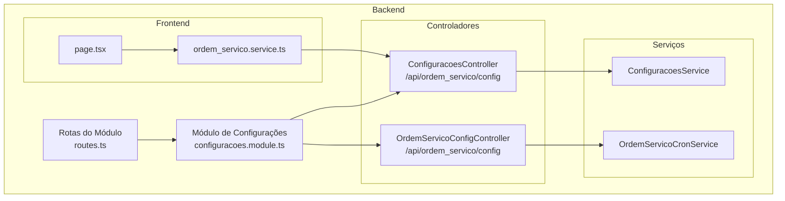
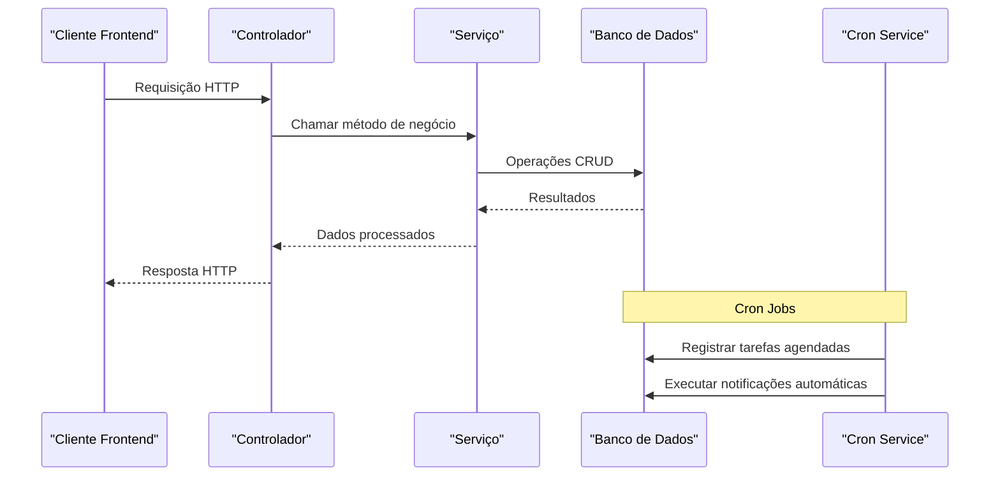
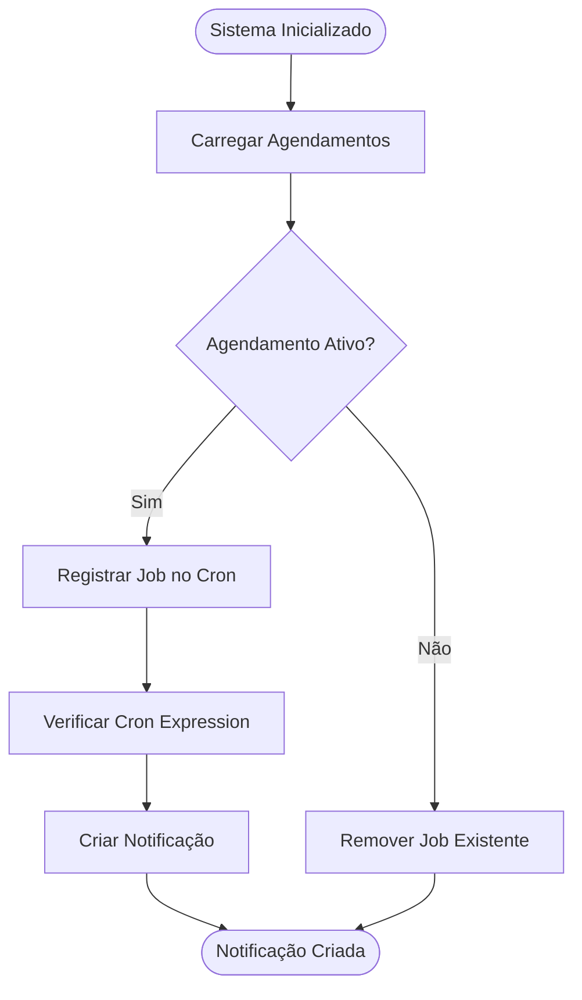

# Endpoints de Configurações do Sistema

<cite>
**Arquivos Referenciados Neste Documento**
- [configuracoes.controller.ts](file://backend/configuracoes/configuracoes.controller.ts)
- [configuracoes.service.ts](file://backend/configuracoes/configuracoes.service.ts)
- [ordem-servico-config.controller.ts](file://backend/core/ordem-servico-config.controller.ts)
- [ordem-servico-cron.service.ts](file://backend/core/ordem-servico-cron.service.ts)
- [routes.ts](file://backend/routes.ts)
- [configuracoes.module.ts](file://backend/configuracoes/configuracoes.module.ts)
- [ordem_servico.service.ts](file://frontend/services/ordem_servico.service.ts)
- [page.tsx](file://frontend/pages/configuracoes/page.tsx)
</cite>

## Sumário
1. [Introdução](#introdução)
2. [Estrutura do Projeto](#estrutura-do-projeto)
3. [Componentes Principais](#componentes-principais)
4. [Visão Geral da Arquitetura](#visão-geral-da-arquitetura)
5. [Análise Detalhada dos Endpoints](#análise-detalhada-dos-endpoints)
6. [Análise de Dependências](#análise-de-dependências)
7. [Considerações de Desempenho](#considerações-de-desempenho)
8. [Guia de Solução de Problemas](#guia-de-solução-de-problemas)
9. [Conclusão](#conclusão)

## Introdução
Este documento apresenta a documentação completa de todos os endpoints REST do módulo de Configurações do Sistema. Ele cobre métodos HTTP, URLs, parâmetros de requisição e respostas esperadas, incluindo configurações do sistema, notificações automáticas, cron jobs e parâmetros do módulo. Especificamente, detalha os endpoints para configuração de notificações programadas e integração com o serviço de cron, fornecendo descrições funcionais, parâmetros obrigatórios e opcionais, exemplos práticos de requisição e resposta, códigos de status HTTP e possíveis erros.

## Estrutura do Projeto
O módulo de configurações é composto por dois controladores principais:
- Controlador de configurações genéricas e notificações
- Controlador de configurações avançadas com permissões e técnicos



**Diagrama Fonte**
- [routes.ts](file://backend/routes.ts#L9-L16)
- [configuracoes.module.ts](file://backend/configuracoes/configuracoes.module.ts#L12-L29)

**Seção Fonte**
- [routes.ts](file://backend/routes.ts#L1-L17)
- [configuracoes.module.ts](file://backend/configuracoes/configuracoes.module.ts#L1-L30)

## Componentes Principais
O módulo de configurações é composto pelos seguintes componentes principais:

### Controladores
- **ConfiguracoesController**: Fornece endpoints para configurações básicas, notificações e IA
- **OrdemServicoConfigController**: Controlador avançado com permissões e gestão de usuários

### Serviços
- **ConfiguracoesService**: Implementa a lógica de negócio para configurações
- **OrdemServicoCronService**: Gerencia a integração com o serviço de cron

### Frontend
- **ordem_servico.service.ts**: Serviço frontend para comunicação com os endpoints
- **page.tsx**: Interface de configurações no frontend

**Seção Fonte**
- [configuracoes.controller.ts](file://backend/configuracoes/configuracoes.controller.ts#L1-L136)
- [ordem-servico-config.controller.ts](file://backend/core/ordem-servico-config.controller.ts#L1-L254)
- [configuracoes.service.ts](file://backend/configuracoes/configuracoes.service.ts#L1-L331)

## Visão Geral da Arquitetura
A arquitetura segue o padrão MVC com injeção de dependência do NestJS. Os controladores expõem endpoints REST protegidos por autenticação JWT e, em alguns casos, por permissões administrativas.



**Diagrama Fonte**
- [configuracoes.controller.ts](file://backend/configuracoes/configuracoes.controller.ts#L6-L136)
- [configuracoes.service.ts](file://backend/configuracoes/configuracoes.service.ts#L1-L331)
- [ordem-servico-cron.service.ts](file://backend/core/ordem-servico-cron.service.ts#L1-L84)

## Análise Detalhada dos Endpoints

### Endpoints de Configurações Básicas

#### GET /api/ordem_servico/config/settings
**Descrição**: Retorna todas as configurações genéricas do sistema para o tenant atual
**Autenticação**: JWT obrigatória
**Parâmetros de Requisição**: Nenhum
**Resposta**: Array de objetos com configurações
**Exemplo de Resposta**:
```json
[
  {
    "config_key": "condicoes_execucao",
    "config_value": "Texto das condições..."
  },
  {
    "config_key": "outro_parametro",
    "config_value": "valor"
  }
]
```

**Códigos de Status**:
- 200: Sucesso
- 500: Erro interno do servidor

**Seção Fonte**
- [configuracoes.controller.ts](file://backend/configuracoes/configuracoes.controller.ts#L115-L124)
- [configuracoes.service.ts](file://backend/configuracoes/configuracoes.service.ts#L283-L296)

#### POST /api/ordem_servico/config/settings
**Descrição**: Salva uma configuração genérica específica
**Autenticação**: JWT obrigatória
**Parâmetros de Requisição**:
- config_key (string): Chave da configuração
- config_value (any): Valor da configuração (string ou objeto)
**Resposta**: Objeto com sucesso
**Exemplo de Requisição**:
```json
{
  "config_key": "condicoes_execucao",
  "config_value": "Texto completo das condições de execução"
}
```

**Códigos de Status**:
- 201: Criado com sucesso
- 400: Requisição inválida
- 500: Erro interno do servidor

**Seção Fonte**
- [configuracoes.controller.ts](file://backend/configuracoes/configuracoes.controller.ts#L126-L135)
- [configuracoes.service.ts](file://backend/configuracoes/configuracoes.service.ts#L299-L329)

### Endpoints de Notificações Automáticas

#### GET /api/ordem_servico/config/notifications
**Descrição**: Retorna todas as notificações programadas do sistema
**Autenticação**: JWT obrigatória
**Parâmetros de Requisição**: Nenhum
**Resposta**: Array de agendas de notificação
**Exemplo de Resposta**:
```json
[
  {
    "id": "uuid",
    "title": "Lembrete Diário",
    "content": "Mensagem de lembrete diário",
    "audience": "all",
    "cron_expression": "0 9 * * *",
    "enabled": true,
    "created_at": "2024-01-01T00:00:00Z"
  }
]
```

**Códigos de Status**:
- 200: Sucesso
- 500: Erro interno do servidor

**Seção Fonte**
- [configuracoes.controller.ts](file://backend/configuracoes/configuracoes.controller.ts#L58-L67)
- [configuracoes.service.ts](file://backend/configuracoes/configuracoes.service.ts#L139-L154)

#### POST /api/ordem_servico/config/notifications
**Descrição**: Cria uma nova notificação programada
**Autenticação**: JWT obrigatória + Permissões administrativas
**Parâmetros de Requisição**:
- title (string): Título da notificação
- content (string): Conteúdo da notificação
- audience (string, opcional): Público-alvo ("all", "admin", "super_admin")
- cronExpression (string): Expressão cron para agendamento
- enabled (boolean, opcional): Ativar/desativar a notificação
**Resposta**: Confirmação de criação
**Exemplo de Requisição**:
```json
{
  "title": "Relatório Diário",
  "content": "Relatório de atividades do dia",
  "audience": "admin",
  "cronExpression": "0 18 * * *",
  "enabled": true
}
```

**Códigos de Status**:
- 201: Criado com sucesso
- 400: Requisição inválida
- 500: Erro interno do servidor

**Seção Fonte**
- [configuracoes.controller.ts](file://backend/configuracoes/configuracoes.controller.ts#L69-L78)
- [configuracoes.service.ts](file://backend/configuracoes/configuracoes.service.ts#L156-L177)

### Endpoints de Gestão de Usuários e Técnicos

#### GET /api/ordem_servico/config/users
**Descrição**: Retorna todos os usuários do sistema com suas permissões específicas
**Autenticação**: JWT obrigatória + Permissões administrativas
**Parâmetros de Requisição**: Nenhum
**Resposta**: Array de usuários com papéis
**Exemplo de Resposta**:
```json
[
  {
    "id": "uuid",
    "name": "João Silva",
    "email": "joao@example.com",
    "system_role": "ADMIN",
    "os_roles": {
      "admin": true,
      "attendant": true,
      "technician": false
    }
  }
]
```

**Códigos de Status**:
- 200: Sucesso
- 500: Erro interno do servidor

**Seção Fonte**
- [ordem-servico-config.controller.ts](file://backend/core/ordem-servico-config.controller.ts#L158-L218)

#### PUT /api/ordem_servico/config/users/{id}/technician
**Descrição**: Altera o status de um usuário como técnico
**Autenticação**: JWT obrigatória + Permissões administrativas
**Parâmetros de Requisição**:
- is_technician (boolean): Status técnico do usuário
**Resposta**: Confirmação de atualização
**Exemplo de Requisição**:
```json
{
  "is_technician": true
}
```

**Códigos de Status**:
- 200: Sucesso
- 400: Requisição inválida
- 500: Erro interno do servidor

**Seção Fonte**
- [ordem-servico-config.controller.ts](file://backend/core/ordem-servico-config.controller.ts#L233-L253)

### Endpoints de Permissões

#### GET /api/ordem_servico/config/profile-permissions
**Descrição**: Retorna o mapa de permissões por perfil
**Autenticação**: JWT obrigatória + Permissões administrativas
**Parâmetros de Requisição**: Nenhum
**Resposta**: Objeto estruturado de permissões
**Exemplo de Resposta**:
```json
{
  "dashboard_view": {
    "admin": true,
    "technician": true,
    "attendant": true
  },
  "orders_create": {
    "admin": true,
    "technician": true,
    "attendant": true
  }
}
```

**Códigos de Status**:
- 200: Sucesso
- 500: Erro interno do servidor

**Seção Fonte**
- [configuracoes.controller.ts](file://backend/configuracoes/configuracoes.controller.ts#L36-L45)
- [configuracoes.service.ts](file://backend/configuracoes/configuracoes.service.ts#L68-L98)

#### POST /api/ordem_servico/config/profile-permissions
**Descrição**: Atualiza o mapa de permissões por perfil
**Autenticação**: JWT obrigatória + Permissões administrativas
**Parâmetros de Requisição**:
- permissions (object): Mapa de permissões a serem atualizadas
**Resposta**: Confirmação de atualização
**Exemplo de Requisição**:
```json
{
  "orders_view": {
    "admin": true,
    "technician": false,
    "attendant": true
  }
}
```

**Códigos de Status**:
- 200: Sucesso
- 400: Requisição inválida
- 500: Erro interno do servidor

**Seção Fonte**
- [configuracoes.controller.ts](file://backend/configuracoes/configuracoes.controller.ts#L47-L56)
- [configuracoes.service.ts](file://backend/configuracoes/configuracoes.service.ts#L100-L137)

### Endpoints de Configurações de IA

#### GET /api/ordem_servico/config/ai
**Descrição**: Retorna a configuração atual da integração de IA
**Autenticação**: JWT obrigatória + Permissões administrativas
**Parâmetros de Requisição**: Nenhum
**Resposta**: Configuração de IA com API Key mascarada
**Exemplo de Resposta**:
```json
{
  "provider": "openai",
  "apiKey": "********1234",
  "model": "gpt-4o-mini",
  "temperature": 0.3,
  "maxTokens": 800,
  "enabled": true
}
```

**Códigos de Status**:
- 200: Sucesso
- 500: Erro interno do servidor

**Seção Fonte**
- [configuracoes.controller.ts](file://backend/configuracoes/configuracoes.controller.ts#L80-L89)
- [configuracoes.service.ts](file://backend/configuracoes/configuracoes.service.ts#L179-L203)

#### POST /api/ordem_servico/config/ai
**Descrição**: Atualiza a configuração da integração de IA
**Autenticação**: JWT obrigatória + Permissões administrativas
**Parâmetros de Requisição**:
- provider (string): Provedor de IA
- apiKey (string): Chave de API (pode ser mascarada)
- model (string): Modelo de IA
- temperature (number): Temperatura de geração
- maxTokens (number): Máximo de tokens
- enabled (boolean): Ativar/desativar IA
**Resposta**: Confirmação de atualização
**Exemplo de Requisição**:
```json
{
  "provider": "openai",
  "apiKey": "sk-...1234",
  "model": "gpt-4o-mini",
  "temperature": 0.3,
  "maxTokens": 800,
  "enabled": true
}
```

**Códigos de Status**:
- 200: Sucesso
- 400: Requisição inválida
- 500: Erro interno do servidor

**Seção Fonte**
- [configuracoes.controller.ts](file://backend/configuracoes/configuracoes.controller.ts#L91-L100)
- [configuracoes.service.ts](file://backend/configuracoes/configuracoes.service.ts#L205-L241)

#### POST /api/ordem_servico/config/ai/test
**Descrição**: Testa a configuração de IA atual
**Autenticação**: JWT obrigatória + Permissões administrativas
**Parâmetros de Requisição**:
- Mesmos parâmetros do endpoint de atualização
**Resposta**: Resultado do teste com resposta da IA
**Exemplo de Resposta**:
```json
{
  "success": true,
  "response": "Resposta da IA..."
}
```

**Códigos de Status**:
- 200: Sucesso
- 500: Erro interno do servidor

**Seção Fonte**
- [configuracoes.controller.ts](file://backend/configuracoes/configuracoes.controller.ts#L102-L111)
- [configuracoes.service.ts](file://backend/configuracoes/configuracoes.service.ts#L254-L281)

### Endpoints de Tipos de Serviço e Equipamento

#### GET /api/ordem_servico/tipos-servico
**Descrição**: Retorna todos os tipos de serviço cadastrados
**Autenticação**: JWT obrigatória
**Parâmetros de Requisição**: Nenhum
**Resposta**: Array de tipos de serviço
**Exemplo de Resposta**:
```json
[
  {
    "id": "uuid",
    "nome": "Manutenção Preventiva",
    "is_default": false,
    "created_at": "2024-01-01T00:00:00Z"
  }
]
```

**Códigos de Status**:
- 200: Sucesso
- 500: Erro interno do servidor

**Seção Fonte**
- [tipos-servico.controller.ts](file://backend/configuracoes/tipos-servico.controller.ts#L10-L14)

#### GET /api/ordem_servico/tipos-equipamento
**Descrição**: Retorna todos os tipos de equipamento cadastrados
**Autenticação**: JWT obrigatória
**Parâmetros de Requisição**: Nenhum
**Resposta**: Array de tipos de equipamento
**Exemplo de Resposta**:
```json
[
  {
    "id": "uuid",
    "nome": "Notebook",
    "created_at": "2024-01-01T00:00:00Z"
  }
]
```

**Códigos de Status**:
- 200: Sucesso
- 500: Erro interno do servidor

**Seção Fonte**
- [tipos-equipamento.controller.ts](file://backend/configuracoes/tipos-equipamento.controller.ts#L10-L14)

## Análise de Dependências

### Integração com Cron Service
O sistema de notificações automáticas é integrado com um serviço de cron central:



**Diagrama Fonte**
- [ordem-servico-cron.service.ts](file://backend/core/ordem-servico-cron.service.ts#L20-L62)

### Mapeamento de URLs

```mermaid
graph LR
subgraph "Configurações Básicas"
A["/api/ordem_servico/config/settings<br/>GET/POST"]
end
subgraph "Notificações"
B["/api/ordem_servico/config/notifications<br/>GET/POST"]
end
subgraph "Usuários e Permissões"
C["/api/ordem_servico/config/users<br/>GET"]
D["/api/ordem_servico/config/users/{id}/technician<br/>PUT"]
E["/api/ordem_servico/config/profile-permissions<br/>GET/POST"]
end
subgraph "IA"
F["/api/ordem_servico/config/ai<br/>GET/POST"]
G["/api/ordem_servico/config/ai/test<br/>POST"]
end
subgraph "Tipos"
H["/api/ordem_servico/tipos-servico<br/>GET/POST/PUT/DELETE"]
I["/api/ordem_servico/tipos-equipamento<br/>GET/POST/PUT/DELETE"]
end
A --> B
B --> C
C --> D
D --> E
E --> F
F --> G
G --> H
H --> I
```


**Diagrama Fonte**
- [configuracoes.controller.ts](file://backend/configuracoes/configuracoes.controller.ts#L6-L136)
- [ordem-servico-config.controller.ts](file://backend/core/ordem-servico-config.controller.ts#L9-L254)

**Seção Fonte**
- [ordem-servico-cron.service.ts](file://backend/core/ordem-servico-cron.service.ts#L1-L84)

## Considerações de Desempenho
- As operações de banco de dados utilizam consultas SQL diretas para otimizar o desempenho
- O serviço de cron registra apenas agendamentos ativos, reduzindo sobrecarga
- As respostas são estruturadas para minimizar o tamanho dos dados transferidos
- O cache de notificações é gerenciado automaticamente pelo serviço de cron

## Guia de Solução de Problemas

### Erros Comuns e Soluções

#### Erro 401 - Não Autorizado
**Causas**: Token JWT inválido ou expirado
**Solução**: Realizar login novamente e renovar o token

#### Erro 403 - Acesso Negado
**Causas**: Permissões insuficientes para o endpoint
**Solução**: Verificar papéis administrativos do usuário

#### Erro 400 - Requisição Inválida
**Causas**: Parâmetros obrigatórios ausentes ou inválidos
**Solução**: Verificar os campos obrigatórios conforme especificação

#### Erro 500 - Erro Interno
**Causas**: Falha na comunicação com o banco de dados
**Solução**: Verificar logs do servidor e conexão com o banco

### Monitoramento de Cron Jobs
O sistema mantém registros de execução dos jobs de notificação automática. Em caso de falhas, verificar:
- Expressão cron válida
- Conexão com o banco de dados
- Configurações de permissões

**Seção Fonte**
- [ordem-servico-cron.service.ts](file://backend/core/ordem-servico-cron.service.ts#L64-L83)

## Conclusão
O módulo de Configurações do Sistema oferece uma interface completa para gerenciamento de configurações, notificações automáticas e integração com IA. Os endpoints seguem padrões REST bem definidos com autenticação JWT e controle de acesso granular. A integração com o serviço de cron permite automação eficiente de tarefas programadas, enquanto a estrutura modular facilita manutenção e expansão futura.