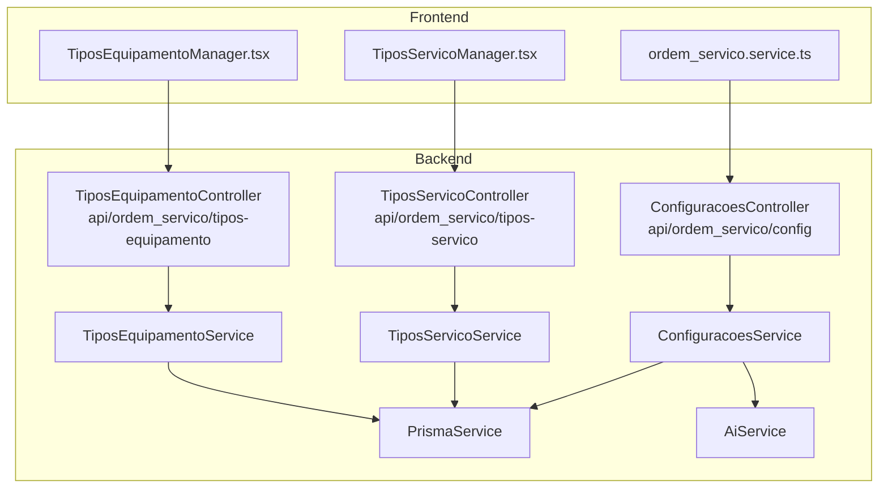
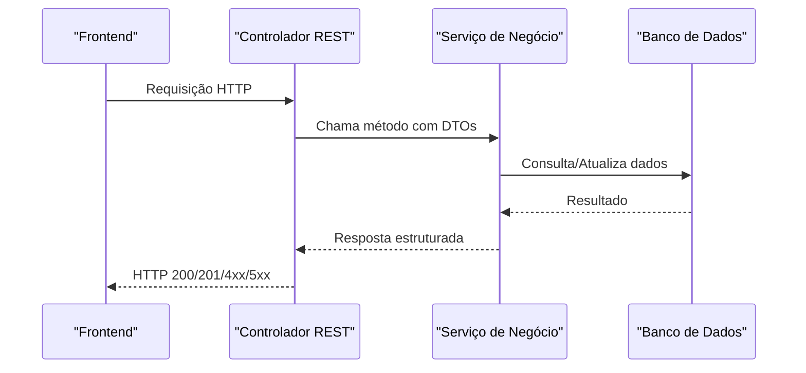
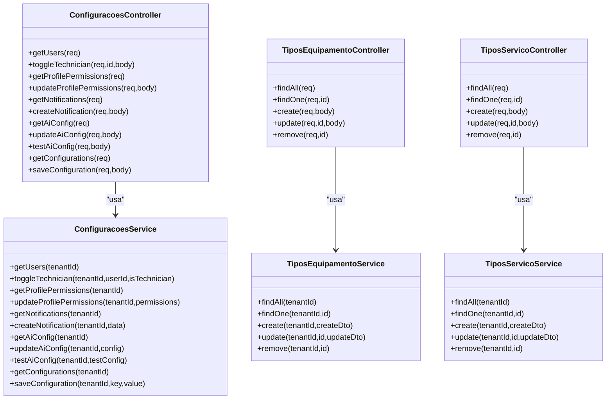
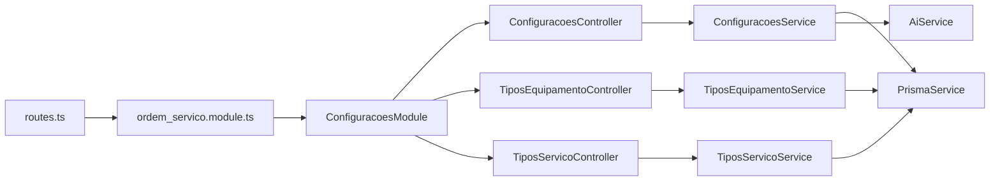
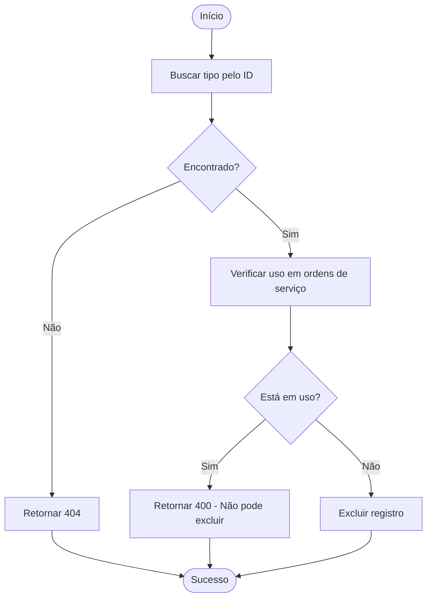
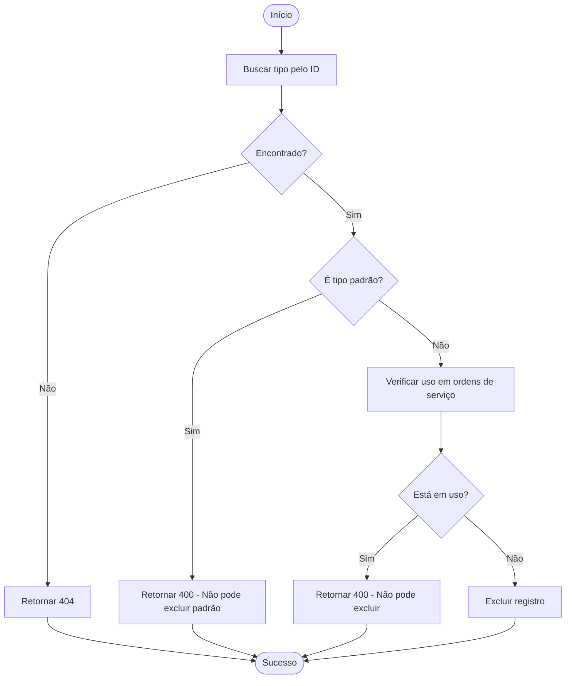

# Endpoints de Configurações

<cite>
**Arquivos referenciados neste documento**
- [configuracoes.controller.ts](file://backend/configuracoes/configuracoes.controller.ts)
- [configuracoes.service.ts](file://backend/configuracoes/configuracoes.service.ts)
- [tipos-equipamento.controller.ts](file://backend/configuracoes/tipos-equipamento.controller.ts)
- [tipos-equipamento.service.ts](file://backend/configuracoes/tipos-equipamento.service.ts)
- [tipos-servico.controller.ts](file://backend/configuracoes/tipos-servico.controller.ts)
- [tipos-servico.service.ts](file://backend/configuracoes/tipos-servico.service.ts)
- [configuracoes.module.ts](file://backend/configuracoes/configuracoes.module.ts)
- [routes.ts](file://backend/routes.ts)
- [ordem_servico.module.ts](file://backend/ordem_servico.module.ts)
- [TiposEquipamentoManager.tsx](file://frontend/components/TiposEquipamentoManager.tsx)
- [TiposServicoManager.tsx](file://frontend/components/TiposServicoManager.tsx)
- [ordem_servico.service.ts](file://frontend/services/ordem_servico.service.ts)
- [004_add_tables_os.sql](file://backend/migrations/004_add_tables_os.sql)
</cite>

## Sumário
1. [Introdução](#introdução)
2. [Estrutura do Projeto](#estrutura-do-projeto)
3. [Componentes-Chave](#componentes-chave)
4. [Visão Geral da Arquitetura](#visão-geral-da-arquitetura)
5. [Análise Detalhada dos Endpoints](#análise-detalhada-dos-endpoints)
6. [Análise de Dependências](#análise-de-dependências)
7. [Considerações de Desempenho](#considerações-de-desempenho)
8. [Guia de Solução de Problemas](#guia-de-solução-de-problemas)
9. [Conclusão](#conclusão)

## Introdução
Este documento apresenta uma documentação abrangente de todos os endpoints REST do módulo de Configurações do sistema de Ordens de Serviço. Ele cobre:
- Configurações gerais do sistema
- Tipos de equipamentos
- Tipos de serviços
- Permissões de perfis
- Notificações agendadas
- Configurações de IA

Além disso, detalha métodos HTTP, URLs, parâmetros de requisição/resposta, códigos de status esperados e possíveis erros. Exemplos práticos de uso são fornecidos com base no frontend e nos serviços.

## Estrutura do Projeto
O módulo de configurações é composto por:
- Controladores REST expostos via NestJS
- Serviços de negócio que interagem com o banco de dados
- Frontend que consome esses endpoints

**Diagrama fonte**
- [configuracoes.controller.ts](file://backend/configuracoes/configuracoes.controller.ts#L6-L136)
- [tipos-equipamento.controller.ts](file://backend/configuracoes/tipos-equipamento.controller.ts#L5-L39)
- [tipos-servico.controller.ts](file://backend/configuracoes/tipos-servico.controller.ts#L5-L39)
- [configuracoes.service.ts](file://backend/configuracoes/configuracoes.service.ts#L9-L331)
- [tipos-equipamento.service.ts](file://backend/configuracoes/tipos-equipamento.service.ts#L6-L123)
- [tipos-servico.service.ts](file://backend/configuracoes/tipos-servico.service.ts#L6-L128)
- [TiposEquipamentoManager.tsx](file://frontend/components/TiposEquipamentoManager.tsx#L212-L250)
- [TiposServicoManager.tsx](file://frontend/components/TiposServicoManager.tsx#L233-L271)
- [ordem_servico.service.ts](file://frontend/services/ordem_servico.service.ts#L12-L18)

**Seção fonte**
- [configuracoes.module.ts](file://backend/configuracoes/configuracoes.module.ts#L12-L30)
- [routes.ts](file://backend/routes.ts#L9-L17)
- [ordem_servico.module.ts](file://backend/ordem_servico.module.ts#L11-L31)

## Componentes-Chave
- ConfiguracoesController: expõe endpoints para configurações gerais, permissões, notificações e IA.
- TiposEquipamentoController e TiposServicoController: endpoints CRUD para categorizar equipamentos e serviços.
- Services: implementam regras de negócio, validações e acesso ao banco.
- Frontend: componentes que consomem os endpoints e apresentam os dados.

**Seção fonte**
- [configuracoes.controller.ts](file://backend/configuracoes/configuracoes.controller.ts#L6-L136)
- [tipos-equipamento.controller.ts](file://backend/configuracoes/tipos-equipamento.controller.ts#L5-L39)
- [tipos-servico.controller.ts](file://backend/configuracoes/tipos-servico.controller.ts#L5-L39)

## Visão Geral da Arquitetura
Os endpoints seguem o padrão REST, com autenticação JWT obrigatória. Os controladores delegam para serviços que acessam o banco de dados via Prisma. Alguns endpoints de IA também interagem com um serviço externo.

**Diagrama fonte**
- [configuracoes.controller.ts](file://backend/configuracoes/configuracoes.controller.ts#L14-L136)
- [configuracoes.service.ts](file://backend/configuracoes/configuracoes.service.ts#L37-L331)
- [tipos-equipamento.controller.ts](file://backend/configuracoes/tipos-equipamento.controller.ts#L10-L39)
- [tipos-servico.controller.ts](file://backend/configuracoes/tipos-servico.controller.ts#L10-L39)

## Análise Detalhada dos Endpoints

### 1) Configurações Gerais do Sistema
URL base: `/api/ordem_servico/config`

- GET /config/settings
  - Descrição: Retorna todas as configurações genéricas do sistema para o tenant.
  - Autenticação: JWT obrigatório.
  - Parâmetros: nenhum.
  - Resposta: Array de objetos com campos `config_key` e `config_value`.
  - Exemplo de resposta:
    - [
        {"config_key": "condicoes_execucao", "config_value": "..."},
        ...
      ]
  - Códigos: 200, 500.
  - Erros: 500 em caso de falha de acesso ao banco.

- POST /config/settings
  - Descrição: Salva ou atualiza uma configuração genérica.
  - Autenticação: JWT obrigatório.
  - Corpo: { config_key: string, config_value: any }.
  - Resposta: { success: true }.
  - Códigos: 201/200, 500.
  - Erros: 500 em caso de falha.

**Seção fonte**
- [configuracoes.controller.ts](file://backend/configuracoes/configuracoes.controller.ts#L115-L136)
- [configuracoes.service.ts](file://backend/configuracoes/configuracoes.service.ts#L283-L331)

### 2) Permissões de Perfis
URL base: `/api/ordem_servico/config`

- GET /config/profile-permissions
  - Descrição: Retorna as permissões configuradas para perfis do sistema.
  - Autenticação: JWT obrigatório.
  - Resposta: Objeto estruturado { [permissão]: { admin: boolean, technician: boolean, attendant: boolean } }.
  - Códigos: 200, 500.
  - Erros: 500.

- POST /config/profile-permissions
  - Descrição: Atualiza todas as permissões de perfil para o tenant.
  - Autenticação: JWT obrigatório.
  - Corpo: { permissions: objeto estruturado como acima }.
  - Resposta: { success: true, permissions }.
  - Códigos: 200/201, 500.
  - Erros: 500.

**Seção fonte**
- [configuracoes.controller.ts](file://backend/configuracoes/configuracoes.controller.ts#L36-L56)
- [configuracoes.service.ts](file://backend/configuracoes/configuracoes.service.ts#L68-L137)

### 3) Usuários e Técnicos
URL base: `/api/ordem_servico/config`

- GET /config/users
  - Descrição: Lista usuários do tenant.
  - Autenticação: JWT obrigatório.
  - Resposta: Array de usuários com campos como id, name, email, role.
  - Códigos: 200, 500.
  - Erros: 500.

- PUT /config/users/:id/technician
  - Descrição: Alterna o status de técnico para um usuário.
  - Autenticação: JWT obrigatório.
  - Parâmetros de caminho: id (string).
  - Corpo: { is_technician: boolean }.
  - Resposta: { success: true, userId, isTechnician }.
  - Códigos: 200, 500.
  - Erros: 500.

**Seção fonte**
- [configuracoes.controller.ts](file://backend/configuracoes/configuracoes.controller.ts#L14-L34)
- [configuracoes.service.ts](file://backend/configuracoes/configuracoes.service.ts#L37-L66)

### 4) Notificações Agendadas
URL base: `/api/ordem_servico/config`

- GET /config/notifications
  - Descrição: Retorna todas as notificações agendadas.
  - Autenticação: JWT obrigatório.
  - Resposta: Array de notificações.
  - Códigos: 200, 500.
  - Erros: 500.

- POST /config/notifications
  - Descrição: Cria uma nova notificação agendada.
  - Autenticação: JWT obrigatório.
  - Corpo: Objeto com campos title, content, audience, cronExpression, enabled.
  - Resposta: { success: true, result }.
  - Códigos: 201, 500.
  - Erros: 500.

**Seção fonte**
- [configuracoes.controller.ts](file://backend/configuracoes/configuracoes.controller.ts#L58-L78)
- [configuracoes.service.ts](file://backend/configuracoes/configuracoes.service.ts#L139-L177)

### 5) Configurações de IA
URL base: `/api/ordem_servico/config`

- GET /config/ai
  - Descrição: Retorna a configuração de integração com IA do tenant, com API Key mascarada.
  - Autenticação: JWT obrigatório.
  - Resposta: Objeto com configurações da IA.
  - Códigos: 200, 500.
  - Erros: 500.

- POST /config/ai
  - Descrição: Atualiza a configuração de IA.
  - Autenticação: JWT obrigatório.
  - Corpo: Objeto com configurações da IA.
  - Resposta: { success: true }.
  - Códigos: 200/201, 500.
  - Erros: 500.

- POST /config/ai/test
  - Descrição: Testa a configuração de IA com uma chamada de IA.
  - Autenticação: JWT obrigatório.
  - Corpo: Objeto com configurações da IA.
  - Resposta: { success: true, response } ou { success: false, message, details }.
  - Códigos: 200, 500.
  - Erros: depende do serviço de IA.

**Seção fonte**
- [configuracoes.controller.ts](file://backend/configuracoes/configuracoes.controller.ts#L80-L111)
- [configuracoes.service.ts](file://backend/configuracoes/configuracoes.service.ts#L179-L281)

### 6) Tipos de Equipamentos
URL base: `/api/ordem_servico/tipos-equipamento`

- GET /
  - Descrição: Lista todos os tipos de equipamento do tenant.
  - Autenticação: JWT obrigatório.
  - Resposta: Array de objetos com id, nome, created_at.
  - Códigos: 200, 404, 500.
  - Erros: 404 se não encontrar registros.

- GET /:id
  - Descrição: Obtém um tipo de equipamento pelo ID.
  - Autenticação: JWT obrigatório.
  - Parâmetros de caminho: id (UUID).
  - Resposta: Objeto com id, nome, created_at.
  - Códigos: 200, 404, 500.
  - Erros: 404 se não encontrar.

- POST /
  - Descrição: Cria um novo tipo de equipamento.
  - Autenticação: JWT obrigatório.
  - Corpo: { nome: string }.
  - Resposta: Objeto criado com id, nome, created_at.
  - Códigos: 201, 400, 409, 500.
  - Erros: 400 (nome obrigatório), 409 (nome duplicado).

- PUT /:id
  - Descrição: Atualiza um tipo de equipamento.
  - Autenticação: JWT obrigatório.
  - Parâmetros de caminho: id (UUID).
  - Corpo: { nome: string }.
  - Resposta: Objeto atualizado.
  - Códigos: 200, 400, 404, 409, 500.
  - Erros: 400/404/409 conforme validações.

- DELETE /:id
  - Descrição: Remove um tipo de equipamento.
  - Autenticação: JWT obrigatório.
  - Parâmetros de caminho: id (UUID).
  - Resposta: { message: "Tipo de equipamento excluído com sucesso" }.
  - Códigos: 200, 400, 404, 500.
  - Erros: 400 (uso em ordens), 404 (não encontrado).

**Seção fonte**
- [tipos-equipamento.controller.ts](file://backend/configuracoes/tipos-equipamento.controller.ts#L10-L39)
- [tipos-equipamento.service.ts](file://backend/configuracoes/tipos-equipamento.service.ts#L8-L123)

### 7) Tipos de Serviço
URL base: `/api/ordem_servico/tipos-servico`

- GET /
  - Descrição: Lista todos os tipos de serviço do tenant, ordenados com os padrão primeiro.
  - Autenticação: JWT obrigatório.
  - Resposta: Array de objetos com id, nome, is_default, created_at.
  - Códigos: 200, 404, 500.
  - Erros: 404 se não encontrar registros.

- GET /:id
  - Descrição: Obtém um tipo de serviço pelo ID.
  - Autenticação: JWT obrigatório.
  - Parâmetros de caminho: id (UUID).
  - Resposta: Objeto com id, nome, is_default, created_at.
  - Códigos: 200, 404, 500.
  - Erros: 404 se não encontrar.

- POST /
  - Descrição: Cria um novo tipo de serviço.
  - Autenticação: JWT obrigatório.
  - Corpo: { nome: string }.
  - Resposta: Objeto criado com id, nome, is_default (false), created_at.
  - Códigos: 201, 400, 409, 500.
  - Erros: 400 (nome obrigatório), 409 (nome duplicado).

- PUT /:id
  - Descrição: Atualiza um tipo de serviço.
  - Autenticação: JWT obrigatório.
  - Parâmetros de caminho: id (UUID).
  - Corpo: { nome: string }.
  - Resposta: Objeto atualizado.
  - Códigos: 200, 400, 404, 409, 500.
  - Erros: 400/404/409 conforme validações.

- DELETE /:id
  - Descrição: Remove um tipo de serviço.
  - Autenticação: JWT obrigatório.
  - Parâmetros de caminho: id (UUID).
  - Resposta: { message: "Tipo de serviço excluído com sucesso" }.
  - Códigos: 200, 400, 404, 500.
  - Erros: 400 (padrão ou uso em ordens), 404 (não encontrado).

**Seção fonte**
- [tipos-servico.controller.ts](file://backend/configuracoes/tipos-servico.controller.ts#L10-L39)
- [tipos-servico.service.ts](file://backend/configuracoes/tipos-servico.service.ts#L8-L128)

## Visão Geral da Arquitetura

**Diagrama fonte**
- [configuracoes.controller.ts](file://backend/configuracoes/configuracoes.controller.ts#L6-L136)
- [tipos-equipamento.controller.ts](file://backend/configuracoes/tipos-equipamento.controller.ts#L5-L39)
- [tipos-servico.controller.ts](file://backend/configuracoes/tipos-servico.controller.ts#L5-L39)
- [configuracoes.service.ts](file://backend/configuracoes/configuracoes.service.ts#L9-L331)
- [tipos-equipamento.service.ts](file://backend/configuracoes/tipos-equipamento.service.ts#L6-L123)
- [tipos-servico.service.ts](file://backend/configuracoes/tipos-servico.service.ts#L6-L128)

## Análise de Dependências

**Diagrama fonte**
- [routes.ts](file://backend/routes.ts#L9-L17)
- [ordem_servico.module.ts](file://backend/ordem_servico.module.ts#L11-L31)
- [configuracoes.module.ts](file://backend/configuracoes/configuracoes.module.ts#L12-L30)

**Seção fonte**
- [routes.ts](file://backend/routes.ts#L9-L17)
- [ordem_servico.module.ts](file://backend/ordem_servico.module.ts#L11-L31)
- [configuracoes.module.ts](file://backend/configuracoes/configuracoes.module.ts#L12-L30)

## Considerações de Desempenho
- Todos os endpoints são síncronos e realizam operações no banco de dados.
- Recomenda-se:
  - Utilizar paginação nos frontends quando aplicável.
  - Evitar consultas desnecessárias e reutilizar dados em cache quando possível.
  - Garantir índices adequados nas tabelas de configurações e tipos.

## Guia de Solução de Problemas

### Erros Comuns e Causas
- 400 Bad Request:
  - Tipos de equipamento/serviço: nome obrigatório ou duplicado.
  - Configurações de IA: chave mascarada precisa da original armazenada.
- 404 Not Found:
  - Registro não encontrado ao consultar/atualizar/remover.
- 409 Conflict:
  - Tipos de equipamento/serviço: nome duplicado.
- 400 Bad Request (exclusão):
  - Tipos de equipamento: ainda usado em ordens de serviço.
  - Tipos de serviço: tentativa de excluir tipo padrão ou em uso.
- 500 Internal Server Error:
  - Erros de conexão com o banco de dados ou serviço de IA.

### Fluxo de Validação de Exclusão de Tipo de Equipamento

**Diagrama fonte**
- [tipos-equipamento.service.ts](file://backend/configuracoes/tipos-equipamento.service.ts#L95-L122)

### Fluxo de Validação de Exclusão de Tipo de Serviço

**Diagrama fonte**
- [tipos-servico.service.ts](file://backend/configuracoes/tipos-servico.service.ts#L95-L128)

## Conclusão
Esta documentação forneceu uma visão completa dos endpoints REST do módulo de Configurações, incluindo:
- Configurações gerais, permissões, notificações e IA
- Gestão de tipos de equipamentos e serviços
- Regras de validação, fluxos de erro e recomendações de desempenho

Os exemplos práticos e os fluxos de validação ajudam a integrar corretamente os endpoints tanto no backend quanto no frontend.