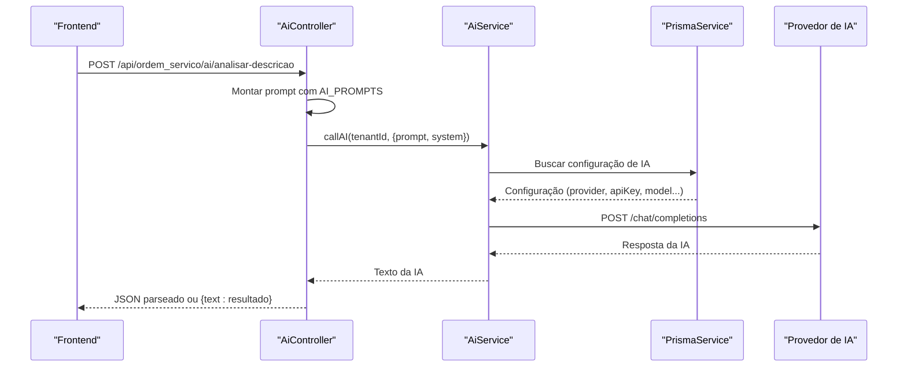

# Endpoints de Integração com IA

<cite>
**Arquivos Referenciados Neste Documento**
- [ai.controller.ts](file://backend/shared/controllers/ai.controller.ts)
- [ai.service.ts](file://backend/shared/services/ai.service.ts)
- [prompts.ts](file://backend/shared/services/prompts.ts)
- [configuracoes.controller.ts](file://backend/configuracoes/configuracoes.controller.ts)
- [configuracoes.service.ts](file://backend/configuracoes/configuracoes.service.ts)
- [useAI.ts](file://frontend/hooks/useAI.ts)
- [page.tsx](file://frontend/pages/configuracoes/page.tsx)
</cite>

## Sumário
- Apresentação geral do módulo de IA
- Endpoints REST de análise e geração de laudos
- Configurações de integração com provedores de IA
- Prompts configuráveis e limitações
- Exemplos práticos de uso

## Apresentação Geral do Módulo de IA
O módulo de Integração com IA oferece funcionalidades voltadas à automação e análise de ordens de serviço através de modelos de linguagem. Ele permite:
- Análise de descrições de problemas para diagnóstico técnico
- Geração de laudos técnicos formatados
- Configuração de provedores de IA (OpenAI e OpenRouter)
- Testes de conectividade e validação de configurações

A integração é multitenant, ou seja, cada inquilino (tenant) pode ter suas próprias configurações de IA.

## Endpoints REST

### Base URL
- Todos os endpoints descritos neste documento utilizam a base `/api/ordem_servico`.

### Autenticação e Acesso
- Todos os endpoints do módulo de IA requerem autenticação JWT.
- O controller principal está protegido com o guard `JwtAuthGuard`.

---

### Endpoint 1: Análise de Descrição de Problema
- Método HTTP: POST
- URL: `/api/ordem_servico/ai/analisar-descricao`
- Descrição: Analisa uma descrição de problema e retorna um diagnóstico técnico estruturado.

#### Parâmetros de Requisição
- Content-Type: application/json
- Corpo da requisição:
  - `descricao` (string, obrigatório): Descrição do problema relatado pelo cliente.

Exemplo de corpo:
{
  "descricao": "Equipamento para de funcionar após troca de peça"
}

#### Resposta Esperada
- Sucesso (200 OK):
  - Se a IA responder com um JSON válido, o corpo será retornado como está.
  - Caso contrário, será retornado um objeto com a chave `text` contendo a resposta como string.

Exemplo de resposta bem-sucedida (JSON):
{
  "resumo": "Equipamento parou de funcionar após substituição",
  "causas": ["Falha na instalação da peça substituída", "Curto-circuito no novo componente"],
  "sugestoes": ["Verificar conexões elétricas", "Testar peça com multímetro"],
  "complexidade": "Médio"
}

Exemplo de resposta bem-sucedida (texto):
{
  "text": "A descrição indica um problema com a instalação da peça substituída."
}

#### Códigos de Status HTTP
- 200: Sucesso
- 400: Erro de validação (IA não habilitada ou configuração inválida)
- 500: Erro interno do servidor

#### Possíveis Erros
- IA não habilitada para o tenant
- Falha na comunicação com o provedor de IA
- Erro de configuração (API Key ausente)

---

### Endpoint 2: Geração de Laudo Técnico
- Método HTTP: POST
- URL: `/api/ordem_servico/ai/gerar-laudo`
- Descrição: Gera um laudo técnico profissional com base no problema e nas notas técnicas.

#### Parâmetros de Requisição
- Content-Type: application/json
- Corpo da requisição:
  - `problema` (string, obrigatório): Descrição inicial do problema.
  - `notas` (string, obrigatório): Anotações técnicas/observações.

Exemplo de corpo:
{
  "problema": "Equipamento desligou inesperadamente",
  "notas": "Verifiquei curto-circuito, substituí fusível"
}

#### Resposta Esperada
- Sucesso (200 OK):
  - Objeto contendo a chave `laudo` com o conteúdo HTML formatado.

Exemplo de resposta:
{
  "laudo": "
<strong>Diagnóstico Técnico</strong>: Curto-circuito detectado...

<strong>Procedimentos Realizados</strong>: Substituição do fusível...

<strong>Conclusão/Estado Atual</strong>: Equipamento em funcionamento normal...

<strong>Recomendações</strong>: Evitar sobrecargas elétricas...
"
}

#### Códigos de Status HTTP
- 200: Sucesso
- 400: Erro de validação
- 500: Erro interno do servidor

#### Possíveis Erros
- IA não habilitada
- Falha na comunicação com o provedor
- Erro de configuração

---

### Endpoint 3: Configurações de IA (Administração)
- Método HTTP: GET
- URL: `/api/ordem_servico/config/ai`
- Descrição: Retorna as configurações atuais da IA para o tenant.

#### Resposta Esperada
- Objeto com as configurações:
  - `provider`: "openai" ou "openrouter"
  - `apiKey`: String mascarada (ex: "********1234")
  - `model`: ID do modelo (ex: "gpt-4o-mini")
  - `temperature`: Valor numérico entre 0 e 1
  - `maxTokens`: Número inteiro
  - `enabled`: Boolean

Exemplo de resposta:
{
  "provider": "openai",
  "apiKey": "********1234",
  "model": "gpt-4o-mini",
  "temperature": 0.3,
  "maxTokens": 800,
  "enabled": true
}

---

### Endpoint 4: Atualização de Configurações de IA
- Método HTTP: POST
- URL: `/api/ordem_servico/config/ai`
- Descrição: Atualiza as configurações da IA para o tenant.

#### Parâmetros de Requisição
- Mesmos campos do endpoint de leitura, podendo incluir:
  - `apiKey`: Nova chave (se fornecida, será mascarada na resposta)
  - Outras configurações conforme necessário

#### Resposta Esperada
- Objeto com `success: true` em caso de sucesso.

---

### Endpoint 5: Teste de Conexão com IA
- Método HTTP: POST
- URL: `/api/ordem_servico/config/ai/test`
- Descrição: Testa a conectividade com a IA usando as configurações fornecidas.

#### Parâmetros de Requisição
- Mesmos campos do endpoint de leitura (provider, apiKey, model, temperature, maxTokens, enabled)

#### Resposta Esperada
- Em caso de sucesso:
  {
    "success": true,
    "response": "Texto de confirmação da IA"
  }
- Em caso de falha:
  {
    "success": false,
    "message": "Mensagem de erro",
    "details": "Detalhes do erro"
  }

---

## Arquitetura e Fluxo de Processamento

**Fontes do Diagrama**
- [ai.controller.ts](file://backend/shared/controllers/ai.controller.ts#L14-L34)
- [ai.service.ts](file://backend/shared/services/ai.service.ts#L33-L89)
- [prompts.ts](file://backend/shared/services/prompts.ts#L1-L27)

---

## Detalhamento de Componentes

### Controlador de IA
Responsável por expor os endpoints REST e orquestrar as chamadas ao serviço de IA.

**Recursos principais:**
- Validação de autenticação
- Montagem de prompts com base nos templates
- Tratamento de respostas JSON vs texto
- Logs de auditoria

**Fontes**
- [ai.controller.ts](file://backend/shared/controllers/ai.controller.ts#L1-L53)

---

### Serviço de IA
Implementa a lógica de integração com provedores de IA.

**Recursos principais:**
- Leitura de configurações no banco de dados
- Chamadas HTTP para OpenAI ou OpenRouter
- Validação de configurações antes da chamada
- Tratamento de erros e logs

**Fontes**
- [ai.service.ts](file://backend/shared/services/ai.service.ts#L1-L91)

---

### Templates de Prompt
Define os textos de instrução e exemplos para cada tipo de análise.

**Recursos principais:**
- ANÁLISE DE DESCRIÇÃO: Diagnóstico técnico estruturado
- GERAÇÃO DE LAUDO: Laudo técnico formatado em HTML

**Fontes**
- [prompts.ts](file://backend/shared/services/prompts.ts#L1-L27)

---

### Configurações de IA (Administração)
Endpoints para gerenciar as configurações de IA do tenant.

**Recursos principais:**
- Leitura de configurações
- Atualização de configurações
- Teste de conexão

**Fontes**
- [configuracoes.controller.ts](file://backend/configuracoes/configuracoes.controller.ts#L80-L111)
- [configuracoes.service.ts](file://backend/configuracoes/configuracoes.service.ts#L179-L281)

---

## Prompts Configuráveis

### Prompt de Análise de Descrição
- Papel: Assistente técnico especializado
- Saída esperada: JSON estruturado com:
  - resumo
  - causas
  - sugestoes
  - complexidade

### Prompt de Geração de Laudo
- Papel: Técnico sênior
- Saída esperada: HTML formatado com:
  - Diagnóstico Técnico
  - Procedimentos Realizados
  - Conclusão/Estado Atual
  - Recomendações

**Fontes**
- [prompts.ts](file://backend/shared/services/prompts.ts#L1-L27)

---

## Integração com Provedores de IA

### Provedores Suportados
- OpenAI (direct): https://api.openai.com/v1/chat/completions
- OpenRouter (unified): https://openrouter.ai/api/v1/chat/completions

### Cabeçalhos Adicionais (OpenRouter)
- HTTP-Referer: https://github.com/Projeto-menu-multitenant-seguro
- X-Title: Sistema OS Multitenant

### Modelos Padrão
- OpenRouter: "openai/gpt-3.5-turbo"
- OpenAI: "gpt-3.5-turbo"

**Fontes**
- [ai.service.ts](file://backend/shared/services/ai.service.ts#L48-L60)

---

## Limitações de Uso

### Configurações Obrigatórias
- apiKey: Deve estar configurada
- enabled: Deve estar true
- provider: Deve ser "openai" ou "openrouter"
- model: Deve ser um modelo válido

### Limitações Técnicas
- Apenas um prompt system e um prompt user são enviados
- A temperatura e maxTokens são configuráveis mas limitadas pelas capacidades do provedor
- A resposta é tratada como JSON apenas se for válida

**Fontes**
- [ai.service.ts](file://backend/shared/services/ai.service.ts#L40-L46)

---

## Exemplos Práticos de Uso

### Exemplo 1: Análise de Descrição
- Requisição:
  - POST /api/ordem_servico/ai/analisar-descricao
  - Body: {"descricao":"Equipamento para de funcionar após troca de peça"}

- Resposta esperada:
  - Um objeto com as chaves resumo, causas, sugestoes e complexidade

### Exemplo 2: Geração de Laudo
- Requisição:
  - POST /api/ordem_servico/ai/gerar-laudo
  - Body: {"problema":"Equipamento desligou inesperadamente","notas":"Verifiquei curto-circuito, substituí fusível"}

- Resposta esperada:
  - Um objeto com a chave laudo contendo HTML formatado

### Exemplo 3: Configurações de IA
- Requisição:
  - GET /api/ordem_servico/config/ai

- Resposta esperada:
  - Objeto com provider, apiKey mascarada, model, temperature, maxTokens e enabled

### Exemplo 4: Teste de Conexão
- Requisição:
  - POST /api/ordem_servico/config/ai/test
  - Body: {provider, apiKey, model, temperature, maxTokens, enabled}

- Resposta esperada:
  - {success: true, response: "..."} ou {success: false, message: "...", details: "..."}

---

## Integração Frontend

### Hooks e Componentes
- useAI: Hook que encapsula chamadas aos endpoints de IA
- Página de Configurações: Interface para gerenciar as configurações de IA

**Fontes**
- [useAI.ts](file://frontend/hooks/useAI.ts#L1-L41)
- [page.tsx](file://frontend/pages/configuracoes/page.tsx#L474-L541)

---

## Considerações de Segurança

### Máscara de Chaves
- As chaves de API são mascaradas ao serem retornadas pela API de leitura de configurações.

### Validação de Acesso
- Todos os endpoints estão protegidos com autenticação JWT.

**Fontes**
- [configuracoes.service.ts](file://backend/configuracoes/configuracoes.service.ts#L193-L196)