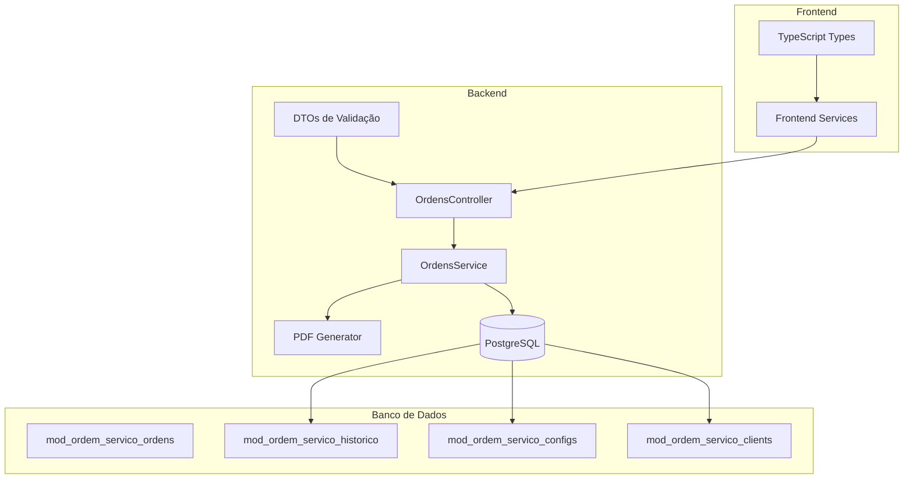
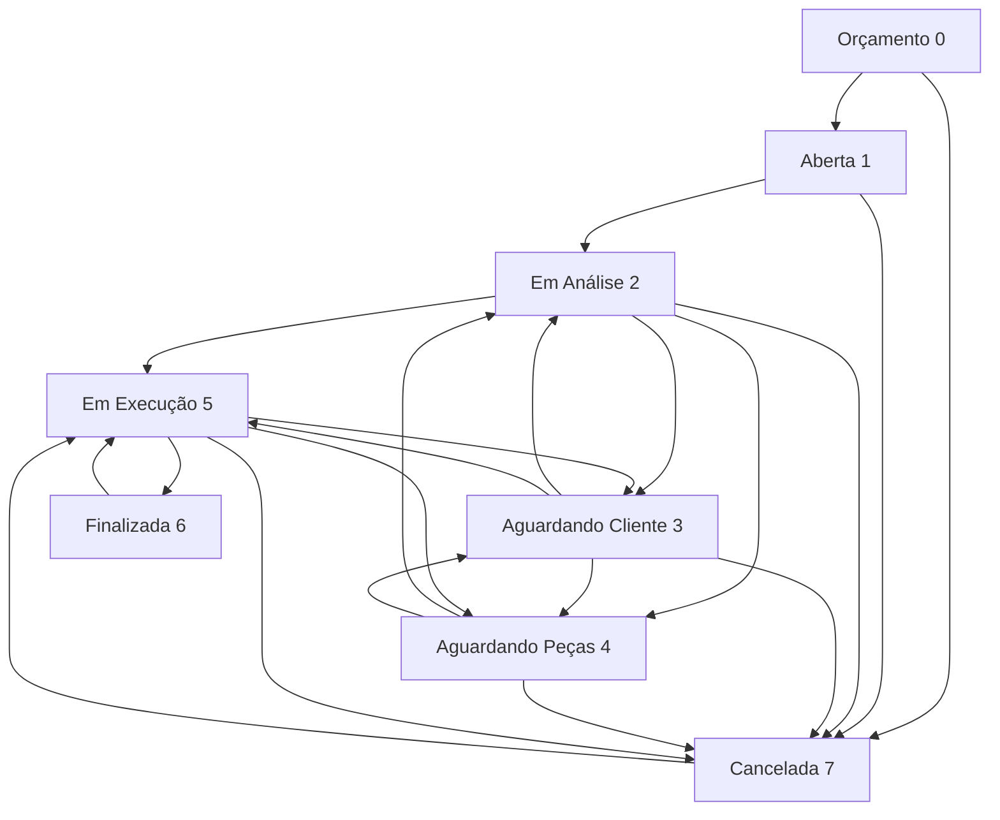

# Endpoints de Ordens de Serviço

<cite>
**Arquivos Referenciados neste Documento**
- [ordens.controller.ts](file://backend/ordens/ordens.controller.ts)
- [ordens.service.ts](file://backend/ordens/ordens.service.ts)
- [ordem-servico.dto.ts](file://backend/shared/dto/ordem-servico.dto.ts)
- [pdf-template.util.ts](file://backend/ordens/pdf-template.util.ts)
- [004_add_tables_os.sql](file://backend/migrations/004_add_tables_os.sql)
- [seeds_os.sql](file://backend/seeds/seeds_os.sql)
- [routes.ts](file://backend/routes.ts)
- [ordem_servico.module.ts](file://backend/ordem_servico.module.ts)
- [ordem_servico.service.ts](file://frontend/services/ordem_servico.service.ts)
- [ordem-servico.types.ts](file://frontend/types/ordem-servico.types.ts)
</cite>

## Sumário
- [Introdução](#introdução)
- [Estrutura do Projeto](#estrutura-do-projeto)
- [Endpoints Principais](#endpoints-principais)
- [Endpoints de Status](#endpoints-de-status)
- [Endpoints de Relacionamentos](#endpoints-de-relacionamentos)
- [Endpoints de PDF e Impressão](#endpoints-de-pdf-e-impressão)
- [Validações e Regras de Negócio](#validações-e-regras-de-negócio)
- [Histórico e Auditoria](#histórico-e-auditoria)
- [Exemplos Práticos](#exemplos-práticos)
- [Considerações de Desempenho](#considerações-de-desempenho)
- [Troubleshooting](#troubleshooting)

## Introdução

O módulo de Ordens de Serviço é um componente fundamental do sistema que gerencia todo o ciclo de vida das ordens de serviço, desde a criação até a conclusão. Este módulo implementa um fluxo de trabalho completo com validações rigorosas de status, histórico detalhado e integração com PDFs para impressão.

O sistema oferece um conjunto completo de endpoints REST para manipulação de ordens de serviço, incluindo operações CRUD completas, transições de status complexas, geração de documentos e relacionamentos com clientes e produtos.

## Estrutura do Projeto



**Fontes**
- [ordem_servico.module.ts](file://backend/ordem_servico.module.ts#L11-L31)
- [routes.ts](file://backend/routes.ts#L9-L17)

## Endpoints Principais

### Listar Todas as Ordens

**Método:** GET  
**URL:** `/api/ordem_servico/ordens`  
**Autenticação:** JWT obrigatória  
**Autorização:** Requer permissão específica

**Parâmetros de Query:**
- `search` (string): Texto para busca textual
- `status[]` (array): Filtrar por status múltiplos
- `cliente_id` (string): Filtrar por cliente específico
- `usuario_responsavel_id` (string): Filtrar por técnico responsável
- `data_inicio` (string): Data inicial para intervalo
- `data_fim` (string): Data final para intervalo
- `origem_solicitacao` (enum): Origem da solicitação
- `tipo_servico` (string): Tipo de serviço
- `page` (number): Número da página (padrão: 1)
- `limit` (number): Itens por página (padrão: 20, máximo: 100)

**Resposta:**
```typescript
{
  data: OrdemServicoResponseDTO[],
  total: number,
  page: number,
  totalPages: number,
  limit: number
}
```

**Exemplo de Requisição:**
```
GET /api/ordem_servico/ordens?page=1&limit=20&status[]=0&status[]=1
```

**Exemplo de Resposta:**
```json
{
  "data": [
    {
      "id": "123e4567-e89b-12d3-a456-426614174000",
      "numero": "000001",
      "cliente_id": "789f0123-a45b-67d9-e012-345678901234",
      "status": 0,
      "tipo_servico": "FORMATAÇÃO",
      "descricao": "Formatação do computador",
      "valor_servico": 250.00,
      "data_abertura": "2024-01-15T10:30:00Z",
      "cliente": {
        "name": "João Silva",
        "phone_primary": "(11) 99999-9999",
        "is_active": true
      }
    }
  ],
  "total": 150,
  "page": 1,
  "totalPages": 8,
  "limit": 20
}
```

**Fontes**
- [ordens.controller.ts](file://backend/ordens/ordens.controller.ts#L34-L55)
- [ordens.service.ts](file://backend/ordens/ordens.service.ts#L137-L473)

### Criar Nova Ordem

**Método:** POST  
**URL:** `/api/ordem_servico/ordens`  
**Autenticação:** JWT obrigatória  
**Autorização:** Requer permissão de criação

**Corpo da Requisição (CreateOrdemServicoDTO):**
```typescript
{
  cliente_id: string,           // Obrigatório
  tipo_servico: string,         // Obrigatório
  prioridade: 'BAIXA' | 'MEDIA' | 'ALTA', // Obrigatório
  descricao: string,            // Obrigatório
  observacoes_internas?: string,
  observacoes_cliente?: string,
  valor_servico?: number,
  forma_pagamento?: string,
  data_previsao?: string,
  origem_solicitacao: OrigemSolicitacao, // Obrigatório
  status?: StatusOS,
  laudo_tecnico?: string,
  usuario_responsavel_id?: string,
  // Dados do equipamento
  equipamento_tipo?: string,
  equipamento_marca?: string,
  equipamento_modelo?: string,
  equipamento_serie?: string,
  equipamento_acessorios?: string,
  equipamento_estado?: string,
  // Formatação
  formatacao_so?: string,
  formatacao_backup?: boolean,
  formatacao_backup_descricao?: string,
  formatacao_senha?: string,
  equipamento_fotos?: string[],
  itens?: ItemOrdem[],
  garantia_dias?: number
}
```

**Validações Especiais:**
- Cliente deve estar ativo
- Número da ordem gerado automaticamente
- Status padrão: 0 (Orçamento) se não especificado

**Exemplo de Requisição:**
```json
{
  "cliente_id": "789f0123-a45b-67d9-e012-345678901234",
  "tipo_servico": "MANUTENÇÃO",
  "prioridade": "MEDIA",
  "descricao": "Troca de peça defeituosa",
  "valor_servico": 350.00,
  "origem_solicitacao": "PRESENCIAL",
  "equipamento_tipo": "Notebook",
  "equipamento_marca": "Dell",
  "equipamento_modelo": "Inspiron 15"
}
```

**Exemplo de Resposta:**
```json
{
  "id": "123e4567-e89b-12d3-a456-426614174001",
  "numero": "000002",
  "cliente_id": "789f0123-a45b-67d9-e012-345678901234",
  "status": 0,
  "tipo_servico": "MANUTENÇÃO",
  "descricao": "Troca de peça defeituosa",
  "valor_servico": 350.00,
  "data_abertura": "2024-01-15T11:00:00Z",
  "cliente": {
    "name": "Maria Oliveira",
    "phone_primary": "(21) 98888-8888",
    "is_active": true
  }
}
```

**Fontes**
- [ordens.controller.ts](file://backend/ordens/ordens.controller.ts#L159-L179)
- [ordens.service.ts](file://backend/ordens/ordens.service.ts#L557-L654)

### Buscar Ordem Específica

**Método:** GET  
**URL:** `/api/ordem_servico/ordens/{id}`  
**Autenticação:** JWT obrigatória  
**Autorização:** Requer permissão de visualização

**Parâmetros de Path:**
- `id` (string): ID da ordem de serviço

**Resposta:**
```typescript
OrdemServicoResponseDTO
```

**Exemplo de Resposta:**
```json
{
  "id": "123e4567-e89b-12d3-a456-426614174000",
  "numero": "000001",
  "cliente_id": "789f0123-a45b-67d9-e012-345678901234",
  "usuario_responsavel_id": "555f0123-a45b-67d9-e012-345678905555",
  "status": 0,
  "tipo_servico": "FORMATAÇÃO",
  "descricao": "Formatação do computador",
  "observacoes_internas": "Verificar se há dados importantes",
  "observacoes_cliente": "Cliente pediu urgência",
  "valor_servico": 250.00,
  "formatacao_backup": true,
  "formatacao_backup_descricao": "Backup completo",
  "formatacao_senha": "admin123",
  "equipamento_fotos": ["uploads/ordem_servico/123e4567-e89b-12d3-a456-426614174000/1705320000000.jpg"],
  "itens": [
    {
      "produto_id": "999f0123-a45b-67d9-e012-345678909999",
      "descricao": "Peça substituta",
      "valor_unitario": 150.00,
      "quantidade": 1,
      "valor_total": 150.00
    }
  ],
  "data_abertura": "2024-01-15T10:30:00Z",
  "data_previsao": "2024-01-20T10:30:00Z",
  "cliente": {
    "name": "João Silva",
    "phone_primary": "(11) 99999-9999",
    "phone_secondary": "(11) 98888-8888",
    "email": "joao@email.com",
    "address_street": "Rua Exemplo",
    "address_number": "123",
    "address_neighborhood": "Centro",
    "address_city": "São Paulo",
    "address_state": "SP",
    "address_zip": "01010-010",
    "is_active": true
  },
  "responsavel": {
    "name": "Carlos Santos",
    "email": "carlos@empresa.com"
  }
}
```

**Fontes**
- [ordens.controller.ts](file://backend/ordens/ordens.controller.ts#L101-L119)
- [ordens.service.ts](file://backend/ordens/ordens.service.ts#L475-L555)

### Atualizar Ordem

**Método:** PUT  
**URL:** `/api/ordem_servico/ordens/{id}`  
**Autenticação:** JWT obrigatória  
**Autorização:** Requer permissão de edição

**Restrições:**
- Ordens finalizadas (status 6) ou canceladas (status 7) não podem ser editadas
- Transições de status são validadas rigorosamente

**Corpo da Requisição (UpdateOrdemServicoDTO):**
Mesmo DTO de criação, todos os campos são opcionais

**Exemplo de Requisição:**
```json
{
  "descricao": "Formatação e limpeza profunda",
  "valor_servico": 300.00,
  "data_previsao": "2024-01-22T10:30:00Z",
  "status": 1
}
```

**Fontes**
- [ordens.controller.ts](file://backend/ordens/ordens.controller.ts#L181-L207)
- [ordens.service.ts](file://backend/ordens/ordens.service.ts#L656-L770)

### Deletar Ordem

**Método:** DELETE  
**URL:** `/api/ordem_servico/ordens/{id}`  
**Autenticação:** JWT obrigatória  
**Autorização:** Requer permissão de exclusão

**Regras de Exclusão:**
- Apenas ordens com status 0 (Orçamento) podem ser excluídas
- Usuários não-administradores só podem excluir orçamentos
- Exclusão remove histórico e ordem

**Fontes**
- [ordens.controller.ts](file://backend/ordens/ordens.controller.ts#L260-L284)
- [ordens.service.ts](file://backend/ordens/ordens.service.ts#L831-L854)

## Endpoints de Status

### Atualizar Status

**Método:** PUT  
**URL:** `/api/ordem_servico/ordens/{id}/status`  
**Autenticação:** JWT obrigatória  
**Autorização:** Requer permissão de edição

**Corpo da Requisição (UpdateStatusDTO):**
```typescript
{
  status: StatusOS,              // Obrigatório
  motivo_cancelamento?: string,  // Obrigatório para cancelamento
  observacoes?: string           // Opcional
}
```

**Validações de Status:**
- Transições válidas são verificadas contra tabela de transições permitidas
- Cancelamento requer motivo
- Finalização só é permitida para ordens em execução (status 5)
- Valor do serviço deve estar definido para finalização

**Fluxo de Transição de Status:**



**Fontes**
- [ordens.controller.ts](file://backend/ordens/ordens.controller.ts#L209-L258)
- [ordens.service.ts](file://backend/ordens/ordens.service.ts#L125-L135)
- [ordens.service.ts](file://backend/ordens/ordens.service.ts#L988-L991)

### Aprovar Orçamento

**Método:** POST  
**URL:** `/api/ordem_servico/ordens/{id}/aprovar-orcamento`  
**Autenticação:** JWT obrigatória  
**Autorização:** Requer permissão de aprovação

**Regras:**
- Apenas ordens com status 0 (Orçamento) podem ser aprovadas
- Altera status para 1 (Aberta) e marca como aprovado

**Fontes**
- [ordens.controller.ts](file://backend/ordens/ordens.controller.ts#L286-L308)
- [ordens.service.ts](file://backend/ordens/ordens.service.ts#L856-L890)

## Endpoints de Relacionamentos

### Buscar Histórico

**Método:** GET  
**URL:** `/api/ordem_servico/ordens/{id}/historico`  
**Autenticação:** JWT obrigatória  
**Autorização:** Requer permissão de visualização

**Resposta:**
```typescript
HistoricoResponseDTO[]
```

**Fontes**
- [ordens.controller.ts](file://backend/ordens/ordens.controller.ts#L121-L133)
- [ordens.service.ts](file://backend/ordens/ordens.service.ts#L892-L915)

### Dashboard

**Método:** GET  
**URL:** `/api/ordem_servico/ordens/dashboard`  
**Autenticação:** JWT obrigatória  
**Autorização:** Requer permissão de visualização

**Resposta:**
```typescript
DashboardDataResponseDTO[]
```

**Fontes**
- [ordens.controller.ts](file://backend/ordens/ordens.controller.ts#L57-L66)
- [ordens.service.ts](file://backend/ordens/ordens.service.ts#L917-L940)

### Tipos de Serviço

**Método:** GET  
**URL:** `/api/ordem_servico/ordens/tipos-servico`  
**Autenticação:** JWT obrigatória  
**Autorização:** Requer permissão de visualização

**Resposta:**
```typescript
TipoServicoResponseDTO[]
```

**Fontes**
- [ordens.controller.ts](file://backend/ordens/ordens.controller.ts#L68-L77)
- [ordens.service.ts](file://backend/ordens/ordens.service.ts#L1089-L1106)

### Tipos de Equipamento

**Método:** GET  
**URL:** `/api/ordem_servico/ordens/tipos-equipamento`  
**Autenticação:** JWT obrigatória  
**Autorização:** Requer permissão de visualização

**Resposta:**
```typescript
TipoEquipamentoResponseDTO[]
```

**Fontes**
- [ordens.controller.ts](file://backend/ordens/ordens.controller.ts#L79-L88)
- [ordens.service.ts](file://backend/ordens/ordens.service.ts#L1108-L1125)

### Técnicos

**Método:** GET  
**URL:** `/api/ordem_servico/ordens/technicians`  
**Autenticação:** JWT obrigatória  
**Autorização:** Requer permissão de visualização

**Resposta:**
```typescript
TechnicianResponseDTO[]
```

**Fontes**
- [ordens.controller.ts](file://backend/ordens/ordens.controller.ts#L90-L99)
- [ordens.service.ts](file://backend/ordens/ordens.service.ts#L1127-L1146)

## Endpoints de PDF e Impressão

### Gerar PDF

**Método:** GET  
**URL:** `/api/ordem_servico/ordens/{id}/pdf`  
**Autenticação:** JWT obrigatória  
**Autorização:** Requer permissão de visualização

**Resposta:** Arquivo PDF (application/pdf)

**Recursos Adicionais:**
- Gera PDF com template personalizado
- Inclui logo da empresa (se disponível)
- Formatação para impressão A4
- Condições de execução configuráveis

**Fontes**
- [ordens.controller.ts](file://backend/ordens/ordens.controller.ts#L135-L157)
- [pdf-template.util.ts](file://backend/ordens/pdf-template.util.ts#L2-L461)

### Upload de Arquivos

**Método:** POST  
**URL:** `/api/ordem_servico/ordens/upload`  
**Autenticação:** JWT obrigatória  
**Autorização:** Requer permissão de upload

**Corpo:** FormData com arquivo (multipart/form-data)

**Resposta:**
```typescript
UploadResponseDTO
```

**Fontes**
- [ordens.controller.ts](file://backend/ordens/ordens.controller.ts#L310-L355)

### Servir Arquivo

**Método:** GET  
**URL:** `/api/ordem_servico/ordens/uploads/{tenantId}/{filename}`  
**Autenticação:** Pode ser público dependendo da configuração

**Resposta:** Arquivo armazenado

**Fontes**
- [ordens.controller.ts](file://backend/ordens/ordens.controller.ts#L357-L376)

## Validações e Regras de Negócio

### Validações de Entrada

Todos os endpoints utilizam validações automáticas com class-validator:

**CreateOrdemServicoDTO:**
- Todos os campos são validados quanto ao tipo e obrigatoriedade
- Valida enumerações específicas
- Valida formatos de data e número
- Valida arrays e objetos complexos

**UpdateOrdemServicoDTO:**
- Mesmas regras que Create, mas todos os campos são opcionais

**UpdateStatusDTO:**
- Status deve ser um valor válido do enum StatusOS
- Motivo de cancelamento obrigatório quando status = 7

### Regras de Transição de Status

As transições de status seguem um fluxo rígido:

| Status Atual | Transições Permitidas |
|-------------|----------------------|
| Orçamento (0) | Aberta (1), Cancelada (7) |
| Aberta (1) | Em Análise (2), Cancelada (7) |
| Em Análise (2) | Em Execução (5), Aguardando Cliente (3), Aguardando Peças (4), Cancelada (7) |
| Aguardando Cliente (3) | Em Análise (2), Em Execução (5), Aguardando Peças (4), Cancelada (7) |
| Aguardando Peças (4) | Em Análise (2), Aguardando Cliente (3), Cancelada (7) |
| Em Execução (5) | Finalizada (6), Aguardando Cliente (3), Aguardando Peças (4), Cancelada (7) |
| Finalizada (6) | Em Execução (5) |
| Cancelada (7) | Em Execução (5) |

### Validações Especiais

- **Cliente Ativo:** Novas ordens só podem ser criadas para clientes ativos
- **Edição Restrita:** Ordens finalizadas ou canceladas não podem ser editadas
- **Finalização:** Requer status em execução e valor do serviço definido
- **Cancelamento:** Requer motivo obrigatório

**Fontes**
- [ordens.controller.ts](file://backend/ordens/ordens.controller.ts#L168-L172)
- [ordens.controller.ts](file://backend/ordens/ordens.controller.ts#L197-L200)
- [ordens.controller.ts](file://backend/ordens/ordens.controller.ts#L236-L244)
- [ordens.service.ts](file://backend/ordens/ordens.service.ts#L942-L986)

## Histórico e Auditoria

### Registro de Alterações

O sistema mantém um histórico completo de todas as alterações:

**Tipos de Ações:**
- CRIACAO: Criação de ordem
- EDICAO: Edição de dados
- MUDANCA_STATUS: Alteração de status
- FINALIZACAO: Finalização de ordem
- CANCELAMENTO: Cancelamento de ordem
- APROVACAO_ORCAMENTO: Aprovação de orçamento

**Campos do Histórico:**
- `ordem_servico_id`: ID da ordem afetada
- `usuario_id`: ID do usuário que fez a alteração
- `acao`: Tipo de ação realizada
- `valor_anterior`: Valor antes da alteração
- `valor_novo`: Valor após a alteração
- `observacoes`: Observações adicionais
- `created_at`: Timestamp da ação

**Fontes**
- [ordens.service.ts](file://backend/ordens/ordens.service.ts#L1006-L1031)
- [ordens.service.ts](file://backend/ordens/ordens.service.ts#L1033-L1073)

## Exemplos Práticos

### Fluxo Completo de Criação e Execução

**Etapa 1: Criar Ordem**
```
POST /api/ordem_servico/ordens
{
  "cliente_id": "CLIENTE_ID",
  "tipo_servico": "MANUTENÇÃO",
  "prioridade": "MEDIA",
  "descricao": "Troca de peça",
  "origem_solicitacao": "PRESENCIAL"
}
```

**Etapa 2: Aprovar Orçamento**
```
POST /api/ordem_servico/ordens/{id}/aprovar-orcamento
```

**Etapa 3: Iniciar Execução**
```
PUT /api/ordem_servico/ordens/{id}/status
{
  "status": 5,
  "observacoes": "Iniciando serviço"
}
```

**Etapa 4: Finalizar Ordem**
```
PUT /api/ordem_servico/ordens/{id}/status
{
  "status": 6,
  "observacoes": "Serviço concluído",
  "valor_servico": 350.00
}
```

### Busca Avançada

```
GET /api/ordem_servico/ordens?page=1&limit=50&status[]=0&status[]=1&status[]=5&data_inicio=2024-01-01&data_fim=2024-01-31&search=formatação
```

### Geração de Relatórios

```
GET /api/ordem_servico/ordens/dashboard
```

## Considerações de Desempenho

### Indexação Recomendada

Para otimizar consultas em produção, recomenda-se:

```sql
-- Índices para buscas frequentes
CREATE INDEX idx_ordens_tenant_status ON mod_ordem_servico_ordens(tenant_id, status);
CREATE INDEX idx_ordens_cliente_data ON mod_ordem_servico_ordens(cliente_id, data_abertura);
CREATE INDEX idx_ordens_usuario_data ON mod_ordem_servico_ordens(usuario_responsavel_id, data_abertura);
CREATE INDEX idx_ordens_numero_tenant ON mod_ordem_servico_ordens(numero, tenant_id);
```

### Paginação

- Limite máximo: 100 registros por página
- Página padrão: 1
- Total de registros calculado automaticamente

### Cache

- Histórico de alterações é registrado mas não cacheado
- PDFs são gerados sob demanda com Puppeteer

## Troubleshooting

### Erros Comuns

**400 Bad Request:**
- Dados inválidos no DTO
- Transição de status inválida
- Valores fora dos limites permitidos

**401 Unauthorized:**
- Token JWT inválido ou expirado
- Falta de autenticação

**403 Forbidden:**
- Permissões insuficientes
- Tentativa de editar ordem finalizada/cancelada
- Tentativa de excluir ordem não autorizada

**404 Not Found:**
- Ordem de serviço não encontrada
- Arquivo de upload não existe

**500 Internal Server Error:**
- Erros de banco de dados
- Problemas na geração de PDF
- Erros de validação de dados

### Diagnóstico

Para depuração, verifique:

1. **Logs do servidor:** Verifique mensagens de erro no console
2. **Validações:** Confirme que todos os campos obrigatórios estão preenchidos
3. **Status:** Verifique o status atual da ordem antes de tentar transições
4. **Permissões:** Confirme que o usuário tem permissões adequadas

**Fontes**
- [ordens.controller.ts](file://backend/ordens/ordens.controller.ts#L48-L54)
- [ordens.service.ts](file://backend/ordens/ordens.service.ts#L468-L472)