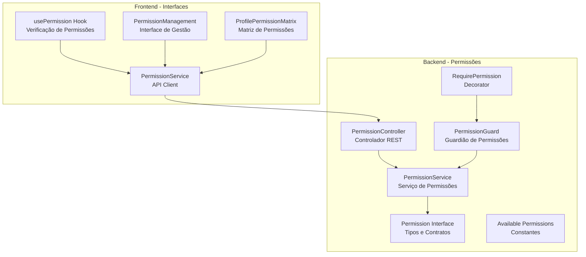
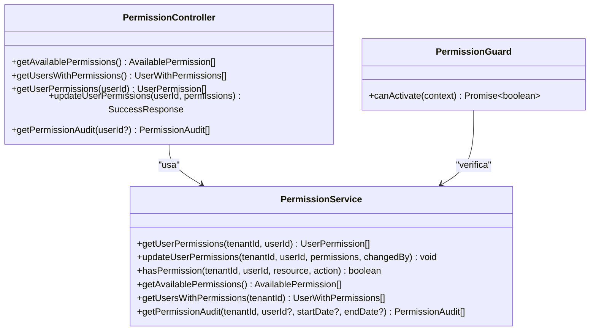
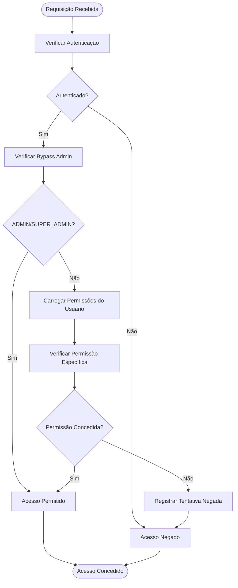
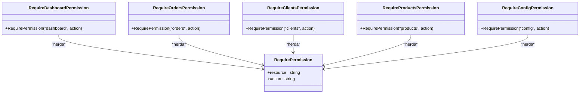
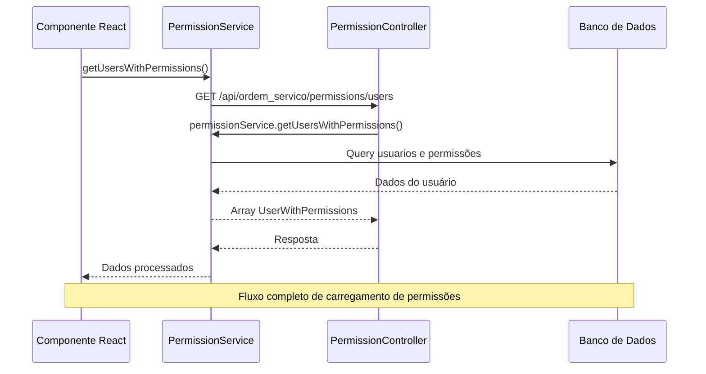
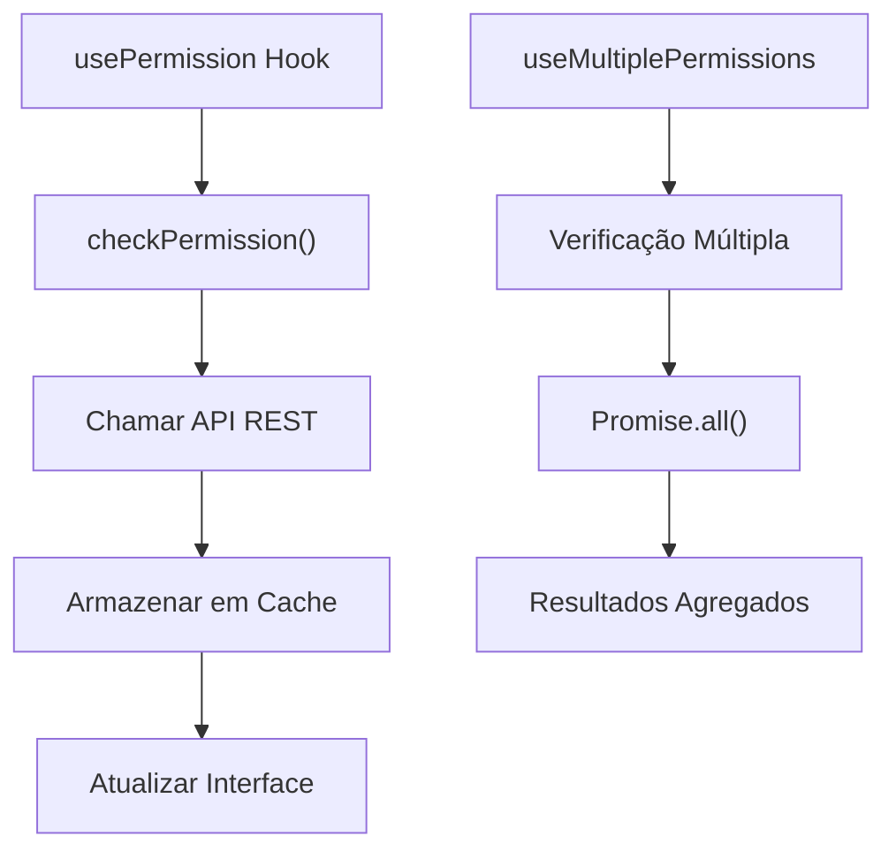
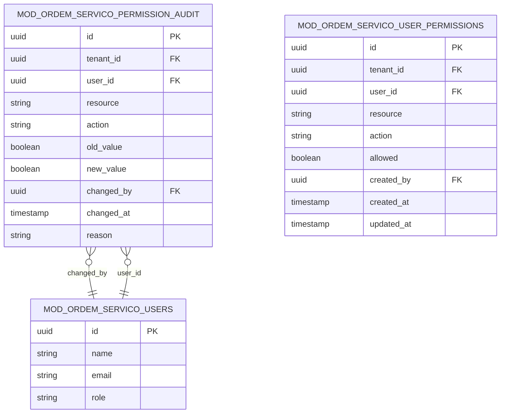

# Endpoints de Permissões

<cite>
**Arquivos Referenciados Neste Documento**
- [permission.controller.ts](file://backend/shared/controllers/permission.controller.ts)
- [permission.service.ts](file://backend/shared/services/permission.service.ts)
- [permission.guard.ts](file://backend/shared/guards/permission.guard.ts)
- [require-permission.decorator.ts](file://backend/shared/decorators/require-permission.decorator.ts)
- [permission.interface.ts](file://backend/shared/interfaces/permission.interface.ts)
- [available-permissions.ts](file://backend/shared/constants/available-permissions.ts)
- [routes.ts](file://backend/routes.ts)
- [permissionService.ts](file://frontend/services/permissionService.ts)
- [permission.types.ts](file://frontend/types/permission.types.ts)
- [usePermission.ts](file://frontend/hooks/usePermission.ts)
- [PermissionManagement.tsx](file://frontend/components/PermissionManagement.tsx)
- [ProfilePermissionMatrix.tsx](file://frontend/components/ProfilePermissionMatrix.tsx)
</cite>

## Sumário
- Apresentação geral do sistema de permissões com RBAC
- Documentação completa de todos os endpoints REST
- Explicação do funcionamento do guardião de permissões
- Exemplos práticos de uso e respostas esperadas
- Arquitetura de permissões e auditoria

## Introdução
O módulo de Permissões implementa um sistema RBAC (Controle Baseado em Papéis) completo para o módulo de Ordens de Serviço. O sistema permite gerenciar permissões granulares por recurso e ação, com suporte a auditoria completa de todas as operações de permissão.

O sistema é composto por três camadas principais:
- **Backend**: Controladores REST e serviços de permissão
- **Middleware**: Guardiões de permissão para proteção de rotas
- **Frontend**: Interfaces de gerenciamento e verificação de permissões

## Estrutura do Projeto
O módulo de permissões está localizado na pasta `backend/shared/` e inclui:



**Diagrama Fontes**
- [permission.controller.ts](file://backend/shared/controllers/permission.controller.ts#L1-L83)
- [permission.service.ts](file://backend/shared/services/permission.service.ts#L1-L313)
- [permission.guard.ts](file://backend/shared/guards/permission.guard.ts#L1-L58)
- [require-permission.decorator.ts](file://backend/shared/decorators/require-permission.decorator.ts#L1-L25)

**Seção Fontes**
- [routes.ts](file://backend/routes.ts#L1-L17)

## Componentes Principais

### Controlador de Permissões
O controlador REST expõe todos os endpoints necessários para gerenciamento de permissões:



**Diagrama Fontes**
- [permission.controller.ts](file://backend/shared/controllers/permission.controller.ts#L8-L83)
- [permission.service.ts](file://backend/shared/services/permission.service.ts#L14-L313)
- [permission.guard.ts](file://backend/shared/guards/permission.guard.ts#L6-L58)

### Sistema RBAC - Recursos e Ações
O sistema define permissões granulares através de recursos e ações:

| Recurso | Ações Disponíveis |
|---------|-------------------|
| **dashboard** | view, view_statistics |
| **clients** | view, view_details, create, edit, delete, upload_images |
| **products** | view, create, edit, delete, upload_images |
| **orders** | view, view_details, create, edit, delete, change_status, approve_budget, view_history |
| **config** | view, edit, manage_permissions, manage_notifications |

**Seção Fontes**
- [available-permissions.ts](file://backend/shared/constants/available-permissions.ts#L3-L164)

## Endpoints REST

### 1. Listar Permissões Disponíveis
**Método:** GET  
**URL:** `/api/ordem_servico/permissions/available`  
**Descrição:** Retorna todas as permissões disponíveis no sistema com suas respectivas ações

**Parâmetros de Requisição:** Nenhum  
**Parâmetros de Resposta:** 
- Array de objetos contendo: resource, name, description, actions

**Exemplo de Resposta:**
```json
[
  {
    "resource": "dashboard",
    "name": "Dashboard",
    "description": "Acesso ao painel principal do módulo",
    "actions": [
      {
        "action": "view",
        "name": "Visualizar Dashboard",
        "description": "Permite visualizar o dashboard principal"
      }
    ]
  }
]
```

**Códigos de Status:**
- 200: Sucesso
- 500: Erro interno do servidor

**Seção Fontes**
- [permission.controller.ts](file://backend/shared/controllers/permission.controller.ts#L13-L22)
- [permission.service.ts](file://backend/shared/services/permission.service.ts#L164-L166)

### 2. Listar Usuários com Permissões
**Método:** GET  
**URL:** `/api/ordem_servico/permissions/users`  
**Descrição:** Retorna todos os usuários do sistema com suas permissões associadas

**Parâmetros de Requisição:** Nenhum  
**Parâmetros de Resposta:** 
- Array de objetos contendo: id, name, email, role, permissions, permissionSummary

**Exemplo de Resposta:**
```json
[
  {
    "id": "user-1",
    "name": "João Silva",
    "email": "joao@empresa.com",
    "role": "USER",
    "permissions": [
      {
        "id": "perm-1",
        "userId": "user-1",
        "tenantId": "tenant-1",
        "resource": "orders",
        "action": "view",
        "allowed": true,
        "createdAt": "2024-01-01T00:00:00Z",
        "updatedAt": "2024-01-01T00:00:00Z",
        "createdBy": "admin"
      }
    ],
    "permissionSummary": {
      "total": 10,
      "allowed": 7,
      "denied": 3
    }
  }
]
```

**Códigos de Status:**
- 200: Sucesso
- 500: Erro interno do servidor

**Seção Fontes**
- [permission.controller.ts](file://backend/shared/controllers/permission.controller.ts#L24-L33)
- [permission.service.ts](file://backend/shared/services/permission.service.ts#L168-L219)

### 3. Consultar Permissões de um Usuário
**Método:** GET  
**URL:** `/api/ordem_servico/permissions/users/{userId}`  
**Descrição:** Retorna todas as permissões específicas de um usuário

**Parâmetros de Requisição:**
- `userId` (path): ID do usuário (obrigatório)

**Parâmetros de Resposta:** Array de permissões do usuário

**Exemplo de Resposta:**
```json
[
  {
    "id": "perm-1",
    "userId": "user-1",
    "tenantId": "tenant-1",
    "resource": "orders",
    "action": "view",
    "allowed": true,
    "createdAt": "2024-01-01T00:00:00Z",
    "updatedAt": "2024-01-01T00:00:00Z",
    "createdBy": "admin"
  }
]
```

**Códigos de Status:**
- 200: Sucesso
- 404: Usuário não encontrado
- 500: Erro interno do servidor

**Seção Fontes**
- [permission.controller.ts](file://backend/shared/controllers/permission.controller.ts#L35-L47)
- [permission.service.ts](file://backend/shared/services/permission.service.ts#L21-L68)

### 4. Atualizar Permissões de um Usuário
**Método:** PUT  
**URL:** `/api/ordem_servico/permissions/users/{userId}`  
**Descrição:** Atualiza as permissões de um usuário específico

**Parâmetros de Requisição:**
- `userId` (path): ID do usuário (obrigatório)
- Body: Array de permissões no formato `{resource, action, allowed}`

**Corpo da Requisição:**
```json
{
  "permissions": [
    {
      "resource": "orders",
      "action": "view",
      "allowed": true
    },
    {
      "resource": "orders",
      "action": "create",
      "allowed": false
    }
  ]
}
```

**Parâmetros de Resposta:**
```json
{
  "success": true
}
```

**Códigos de Status:**
- 200: Sucesso
- 400: Dados inválidos
- 500: Erro interno do servidor

**Seção Fontes**
- [permission.controller.ts](file://backend/shared/controllers/permission.controller.ts#L49-L68)
- [permission.service.ts](file://backend/shared/services/permission.service.ts#L70-L129)

### 5. Consultar Auditoria de Permissões
**Método:** GET  
**URL:** `/api/ordem_servico/permissions/audit`  
**Descrição:** Retorna histórico de alterações de permissões

**Parâmetros de Requisição:**
- `userId` (query): ID do usuário (opcional)
- `startDate` (query): Data inicial (opcional)
- `endDate` (query): Data final (opcional)

**Parâmetros de Resposta:** Array de registros de auditoria

**Exemplo de Resposta:**
```json
[
  {
    "id": "audit-1",
    "tenantId": "tenant-1",
    "userId": "user-1",
    "resource": "orders",
    "action": "view",
    "oldValue": false,
    "newValue": true,
    "changedBy": "admin",
    "changedAt": "2024-01-01T00:00:00Z",
    "reason": "PERMISSION_GRANTED"
  }
]
```

**Códigos de Status:**
- 200: Sucesso
- 500: Erro interno do servidor

**Seção Fontes**
- [permission.controller.ts](file://backend/shared/controllers/permission.controller.ts#L70-L82)
- [permission.service.ts](file://backend/shared/services/permission.service.ts#L261-L312)

## Funcionamento do RBAC

### Verificação de Permissões
O sistema implementa um mecanismo de verificação de permissões em tempo real:



**Diagrama Fontes**
- [permission.guard.ts](file://backend/shared/guards/permission.guard.ts#L12-L57)
- [permission.service.ts](file://backend/shared/services/permission.service.ts#L131-L162)

### Decorators Específicos
Para facilitar o uso, o sistema oferece decorators específicos:



**Diagrama Fontes**
- [require-permission.decorator.ts](file://backend/shared/decorators/require-permission.decorator.ts#L8-L25)

**Seção Fontes**
- [require-permission.decorator.ts](file://backend/shared/decorators/require-permission.decorator.ts#L1-L25)

## Frontend - Integração

### Serviço de Permissões
O frontend utiliza um serviço para consumir os endpoints REST:



**Diagrama Fontes**
- [permissionService.ts](file://frontend/services/permissionService.ts#L63-L86)
- [permission.controller.ts](file://backend/shared/controllers/permission.controller.ts#L24-L33)
- [permission.service.ts](file://backend/shared/services/permission.service.ts#L168-L219)

### Hooks de Permissão
O frontend oferece hooks para verificação de permissões:



**Diagrama Fontes**
- [usePermission.ts](file://frontend/hooks/usePermission.ts#L17-L35)
- [usePermission.ts](file://frontend/hooks/usePermission.ts#L64-L92)

**Seção Fontes**
- [permissionService.ts](file://frontend/services/permissionService.ts#L1-L135)
- [usePermission.ts](file://frontend/hooks/usePermission.ts#L1-L142)

## Exemplos Práticos

### Exemplo 1: Gerenciamento de Permissões de Usuário
**Cenário:** Administrador quer conceder permissão de criação de ordens para um usuário

**Passos:**
1. Listar permissões disponíveis: `GET /api/ordem_servico/permissions/available`
2. Consultar permissões atuais: `GET /api/ordem_servico/permissions/users/{userId}`
3. Atualizar permissões: `PUT /api/ordem_servico/permissions/users/{userId}`

**Requisição de Atualização:**
```json
{
  "permissions": [
    {
      "resource": "orders",
      "action": "create",
      "allowed": true
    }
  ]
}
```

### Exemplo 2: Verificação de Permissão em Tempo Real
**Cenário:** Interface precisa verificar se usuário pode visualizar um cliente

**Implementação:**
```typescript
const { hasPermission, loading } = usePermission('clients', 'view');
```

**Fluxo Interno:**
1. Hook chama `checkPermission('clients', 'view')`
2. API retorna `{ hasPermission: true/false }`
3. Interface atualiza estado e conteúdo

### Exemplo 3: Auditoria de Alterações
**Cenário:** Administrador deseja verificar quem concedeu permissão de edição de produtos

**Consulta:**
```javascript
await PermissionService.getPermissionAudit(
  undefined, // todos os usuários
  undefined, // qualquer período
  '2024-01-01',
  '2024-12-31'
);
```

## Arquitetura de Auditoria

### Registros de Auditoria
O sistema mantém histórico completo de todas as alterações:



**Diagrama Fontes**
- [permission.service.ts](file://backend/shared/services/permission.service.ts#L221-L259)
- [permission.service.ts](file://backend/shared/services/permission.service.ts#L261-L312)

## Melhorias e Considerações

### Cache de Permissões
O serviço implementa cache com TTL de 5 minutos para melhorar performance:

- **Cache Key:** `{tenantId}:{userId}`
- **TTL:** 5 minutos
- **Limpeza Automática:** Timeout programado
- **Invalidação Manual:** Ao atualizar permissões

### Segurança
- **Bypass Administrativo:** ADMIN e SUPER_ADMIN têm acesso automático
- **Auditoria Obrigatória:** Todas as alterações são registradas
- **Verificação em Tempo Real:** Validação de permissões antes de cada operação

### Escalabilidade
- **Consultas Otimizadas:** Uso de prepared statements
- **Indexação:** Campos críticos indexados no banco de dados
- **Paginação:** Auditoria limitada a 1000 registros

## Conclusão
O sistema de permissões implementa um modelo RBAC completo com recursos granulares, auditoria detalhada e integração frontend robusta. A arquitetura permite fácil manutenção e expansão de novos recursos e ações conforme as necessidades do negócio.