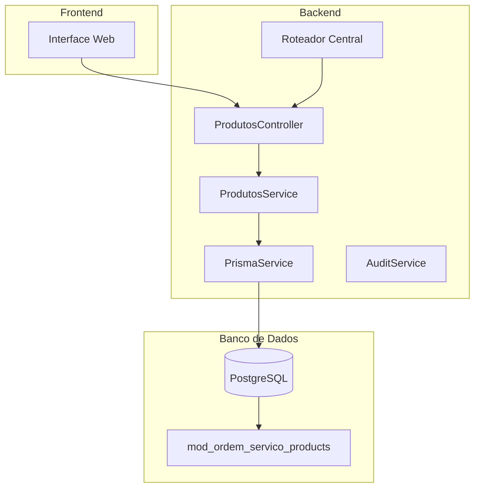
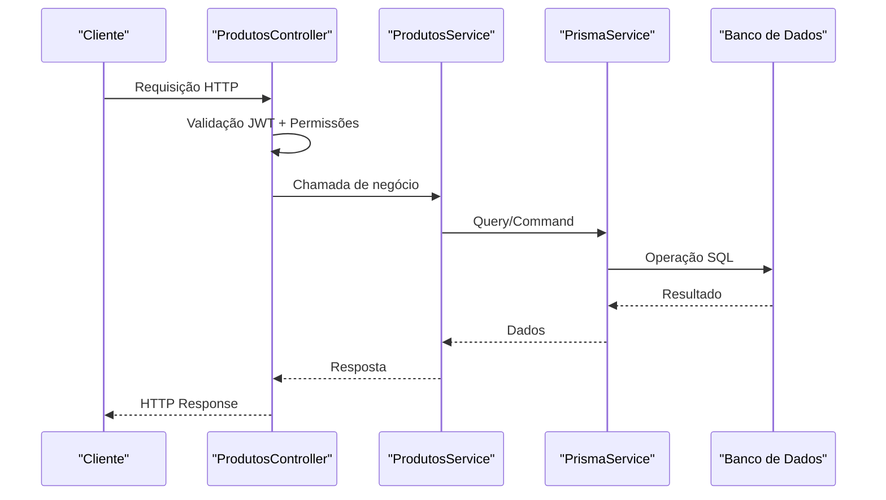
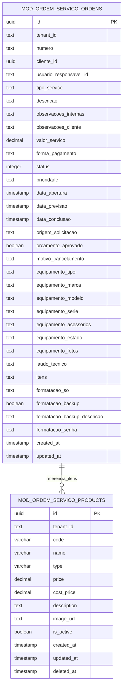
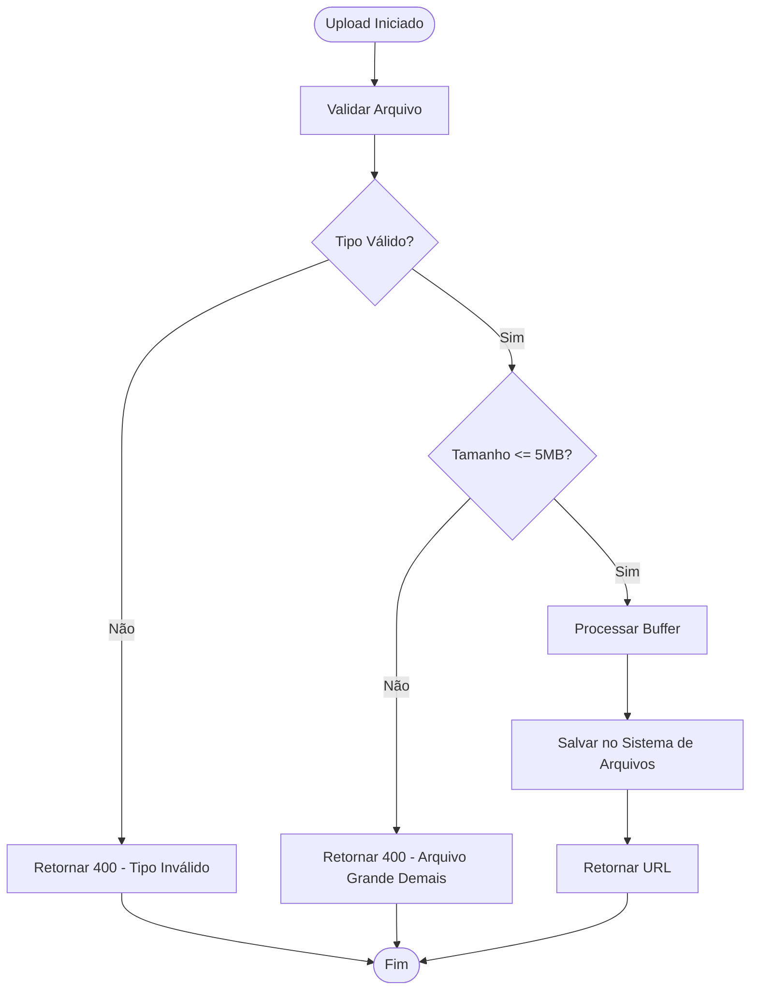

# Endpoints de Produtos e Serviços

<cite>
**Arquivos Referenciados Neste Documento**
- [produtos.controller.ts](file://backend/produtos/produtos.controller.ts)
- [produtos.service.ts](file://backend/produtos/produtos.service.ts)
- [produtos.module.ts](file://backend/produtos/produtos.module.ts)
- [routes.ts](file://backend/routes.ts)
- [001_master.sql](file://backend/migrations/001_master.sql)
- [004_add_tables_os.sql](file://backend/migrations/004_add_tables_os.sql)
- [page.tsx](file://frontend/pages/produtos/page.tsx)
- [ordem-servico.dto.ts](file://backend/shared/dto/ordem-servico.dto.ts)
</cite>

## Sumário
1. [Introdução](#introdução)
2. [Estrutura do Projeto](#estrutura-do-projeto)
3. [Componentes Principais](#componentes-principais)
4. [Visão Geral da Arquitetura](#visão-geral-da-arquitetura)
5. [Análise Detalhada dos Endpoints](#análise-detalhada-dos-endpoints)
6. [Relacionamentos e Integrações](#relacionamentos-e-integrações)
7. [Considerações de Desempenho](#considerações-de-desempenho)
8. [Guia de Solução de Problemas](#guia-de-solução-de-problemas)
9. [Conclusão](#conclusão)

## Introdução
Este documento apresenta a documentação completa dos endpoints REST do módulo de Produtos e Serviços do sistema de Ordens de Serviço. Ele abrange todos os métodos HTTP disponíveis, URLs, parâmetros de requisição e respostas esperadas, além de detalhar os relacionamentos com as Ordens de Serviço e fornecer exemplos práticos de uso.

## Estrutura do Projeto
O módulo de Produtos e Serviços segue uma arquitetura de camadas bem definida com os seguintes componentes principais:



**Fontes do Diagrama**
- [routes.ts](file://backend/routes.ts#L9-L17)
- [produtos.controller.ts](file://backend/produtos/produtos.controller.ts#L12-L18)
- [produtos.service.ts](file://backend/produtos/produtos.service.ts#L10-L15)

**Fontes da Seção**
- [routes.ts](file://backend/routes.ts#L9-L17)
- [produtos.module.ts](file://backend/produtos/produtos.module.ts#L8-L13)

## Componentes Principais
O módulo é composto pelos seguintes componentes principais:

### ProdutosController
Responsável por expor os endpoints REST e aplicar as regras de segurança e permissões.

### ProdutosService
Implementa a lógica de negócios e interage com o banco de dados através do Prisma.

### Módulo Produtos
Configura as dependências e exporta os serviços necessários.

**Fontes da Seção**
- [produtos.controller.ts](file://backend/produtos/produtos.controller.ts#L12-L18)
- [produtos.service.ts](file://backend/produtos/produtos.service.ts#L6-L15)
- [produtos.module.ts](file://backend/produtos/produtos.module.ts#L8-L13)

## Visão Geral da Arquitetura
A arquitetura segue o padrão MVC com injeção de dependência e middleware de autenticação:



**Fontes do Diagrama**
- [produtos.controller.ts](file://backend/produtos/produtos.controller.ts#L20-L61)
- [produtos.service.ts](file://backend/produtos/produtos.service.ts#L17-L40)

## Análise Detalhada dos Endpoints

### Endpoint: Listar Produtos e Serviços
**Método:** GET  
**URL:** `/api/ordem_servico/produtos`  
**Descrição:** Retorna o catálogo completo de produtos e serviços com filtros opcionais

**Parâmetros de Consulta:**
- `search` (opcional): Texto para busca em nome e código
- `status` (opcional): Filtra por status ativo/inativo (true/false)

**Exemplo de Requisição:**
```bash
curl -X GET "https://seusistema/api/ordem_servico/produtos?search=teclado&status=true" \
  -H "Authorization: Bearer SEU_TOKEN" \
  -H "Content-Type: application/json"
```

**Exemplo de Resposta:**
```json
[
  {
    "id": "d2b3f8a7-4c5d-4e6f-8g9h-1i2j3k4l5m6n",
    "tenant_id": "empresa-123",
    "code": "TECL-001",
    "name": "Teclado Mecânico RGB",
    "type": "PRODUCT",
    "price": 299.90,
    "cost_price": 180.00,
    "description": "Teclado mecânico com iluminação RGB",
    "image_url": "/uploads/produtos/empresa-123/1700000000000-12345.png",
    "is_active": true,
    "created_at": "2024-01-01T10:00:00Z",
    "updated_at": "2024-01-15T14:30:00Z",
    "deleted_at": null
  }
]
```

**Códigos de Status HTTP:**
- 200: Sucesso
- 401: Não autorizado
- 403: Acesso negado
- 500: Erro interno do servidor

**Fontes da Seção**
- [produtos.controller.ts](file://backend/produtos/produtos.controller.ts#L20-L26)
- [produtos.service.ts](file://backend/produtos/produtos.service.ts#L17-L40)

### Endpoint: Buscar Produto por ID
**Método:** GET  
**URL:** `/api/ordem_servico/produtos/:id`  
**Descrição:** Retorna um produto ou serviço específico pelo ID

**Parâmetros de Caminho:**
- `id` (obrigatório): Identificador único do produto/serviço

**Exemplo de Requisição:**
```bash
curl -X GET "https://seusistema/api/ordem_servico/produtos/d2b3f8a7-4c5d-4e6f-8g9h-1i2j3k4l5m6n" \
  -H "Authorization: Bearer SEU_TOKEN"
```

**Exemplo de Resposta:**
```json
{
  "id": "d2b3f8a7-4c5d-4e6f-8g9h-1i2j3k4l5m6n",
  "tenant_id": "empresa-123",
  "code": "TECL-001",
  "name": "Teclado Mecânico RGB",
  "type": "PRODUCT",
  "price": 299.90,
  "cost_price": 180.00,
  "description": "Teclado mecânico com iluminação RGB",
  "image_url": "/uploads/produtos/empresa-123/1700000000000-12345.png",
  "is_active": true,
  "created_at": "2024-01-01T10:00:00Z",
  "updated_at": "2024-01-15T14:30:00Z",
  "deleted_at": null
  }
```

**Códigos de Status HTTP:**
- 200: Sucesso
- 401: Não autorizado
- 403: Acesso negado
- 404: Produto não encontrado
- 500: Erro interno do servidor

**Fontes da Seção**
- [produtos.controller.ts](file://backend/produtos/produtos.controller.ts#L28-L34)
- [produtos.service.ts](file://backend/produtos/produtos.service.ts#L42-L48)

### Endpoint: Criar Novo Produto/Serviço
**Método:** POST  
**URL:** `/api/ordem_servico/produtos`  
**Descrição:** Cria um novo produto ou serviço no catálogo

**Corpo da Requisição:**
```json
{
  "code": "MEM-001",
  "name": "Memória RAM 16GB",
  "price": 399.90,
  "cost_price": 250.00,
  "description": "Memória RAM DDR4 16GB",
  "type": "PRODUCT",
  "image_url": "/uploads/produtos/empresa-123/1700000000000-67890.png",
  "is_active": true
}
```

**Campos Obrigatórios:**
- `code`: Código único do produto
- `name`: Nome descritivo
- `price`: Preço de venda (número)

**Campos Opcionais:**
- `cost_price`: Preço de custo
- `description`: Descrição detalhada
- `type`: Tipo (PRODUCT ou SERVICE)
- `image_url`: URL da imagem
- `is_active`: Status ativo

**Exemplo de Resposta:**
```json
{
  "id": "a1b2c3d4-e5f6-7890-a1b2-c3d4e5f67890",
  "code": "MEM-001",
  "name": "Memória RAM 16GB",
  "price": 399.90,
  "cost_price": 250.00,
  "description": "Memória RAM DDR4 16GB",
  "type": "PRODUCT",
  "image_url": "/uploads/produtos/empresa-123/1700000000000-67890.png",
  "is_active": true
}
```

**Códigos de Status HTTP:**
- 201: Criado com sucesso
- 400: Dados inválidos
- 401: Não autorizado
- 403: Acesso negado
- 409: Código já existe
- 500: Erro interno do servidor

**Fontes da Seção**
- [produtos.controller.ts](file://backend/produtos/produtos.controller.ts#L36-L43)
- [produtos.service.ts](file://backend/produtos/produtos.service.ts#L58-L101)

### Endpoint: Atualizar Produto/Serviço
**Método:** PUT  
**URL:** `/api/ordem_servico/produtos/:id`  
**Descrição:** Atualiza as informações de um produto ou serviço existente

**Parâmetros de Caminho:**
- `id` (obrigatório): Identificador único do produto

**Corpo da Requisição:**
```json
{
  "code": "MEM-001",
  "name": "Memória RAM 32GB",
  "price": 599.90,
  "cost_price": 350.00,
  "description": "Memória RAM DDR4 32GB",
  "type": "PRODUCT",
  "image_url": "/uploads/produtos/empresa-123/1700000000001-54321.png",
  "is_active": false
}
```

**Exemplo de Resposta:**
```json
{
  "id": "a1b2c3d4-e5f6-7890-a1b2-c3d4e5f67890",
  "code": "MEM-001",
  "name": "Memória RAM 32GB",
  "price": 599.90,
  "cost_price": 350.00,
  "description": "Memória RAM DDR4 32GB",
  "type": "PRODUCT",
  "image_url": "/uploads/produtos/empresa-123/1700000000001-54321.png",
  "is_active": false
}
```

**Códigos de Status HTTP:**
- 200: Atualizado com sucesso
- 400: Dados inválidos
- 401: Não autorizado
- 403: Acesso negado
- 404: Produto não encontrado
- 409: Código já existe
- 500: Erro interno do servidor

**Fontes da Seção**
- [produtos.controller.ts](file://backend/produtos/produtos.controller.ts#L45-L52)
- [produtos.service.ts](file://backend/produtos/produtos.service.ts#L103-L152)

### Endpoint: Deletar Produto/Serviço
**Método:** DELETE  
**URL:** `/api/ordem_servico/produtos/:id`  
**Descrição:** Remove um produto ou serviço do catálogo (soft delete)

**Parâmetros de Caminho:**
- `id` (obrigatório): Identificador único do produto

**Exemplo de Resposta:**
```json
{
  "success": true
}
```

**Códigos de Status HTTP:**
- 200: Deletado com sucesso
- 401: Não autorizado
- 403: Acesso negado
- 404: Produto não encontrado
- 500: Erro interno do servidor

**Fontes da Seção**
- [produtos.controller.ts](file://backend/produtos/produtos.controller.ts#L54-L61)
- [produtos.service.ts](file://backend/produtos/produtos.service.ts#L154-L168)

### Endpoint: Upload de Imagem
**Método:** POST  
**URL:** `/api/ordem_servico/produtos/upload`  
**Descrição:** Realiza upload de imagens para produtos/serviços

**Tipos de Arquivo Permitidos:**
- image/jpeg
- image/png
- image/webp
- image/gif

**Limites:**
- Tamanho máximo: 5MB
- Extensões válidas: .jpg, .jpeg, .png, .webp, .gif

**Exemplo de Resposta:**
```json
{
  "url": "/uploads/produtos/empresa-123/1700000000000-12345.png"
}
```

**Códigos de Status HTTP:**
- 200: Upload realizado com sucesso
- 400: Arquivo inválido ou acima do limite
- 401: Não autorizado
- 403: Acesso negado
- 500: Erro no processamento

**Fontes da Seção**
- [produtos.controller.ts](file://backend/produtos/produtos.controller.ts#L63-L143)

## Relacionamentos e Integrações

### Relacionamento com Ordens de Serviço
Os produtos e serviços são integrados às Ordens de Serviço através do campo `itens` no DTO de criação/edição de ordens:



**Fontes do Diagrama**
- [001_master.sql](file://backend/migrations/001_master.sql#L80-L97)
- [001_master.sql](file://backend/migrations/001_master.sql#L203-L249)
- [ordem-servico.dto.ts](file://backend/shared/dto/ordem-servico.dto.ts#L20-L26)

### Tipos de Produtos e Serviços
O sistema suporta dois tipos principais:

| Tipo | Descrição | Exemplo |
|------|-----------|---------|
| `PRODUCT` | Produtos físicos ou digitais vendidos | Hardware, Software, Peças |
| `SERVICE` | Serviços prestados | Manutenção, Instalação, Consultoria |

### Campos Importantes

**Campos de Preços:**
- `price`: Preço de venda (obrigatório)
- `cost_price`: Preço de custo (opcional)
- Lucro: Calculado automaticamente com base nos preços

**Campos de Status:**
- `is_active`: Controla disponibilidade no catálogo
- `deleted_at`: Marca exclusão (soft delete)

**Fontes da Seção**
- [001_master.sql](file://backend/migrations/001_master.sql#L80-L97)
- [produtos.service.ts](file://backend/produtos/produtos.service.ts#L58-L101)

## Considerações de Desempenho
- **Índices Específicos:** O banco de dados possui índices otimizados para buscas por código, nome e tenant_id
- **Filtros Eficientes:** Buscas por código e nome são indexadas para melhor performance
- **Paginação:** Para grandes volumes de dados, considere implementar paginação nos filtros

## Guia de Solução de Problemas

### Erros Comuns e Soluções

**Código 400 - Dados Inválidos:**
- Verifique se todos os campos obrigatórios foram preenchidos
- Confirme que o preço é um número válido
- Valide o formato do código (único e não vazio)

**Código 409 - Código Já Existe:**
- Altere o código do produto para um valor único
- Verifique se o código não está sendo usado por outro produto

**Código 401/403 - Permissão Negada:**
- Verifique se o token JWT está presente e válido
- Confirme que o usuário tem permissão para acessar o recurso

**Código 500 - Erro Interno:**
- Verifique o log do servidor para mais detalhes
- Confirme que o banco de dados está acessível

### Diagnóstico de Upload de Imagens


**Fontes do Diagrama**
- [produtos.controller.ts](file://backend/produtos/produtos.controller.ts#L72-L143)

## Conclusão
O módulo de Produtos e Serviços oferece uma solução completa para gerenciamento de catálogos de produtos e serviços, integrando-se perfeitamente com o fluxo de Ordens de Serviço. Os endpoints seguem boas práticas de REST, com validações adequadas e tratamento de erros. A arquitetura permite fácil manutenção e expansão para futuras funcionalidades.