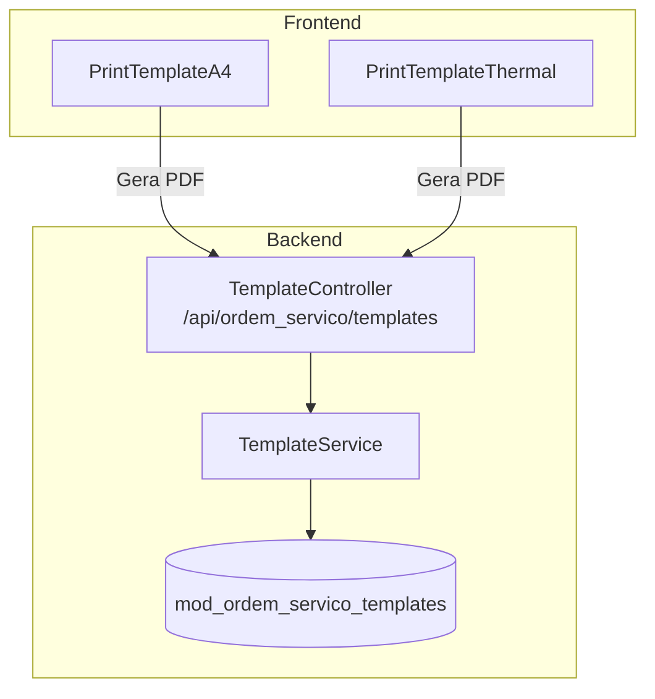
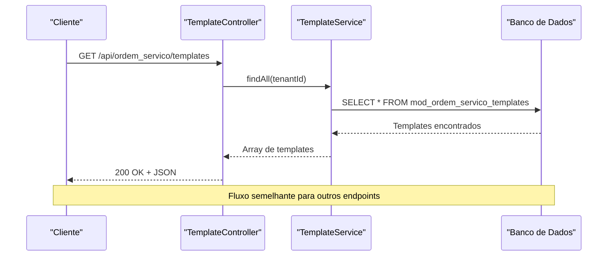
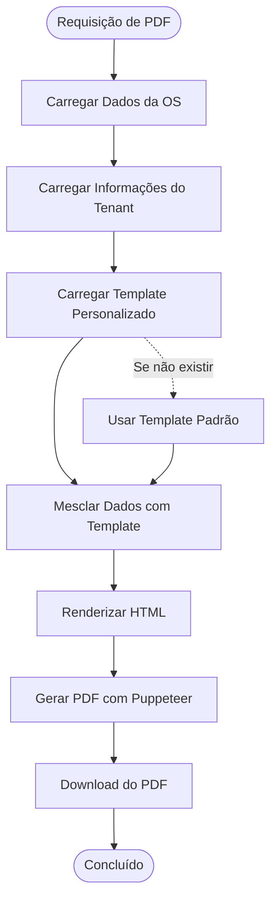
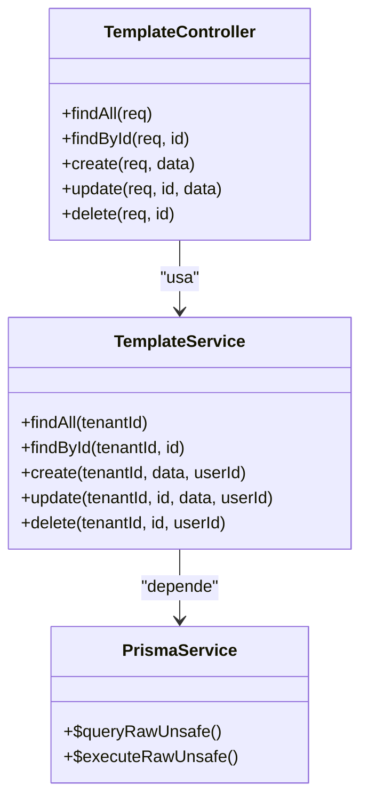
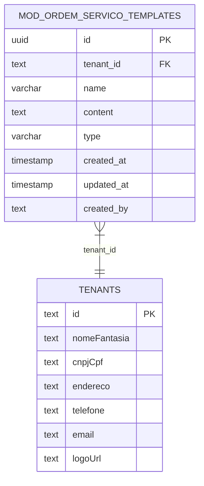

# Endpoints de Templates

<cite>
**Arquivos referenciados neste documento**
- [template.controller.ts](file://backend/shared/controllers/template.controller.ts)
- [template.service.ts](file://backend/shared/services/template.service.ts)
- [routes.ts](file://backend/routes.ts)
- [001_master.sql](file://backend/migrations/001_master.sql)
- [003_add_print_fields.sql](file://backend/migrations/003_add_print_fields.sql)
- [004_add_tables_os.sql](file://backend/migrations/004_add_tables_os.sql)
- [pdf-template.util.ts](file://backend/ordens/pdf-template.util.ts)
- [PrintTemplateA4.tsx](file://frontend/components/PrintTemplateA4.tsx)
- [PrintTemplateThermal.tsx](file://frontend/components/PrintTemplateThermal.tsx)
- [ordens.controller.ts](file://backend/ordens/ordens.controller.ts)
- [ordens.service.ts](file://backend/ordens/ordens.service.ts)
</cite>

## Sumário
1. [Introdução](#introdução)
2. [Estrutura do Projeto](#estrutura-do-projeto)
3. [Componentes Principais](#componentes-principais)
4. [Visão Geral da Arquitetura](#visão-geral-da-arquitetura)
5. [Análise Detalhada dos Endpoints](#análise-detalhada-dos-endpoints)
6. [Análise de Dependências](#análise-de-dependências)
7. [Considerações de Desempenho](#considerações-de-desempenho)
8. [Guia de Solução de Problemas](#guia-de-solução-de-problemas)
9. [Conclusão](#conclusão)

## Introdução
Este documento apresenta a documentação completa dos endpoints REST do sistema de Templates, especificamente voltados para o gerenciamento de modelos de impressão. O sistema permite criar, consultar, atualizar e excluir templates de documentos, sendo essencial para a geração de documentos padronizados como A4 e termal. Além disso, os templates são integrados ao fluxo de geração de PDFs de ordens de serviço, permitindo personalização do conteúdo impresso com base em dados específicos do tenant e da ordem.

## Estrutura do Projeto
O módulo de Templates segue uma arquitetura de camadas bem definida:
- Controlador REST exposto em `/api/ordem_servico/templates`
- Serviço de negócio que interage com o banco de dados
- Migrações de banco de dados que criam a estrutura necessária
- Componentes frontend para impressão A4 e termal



**Diagrama fonte**
- [template.controller.ts](file://backend/shared/controllers/template.controller.ts#L6-L80)
- [template.service.ts](file://backend/shared/services/template.service.ts#L5-L104)
- [001_master.sql](file://backend/migrations/001_master.sql#L103-L115)

**Seção fonte**
- [template.controller.ts](file://backend/shared/controllers/template.controller.ts#L1-L80)
- [routes.ts](file://backend/routes.ts#L9-L17)

## Componentes Principais
O sistema de Templates é composto pelos seguintes componentes principais:

### Controlador de Templates
Responsável por expor os endpoints REST e lidar com as requisições HTTP:
- Autenticação JWT obrigatória
- Operações CRUD completas para templates
- Validação de tenant e permissões

### Serviço de Templates
Implementa a lógica de negócio e acesso ao banco de dados:
- Consultas SQL parametrizadas
- Tratamento de erros e exceções
- Persistência de templates com conteúdo personalizado

### Migrações de Banco de Dados
Define a estrutura da tabela de templates:
- Identificador único UUID
- Relacionamento com tenants
- Campos para nome, conteúdo e tipo de template
- Indices para performance

**Seção fonte**
- [template.service.ts](file://backend/shared/services/template.service.ts#L1-L104)
- [001_master.sql](file://backend/migrations/001_master.sql#L103-L115)

## Visão Geral da Arquitetura
A arquitetura do sistema de Templates segue o padrão MVC com separação clara de responsabilidades:



**Diagrama fonte**
- [template.controller.ts](file://backend/shared/controllers/template.controller.ts#L13-L22)
- [template.service.ts](file://backend/shared/services/template.service.ts#L10-L26)

## Análise Detalhada dos Endpoints

### Endpoint: Listar Todos os Templates
**Método:** GET  
**URL:** `/api/ordem_servico/templates`  
**Descrição:** Retorna todos os templates disponíveis para o tenant autenticado

**Autenticação:** JWT obrigatória  
**Parâmetros de Requisição:** Nenhum  
**Parâmetros de Resposta:** Nenhum  
**Códigos HTTP:**
- 200: Sucesso - Retorna array de templates
- 500: Erro interno - Falha na consulta ao banco

**Resposta Exemplo:**
```json
[
  {
    "id": "uuid-do-template",
    "tenant_id": "tenant-123",
    "name": "Modelo Padrão A4",
    "content": "<html>...</html>",
    "type": "A4",
    "created_at": "2024-01-01T00:00:00Z",
    "updated_at": "2024-01-01T00:00:00Z",
    "created_by": "usuario-123"
  }
]
```

**Seção fonte**
- [template.controller.ts](file://backend/shared/controllers/template.controller.ts#L13-L22)
- [template.service.ts](file://backend/shared/services/template.service.ts#L10-L26)

### Endpoint: Obter Template por ID
**Método:** GET  
**URL:** `/api/ordem_servico/templates/{id}`  
**Descrição:** Retorna um template específico pelo seu identificador

**Autenticação:** JWT obrigatória  
**Parâmetros de Requisição:** 
- Path Parameter: `id` (UUID do template)  
**Parâmetros de Resposta:** Nenhum  
**Códigos HTTP:**
- 200: Sucesso - Template encontrado
- 404: Não encontrado - Template não existe
- 500: Erro interno - Falha na consulta

**Resposta Exemplo:**
```json
{
  "id": "uuid-do-template",
  "tenant_id": "tenant-123", 
  "name": "Modelo Termal",
  "content": "<div>...</div>",
  "type": "THERMAL",
  "created_at": "2024-01-01T00:00:00Z",
  "updated_at": "2024-01-01T00:00:00Z",
  "created_by": "usuario-123"
}
```

**Seção fonte**
- [template.controller.ts](file://backend/shared/controllers/template.controller.ts#L24-L36)
- [template.service.ts](file://backend/shared/services/template.service.ts#L28-L39)

### Endpoint: Criar Novo Template
**Método:** POST  
**URL:** `/api/ordem_servico/templates`  
**Descrição:** Cria um novo template com os dados fornecidos

**Autenticação:** JWT obrigatória  
**Parâmetros de Requisição (Body):**
- `name` (string, obrigatório): Nome do template
- `content` (string, obrigatório): Conteúdo HTML/Personalização
- `type` (string, opcional): Tipo do template (padrão: GENERAL)

**Parâmetros de Resposta:** Nenhum  
**Códigos HTTP:**
- 201: Sucesso - Template criado
- 400: Requisição inválida - Dados incompletos
- 500: Erro interno - Falha na criação

**Resposta Exemplo:**
```json
{
  "success": true,
  "result": "INSERT 0 1"
}
```

**Seção fonte**
- [template.controller.ts](file://backend/shared/controllers/template.controller.ts#L38-L50)
- [template.service.ts](file://backend/shared/services/template.service.ts#L41-L62)

### Endpoint: Atualizar Template
**Método:** PUT  
**URL:** `/api/ordem_servico/templates/{id}`  
**Descrição:** Atualiza um template existente

**Autenticação:** JWT obrigatória  
**Parâmetros de Requisição:**
- Path Parameter: `id` (UUID do template)
- Body: 
  - `name` (string, obrigatório): Nome do template
  - `content` (string, obrigatório): Conteúdo atualizado
  - `type` (string, opcional): Tipo do template

**Parâmetros de Resposta:** Nenhum  
**Códigos HTTP:**
- 200: Sucesso - Template atualizado
- 404: Não encontrado - Template não existe
- 500: Erro interno - Falha na atualização

**Resposta Exemplo:**
```json
{
  "success": true,
  "result": "UPDATE 1"
}
```

**Seção fonte**
- [template.controller.ts](file://backend/shared/controllers/template.controller.ts#L52-L65)
- [template.service.ts](file://backend/shared/services/template.service.ts#L64-L85)

### Endpoint: Excluir Template
**Método:** DELETE  
**URL:** `/api/ordem_servico/templates/{id}`  
**Descrição:** Remove permanentemente um template

**Autenticação:** JWT obrigatória  
**Parâmetros de Requisição:**
- Path Parameter: `id` (UUID do template)  
**Parâmetros de Resposta:** Nenhum  
**Códigos HTTP:**
- 200: Sucesso - Template excluído
- 404: Não encontrado - Template não existe
- 500: Erro interno - Falha na exclusão

**Resposta Exemplo:**
```json
{
  "success": true
}
```

**Seção fonte**
- [template.controller.ts](file://backend/shared/controllers/template.controller.ts#L67-L79)
- [template.service.ts](file://backend/shared/services/template.service.ts#L87-L103)

## Templates A4 e Termal

### Template A4 (Impressão em Papel)
O template A4 é projetado para impressão em papel A4 com layout completo:

**Características principais:**
- Layout responsivo para impressão
- Cabeçalho com logotipo e informações da empresa
- Tabela de informações da ordem de serviço
- Seções para dados do cliente, equipamento e serviços
- Assinaturas e rodapé com marca d'água
- Estilos otimizados para impressão

**Componentes principais:**
- Header com logotipo e dados da empresa
- Título da OS com número e data
- Tabela de informações (status, datas, garantia)
- Seções de dados personalizáveis
- Tabela de itens e valores
- Assinaturas do atendente e cliente
- Declaração de recebimento (via 2)

**Seção fonte**
- [PrintTemplateA4.tsx](file://frontend/components/PrintTemplateA4.tsx#L72-L694)
- [pdf-template.util.ts](file://backend/ordens/pdf-template.util.ts#L2-L461)

### Template Termal (Impressão Fiscal)
O template termal é otimizado para impressoras térmicas de 80mm:

**Características principais:**
- Layout compacto para 80mm de largura
- Fontes e tamanhos otimizados
- QR Code para pagamento PIX
- Layout vertical com informações essenciais
- Formatação simplificada para impressão térmica

**Componentes principais:**
- Logotipo e informações da empresa
- Documento de controle com número da OS
- Meta informações (emissão, status, previsão)
- Seção de cliente com telefone
- Descrição do equipamento
- Itens/serviços em formato compacto
- QR Code e informações de pagamento
- Observações do cliente

**Seção fonte**
- [PrintTemplateThermal.tsx](file://frontend/components/PrintTemplateThermal.tsx#L10-L273)

## Integração com Geração de Documentos

### Fluxo de Geração de PDF
O sistema de templates se integra com a geração de PDFs através de um pipeline completo:



**Diagrama fonte**
- [ordens.service.ts](file://backend/ordens/ordens.service.ts#L16-L123)
- [pdf-template.util.ts](file://backend/ordens/pdf-template.util.ts#L2-L461)

### Personalização de Conteúdo
Os templates permitem personalização completa através de variáveis e dados dinâmicos:

**Campos personalizáveis:**
- Informações do tenant (nome, CNPJ, endereço, telefone)
- Dados da ordem de serviço (número, datas, status)
- Informações do cliente (nome, telefone, e-mail)
- Descrição do serviço e equipamento
- Itens e valores
- Condições de execução configuradas

**Seção fonte**
- [ordens.service.ts](file://backend/ordens/ordens.service.ts#L33-L76)
- [pdf-template.util.ts](file://backend/ordens/pdf-template.util.ts#L2-L461)

## Análise de Dependências

### Relacionamento entre Componentes


**Diagrama fonte**
- [template.controller.ts](file://backend/shared/controllers/template.controller.ts#L8-L11)
- [template.service.ts](file://backend/shared/services/template.service.ts#L1-L8)

### Mapeamento de Tabelas


**Diagrama fonte**
- [001_master.sql](file://backend/migrations/001_master.sql#L103-L115)

**Seção fonte**
- [routes.ts](file://backend/routes.ts#L9-L17)
- [001_master.sql](file://backend/migrations/001_master.sql#L103-L115)

## Considerações de Desempenho

### Otimizações Implementadas
- **Consultas parametrizadas:** Todas as operações utilizam SQL parametrizado para evitar injeção e melhorar cache
- **Índices otimizados:** Índice na coluna tenant_id para consultas rápidas
- **Tratamento de erros:** Retorno de array vazio quando tabela não existe
- **Paginação implícita:** Ordenação alfabética pelo nome dos templates

### Melhorias Recomendadas
- Implementar paginação explícita para grandes volumes de templates
- Adicionar cache para templates mais acessados
- Considerar compressão de conteúdo HTML armazenado
- Implementar índices adicionais para campos frequentemente pesquisados

## Guia de Solução de Problemas

### Erros Comuns e Soluções

**Erro 401 - Não Autorizado**
- Causa: Token JWT inválido ou expirado
- Solução: Realizar login novamente e renovar o token

**Erro 403 - Acesso Negado**
- Causa: Tentativa de acessar templates de outro tenant
- Solução: Verificar se o usuário pertence ao mesmo tenant

**Erro 500 - Erro Interno**
- Causa: Falha na conexão com o banco de dados
- Solução: Verificar status do banco e reintentar a operação

**Seção fonte**
- [template.controller.ts](file://backend/shared/controllers/template.controller.ts#L18-L21)
- [template.service.ts](file://backend/shared/services/template.service.ts#L21-L25)

### Debugging de Templates
Para depurar problemas com templates personalizados:

1. **Verificar estrutura do banco:**
   ```sql
   SELECT * FROM mod_ordem_servico_templates WHERE tenant_id = 'SEU_TENANT';
   ```

2. **Testar renderização local:**
   - Copiar conteúdo do template para um arquivo HTML
   - Abrir no navegador para verificar formatação

3. **Validar dados de entrada:**
   - Verificar se todos os campos obrigatórios estão preenchidos
   - Confirmar que o conteúdo HTML é válido

## Conclusão
O sistema de Templates oferece uma solução robusta e escalável para gerenciamento de modelos de impressão. Com a separação clara de camadas, implementação de segurança por tenant e integração com templates A4 e termal, o sistema atende às necessidades de geração de documentos padronizados. As operações CRUD completas permitem fácil personalização e manutenção dos templates, enquanto a integração com o fluxo de geração de PDFs garante uma experiência consistente tanto para impressão em papel quanto para impressoras térmicas.

As próximas etapas recomendadas incluem a implementação de paginação, cache e monitoramento de desempenho, além de expandir o sistema para suportar diferentes tipos de templates além dos já existentes (A4 e termal).