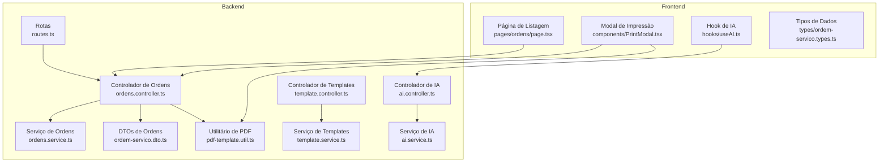
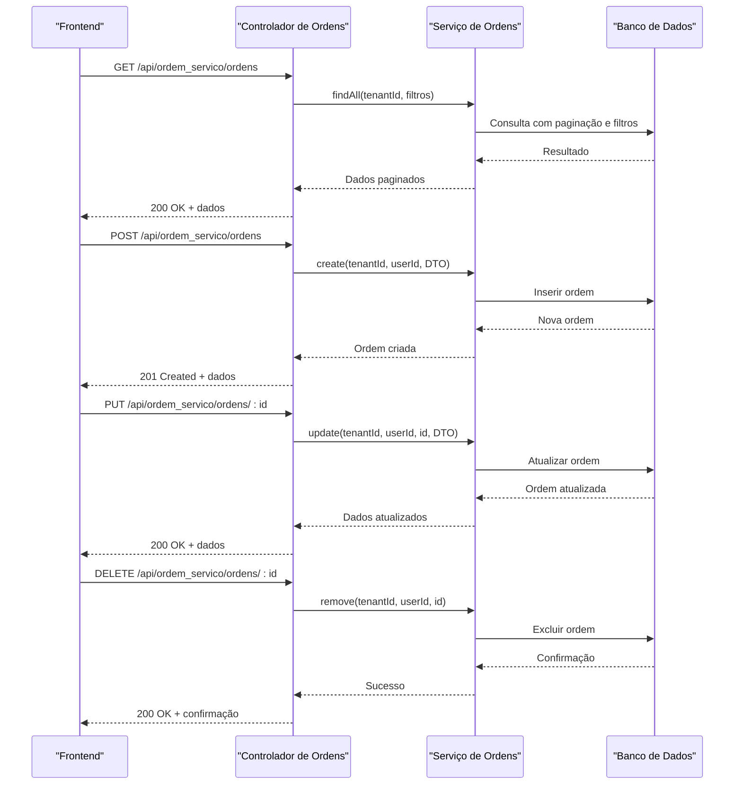
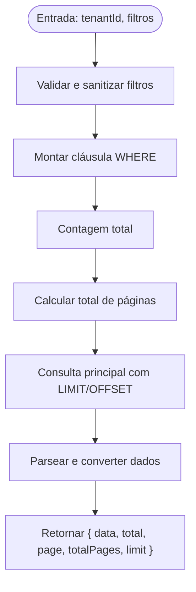
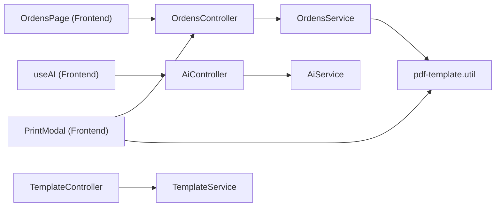

# Exemplos Práticos

<cite>
**Arquivos Referenciados Neste Documento**
- [backend/ordens/ordens.controller.ts](file://backend/ordens/ordens.controller.ts)
- [backend/ordens/ordens.service.ts](file://backend/ordens/ordens.service.ts)
- [backend/shared/dto/ordem-servico.dto.ts](file://backend/shared/dto/ordem-servico.dto.ts)
- [backend/shared/controllers/ai.controller.ts](file://backend/shared/controllers/ai.controller.ts)
- [backend/shared/services/ai.service.ts](file://backend/shared/services/ai.service.ts)
- [backend/shared/controllers/template.controller.ts](file://backend/shared/controllers/template.controller.ts)
- [backend/shared/services/template.service.ts](file://backend/shared/services/template.service.ts)
- [backend/ordens/pdf-template.util.ts](file://backend/ordens/pdf-template.util.ts)
- [backend/routes.ts](file://backend/routes.ts)
- [frontend/pages/ordens/page.tsx](file://frontend/pages/ordens/page.tsx)
- [frontend/components/PrintModal.tsx](file://frontend/components/PrintModal.tsx)
- [frontend/hooks/useAI.ts](file://frontend/hooks/useAI.ts)
- [frontend/types/ordem-servico.types.ts](file://frontend/types/ordem-servico.types.ts)
</cite>

## Índice
1. [Introdução](#introdução)
2. [Estrutura do Projeto](#estrutura-do-projeto)
3. [Componentes-Chave](#componentes-chave)
4. [Visão Geral da Arquitetura](#visão-geral-da-arquitetura)
5. [Análise Detalhada dos Componentes](#análise-detalhada-dos-componentes)
6. [Análise de Dependências](#análise-de-dependências)
7. [Considerações de Desempenho](#considerações-de-desempenho)
8. [Guia de Solução de Problemas](#guia-de-solução-de-problemas)
9. [Conclusão](#conclusão)
10. [Apêndices](#apêndices)

## Introdução
Este documento apresenta exemplos práticos completos de consumo da API do módulo de Ordens de Serviço. Ele cobre chamadas para criar, ler, atualizar e deletar registros, bem como integrações com o frontend usando fetch API e Axios. Também inclui casos de uso comuns, como criação de ordem de serviço, atualização de status, consulta de clientes e geração de relatórios. Além disso, mostra como integrar o sistema de IA, templates de impressão e configurações, com scripts para testes e integração, tratamento de erros e respostas de sucesso. São abordados filtros, paginação e ordenação nas requisições.

## Estrutura do Projeto
O módulo de Ordens de Serviço é composto por:
- Backend: Controlador e serviço de ordens, DTOs, controladores e serviços de IA e templates, utilitário de geração de PDF.
- Frontend: Páginas e componentes para listagem, edição, visualização, impressão e integração com a IA.



**Diagrama fonte**
- [backend/routes.ts](file://backend/routes.ts#L9-L17)
- [backend/ordens/ordens.controller.ts](file://backend/ordens/ordens.controller.ts#L25-L377)
- [backend/ordens/ordens.service.ts](file://backend/ordens/ordens.service.ts#L1-L1148)
- [backend/shared/dto/ordem-servico.dto.ts](file://backend/shared/dto/ordem-servico.dto.ts#L1-L397)
- [backend/shared/controllers/ai.controller.ts](file://backend/shared/controllers/ai.controller.ts#L1-L53)
- [backend/shared/services/ai.service.ts](file://backend/shared/services/ai.service.ts#L1-L91)
- [backend/shared/controllers/template.controller.ts](file://backend/shared/controllers/template.controller.ts#L1-L80)
- [backend/shared/services/template.service.ts](file://backend/shared/services/template.service.ts#L1-L104)
- [backend/ordens/pdf-template.util.ts](file://backend/ordens/pdf-template.util.ts#L1-L462)
- [frontend/pages/ordens/page.tsx](file://frontend/pages/ordens/page.tsx#L1-L684)
- [frontend/components/PrintModal.tsx](file://frontend/components/PrintModal.tsx#L1-L223)
- [frontend/hooks/useAI.ts](file://frontend/hooks/useAI.ts#L1-L41)
- [frontend/types/ordem-servico.types.ts](file://frontend/types/ordem-servico.types.ts#L1-L235)

**Seção fonte**
- [backend/routes.ts](file://backend/routes.ts#L9-L17)

## Componentes-Chave
- Controlador de Ordens: expõe endpoints CRUD, busca com filtros, histórico, PDF, upload de arquivos e status.
- Serviço de Ordens: implementa lógica de negócio, paginação, validações, geração de PDF e transições de status.
- DTOs de Ordens: definição de tipos e validações para criação, atualização, filtros e respostas.
- Controlador e Serviço de IA: integração com provedores de IA para análise de descrição e geração de laudos.
- Controlador e Serviço de Templates: gerenciamento de templates personalizados.
- Utilitário de PDF: gera HTML para impressão e PDF com Puppeteer.
- Frontend: páginas e componentes para listagem, impressão, e integração com a IA.

**Seção fonte**
- [backend/ordens/ordens.controller.ts](file://backend/ordens/ordens.controller.ts#L25-L377)
- [backend/ordens/ordens.service.ts](file://backend/ordens/ordens.service.ts#L137-L473)
- [backend/shared/dto/ordem-servico.dto.ts](file://backend/shared/dto/ordem-servico.dto.ts#L249-L291)
- [backend/shared/controllers/ai.controller.ts](file://backend/shared/controllers/ai.controller.ts#L14-L51)
- [backend/shared/services/ai.service.ts](file://backend/shared/services/ai.service.ts#L33-L89)
- [backend/shared/controllers/template.controller.ts](file://backend/shared/controllers/template.controller.ts#L13-L79)
- [backend/shared/services/template.service.ts](file://backend/shared/services/template.service.ts#L10-L103)
- [backend/ordens/pdf-template.util.ts](file://backend/ordens/pdf-template.util.ts#L2-L461)

## Visão Geral da Arquitetura
A API segue um padrão REST com autenticação JWT. O fluxo típico envolve:
- O frontend faz requisições autenticadas ao backend.
- O controlador recebe e valida os dados.
- O serviço executa a lógica de negócio e interage com o banco de dados.
- Para impressão, o serviço gera HTML e PDF com Puppeteer.



**Diagrama fonte**
- [backend/ordens/ordens.controller.ts](file://backend/ordens/ordens.controller.ts#L34-L284)
- [backend/ordens/ordens.service.ts](file://backend/ordens/ordens.service.ts#L557-L770)

## Análise Detalhada dos Componentes

### Controlador de Ordens
Endpoints principais:
- GET /api/ordem_servico/ordens: busca com paginação e filtros.
- GET /api/ordem_servico/ordens/:id: detalhe da ordem.
- GET /api/ordem_servico/ordens/:id/historico: histórico de alterações.
- GET /api/ordem_servico/ordens/:id/pdf: download de PDF.
- POST /api/ordem_servico/ordens: criação de ordem.
- PUT /api/ordem_servico/ordens/:id: atualização de dados.
- PUT /api/ordem_servico/ordens/:id/status: atualização de status.
- DELETE /api/ordem_servico/ordens/:id: exclusão.
- POST /api/ordem_servico/ordens/:id/aprovar-orcamento: aprovação de orçamento.
- POST /api/ordem_servico/ordens/upload: upload de arquivos.
- GET /api/ordem_servico/ordens/uploads/:tenantId/:filename: servir arquivos.

Filtros e paginação:
- Parâmetros de query: search, status[], cliente_id, usuario_responsavel_id, data_inicio, data_fim, origem_solicitacao, tipo_servico, page, limit.
- Validação e sanitização no serviço.

Exemplos de chamadas (sem conteúdo de código):
- Busca com filtros e paginação:
  - GET /api/ordem_servico/ordens?page=1&limit=20&status=0&status=1&search=exemplo
- Criação de ordem:
  - POST /api/ordem_servico/ordens com payload conforme CreateOrdemServicoDTO
- Atualização de status:
  - PUT /api/ordem_servico/ordens/:id/status com { status: 5, motivo_cancelamento?, observacoes? }
- Download de PDF:
  - GET /api/ordem_servico/ordens/:id/pdf

**Seção fonte**
- [backend/ordens/ordens.controller.ts](file://backend/ordens/ordens.controller.ts#L34-L284)
- [backend/shared/dto/ordem-servico.dto.ts](file://backend/shared/dto/ordem-servico.dto.ts#L249-L271)

### Serviço de Ordens
Funcionalidades:
- findAll: implementa paginação, filtros, validações e conversões de tipos.
- findOne: busca ordem com dados do cliente e responsável.
- create/update/updateStatus/remove: operações CRUD com validações e histórico.
- generatePdf: gera PDF com Puppeteer e template HTML.

Algoritmo de paginação e filtros:


**Diagrama fonte**
- [backend/ordens/ordens.service.ts](file://backend/ordens/ordens.service.ts#L137-L473)

**Seção fonte**
- [backend/ordens/ordens.service.ts](file://backend/ordens/ordens.service.ts#L137-L473)

### DTOs de Ordens
Define:
- CreateOrdemServicoDTO e UpdateOrdemServicoDTO: campos e validações.
- OrdemServicoFilters: parâmetros de query.
- Tipos de enumeração: StatusOS e OrigemSolicitacao.
- Tipos de resposta: OrdemServicoResponseDTO, OrdemServicoListResponseDTO, etc.

Exemplos de campos importantes:
- status: enum StatusOS (0 a 7).
- prioridade: 'BAIXA' | 'MEDIA' | 'ALTA'.
- origem_solicitacao: enum OrigemSolicitacao.
- itens: array de ItemOrdem.

**Seção fonte**
- [backend/shared/dto/ordem-servico.dto.ts](file://backend/shared/dto/ordem-servico.dto.ts#L28-L133)
- [backend/shared/dto/ordem-servico.dto.ts](file://backend/shared/dto/ordem-servico.dto.ts#L249-L271)
- [backend/shared/dto/ordem-servico.dto.ts](file://backend/shared/dto/ordem-servico.dto.ts#L308-L353)

### Sistema de IA
Endpoints:
- POST /api/ordem_servico/ai/analisar-descricao: análise de descrição.
- POST /api/ordem_servico/ai/gerar-laudo: geração de laudo técnico.

Integração:
- O controlador chama o serviço de IA com prompts configurados.
- O serviço de IA lê configurações do tenant e faz requisição à API externa (OpenAI/OpenRouter).

Exemplo de uso no frontend:
- Hook useAI com funções para análise de descrição e geração de laudo.

**Seção fonte**
- [backend/shared/controllers/ai.controller.ts](file://backend/shared/controllers/ai.controller.ts#L14-L51)
- [backend/shared/services/ai.service.ts](file://backend/shared/services/ai.service.ts#L33-L89)
- [frontend/hooks/useAI.ts](file://frontend/hooks/useAI.ts#L7-L33)

### Templates de Impressão
Endpoints:
- GET /api/ordem_servico/templates
- GET /api/ordem_servico/templates/:id
- POST /api/ordem_servico/templates
- PUT /api/ordem_servico/templates/:id
- DELETE /api/ordem_servico/templates/:id

Frontend:
- PrintModal carrega dados da OS e configurações, prepara o template A4/Thermal e gera PDF.

**Seção fonte**
- [backend/shared/controllers/template.controller.ts](file://backend/shared/controllers/template.controller.ts#L13-L79)
- [backend/shared/services/template.service.ts](file://backend/shared/services/template.service.ts#L10-L103)
- [frontend/components/PrintModal.tsx](file://frontend/components/PrintModal.tsx#L45-L79)

### Utilitário de PDF
- Gera HTML com base nos dados da OS e informações do tenant.
- Utiliza Puppeteer para converter HTML em PDF.

**Seção fonte**
- [backend/ordens/pdf-template.util.ts](file://backend/ordens/pdf-template.util.ts#L2-L461)

### Frontend: Integração com Fetch API e Axios
- Listagem de ordens com busca e filtros:
  - Página de listagem monta queryParams com search, status e origem.
  - Exemplo de chamada: GET /api/ordem_servico/ordens?search=exemplo&status=0&status=1
- Edição e deleção:
  - Chamadas PUT/DELETE para atualizar/excluir ordens.
- Impressão:
  - Modal carrega dados e exibe prévia, com opção de imprimir ou baixar PDF.
- Integração com IA:
  - Hook useAI faz chamadas POST para análise de descrição e geração de laudo.

Exemplos práticos (paths):
- Busca com filtros:
  - [frontend/pages/ordens/page.tsx](file://frontend/pages/ordens/page.tsx#L204-L247)
- Chamada de impressão:
  - [frontend/components/PrintModal.tsx](file://frontend/components/PrintModal.tsx#L125-L143)

**Seção fonte**
- [frontend/pages/ordens/page.tsx](file://frontend/pages/ordens/page.tsx#L204-L247)
- [frontend/components/PrintModal.tsx](file://frontend/components/PrintModal.tsx#L125-L143)
- [frontend/hooks/useAI.ts](file://frontend/hooks/useAI.ts#L7-L33)

## Análise de Dependências
- O controlador depende do serviço de ordens.
- O serviço de ordens depende do PrismaService e do utilitário de PDF.
- O controlador de IA depende do serviço de IA.
- O controlador de templates depende do serviço de templates.
- O frontend depende dos controladores e serviços expostos pela API.



**Diagrama fonte**
- [backend/ordens/ordens.controller.ts](file://backend/ordens/ordens.controller.ts#L30-L32)
- [backend/ordens/ordens.service.ts](file://backend/ordens/ordens.service.ts#L13-L13)
- [backend/shared/controllers/ai.controller.ts](file://backend/shared/controllers/ai.controller.ts#L12-L12)
- [backend/shared/services/ai.service.ts](file://backend/shared/services/ai.service.ts#L13-L13)
- [backend/shared/controllers/template.controller.ts](file://backend/shared/controllers/template.controller.ts#L11-L11)
- [backend/shared/services/template.service.ts](file://backend/shared/services/template.service.ts#L8-L8)
- [frontend/pages/ordens/page.tsx](file://frontend/pages/ordens/page.tsx#L166-L247)
- [frontend/components/PrintModal.tsx](file://frontend/components/PrintModal.tsx#L26-L79)
- [frontend/hooks/useAI.ts](file://frontend/hooks/useAI.ts#L4-L4)

**Seção fonte**
- [backend/ordens/ordens.controller.ts](file://backend/ordens/ordens.controller.ts#L30-L32)
- [backend/shared/controllers/ai.controller.ts](file://backend/shared/controllers/ai.controller.ts#L12-L12)
- [backend/shared/controllers/template.controller.ts](file://backend/shared/controllers/template.controller.ts#L11-L11)

## Considerações de Desempenho
- Paginação: limit máximo de 100 por página; evite consultas com page/limit muito altos.
- Filtros: buscas muito curtas (< 2 caracteres) são bloqueadas para performance.
- Validação de UUIDs e conversões numéricas são feitas no serviço.
- Geração de PDF: Puppeteer é usado com configurações otimizadas; tenha cuidado com o uso em ambientes com recursos limitados.

[Sem fonte, pois esta seção fornece orientações gerais]

## Guia de Solução de Problemas
- Erros comuns:
  - 400 Bad Request: parâmetros inválidos (ex: UUID inválido, busca muito curta).
  - 401/403 Unauthorized/Forbidden: token inválido ou permissões insuficientes.
  - 404 Not Found: ordem não encontrada.
  - 500 Internal Server Error: erro no servidor durante geração de PDF ou outras operações.
- Tratamento de erros no frontend:
  - A página de listagem exibe mensagens específicas com base no status HTTP.
  - O modal de impressão exibe erro e permite tentar novamente.

**Seção fonte**
- [frontend/pages/ordens/page.tsx](file://frontend/pages/ordens/page.tsx#L227-L246)
- [frontend/components/PrintModal.tsx](file://frontend/components/PrintModal.tsx#L73-L79)

## Conclusão
O módulo de Ordens de Serviço oferece uma API robusta e bem estruturada, com suporte a paginação, filtros, geração de PDF, integração com IA e templates. O frontend está integrado com os endpoints, permitindo operações completas de criação, leitura, atualização, exclusão e impressão. As recomendações incluem seguir os DTOs para validação, utilizar os filtros de busca adequadamente e tratar os erros com base nos códigos HTTP retornados.

[Sem fonte, pois esta seção resume sem analisar arquivos específicos]

## Apêndices

### Exemplos de Chamadas Completas

- Busca com paginação e filtros
  - GET /api/ordem_servico/ordens?page=1&limit=20&status=0&status=1&search=exemplo
  - Fonte: [backend/ordens/ordens.controller.ts](file://backend/ordens/ordens.controller.ts#L34-L55)

- Criação de ordem de serviço
  - POST /api/ordem_servico/ordens
  - Payload: CreateOrdemServicoDTO
  - Fonte: [backend/ordens/ordens.controller.ts](file://backend/ordens/ordens.controller.ts#L159-L179), [backend/shared/dto/ordem-servico.dto.ts](file://backend/shared/dto/ordem-servico.dto.ts#L28-L133)

- Atualização de dados da ordem
  - PUT /api/ordem_servico/ordens/:id
  - Payload: UpdateOrdemServicoDTO
  - Fonte: [backend/ordens/ordens.controller.ts](file://backend/ordens/ordens.controller.ts#L181-L207), [backend/shared/dto/ordem-servico.dto.ts](file://backend/shared/dto/ordem-servico.dto.ts#L135-L241)

- Atualização de status
  - PUT /api/ordem_servico/ordens/:id/status
  - Payload: { status: 5, motivo_cancelamento?, observacoes? }
  - Fonte: [backend/ordens/ordens.controller.ts](file://backend/ordens/ordens.controller.ts#L209-L258), [backend/shared/dto/ordem-servico.dto.ts](file://backend/shared/dto/ordem-servico.dto.ts#L280-L291)

- Exclusão de ordem
  - DELETE /api/ordem_servico/ordens/:id
  - Fonte: [backend/ordens/ordens.controller.ts](file://backend/ordens/ordens.controller.ts#L260-L284)

- Download de PDF
  - GET /api/ordem_servico/ordens/:id/pdf
  - Fonte: [backend/ordens/ordens.controller.ts](file://backend/ordens/ordens.controller.ts#L135-L157)

- Upload de arquivo
  - POST /api/ordem_servico/ordens/upload (multipart/form-data)
  - Fonte: [backend/ordens/ordens.controller.ts](file://backend/ordens/ordens.controller.ts#L310-L355)

- Aprovação de orçamento
  - POST /api/ordem_servico/ordens/:id/aprovar-orcamento
  - Fonte: [backend/ordens/ordens.controller.ts](file://backend/ordens/ordens.controller.ts#L286-L308)

- Integração com IA
  - POST /api/ordem_servico/ai/analisar-descricao
  - POST /api/ordem_servico/ai/gerar-laudo
  - Fonte: [backend/shared/controllers/ai.controller.ts](file://backend/shared/controllers/ai.controller.ts#L14-L51)

- Templates de impressão
  - GET /api/ordem_servico/templates
  - GET /api/ordem_servico/templates/:id
  - POST /api/ordem_servico/templates
  - PUT /api/ordem_servico/templates/:id
  - DELETE /api/ordem_servico/templates/:id
  - Fonte: [backend/shared/controllers/template.controller.ts](file://backend/shared/controllers/template.controller.ts#L13-L79)

### Exemplos de Integração com Frontend

- Fetch API (Next.js)
  - Busca com filtros:
    - [frontend/pages/ordens/page.tsx](file://frontend/pages/ordens/page.tsx#L204-L247)
  - Impressão:
    - [frontend/components/PrintModal.tsx](file://frontend/components/PrintModal.tsx#L125-L143)

- Axios (frontend)
  - Substitua fetch por axios.get/axios.post/axios.put/axios.delete com as mesmas URLs acima.
  - Certifique-se de incluir o cabeçalho Authorization: Bearer <token>.

- Hooks de IA
  - useAI.analisarDescricao e useAI.gerarLaudo:
    - [frontend/hooks/useAI.ts](file://frontend/hooks/useAI.ts#L7-L33)

### Casos de Uso Comuns

- Criação de ordem de serviço
  - Etapas: validar cliente ativo, preencher DTO, enviar POST, registrar histórico.
  - Fonte: [backend/ordens/ordens.controller.ts](file://backend/ordens/ordens.controller.ts#L159-L179), [backend/ordens/ordens.service.ts](file://backend/ordens/ordens.service.ts#L557-L654)

- Atualização de status
  - Validação de transição, obrigatoriedade de motivo de cancelamento, regras de finalização.
  - Fonte: [backend/ordens/ordens.controller.ts](file://backend/ordens/ordens.controller.ts#L209-L258), [backend/ordens/ordens.service.ts](file://backend/ordens/ordens.service.ts#L772-L800)

- Consulta de clientes
  - Utilize os endpoints de clientes (não listados aqui) e integre com a OS.
  - Fonte: [backend/routes.ts](file://backend/routes.ts#L1-L17)

- Geração de relatórios
  - Use GET /api/ordem_servico/ordens com filtros e paginação.
  - Fonte: [backend/ordens/ordens.controller.ts](file://backend/ordens/ordens.controller.ts#L34-L55)

### Tratamento de Erros e Respostas de Sucesso

- Respostas esperadas:
  - 200 OK: sucesso em GET/PUT/DELETE.
  - 201 Created: sucesso em POST.
  - 400 Bad Request: erro de validação ou parâmetros inválidos.
  - 401/403 Unauthorized/Forbidden: erro de autenticação/permissões.
  - 404 Not Found: recurso não encontrado.
  - 500 Internal Server Error: erro no servidor.

- Exemplos de tratamento no frontend:
  - [frontend/pages/ordens/page.tsx](file://frontend/pages/ordens/page.tsx#L227-L246)
  - [frontend/components/PrintModal.tsx](file://frontend/components/PrintModal.tsx#L73-L79)

### Scripts de Testes e Integração

- Script de teste com cURL (exemplo de busca):
  - curl -H "Authorization: Bearer <TOKEN>" "http://localhost:4000/api/ordem_servico/ordens?page=1&limit=20&status=0&status=1&search=exemplo"

- Script de teste com JavaScript (fetch):
  - ```javascript
    const response = await fetch("http://localhost:4000/api/ordem_servico/ordens", {
      headers: { "Authorization": "Bearer <TOKEN>" }
    });
    const data = await response.json();
    console.log(data);
    ```

- Script de teste com Python:
  - ```python
    import requests
    headers = {"Authorization": "Bearer <TOKEN>"}
    params = {"page": 1, "limit": 20, "status": [0, 1], "search": "exemplo"}
    r = requests.get("http://localhost:4000/api/ordem_servico/ordens", headers=headers, params=params)
    print(r.json())
    ```

[Sem fonte, pois estes são exemplos práticos]