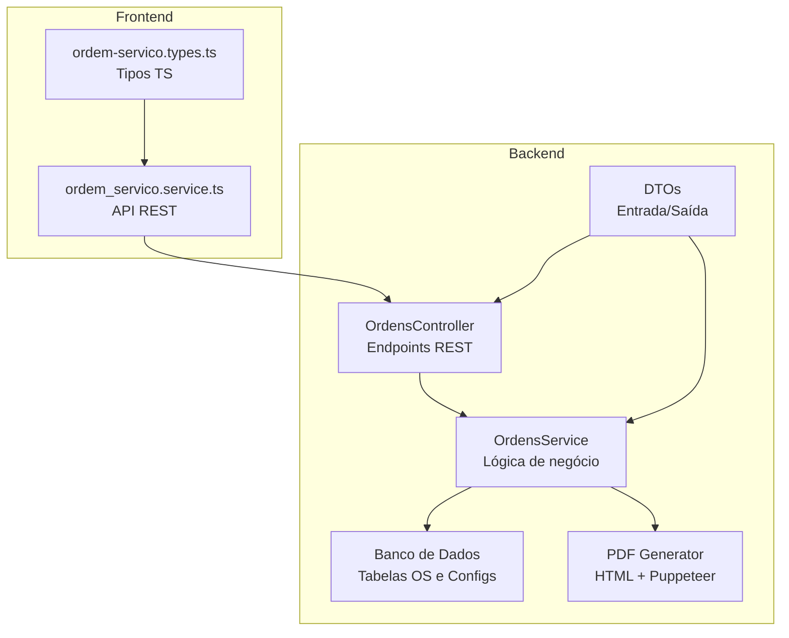
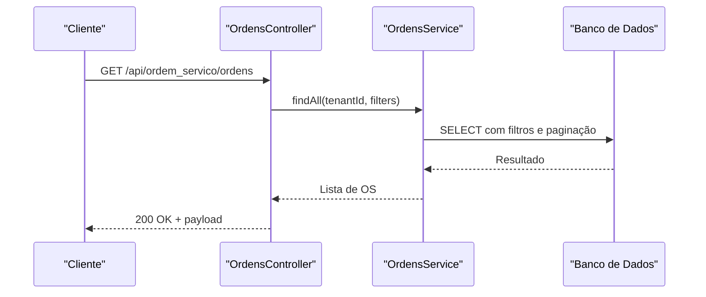
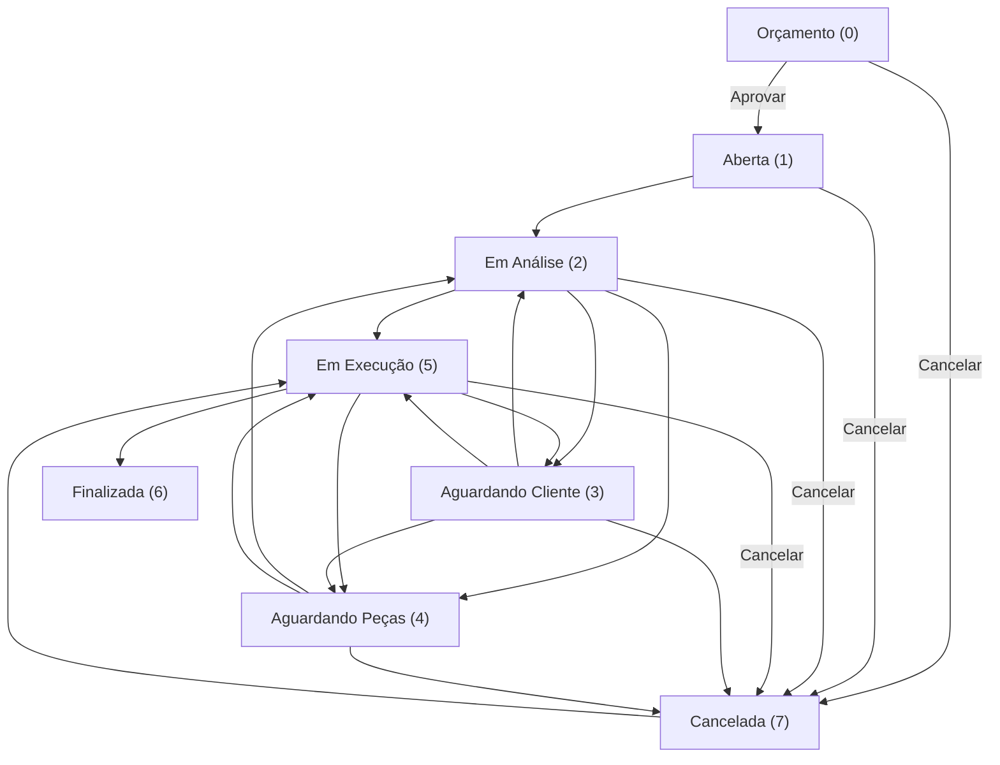
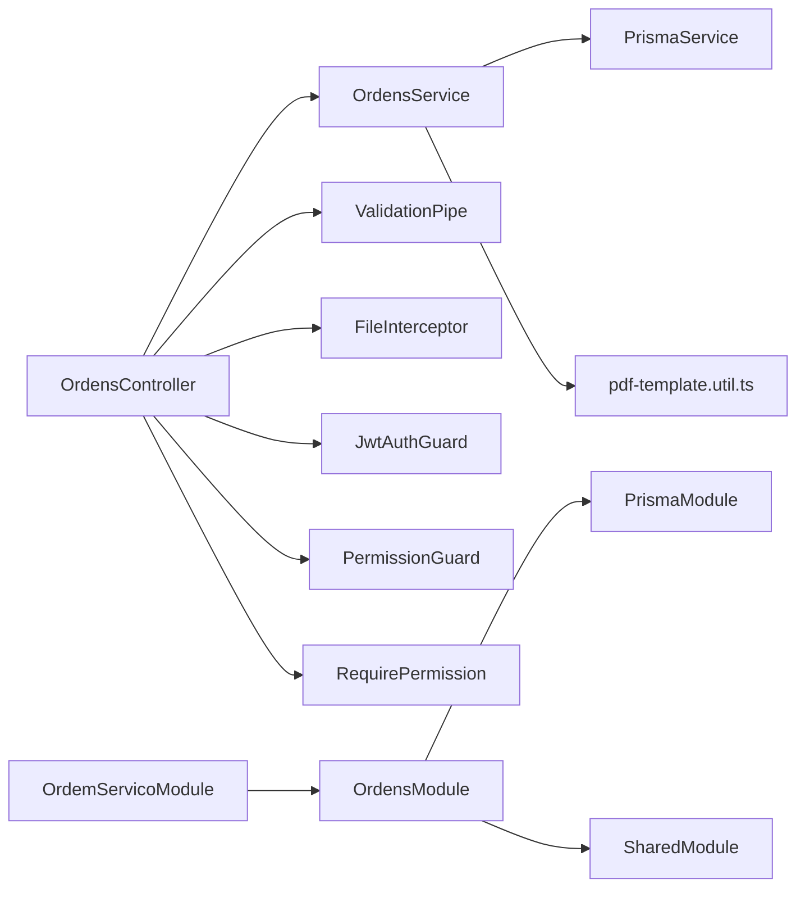

# Referência da API

<cite>
**Arquivos referenciados nesta documentação**
- [backend/ordens/ordens.controller.ts](file://backend/ordens/ordens.controller.ts)
- [backend/ordens/ordens.service.ts](file://backend/ordens/ordens.service.ts)
- [backend/ordens/pdf-template.util.ts](file://backend/ordens/pdf-template.util.ts)
- [backend/ordens/ordens.module.ts](file://backend/ordens/ordens.module.ts)
- [backend/shared/dto/ordem-servico.dto.ts](file://backend/shared/dto/ordem-servico.dto.ts)
- [backend/routes.ts](file://backend/routes.ts)
- [backend/ordem_servico.module.ts](file://backend/ordem_servico.module.ts)
- [backend/migrations/004_add_tables_os.sql](file://backend/migrations/004_add_tables_os.sql)
- [backend/shared/constants/available-permissions.ts](file://backend/shared/constants/available-permissions.ts)
- [backend/shared/guards/permission.guard.ts](file://backend/shared/guards/permission.guard.ts)
- [backend/shared/decorators/require-permission.decorator.ts](file://backend/shared/decorators/require-permission.decorator.ts)
- [frontend/services/ordem_servico.service.ts](file://frontend/services/ordem_servico.service.ts)
- [frontend/types/ordem-servico.types.ts](file://frontend/types/ordem-servico.types.ts)
</cite>

## Sumário
1. [Introdução](#introdução)
2. [Estrutura do Projeto](#estrutura-do-projeto)
3. [Componentes Principais](#componentes-principais)
4. [Visão Geral da Arquitetura](#visão-geral-da-arquitetura)
5. [Análise Detalhada dos Componentes](#análise-detalhada-dos-componentes)
6. [Análise de Dependências](#análise-de-dependências)
7. [Considerações de Desempenho](#considerações-de-desempenho)
8. [Guia de Solução de Problemas](#guia-de-solução-de-problemas)
9. [Conclusão](#conclusão)
10. [Apêndices](#apêndices)

## Introdução
Esta documentação apresenta a Referência da API REST do módulo de Ordens de Serviço. Ela descreve endpoints HTTP, esquemas de requisição/resposta, autenticação, permissões, validações, tratamento de erros, segurança, limitação de taxa, versionamento, casos de uso comuns, diretrizes para implementação de clientes e dicas de otimização. Também inclui informações sobre geração de PDFs e fluxos de status.

## Estrutura do Projeto
O módulo de Ordens de Serviço é composto pelos seguintes elementos-chave:
- Controlador de Ordens: expõe os endpoints REST e aplica validações e proteções.
- Serviço de Ordens: implementa a lógica de negócio, consultas, geração de PDFs e transições de status.
- DTOs: definem os esquemas de entrada/saída e validações.
- Módulos NestJS: organização dos componentes e injeção de dependência.
- Migrações: criação de tabelas e campos necessários para o módulo.
- Frontend: serviços e tipos TypeScript consumindo a API REST.

**Diagrama fonte**
- [backend/ordens/ordens.controller.ts](file://backend/ordens/ordens.controller.ts#L25-L377)
- [backend/ordens/ordens.service.ts](file://backend/ordens/ordens.service.ts#L1-L120)
- [backend/ordens/pdf-template.util.ts](file://backend/ordens/pdf-template.util.ts#L1-L462)
- [frontend/services/ordem_servico.service.ts](file://frontend/services/ordem_servico.service.ts#L1-L20)
- [frontend/types/ordem-servico.types.ts](file://frontend/types/ordem-servico.types.ts#L1-L235)

**Seção fonte**
- [backend/ordem_servico.module.ts](file://backend/ordem_servico.module.ts#L1-L35)
- [backend/ordens/ordens.module.ts](file://backend/ordens/ordens.module.ts#L1-L13)
- [backend/routes.ts](file://backend/routes.ts#L1-L17)

## Componentes Principais
- Controlador de Ordens: define os endpoints REST, aplica pipes de validação, interceptores de upload e proteções de permissão.
- Serviço de Ordens: consulta paginada, filtros avançados, geração de PDF com Puppeteer, transições de status e histórico.
- DTOs: validações com class-validator, enums de status e origem, e esquemas de resposta.
- Segurança: autenticação JWT e permissões granulares via decorator e guard.

**Seção fonte**
- [backend/ordens/ordens.controller.ts](file://backend/ordens/ordens.controller.ts#L25-L377)
- [backend/ordens/ordens.service.ts](file://backend/ordens/ordens.service.ts#L125-L135)
- [backend/shared/dto/ordem-servico.dto.ts](file://backend/shared/dto/ordem-servico.dto.ts#L1-L397)
- [backend/shared/guards/permission.guard.ts](file://backend/shared/guards/permission.guard.ts#L1-L58)
- [backend/shared/decorators/require-permission.decorator.ts](file://backend/shared/decorators/require-permission.decorator.ts#L1-L25)

## Visão Geral da Arquitetura
A API REST segue um padrão RESTful com recursos bem definidos. O controlador aplica:
- Autenticação: JwtAuthGuard nos endpoints protegidos.
- Validação: ValidationPipe com transform e whitelist.
- Upload de arquivos: FileInterceptor com tratamento seguro de buffers.
- Permissões: RequirePermission/PermissionGuard para ações específicas.

**Diagrama fonte**
- [backend/ordens/ordens.controller.ts](file://backend/ordens/ordens.controller.ts#L34-L55)
- [backend/ordens/ordens.service.ts](file://backend/ordens/ordens.service.ts#L137-L473)

**Seção fonte**
- [backend/ordens/ordens.controller.ts](file://backend/ordens/ordens.controller.ts#L25-L377)
- [backend/ordens/ordens.service.ts](file://backend/ordens/ordens.service.ts#L1-L120)

## Análise Detalhada dos Componentes

### Endpoints REST

#### Base e Autenticação
- Base do endpoint: api/ordem_servico/ordens
- Todos os endpoints abaixo exigem autenticação JWT (JwtAuthGuard).
- Alguns endpoints públicos permitem acesso sem autenticação (ex: upload de arquivos via URL pública).

**Seção fonte**
- [backend/ordens/ordens.controller.ts](file://backend/ordens/ordens.controller.ts#L25-L27)
- [backend/ordens/ordens.controller.ts](file://backend/ordens/ordens.controller.ts#L357-L376)

#### Listagem e Busca
- Método: GET
- Caminho: /api/ordem_servico/ordens
- Query params: search, status[], cliente_id, usuario_responsavel_id, data_inicio, data_fim, origem_solicitacao, tipo_servico, page, limit
- Validação: ValidationPipe com transform e whitelist nos DTOs de entrada.
- Paginação: limit máximo de 100, page mínimo 1.
- Busca textual: bloqueio de buscas com menos de 2 caracteres para performance.

Resposta:
- OrdemServicoListResponseDTO com data, total, page, totalPages, limit.

**Seção fonte**
- [backend/ordens/ordens.controller.ts](file://backend/ordens/ordens.controller.ts#L34-L55)
- [backend/ordens/ordens.service.ts](file://backend/ordens/ordens.service.ts#L137-L473)
- [backend/shared/dto/ordem-servico.dto.ts](file://backend/shared/dto/ordem-servico.dto.ts#L249-L271)

#### Detalhe de Ordem
- Método: GET
- Caminho: /api/ordem_servico/ordens/{id}
- Resposta: OrdemServicoResponseDTO com dados do cliente e responsável.

**Seção fonte**
- [backend/ordens/ordens.controller.ts](file://backend/ordens/ordens.controller.ts#L101-L119)
- [backend/ordens/ordens.service.ts](file://backend/ordens/ordens.service.ts#L475-L555)
- [backend/shared/dto/ordem-servico.dto.ts](file://backend/shared/dto/ordem-servico.dto.ts#L308-L353)

#### Histórico de Ordem
- Método: GET
- Caminho: /api/ordem_servico/ordens/{id}/historico
- Resposta: Array de HistoricoResponseDTO.

**Seção fonte**
- [backend/ordens/ordens.controller.ts](file://backend/ordens/ordens.controller.ts#L121-L133)
- [backend/shared/dto/ordem-servico.dto.ts](file://backend/shared/dto/ordem-servico.dto.ts#L378-L389)

#### Dashboard
- Método: GET
- Caminho: /api/ordem_servico/ordens/dashboard
- Resposta: DashboardDataResponseDTO[] com status, quantidade e valor total.

**Seção fonte**
- [backend/ordens/ordens.controller.ts](file://backend/ordens/ordens.controller.ts#L57-L66)
- [backend/shared/dto/ordem-servico.dto.ts](file://backend/shared/dto/ordem-servico.dto.ts#L355-L359)

#### Tipos de Serviço
- Método: GET
- Caminho: /api/ordem_servico/ordens/tipos-servico
- Resposta: TipoServicoResponseDTO[].

**Seção fonte**
- [backend/ordens/ordens.controller.ts](file://backend/ordens/ordens.controller.ts#L68-L77)
- [backend/shared/dto/ordem-servico.dto.ts](file://backend/shared/dto/ordem-servico.dto.ts#L361-L365)

#### Tipos de Equipamento
- Método: GET
- Caminho: /api/ordem_servico/ordens/tipos-equipamento
- Resposta: TipoEquipamentoResponseDTO[].

**Seção fonte**
- [backend/ordens/ordens.controller.ts](file://backend/ordens/ordens.controller.ts#L79-L88)
- [backend/shared/dto/ordem-servico.dto.ts](file://backend/shared/dto/ordem-servico.dto.ts#L367-L370)

#### Técnicos
- Método: GET
- Caminho: /api/ordem_servico/ordens/technicians
- Resposta: TechnicianResponseDTO[].

**Seção fonte**
- [backend/ordens/ordens.controller.ts](file://backend/ordens/ordens.controller.ts#L90-L99)
- [backend/shared/dto/ordem-servico.dto.ts](file://backend/shared/dto/ordem-servico.dto.ts#L372-L376)

#### Criação de Ordem
- Método: POST
- Caminho: /api/ordem_servico/ordens
- Corpo: CreateOrdemServicoDTO
- Validação: ValidationPipe com transform e whitelist.
- Regras: cliente deve estar ativo; gera número sequencial; insere histórico de criação.

**Seção fonte**
- [backend/ordens/ordens.controller.ts](file://backend/ordens/ordens.controller.ts#L159-L179)
- [backend/ordens/ordens.service.ts](file://backend/ordens/ordens.service.ts#L557-L654)
- [backend/shared/dto/ordem-servico.dto.ts](file://backend/shared/dto/ordem-servico.dto.ts#L28-L133)

#### Atualização de Ordem
- Método: PUT
- Caminho: /api/ordem_servico/ordens/{id}
- Corpo: UpdateOrdemServicoDTO
- Validação: ValidationPipe com transform e whitelist.
- Regras: não permite edição de ordens finalizadas ou canceladas; atualiza histórico de alterações.

**Seção fonte**
- [backend/ordens/ordens.controller.ts](file://backend/ordens/ordens.controller.ts#L181-L207)
- [backend/ordens/ordens.service.ts](file://backend/ordens/ordens.service.ts#L656-L770)
- [backend/shared/dto/ordem-servico.dto.ts](file://backend/shared/dto/ordem-servico.dto.ts#L135-L241)

#### Alteração de Status
- Método: PUT
- Caminho: /api/ordem_servico/ordens/{id}/status
- Corpo: UpdateStatusDTO
- Validação: ValidationPipe com transform e whitelist.
- Regras: transições válidas, cancelamento requer motivo, finalização exige status anterior e valor positivo.

**Seção fonte**
- [backend/ordens/ordens.controller.ts](file://backend/ordens/ordens.controller.ts#L209-L258)
- [backend/ordens/ordens.service.ts](file://backend/ordens/ordens.service.ts#L125-L135)
- [backend/shared/dto/ordem-servico.dto.ts](file://backend/shared/dto/ordem-servico.dto.ts#L280-L291)

#### Exclusão de Ordem
- Método: DELETE
- Caminho: /api/ordem_servico/ordens/{id}
- Regras: só permite exclusão de orçamentos ou usuários com papéis ADMIN/SUPER_ADMIN.

**Seção fonte**
- [backend/ordens/ordens.controller.ts](file://backend/ordens/ordens.controller.ts#L260-L284)
- [backend/ordens/ordens.service.ts](file://backend/ordens/ordens.service.ts#L771-L800)

#### Aprovação de Orçamento
- Método: POST
- Caminho: /api/ordem_servico/ordens/{id}/aprovar-orcamento
- Regras: apenas orçamentos podem ser aprovados.

**Seção fonte**
- [backend/ordens/ordens.controller.ts](file://backend/ordens/ordens.controller.ts#L286-L308)

#### Upload de Arquivo
- Método: POST
- Caminho: /api/ordem_servico/ordens/upload
- Corpo: multipart/form-data com campo file
- Validação: FileInterceptor, tratamento de buffer, salvamento em uploads/modules/ordem_servico/ordens/{tenantId}/ com nome único
- Resposta: UploadResponseDTO com url pública

**Seção fonte**
- [backend/ordens/ordens.controller.ts](file://backend/ordens/ordens.controller.ts#L310-L355)

#### Download de Arquivo
- Método: GET
- Caminho público: /api/ordem_servico/ordens/uploads/{tenantId}/{filename}
- Proteção: verificação de caminho seguro e acesso permitido via @Public()

**Seção fonte**
- [backend/ordens/ordens.controller.ts](file://backend/ordens/ordens.controller.ts#L357-L376)

#### Geração de PDF
- Método: GET
- Caminho: /api/ordem_servico/ordens/{id}/pdf
- Processo: gera HTML com base em template e dados da OS, usa Puppeteer para gerar PDF, retorna buffer binário
- Resposta: application/pdf com Content-Disposition attachment

**Seção fonte**
- [backend/ordens/ordens.controller.ts](file://backend/ordens/ordens.controller.ts#L135-L157)
- [backend/ordens/ordens.service.ts](file://backend/ordens/ordens.service.ts#L16-L123)
- [backend/ordens/pdf-template.util.ts](file://backend/ordens/pdf-template.util.ts#L1-L462)

### Esquemas de Requisição/Resposta

#### Enums
- StatusOS: ORCAMENTO, ABERTA, EM_ANALISE, AGUARDANDO_CLIENTE, AGUARDANDO_PECAS, EM_EXECUCAO, FINALIZADA, CANCELADA
- OrigemSolicitacao: WHATSAPP, PRESENCIAL, SISTEMA

**Seção fonte**
- [backend/shared/dto/ordem-servico.dto.ts](file://backend/shared/dto/ordem-servico.dto.ts#L3-L18)
- [backend/shared/dto/ordem-servico.dto.ts](file://backend/shared/dto/ordem-servico.dto.ts#L3-L18)

#### DTOs de Entrada
- CreateOrdemServicoDTO: campos obrigatórios e opcionais para criação de OS
- UpdateOrdemServicoDTO: campos atualizáveis
- UpdateStatusDTO: status e campos associados à mudança de status

**Seção fonte**
- [backend/shared/dto/ordem-servico.dto.ts](file://backend/shared/dto/ordem-servico.dto.ts#L28-L133)
- [backend/shared/dto/ordem-servico.dto.ts](file://backend/shared/dto/ordem-servico.dto.ts#L135-L241)
- [backend/shared/dto/ordem-servico.dto.ts](file://backend/shared/dto/ordem-servico.dto.ts#L280-L291)

#### DTOs de Saída
- OrdemServicoResponseDTO: dados completos da OS
- OrdemServicoListResponseDTO: lista com paginação
- DashboardDataResponseDTO, TipoServicoResponseDTO, TipoEquipamentoResponseDTO, TechnicianResponseDTO, HistoricoResponseDTO, UploadResponseDTO, DeleteResponseDTO

**Seção fonte**
- [backend/shared/dto/ordem-servico.dto.ts](file://backend/shared/dto/ordem-servico.dto.ts#L308-L353)
- [backend/shared/dto/ordem-servico.dto.ts](file://backend/shared/dto/ordem-servico.dto.ts#L355-L397)

### Autenticação e Permissões
- Autenticação: JwtAuthGuard aplicado ao controlador.
- Permissões: RequirePermission('orders', '...') combinado com PermissionGuard.
- Permissões disponíveis: orders.view, orders.view_details, orders.create, orders.edit, orders.delete, orders.change_status, orders.approve_budget, orders.view_history.

**Seção fonte**
- [backend/ordens/ordens.controller.ts](file://backend/ordens/ordens.controller.ts#L26-L27)
- [backend/shared/decorators/require-permission.decorator.ts](file://backend/shared/decorators/require-permission.decorator.ts#L1-L25)
- [backend/shared/guards/permission.guard.ts](file://backend/shared/guards/permission.guard.ts#L1-L58)
- [backend/shared/constants/available-permissions.ts](file://backend/shared/constants/available-permissions.ts#L90-L136)

### Validações e Sanitização
- Query params: validação manual com regex para UUIDs, conversão de datas, sanitização de busca e limites de paginação.
- DTOs: class-validator com enums, tipos e restrições (ex: valor_servico >= 0).

**Seção fonte**
- [backend/ordens/ordens.service.ts](file://backend/ordens/ordens.service.ts#L145-L166)
- [backend/ordens/ordens.service.ts](file://backend/ordens/ordens.service.ts#L180-L196)
- [backend/shared/dto/ordem-servico.dto.ts](file://backend/shared/dto/ordem-servico.dto.ts#L28-L133)

### Tratamento de Erros
- Exceptions: BadRequestException, NotFoundException, ForbiddenException, HttpException com status apropriado.
- Logs: Logger no controlador e serviço para rastreabilidade.
- Upload: tratamento de buffer inválido e erros de servidor.

**Seção fonte**
- [backend/ordens/ordens.controller.ts](file://backend/ordens/ordens.controller.ts#L108-L112)
- [backend/ordens/ordens.controller.ts](file://backend/ordens/ordens.controller.ts#L170-L172)
- [backend/ordens/ordens.controller.ts](file://backend/ordens/ordens.controller.ts#L232-L244)
- [backend/ordens/ordens.controller.ts](file://backend/ordens/ordens.controller.ts#L314-L316)
- [backend/ordens/ordens.controller.ts](file://backend/ordens/ordens.controller.ts#L351-L354)

### Segurança
- Uploads: salvamento em diretórios isolados por tenant, validação de buffer, verificação de caminho seguro.
- Acesso público a uploads: rota pública com proteção de navegação direta.
- PDF: geração com Puppeteer, configurações de headless e args otimizados.

**Seção fonte**
- [backend/ordens/ordens.controller.ts](file://backend/ordens/ordens.controller.ts#L338-L347)
- [backend/ordens/ordens.controller.ts](file://backend/ordens/ordens.controller.ts#L363-L365)
- [backend/ordens/ordens.service.ts](file://backend/ordens/ordens.service.ts#L83-L95)

### Versionamento e Migrações
- Migrações: criação de tabelas e campos específicos para o módulo (ex: mod_ordem_servico_ordens, mod_ordem_servico_configs).
- Campos adicionados: formatacao_so, formatacao_backup, formatacao_backup_descricao, formatacao_senha, laudo_tecnico, garantia_dias.

**Seção fonte**
- [backend/migrations/004_add_tables_os.sql](file://backend/migrations/004_add_tables_os.sql#L34-L44)

### Fluxo de Status

**Diagrama fonte**
- [backend/ordens/ordens.service.ts](file://backend/ordens/ordens.service.ts#L125-L135)

## Análise de Dependências

**Diagrama fonte**
- [backend/ordens/ordens.controller.ts](file://backend/ordens/ordens.controller.ts#L1-L8)
- [backend/ordens/ordens.service.ts](file://backend/ordens/ordens.service.ts#L1-L7)
- [backend/ordens/ordens.module.ts](file://backend/ordens/ordens.module.ts#L1-L13)
- [backend/ordem_servico.module.ts](file://backend/ordem_servico.module.ts#L1-L35)

**Seção fonte**
- [backend/routes.ts](file://backend/routes.ts#L1-L17)

## Considerações de Desempenho
- Busca textual: bloqueio de buscas com menos de 2 caracteres.
- Paginação: limit máximo de 100 registros.
- Sanitização de dados: regex para UUIDs, conversão de datas e limites de tamanho.
- PDF: Puppeteer em headless com args otimizados e timeout configurado.

[Sem fonte específica, pois esta seção fornece orientações gerais]

## Guia de Solução de Problemas
- Erros de upload: verifique buffer inválido, tamanho máximo e tipo de arquivo.
- Acesso a uploads: certifique-se de usar a URL pública e que o caminho esteja dentro do diretório esperado.
- Status inválido: confirme a transição permitida e os requisitos (ex: valor_servico para finalização).
- PDF não gera: verifique permissões de leitura do logo e configurações do Puppeteer.

**Seção fonte**
- [backend/ordens/ordens.controller.ts](file://backend/ordens/ordens.controller.ts#L314-L316)
- [backend/ordens/ordens.controller.ts](file://backend/ordens/ordens.controller.ts#L363-L365)
- [backend/ordens/ordens.controller.ts](file://backend/ordens/ordens.controller.ts#L225-L244)
- [backend/ordens/ordens.service.ts](file://backend/ordens/ordens.service.ts#L83-L95)

## Conclusão
A API REST do módulo de Ordens de Serviço oferece um conjunto completo de operações para gerenciar ordens, incluindo listagem com filtros avançados, criação, atualização, alteração de status, histórico, upload de arquivos e geração de PDF. A arquitetura adota boas práticas de segurança, validação e tratamento de erros, com suporte a permissões granulares e um fluxo de status bem definido.

[Sem fonte específica, pois esta seção resume sem análise de arquivos]

## Apêndices

### Diretrizes para Clientes
- Autenticação: incluir token JWT nos cabeçalhos.
- Validação: seguir os DTOs e enums definidos.
- Upload: enviar multipart/form-data com campo file; usar a URL retornada para acesso público.
- PDF: solicitar via GET e salvar o buffer como arquivo PDF.

**Seção fonte**
- [frontend/services/ordem_servico.service.ts](file://frontend/services/ordem_servico.service.ts#L1-L20)
- [frontend/types/ordem-servico.types.ts](file://frontend/types/ordem-servico.types.ts#L166-L224)

### Exemplos de Uso Comum
- Listar ordens com paginação e filtro de status.
- Criar uma OS com dados do cliente e equipamento.
- Aprovar um orçamento e alterar status para aberta.
- Finalizar uma OS com valor definido e registrar histórico.

**Seção fonte**
- [backend/ordens/ordens.controller.ts](file://backend/ordens/ordens.controller.ts#L34-L55)
- [backend/ordens/ordens.controller.ts](file://backend/ordens/ordens.controller.ts#L159-L179)
- [backend/ordens/ordens.controller.ts](file://backend/ordens/ordens.controller.ts#L286-L308)
- [backend/ordens/ordens.controller.ts](file://backend/ordens/ordens.controller.ts#L209-L258)

### Ferramentas de Depuração e Monitoramento
- Logs: utilize os logs do Logger no controlador e serviço.
- PDF: verifique o log de geração e erros do Puppeteer.
- Upload: acompanhe o buffer e caminho salvo.

**Seção fonte**
- [backend/ordens/ordens.controller.ts](file://backend/ordens/ordens.controller.ts#L40-L54)
- [backend/ordens/ordens.service.ts](file://backend/ordens/ordens.service.ts#L117-L123)