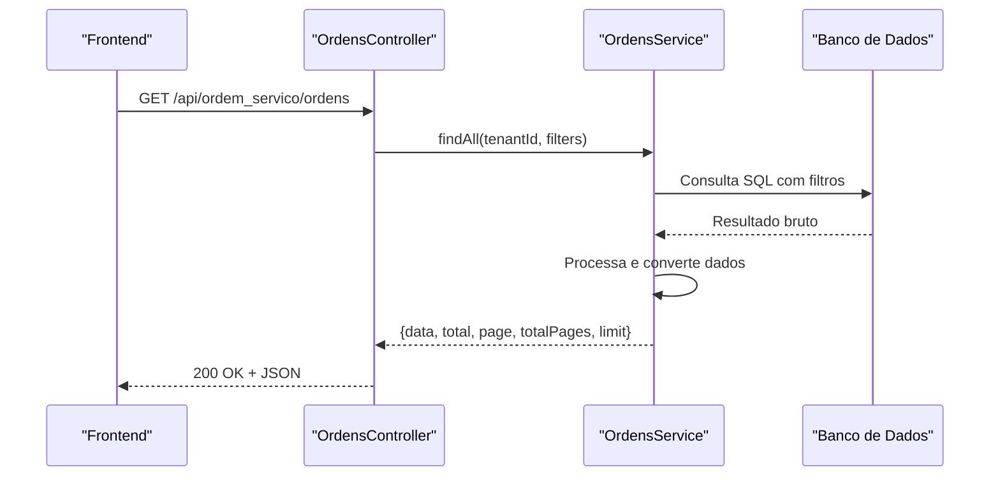
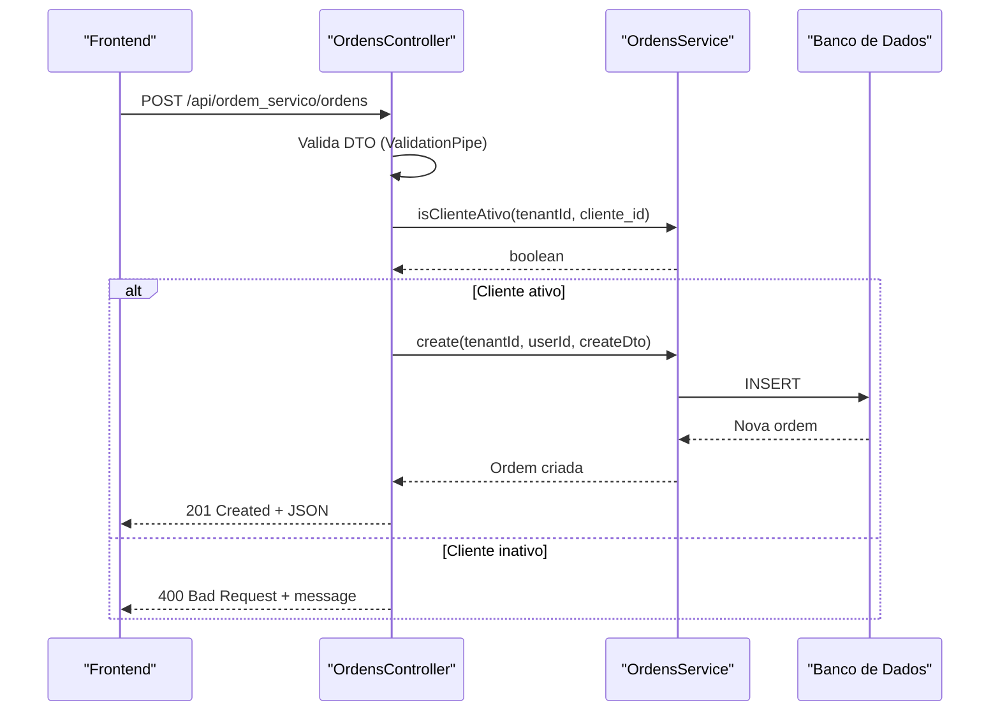
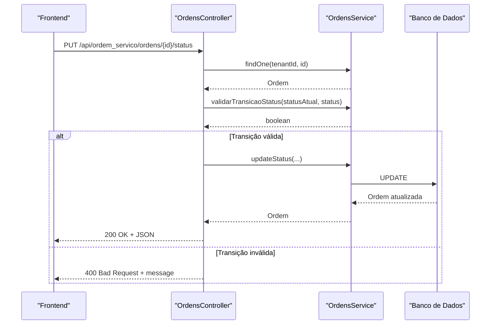

# Respostas e Erros

<cite>
**Arquivos Referenciados Neste Documento**
- [backend/ordens/ordens.controller.ts](file://backend/ordens/ordens.controller.ts)
- [backend/ordens/ordens.service.ts](file://backend/ordens/ordens.service.ts)
- [backend/shared/dto/ordem-servico.dto.ts](file://backend/shared/dto/ordem-servico.dto.ts)
- [frontend/services/ordem_servico.service.ts](file://frontend/services/ordem_servico.service.ts)
- [frontend/pages/ordens/page.tsx](file://frontend/pages/ordens/page.tsx)
</cite>

## Sumário
1. [Introdução](#introdução)
2. [Estrutura das Respostas](#estrutura-das-respostas)
3. [Códigos de Status HTTP](#códigos-de-status-http)
4. [Exemplos de Respostas](#exemplos-de-respostas)
5. [Tratamento de Erros](#tratamento-de-erros)
6. [Padrões de Mensagens de Erro](#padrões-de-mensagens-de-erro)
7. [Exceções Lançadas pelos Controllers](#exceções-lançadas-pelos-controllers)
8. [Como Interpretar Respostas e Tratar Erros no Frontend](#como-interpretar-respostas-e-tratar-erros-no-frontend)
9. [Arquitetura de Respostas e Tratamento de Erros](#arquitetura-de-respostas-e-tratamento-de-erros)
10. [Considerações de Desempenho](#considerações-de-desempenho)
11. [Guia de Solução de Problemas](#guia-de-solução-de-problemas)
12. [Conclusão](#conclusão)

## Introdução
Este documento descreve o padrão de respostas e tratamento de erros do módulo de Ordens de Serviço. Ele explica a estrutura das respostas JSON, os códigos de status HTTP utilizados, quando cada um é retornado, e como interpretar e tratar essas respostas no frontend. Também documenta os tipos de erros tratados (validação, negócio e sistema), as mensagens padronizadas e as exceções lançadas pelos controllers.

## Estrutura das Respostas
As respostas do backend seguem um padrão consistente com base nos DTOs de resposta definidos no módulo. Os principais tipos de resposta são:

- Resposta de lista de ordens de serviço:
  - Estrutura: `{ data: OrdemServicoResponseDTO[], total: number, page: number, totalPages: number, limit: number }`
  - Campos:
    - data: array de ordens de serviço
    - total: total de registros encontrados
    - page: página atual
    - totalPages: total de páginas
    - limit: limite de itens por página

- Resposta de uma ordem de serviço:
  - Estrutura: `OrdemServicoResponseDTO`
  - Campos incluem identificadores, dados do cliente, dados do responsável, informações do equipamento, formatação, itens, valores financeiros, datas e status.

- Respostas de listagem de tipos:
  - Tipos de serviço: `[TipoServicoResponseDTO...]`
  - Tipos de equipamento: `[TipoEquipamentoResponseDTO...]`
  - Técnicos: `[TechnicianResponseDTO...]`

- Resposta de histórico:
  - Estrutura: `[HistoricoResponseDTO...]`
  - Campos: identificador da ordem, usuário, ação, valores antigo/novo, observações e timestamps.

- Resposta de upload:
  - Estrutura: `{ url: string }`
  - Retorna a URL pública do arquivo salvo.

- Resposta de exclusão:
  - Estrutura: `{ success: boolean }`
  - Indica se a exclusão foi bem-sucedida.

**Seção fonte**
- [backend/shared/dto/ordem-servico.dto.ts](file://backend/shared/dto/ordem-servico.dto.ts#L347-L397)

## Códigos de Status HTTP
Os códigos de status utilizados no módulo de Ordens de Serviço e seus contextos:

- 200 OK
  - Listagem de ordens de serviço
  - Busca de detalhes de uma ordem
  - Histórico de uma ordem
  - Tipos de serviço, equipamento e técnicos
  - Download de PDF (quando bem-sucedido)
  - Exclusão de ordem (sucesso)

- 201 Created
  - Criação de nova ordem de serviço
  - Aprovação de orçamento
  - Upload de arquivo

- 400 Bad Request
  - Dados inválidos (validação)
  - Cliente inativo ao criar ordem
  - Transição de status inválida
  - Cancelamento sem motivo
  - Finalização sem valor definido
  - Upload sem arquivo
  - Busca muito curta (< 2 caracteres)

- 401 Unauthorized
  - Acesso sem autenticação válida

- 403 Forbidden
  - Acesso negado a recursos protegidos
  - Tentativa de edição de ordem finalizada/cancelada
  - Exclusão de ordem não permitida (não admin e não orçamento)
  - Acesso a arquivos fora do diretório permitido

- 404 Not Found
  - Ordem de serviço não encontrada
  - Arquivo não encontrado

- 500 Internal Server Error
  - Erros de sistema durante geração de PDF
  - Erros internos durante upload de arquivos
  - Erros não esperados no servidor

**Seção fonte**
- [backend/ordens/ordens.controller.ts](file://backend/ordens/ordens.controller.ts#L159-L284)
- [backend/ordens/ordens.controller.ts](file://backend/ordens/ordens.controller.ts#L135-L157)
- [backend/ordens/ordens.controller.ts](file://backend/ordens/ordens.controller.ts#L357-L376)

## Exemplos de Respostas
A seguir, exemplos de respostas bem-sucedidas e de erro para diferentes cenários. As respostas seguem o padrão descrito acima.

- Listagem de ordens (200):
  - Entrada: GET /api/ordem_servico/ordens?limit=20&page=1
  - Saída:
    ```json
    {
      "data": [
        {
          "id": "uuid",
          "tenant_id": "uuid",
          "numero": "000001",
          "cliente_id": "uuid",
          "usuario_responsavel_id": "uuid",
          "tipo_servico": "string",
          "descricao": "string",
          "laudo_tecnico": "string",
          "observacoes_internas": "string",
          "observacoes_cliente": "string",
          "valor_servico": 0,
          "forma_pagamento": "string",
          "status": 0,
          "prioridade": "string",
          "data_abertura": "string",
          "data_previsao": "string",
          "data_conclusao": "string",
          "origem_solicitacao": "string",
          "orcamento_aprovado": false,
          "motivo_cancelamento": "string",
          "equipamento_tipo": "string",
          "equipamento_marca": "string",
          "equipamento_modelo": "string",
          "equipamento_serie": "string",
          "equipamento_acessorios": "string",
          "equipamento_estado": "string",
          "equipamento_fotos": ["string"],
          "formatacao_so": "string",
          "formatacao_backup": false,
          "formatacao_backup_descricao": "string",
          "formatacao_senha": "string",
          "created_at": "string",
          "updated_at": "string",
          "cliente": {
            "name": "string",
            "phone_primary": "string",
            "is_active": true
          },
          "responsavel": {
            "name": "string",
            "email": "string"
          },
          "itens": [
            {
              "produto_id": "string",
              "descricao": "string",
              "valor_unitario": 0,
              "quantidade": 0,
              "valor_total": 0
            }
          ]
        }
      ],
      "total": 1,
      "page": 1,
      "totalPages": 1,
      "limit": 20
    }
    ```

- Detalhe de ordem (200):
  - Entrada: GET /api/ordem_servico/ordens/{id}
  - Saída: OrdemServicoResponseDTO conforme acima.

- Histórico (200):
  - Entrada: GET /api/ordem_servico/ordens/{id}/historico
  - Saída:
    ```json
    [
      {
        "id": "uuid",
        "ordem_servico_id": "uuid",
        "usuario_id": "uuid",
        "acao": "string",
        "valor_anterior": "string",
        "valor_novo": "string",
        "observacoes": "string",
        "created_at": "string",
        "usuario_nome": "string",
        "usuario_email": "string"
      }
    ]
    ```

- Upload de arquivo (201):
  - Entrada: POST /api/ordem_servico/ordens/upload
  - Saída:
    ```json
    {
      "url": "/api/ordem_servico/ordens/uploads/tenantId/filename"
    }
    ```

- Erro de validação (400):
  - Entrada: POST /api/ordem_servico/ordens
  - Saída:
    ```json
    {
      "message": "Cliente inativo não pode abrir ordem de serviço"
    }
    ```

- Erro de acesso negado (403):
  - Entrada: PUT /api/ordem_servico/ordens/{id}
  - Saída:
    ```json
    {
      "message": "Ordem de serviço finalizada ou cancelada não pode ser editada"
    }
    ```

- Erro de não encontrado (404):
  - Entrada: GET /api/ordem_servico/ordens/{id}
  - Saída:
    ```json
    {
      "message": "Ordem de serviço não encontrada"
    }
    ```

- Erro de servidor (500):
  - Entrada: GET /api/ordem_servico/ordens/{id}/pdf
  - Saída:
    ```json
    {
      "message": "Erro ao gerar PDF"
    }
    ```

**Seção fonte**
- [backend/shared/dto/ordem-servico.dto.ts](file://backend/shared/dto/ordem-servico.dto.ts#L308-L353)
- [backend/ordens/ordens.controller.ts](file://backend/ordens/ordens.controller.ts#L159-L179)
- [backend/ordens/ordens.controller.ts](file://backend/ordens/ordens.controller.ts#L181-L207)
- [backend/ordens/ordens.controller.ts](file://backend/ordens/ordens.controller.ts#L209-L258)
- [backend/ordens/ordens.controller.ts](file://backend/ordens/ordens.controller.ts#L260-L284)
- [backend/ordens/ordens.controller.ts](file://backend/ordens/ordens.controller.ts#L310-L355)
- [backend/ordens/ordens.controller.ts](file://backend/ordens/ordens.controller.ts#L135-L157)
- [backend/ordens/ordens.controller.ts](file://backend/ordens/ordens.controller.ts#L357-L376)

## Tratamento de Erros
O módulo implementa três categorias principais de tratamento de erros:

- Erros de validação
  - Realizados pelo ValidationPipe nos DTOs e nos controllers.
  - Exemplos: campos obrigatórios ausentes, valores fora dos intervalos permitidos, enum inválido.
  - Retorno: 400 Bad Request com mensagem informativa.

- Erros de negócio
  - Regras específicas do domínio de negócio.
  - Exemplos: cliente inativo, transição de status inválida, tentativa de editar ordem finalizada/cancelada, finalização sem valor definido, cancelamento sem motivo, exclusão não permitida.
  - Retorno: 400 Bad Request com mensagem específica.

- Erros de sistema
  - Exceções não tratadas, falhas de leitura de arquivos, geração de PDF, acesso a arquivos fora do diretório permitido.
  - Retorno: 403 Forbidden (acesso negado), 404 Not Found (arquivo não encontrado), 500 Internal Server Error (erro interno).

**Seção fonte**
- [backend/ordens/ordens.controller.ts](file://backend/ordens/ordens.controller.ts#L168-L172)
- [backend/ordens/ordens.controller.ts](file://backend/ordens/ordens.controller.ts#L197-L200)
- [backend/ordens/ordens.controller.ts](file://backend/ordens/ordens.controller.ts#L225-L244)
- [backend/ordens/ordens.controller.ts](file://backend/ordens/ordens.controller.ts#L231-L234)
- [backend/ordens/ordens.controller.ts](file://backend/ordens/ordens.controller.ts#L274-L277)
- [backend/ordens/ordens.controller.ts](file://backend/ordens/ordens.controller.ts#L153-L156)
- [backend/ordens/ordens.controller.ts](file://backend/ordens/ordens.controller.ts#L363-L365)
- [backend/ordens/ordens.controller.ts](file://backend/ordens/ordens.controller.ts#L369-L371)
- [backend/ordens/ordens.controller.ts](file://backend/ordens/ordens.controller.ts#L373-L375)

## Padrões de Mensagens de Erro
As mensagens de erro seguem um padrão consistente e informativo:

- "Cliente inativo não pode abrir ordem de serviço"
- "Ordem de serviço não encontrada"
- "Ordem de serviço finalizada ou cancelada não pode ser editada"
- "Transição de status inválida: X → Y"
- "Motivo do cancelamento é obrigatório"
- "Só é possível finalizar ordens em execução"
- "Valor do serviço deve estar definido para finalizar"
- "Apenas orçamentos podem ser aprovados"
- "Apenas orçamentos podem ser excluídos por usuários não-admin"
- "Nenhum arquivo enviado"
- "Acesso negado"
- "Arquivo não encontrado"
- "Erro ao gerar PDF"
- "Erro ao processar upload: {mensagem}"
- "Erro interno ao buscar imagem"

Essas mensagens são retornadas em objetos JSON com a chave "message".

**Seção fonte**
- [backend/ordens/ordens.controller.ts](file://backend/ordens/ordens.controller.ts#L170-L171)
- [backend/ordens/ordens.controller.ts](file://backend/ordens/ordens.controller.ts#L110-L112)
- [backend/ordens/ordens.controller.ts](file://backend/ordens/ordens.controller.ts#L198-L200)
- [backend/ordens/ordens.controller.ts](file://backend/ordens/ordens.controller.ts#L227-L228)
- [backend/ordens/ordens.controller.ts](file://backend/ordens/ordens.controller.ts#L232-L234)
- [backend/ordens/ordens.controller.ts](file://backend/ordens/ordens.controller.ts#L238-L244)
- [backend/ordens/ordens.controller.ts](file://backend/ordens/ordens.controller.ts#L299-L301)
- [backend/ordens/ordens.controller.ts](file://backend/ordens/ordens.controller.ts#L275-L277)
- [backend/ordens/ordens.controller.ts](file://backend/ordens/ordens.controller.ts#L314-L316)
- [backend/ordens/ordens.controller.ts](file://backend/ordens/ordens.controller.ts#L364-L364)
- [backend/ordens/ordens.controller.ts](file://backend/ordens/ordens.controller.ts#L370-L370)
- [backend/ordens/ordens.controller.ts](file://backend/ordens/ordens.controller.ts#L155-L155)
- [backend/ordens/ordens.controller.ts](file://backend/ordens/ordens.controller.ts#L353-L353)
- [backend/ordens/ordens.controller.ts](file://backend/ordens/ordens.controller.ts#L374-L374)

## Exceções Lançadas pelos Controllers
Os controllers lançam exceções específicas que são capturadas e convertidas em respostas HTTP adequadas:

- BadRequestException
  - Uso: validações de dados, regras de negócio, status inválido, falta de campos obrigatórios.
  - Exemplos: cliente inativo, transição inválida, cancelamento sem motivo, finalização sem valor, upload sem arquivo.

- NotFoundException
  - Uso: ordem de serviço não encontrada.
  - Exemplo: busca de ordem inexistente.

- ForbiddenException
  - Uso: tentativas de edição de ordem finalizada/cancelada, exclusão não permitida, acesso a arquivos fora do diretório permitido.

- HttpException
  - Uso: erros durante upload de arquivos (com status 500).
  - Exemplo: falha crítica no buffer do arquivo.

Essas exceções são lançadas diretamente nos métodos do controller e propagadas para o mecanismo de tratamento de erros do NestJS.

**Seção fonte**
- [backend/ordens/ordens.controller.ts](file://backend/ordens/ordens.controller.ts#L170-L172)
- [backend/ordens/ordens.controller.ts](file://backend/ordens/ordens.controller.ts#L227-L228)
- [backend/ordens/ordens.controller.ts](file://backend/ordens/ordens.controller.ts#L232-L234)
- [backend/ordens/ordens.controller.ts](file://backend/ordens/ordens.controller.ts#L238-L244)
- [backend/ordens/ordens.controller.ts](file://backend/ordens/ordens.controller.ts#L110-L112)
- [backend/ordens/ordens.controller.ts](file://backend/ordens/ordens.controller.ts#L198-L200)
- [backend/ordens/ordens.controller.ts](file://backend/ordens/ordens.controller.ts#L275-L277)
- [backend/ordens/ordens.controller.ts](file://backend/ordens/ordens.controller.ts#L353-L353)

## Como Interpretar Respostas e Tratar Erros no Frontend
O frontend interpreta as respostas com base no status HTTP e no conteúdo JSON retornado:

- Status 2xx (sucesso)
  - Listagem: utilizar os dados da propriedade "data", e os metadados "total", "page", "totalPages", "limit".
  - Detalhe: utilizar o objeto retornado como OrdemServicoResponseDTO.
  - Upload: utilizar a URL retornada em "url".

- Status 4xx (erro)
  - 400 Bad Request: mostrar a mensagem em "message" e impedir a continuidade da operação.
  - 401 Unauthorized: redirecionar para login ou limpar o token.
  - 403 Forbidden: informar que o acesso é negado (ex: tentativa de edição de ordem finalizada).
  - 404 Not Found: informar que o recurso não foi encontrado (ex: ordem inexistente).
  - 500 Internal Server Error: informar erro interno e sugerir tentar novamente.

- Tratamento de erros no frontend
  - O componente de página do frontend lança erros com "throw new Error(`HTTP ${response.status}`)" quando response.ok é falso.
  - Recomenda-se capturar esses erros e exibir mensagens amigáveis ao usuário, utilizando as mensagens de "message" quando disponíveis.
  - Para operações assíncronas, utilize try/catch e trate os diferentes códigos de status adequadamente.

**Seção fonte**
- [frontend/pages/ordens/page.tsx](file://frontend/pages/ordens/page.tsx#L75-L76)
- [frontend/pages/ordens/page.tsx](file://frontend/pages/ordens/page.tsx#L100-L101)
- [frontend/pages/ordens/page.tsx](file://frontend/pages/ordens/page.tsx#L125-L126)
- [frontend/pages/ordens/page.tsx](file://frontend/pages/ordens/page.tsx#L149-L150)

## Arquitetura de Respostas e Tratamento de Erros
A arquitetura de respostas e tratamento de erros segue o padrão MVC típico do NestJS:

```mermaid
graph TB
Client["Frontend"] --> API["OrdensController"]
API --> Service["OrdensService"]
Service --> DB["Banco de Dados"]
API --> Exceptions["Exceções HTTP"]
Exceptions --> Client
subgraph "Controllers"
API
end
subgraph "Services"
Service
end
subgraph "Data Layer"
DB
end
subgraph "Exceptions"
Exceptions
end
```

**Fontes do diagrama**
- [backend/ordens/ordens.controller.ts](file://backend/ordens/ordens.controller.ts#L25-L32)
- [backend/ordens/ordens.service.ts](file://backend/ordens/ordens.service.ts#L9-L13)

### Fluxo de Resposta de Listagem


**Fontes do diagrama**
- [backend/ordens/ordens.controller.ts](file://backend/ordens/ordens.controller.ts#L34-L55)
- [backend/ordens/ordens.service.ts](file://backend/ordens/ordens.service.ts#L137-L473)

### Fluxo de Criação de Ordem


**Fontes do diagrama**
- [backend/ordens/ordens.controller.ts](file://backend/ordens/ordens.controller.ts#L159-L179)
- [backend/ordens/ordens.service.ts](file://backend/ordens/ordens.service.ts#L942-L986)

### Fluxo de Atualização de Status


**Fontes do diagrama**
- [backend/ordens/ordens.controller.ts](file://backend/ordens/ordens.controller.ts#L209-L258)
- [backend/ordens/ordens.service.ts](file://backend/ordens/ordens.service.ts#L988-L991)

## Considerações de Desempenho
- Validação manual de filtros
  - O serviço realiza validações manuais e sanitizações para evitar injeção e problemas de performance (ex: busca muito curta bloqueada).
  - Recomenda-se manter os mesmos níveis de validação e sanitização no frontend antes de enviar requisições.

- Paginação e limites
  - Limites máximos de registros por página evitam sobrecarga do servidor.
  - Recomenda-se respeitar os limites e utilizar paginação correta no frontend.

- Geração de PDF
  - A geração de PDF utiliza Puppeteer e pode ser sensível a tempo limite e recursos do servidor.
  - Recomenda-se otimizar o ambiente de execução e considerar timeouts maiores em ambientes de produção.

**Seção fonte**
- [backend/ordens/ordens.service.ts](file://backend/ordens/ordens.service.ts#L221-L224)
- [backend/ordens/ordens.service.ts](file://backend/ordens/ordens.service.ts#L163-L166)
- [backend/ordens/ordens.service.ts](file://backend/ordens/ordens.service.ts#L82-L95)

## Guia de Solução de Problemas
- Erros 400 Bad Request
  - Verifique se todos os campos obrigatórios estão preenchidos e dentro dos intervalos permitidos.
  - Confirme que o cliente está ativo antes de criar uma ordem.
  - Valide as transições de status e certifique-se de que todas as condições para finalização ou cancelamento foram atendidas.

- Erros 403 Forbidden
  - Verifique as permissões do usuário e o status da ordem (não é possível editar ordens finalizadas/canceladas).
  - Confirme que o acesso a arquivos está dentro do diretório permitido.

- Erros 404 Not Found
  - Confirme que o ID da ordem está correto e pertence ao tenant atual.
  - Verifique se o arquivo solicitado existe no diretório de uploads.

- Erros 500 Internal Server Error
  - Para geração de PDF, verifique se o ambiente permite a execução do Puppeteer e se há recursos suficientes.
  - Para upload de arquivos, verifique o buffer e o caminho de salvamento.

**Seção fonte**
- [backend/ordens/ordens.controller.ts](file://backend/ordens/ordens.controller.ts#L110-L112)
- [backend/ordens/ordens.controller.ts](file://backend/ordens/ordens.controller.ts#L198-L200)
- [backend/ordens/ordens.controller.ts](file://backend/ordens/ordens.controller.ts#L363-L365)
- [backend/ordens/ordens.controller.ts](file://backend/ordens/ordens.controller.ts#L369-L371)
- [backend/ordens/ordens.controller.ts](file://backend/ordens/ordens.controller.ts#L153-L155)

## Conclusão
O módulo de Ordens de Serviço implementa um padrão robusto de respostas e tratamento de erros, com DTOs bem definidos, validações rigorosas e mensagens informativas. O frontend deve interpretar os códigos de status e as mensagens de erro para fornecer uma experiência de usuário clara e eficaz. A arquitetura permite escalabilidade e manutenibilidade, com foco em segurança e desempenho.