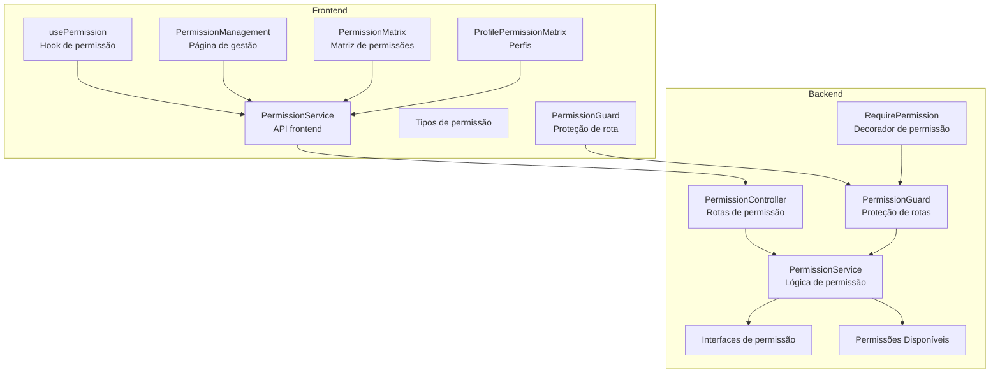
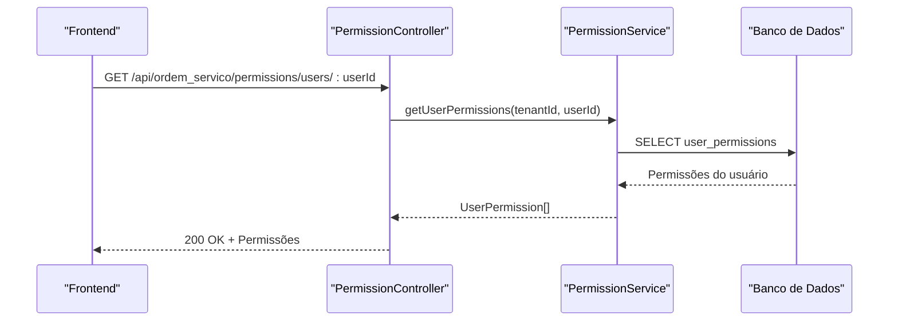
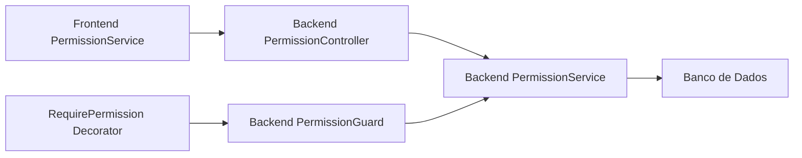

# API de Permissões

<cite>
**Arquivos Referenciados Neste Documento**
- [permission.controller.ts](file://backend/shared/controllers/permission.controller.ts)
- [permission.service.ts](file://backend/shared/services/permission.service.ts)
- [permission.guard.ts](file://backend/shared/guards/permission.guard.ts)
- [require-permission.decorator.ts](file://backend/shared/decorators/require-permission.decorator.ts)
- [permission.interface.ts](file://backend/shared/interfaces/permission.interface.ts)
- [available-permissions.ts](file://backend/shared/constants/available-permissions.ts)
- [permissionService.ts](file://frontend/services/permissionService.ts)
- [permission.types.ts](file://frontend/types/permission.types.ts)
- [usePermission.ts](file://frontend/hooks/usePermission.ts)
- [PermissionManagement.tsx](file://frontend/components/PermissionManagement.tsx)
- [PermissionMatrix.tsx](file://frontend/components/PermissionMatrix.tsx)
- [ProfilePermissionMatrix.tsx](file://frontend/components/ProfilePermissionMatrix.tsx)
- [PermissionGuard.tsx](file://frontend/components/PermissionGuard.tsx)
- [permissions_seed.sql](file://backend/seeds/permissions_seed.sql)
- [004_add_tables_os.sql](file://backend/migrations/004_add_tables_os.sql)
</cite>

## Sumário
1. [Introdução](#introdução)
2. [Estrutura do Projeto](#estrutura-do-projeto)
3. [Componentes Principais](#componentes-principais)
4. [Visão Geral da Arquitetura](#visão-geral-da-arquitetura)
5. [Análise Detalhada dos Componentes](#análise-detalhada-dos-componentes)
6. [Análise de Dependências](#análise-de-dependências)
7. [Considerações de Desempenho](#considerações-de-desempenho)
8. [Guia de Solução de Problemas](#guia-de-solução-de-problemas)
9. [Conclusão](#conclusão)
10. [Apêndices](#apêndices)

## Introdução
Esta documentação apresenta a API de permissões do módulo Ordem de Serviço, descrevendo todos os endpoints disponíveis para gerenciamento de permissões, incluindo métodos HTTP, URLs, parâmetros e respostas esperadas. Explica como consultar permissões de usuários, atribuir permissões a perfis e gerenciar configurações de permissão. Inclui exemplos de requisições e respostas, códigos de status HTTP, tratamento de erros, proteção dos endpoints, credenciais necessárias, e práticas recomendadas de integração com o frontend e outras aplicações.

## Estrutura do Projeto
A API de permissões é composta pelos seguintes elementos-chave:
- Backend: Controlador, serviço, guardas e decoradores de permissão.
- Frontend: Serviços, hooks e componentes para gerenciamento de permissões.
- Mapeamento de permissões disponíveis e seeds para perfis.



**Diagrama Fonte**
- [permission.controller.ts](file://backend/shared/controllers/permission.controller.ts#L1-L83)
- [permission.service.ts](file://backend/shared/services/permission.service.ts#L1-L313)
- [permission.guard.ts](file://backend/shared/guards/permission.guard.ts#L1-L58)
- [require-permission.decorator.ts](file://backend/shared/decorators/require-permission.decorator.ts#L1-L25)
- [permissionService.ts](file://frontend/services/permissionService.ts#L1-L135)
- [usePermission.ts](file://frontend/hooks/usePermission.ts#L1-L142)
- [PermissionManagement.tsx](file://frontend/components/PermissionManagement.tsx#L1-L596)
- [PermissionMatrix.tsx](file://frontend/components/PermissionMatrix.tsx#L1-L427)
- [ProfilePermissionMatrix.tsx](file://frontend/components/ProfilePermissionMatrix.tsx#L1-L719)
- [PermissionGuard.tsx](file://frontend/components/PermissionGuard.tsx#L1-L50)

**Seção Fonte**
- [permission.controller.ts](file://backend/shared/controllers/permission.controller.ts#L1-L83)
- [permission.service.ts](file://backend/shared/services/permission.service.ts#L1-L313)
- [permission.guard.ts](file://backend/shared/guards/permission.guard.ts#L1-L58)
- [require-permission.decorator.ts](file://backend/shared/decorators/require-permission.decorator.ts#L1-L25)
- [permissionService.ts](file://frontend/services/permissionService.ts#L1-L135)
- [usePermission.ts](file://frontend/hooks/usePermission.ts#L1-L142)
- [PermissionManagement.tsx](file://frontend/components/PermissionManagement.tsx#L1-L596)
- [PermissionMatrix.tsx](file://frontend/components/PermissionMatrix.tsx#L1-L427)
- [ProfilePermissionMatrix.tsx](file://frontend/components/ProfilePermissionMatrix.tsx#L1-L719)
- [PermissionGuard.tsx](file://frontend/components/PermissionGuard.tsx#L1-L50)

## Componentes Principais
- Controlador de Permissões: expõe endpoints REST para consulta e atualização de permissões.
- Serviço de Permissões: implementa lógica de verificação, atualização e auditoria de permissões.
- Guarda de Permissões: protege rotas com base em permissões declaradas.
- Decoradores de Permissão: permitem declarar permissões necessárias em handlers.
- Interfaces de Permissão: tipagem para permissões, atualizações e auditoria.
- Permissões Disponíveis: definição centralizada de recursos e ações.

**Seção Fonte**
- [permission.controller.ts](file://backend/shared/controllers/permission.controller.ts#L1-L83)
- [permission.service.ts](file://backend/shared/services/permission.service.ts#L1-L313)
- [permission.guard.ts](file://backend/shared/guards/permission.guard.ts#L1-L58)
- [require-permission.decorator.ts](file://backend/shared/decorators/require-permission.decorator.ts#L1-L25)
- [permission.interface.ts](file://backend/shared/interfaces/permission.interface.ts#L1-L63)
- [available-permissions.ts](file://backend/shared/constants/available-permissions.ts#L1-L164)

## Visão Geral da Arquitetura
A API segue um padrão REST com autenticação JWT obrigatória. O controlador expõe endpoints para:
- Listar permissões disponíveis
- Consultar usuários com permissões
- Consultar permissões de um usuário
- Atualizar permissões de um usuário
- Consultar auditoria de permissões

A guarda de permissões verifica a permissão necessária antes de permitir o acesso ao handler protegido.



**Diagrama Fonte**
- [permission.controller.ts](file://backend/shared/controllers/permission.controller.ts#L35-L47)
- [permission.service.ts](file://backend/shared/services/permission.service.ts#L21-L68)

**Seção Fonte**
- [permission.controller.ts](file://backend/shared/controllers/permission.controller.ts#L1-L83)
- [permission.service.ts](file://backend/shared/services/permission.service.ts#L1-L313)

## Análise Detalhada dos Componentes

### Endpoints da API de Permissões
Todos os endpoints estão sob a rota base: `/api/ordem_servico/permissions`. A autenticação é feita via JWT e o guardião de permissões exige permissão para rotas protegidas.

- Listar permissões disponíveis
  - Método: GET
  - URL: `/available`
  - Resposta: Array de permissões disponíveis
  - Exemplo de resposta:
    - 200 OK: `[ { "resource": "...", "name": "...", "description": "...", "actions": [...] }, ... ]`
  - Erros: 500 Interno se falhar ao buscar

- Listar usuários com permissões
  - Método: GET
  - URL: `/users`
  - Resposta: Array de usuários com resumo de permissões
  - Exemplo de resposta:
    - 200 OK: `[ { "id": "...", "name": "...", "email": "...", "role": "...", "permissions": [...], "permissionSummary": { "total": n, "allowed": n, "denied": n } }, ... ]`
  - Erros: 500 Interno se falhar ao buscar

- Consultar permissões de um usuário
  - Método: GET
  - URL: `/users/:userId`
  - Parâmetros de caminho: userId (string)
  - Resposta: Array de permissões do usuário
  - Exemplo de resposta:
    - 200 OK: `[ { "id": "...", "userId": "...", "tenantId": "...", "resource": "...", "action": "...", "allowed": boolean, "createdAt": "...", "updatedAt": "...", "createdBy": "..." }, ... ]`
  - Erros: 500 Interno se falhar ao buscar

- Atualizar permissões de um usuário
  - Método: PUT
  - URL: `/users/:userId`
  - Parâmetros de caminho: userId (string)
  - Corpo: `{ "permissions": [ { "resource": "...", "action": "...", "allowed": boolean }, ... ] }`
  - Resposta: `{ "success": true }`
  - Erros: 500 Interno se falhar ao atualizar

- Consultar auditoria de permissões
  - Método: GET
  - URL: `/audit`
  - Parâmetros de consulta: userId (opcional), startDate (opcional), endDate (opcional)
  - Resposta: Array de registros de auditoria
  - Exemplo de resposta:
    - 200 OK: `[ { "id": "...", "tenantId": "...", "userId": "...", "resource": "...", "action": "...", "oldValue": boolean|null, "newValue": boolean, "changedBy": "...", "changedAt": "...", "reason": "..." }, ... ]`
  - Erros: 500 Interno se falhar ao buscar

**Seção Fonte**
- [permission.controller.ts](file://backend/shared/controllers/permission.controller.ts#L13-L82)
- [permission.service.ts](file://backend/shared/services/permission.service.ts#L164-L312)

### Proteção de Rotas e Credenciais
- Todos os endpoints do controlador de permissões são protegidos com o guardião JWT.
- A guarda de permissões verifica a permissão declarada nos handlers via decorador RequirePermission.
- Para acesso, é necessário um token JWT válido no cabeçalho Authorization: Bearer <token>.
- O usuário deve conter tenantId e id válidos.

**Seção Fonte**
- [permission.controller.ts](file://backend/shared/controllers/permission.controller.ts#L6-L7)
- [permission.guard.ts](file://backend/shared/guards/permission.guard.ts#L12-L57)
- [require-permission.decorator.ts](file://backend/shared/decorators/require-permission.decorator.ts#L8-L9)

### Integração com o Frontend
- O frontend consome a API através de um serviço simplificado com métodos GET e PUT.
- Hooks permitem verificar permissões em tempo real e gerenciar estados de carregamento e erro.
- Componentes de UI apresentam matrizes de permissões e permitem salvar atualizações.

Exemplos de chamadas do frontend:
- Buscar permissões disponíveis: GET `/modules/ordem_servico/permissions/available`
- Buscar usuários com permissões: GET `/modules/ordem_servico/permissions/users`
- Buscar permissões de um usuário: GET `/modules/ordem_servico/permissions/users/:userId`
- Atualizar permissões de um usuário: PUT `/modules/ordem_servico/permissions/users/:userId` com corpo `{ permissions: [...] }`
- Buscar auditoria: GET `/modules/ordem_servico/permissions/audit?userId=&startDate=&endDate=`

**Seção Fonte**
- [permissionService.ts](file://frontend/services/permissionService.ts#L50-L134)
- [usePermission.ts](file://frontend/hooks/usePermission.ts#L12-L141)
- [PermissionManagement.tsx](file://frontend/components/PermissionManagement.tsx#L282-L316)
- [PermissionMatrix.tsx](file://frontend/components/PermissionMatrix.tsx#L174-L296)
- [ProfilePermissionMatrix.tsx](file://frontend/components/ProfilePermissionMatrix.tsx#L406-L486)

### Exemplos Práticos de Uso
- Verificação de permissão em componente:
  - Utilize o hook usePermission para verificar se o usuário atual possui uma determinada permissão.
  - Exemplo: usePermission('orders', 'view') retorna um boolean com o resultado.
- Proteção de rota:
  - Use o componente PermissionGuard para renderizar conteúdo condicionalmente com base em permissões.
- Gestão de permissões:
  - A página PermissionManagement exibe todos os usuários e permite configurar permissões individuais via PermissionMatrix.
  - A matriz de perfis permite configurar permissões por perfil no módulo.

**Seção Fonte**
- [usePermission.ts](file://frontend/hooks/usePermission.ts#L12-L141)
- [PermissionGuard.tsx](file://frontend/components/PermissionGuard.tsx#L12-L49)
- [PermissionManagement.tsx](file://frontend/components/PermissionManagement.tsx#L250-L396)
- [PermissionMatrix.tsx](file://frontend/components/PermissionMatrix.tsx#L156-L427)
- [ProfilePermissionMatrix.tsx](file://frontend/components/ProfilePermissionMatrix.tsx#L393-L719)

### Considerações de Segurança
- A guarda de permissões impede acesso quando o usuário não está autenticado ou não possui a permissão necessária.
- Os usuários com papéis ADMIN ou SUPER_ADMIN têm acesso automático a todas as permissões.
- A auditoria registra todas as mudanças de permissões e tentativas de acesso negadas.
- Recomenda-se sempre validar permissões no backend e evitar confiar apenas no frontend.

**Seção Fonte**
- [permission.guard.ts](file://backend/shared/guards/permission.guard.ts#L27-L56)
- [permission.service.ts](file://backend/shared/services/permission.service.ts#L131-L162)
- [permission.service.ts](file://backend/shared/services/permission.service.ts#L221-L259)

## Visão Geral da Arquitetura

```mermaid
classDiagram
class PermissionController {
+getAvailablePermissions()
+getUsersWithPermissions()
+getUserPermissions(userId)
+updateUserPermissions(userId, permissions)
+getPermissionAudit(userId?, startDate?, endDate?)
}
class PermissionService {
+getUserPermissions(tenantId, userId)
+updateUserPermissions(tenantId, userId, permissions, changedBy)
+hasPermission(tenantId, userId, resource, action)
+getAvailablePermissions()
+getUsersWithPermissions(tenantId)
+getPermissionAudit(tenantId, userId?, startDate?, endDate?)
}
class PermissionGuard {
+canActivate(context) : Promise<boolean>
}
class RequirePermission {
+SetMetadata("permission", {resource, action})
}
PermissionController --> PermissionService : "usa"
PermissionGuard --> PermissionService : "verifica permissão"
RequirePermission --> PermissionGuard : "decora handlers"
```

**Diagrama Fonte**
- [permission.controller.ts](file://backend/shared/controllers/permission.controller.ts#L1-L83)
- [permission.service.ts](file://backend/shared/services/permission.service.ts#L1-L313)
- [permission.guard.ts](file://backend/shared/guards/permission.guard.ts#L1-L58)
- [require-permission.decorator.ts](file://backend/shared/decorators/require-permission.decorator.ts#L1-L25)

## Análise Detalhada dos Componentes

### Controlador de Permissões
- Métodos expostos:
  - GET /available: retorna permissões disponíveis
  - GET /users: retorna todos os usuários com resumo de permissões
  - GET /users/:userId: retorna permissões de um usuário
  - PUT /users/:userId: atualiza permissões de um usuário
  - GET /audit: retorna auditoria de permissões
- Autenticação: JWT obrigatório
- Validação: logs e tratamento de erro com logger

**Seção Fonte**
- [permission.controller.ts](file://backend/shared/controllers/permission.controller.ts#L13-L82)

### Serviço de Permissões
- Recursos principais:
  - getUserPermissions: busca permissões com cache de 5 minutos
  - updateUserPermissions: atualiza permissões e registra auditoria
  - hasPermission: verifica permissão com bypass para ADMIN/SUPER_ADMIN
  - getAvailablePermissions: retorna permissões disponíveis
  - getUsersWithPermissions: busca todos os usuários com permissões
  - getPermissionAudit: consulta auditoria com filtros
- Auditoria: logPermissionChange e logAccessDenied
- Cache: cacheKey = tenantId:userId

**Seção Fonte**
- [permission.service.ts](file://backend/shared/services/permission.service.ts#L21-L312)

### Guarda de Permissões
- Verifica se o usuário possui a permissão declarada no handler
- Lança ForbiddenException se não tiver permissão
- Trata erros no sistema como acesso negado

**Seção Fonte**
- [permission.guard.ts](file://backend/shared/guards/permission.guard.ts#L12-L57)

### Decoradores de Permissão
- RequirePermission(resource, action): define permissão necessária
- Atalhos: RequireDashboardPermission, RequireOrdersPermission, RequireClientsPermission, RequireProductsPermission, RequireConfigPermission

**Seção Fonte**
- [require-permission.decorator.ts](file://backend/shared/decorators/require-permission.decorator.ts#L8-L25)

### Permissões Disponíveis
- Recursos: dashboard, clients, products, orders, config
- Ações: variação de visualizar, criar, editar, excluir, alterar status, aprovar orçamento, exportar, etc.
- Utilizados para montar matrizes de permissões no frontend

**Seção Fonte**
- [available-permissions.ts](file://backend/shared/constants/available-permissions.ts#L3-L164)

### Frontend: Serviços e Hooks
- PermissionService: métodos GET/PUT para consumir a API
- usePermission: hook para verificar permissões e gerenciar estado
- PermissionGuard: componente para proteger rotas com base em permissões

**Seção Fonte**
- [permissionService.ts](file://frontend/services/permissionService.ts#L52-L134)
- [usePermission.ts](file://frontend/hooks/usePermission.ts#L12-L141)
- [PermissionGuard.tsx](file://frontend/components/PermissionGuard.tsx#L12-L49)

### Frontend: Componentes de Permissões
- PermissionManagement: página de gestão de permissões
- PermissionMatrix: matriz de permissões por usuário
- ProfilePermissionMatrix: configuração de permissões por perfil
- PermissionService: consumo da API

**Seção Fonte**
- [PermissionManagement.tsx](file://frontend/components/PermissionManagement.tsx#L250-L596)
- [PermissionMatrix.tsx](file://frontend/components/PermissionMatrix.tsx#L156-L427)
- [ProfilePermissionMatrix.tsx](file://frontend/components/ProfilePermissionMatrix.tsx#L393-L719)

## Análise de Dependências



**Diagrama Fonte**
- [permissionService.ts](file://frontend/services/permissionService.ts#L52-L134)
- [permission.controller.ts](file://backend/shared/controllers/permission.controller.ts#L1-L83)
- [permission.service.ts](file://backend/shared/services/permission.service.ts#L1-L313)
- [permission.guard.ts](file://backend/shared/guards/permission.guard.ts#L1-L58)
- [require-permission.decorator.ts](file://backend/shared/decorators/require-permission.decorator.ts#L1-L25)

**Seção Fonte**
- [permission.controller.ts](file://backend/shared/controllers/permission.controller.ts#L1-L83)
- [permission.service.ts](file://backend/shared/services/permission.service.ts#L1-L313)
- [permission.guard.ts](file://backend/shared/guards/permission.guard.ts#L1-L58)
- [require-permission.decorator.ts](file://backend/shared/decorators/require-permission.decorator.ts#L1-L25)
- [permissionService.ts](file://frontend/services/permissionService.ts#L1-L135)

## Considerações de Desempenho
- Cache de permissões: o serviço armazena permissões em cache com TTL de 5 minutos para reduzir consultas ao banco.
- Auditoria: operações de atualização limparam o cache do usuário afetado.
- Recomendações:
  - Evite consultas excessivas em curto período.
  - Utilize o cache do frontend para evitar múltiplas requisições iguais.
  - Prefira bulk updates quando possível.

**Seção Fonte**
- [permission.service.ts](file://backend/shared/services/permission.service.ts#L16-L121)

## Guia de Solução de Problemas
- Erros comuns:
  - 403 Forbidden: permissão negada ou usuário não autenticado.
  - 500 Internal Server Error: erro interno no backend.
- Diagnóstico:
  - Verifique se o token JWT está presente e válido.
  - Confirme se o usuário possui o papel necessário (ADMIN/SUPER_ADMIN).
  - Revise a auditoria de permissões para identificar mudanças recentes.
- Logs:
  - O controlador e serviço utilizam logger para registrar erros e operações.

**Seção Fonte**
- [permission.guard.ts](file://backend/shared/guards/permission.guard.ts#L27-L56)
- [permission.controller.ts](file://backend/shared/controllers/permission.controller.ts#L18-L21)
- [permission.service.ts](file://backend/shared/services/permission.service.ts#L64-L67)

## Conclusão
A API de permissões oferece um conjunto completo de endpoints para gerenciamento granular de acesso, com proteção via JWT, auditoria detalhada e integração direta com o frontend. As práticas recomendadas incluem validar permissões no backend, utilizar o cache e seguir padrões de auditoria para manutenção da segurança.

## Apêndices

### Tabelas de Permissões e Perfis
- Tabelas envolvidas:
  - mod_ordem_servico_user_permissions: permissões individuais
  - mod_ordem_servico_permission_audit: auditoria de permissões
  - Seeds de templates e permissões para perfis Admin, Super Admin e Técnico

**Seção Fonte**
- [permissions_seed.sql](file://backend/seeds/permissions_seed.sql#L11-L329)
- [004_add_tables_os.sql](file://backend/migrations/004_add_tables_os.sql#L1-L80)