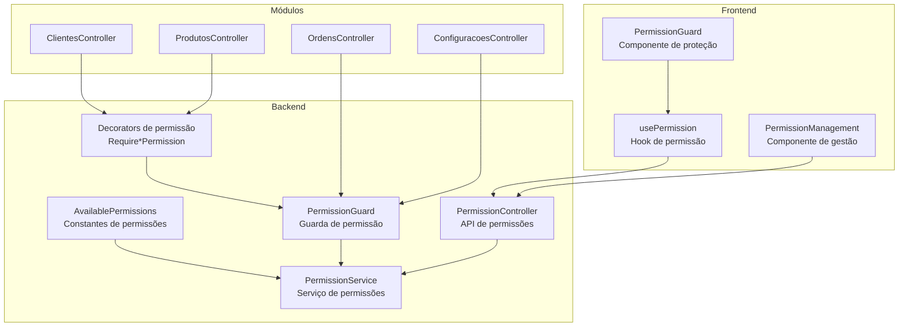
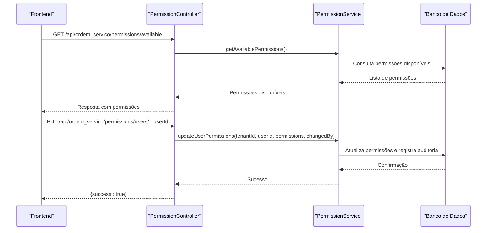
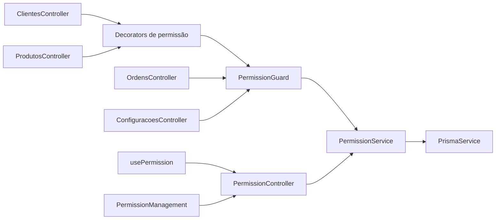

# Arquitetura RBAC

<cite>
**Arquivo referenciados neste documento**
- [available-permissions.ts](file://backend/shared/constants/available-permissions.ts)
- [permission.interface.ts](file://backend/shared/interfaces/permission.interface.ts)
- [require-permission.decorator.ts](file://backend/shared/decorators/require-permission.decorator.ts)
- [permission.guard.ts](file://backend/shared/guards/permission.guard.ts)
- [permission.controller.ts](file://backend/shared/controllers/permission.controller.ts)
- [permission.service.ts](file://backend/shared/services/permission.service.ts)
- [clientes.controller.ts](file://backend/clientes/clientes.controller.ts)
- [produtos.controller.ts](file://backend/produtos/produtos.controller.ts)
- [ordens.controller.ts](file://backend/ordens/ordens.controller.ts)
- [configuracoes.controller.ts](file://backend/configuracoes/configuracoes.controller.ts)
- [permissions_seed.sql](file://backend/seeds/permissions_seed.sql)
- [usePermission.ts](file://frontend/hooks/usePermission.ts)
- [permission.types.ts](file://frontend/types/permission.types.ts)
- [PermissionGuard.tsx](file://frontend/components/PermissionGuard.tsx)
- [PermissionManagement.tsx](file://frontend/components/PermissionManagement.tsx)
</cite>

## Sumário
1. [Introdução](#introdução)
2. [Estrutura do Projeto](#estrutura-do-projeto)
3. [Componentes Principais](#componentes-principais)
4. [Visão Geral da Arquitetura](#visão-geral-da-arquitetura)
5. [Análise Detalhada de Componentes](#análise-detalhada-de-componentes)
6. [Análise de Dependências](#análise-de-dependências)
7. [Considerações de Desempenho](#considerações-de-desempenho)
8. [Guia de Solução de Problemas](#guia-de-solução-de-problemas)
9. [Conclusão](#conclusão)

## Introdução
Este documento apresenta a arquitetura RBAC (Controle de Acesso Baseado em Funções) implementada no módulo de Ordens de Serviço. O sistema adota um modelo de permissões baseado em recursos e ações, com definições centralizadas, guardas de permissão e um mecanismo de auditoria robusto. Ele explica como os recursos (clientes, produtos, ordens, configurações) e as ações (criar, ler, atualizar, deletar, imprimir, aprovar, alterar status, etc.) são organizados, como são aplicadas as permissões nos controladores e no frontend, e como o sistema lida com herança de permissões e permissões combinadas.

## Estrutura do Projeto
O módulo segue uma estrutura modular com camadas bem definidas:
- Backend: Controles de permissões, guardas, serviços e controladores de módulos
- Frontend: Hooks e componentes para verificação e gerenciamento de permissões
- Seeds: Dados iniciais para perfis e permissões

**Diagrama fonte**
- [permission.service.ts](file://backend/shared/services/permission.service.ts#L1-L313)
- [permission.guard.ts](file://backend/shared/guards/permission.guard.ts#L1-L58)
- [permission.controller.ts](file://backend/shared/controllers/permission.controller.ts#L1-L83)
- [require-permission.decorator.ts](file://backend/shared/decorators/require-permission.decorator.ts#L1-L25)
- [available-permissions.ts](file://backend/shared/constants/available-permissions.ts#L1-L164)
- [clientes.controller.ts](file://backend/clientes/clientes.controller.ts#L1-L182)
- [produtos.controller.ts](file://backend/produtos/produtos.controller.ts#L1-L144)
- [ordens.controller.ts](file://backend/ordens/ordens.controller.ts#L1-L377)
- [configuracoes.controller.ts](file://backend/configuracoes/configuracoes.controller.ts#L1-L136)
- [usePermission.ts](file://frontend/hooks/usePermission.ts#L1-L142)
- [PermissionManagement.tsx](file://frontend/components/PermissionManagement.tsx#L1-L596)
- [PermissionGuard.tsx](file://frontend/components/PermissionGuard.tsx#L1-L50)

**Seção fonte**
- [available-permissions.ts](file://backend/shared/constants/available-permissions.ts#L1-L164)
- [permission.interface.ts](file://backend/shared/interfaces/permission.interface.ts#L1-L63)
- [require-permission.decorator.ts](file://backend/shared/decorators/require-permission.decorator.ts#L1-L25)
- [permission.guard.ts](file://backend/shared/guards/permission.guard.ts#L1-L58)
- [permission.controller.ts](file://backend/shared/controllers/permission.controller.ts#L1-L83)
- [permission.service.ts](file://backend/shared/services/permission.service.ts#L1-L313)
- [clientes.controller.ts](file://backend/clientes/clientes.controller.ts#L1-L182)
- [produtos.controller.ts](file://backend/produtos/produtos.controller.ts#L1-L144)
- [ordens.controller.ts](file://backend/ordens/ordens.controller.ts#L1-L377)
- [configuracoes.controller.ts](file://backend/configuracoes/configuracoes.controller.ts#L1-L136)
- [usePermission.ts](file://frontend/hooks/usePermission.ts#L1-L142)
- [permission.types.ts](file://frontend/types/permission.types.ts#L1-L55)
- [PermissionGuard.tsx](file://frontend/components/PermissionGuard.tsx#L1-L50)
- [PermissionManagement.tsx](file://frontend/components/PermissionManagement.tsx#L1-L596)

## Componentes Principais
- Constantes de permissões: Define os recursos e ações disponíveis no sistema
- Interfaces de permissão: Contratos para acesso e auditoria
- Decorators de permissão: Facilitadores para anexar permissões a métodos
- Guarda de permissão: Middleware que verifica permissões antes de executar handlers
- Serviço de permissões: Lógica central de verificação, cache e auditoria
- Controladores de módulos: Aplicam decorators para restringir acesso
- API de permissões: Endpoints para consulta e atualização de permissões
- Hooks e componentes do frontend: Verificação e gerenciamento de permissões

**Seção fonte**
- [available-permissions.ts](file://backend/shared/constants/available-permissions.ts#L1-L164)
- [permission.interface.ts](file://backend/shared/interfaces/permission.interface.ts#L1-L63)
- [require-permission.decorator.ts](file://backend/shared/decorators/require-permission.decorator.ts#L1-L25)
- [permission.guard.ts](file://backend/shared/guards/permission.guard.ts#L1-L58)
- [permission.service.ts](file://backend/shared/services/permission.service.ts#L1-L313)
- [permission.controller.ts](file://backend/shared/controllers/permission.controller.ts#L1-L83)

## Visão Geral da Arquitetura
A arquitetura RBAC é composta por:
- Definição centralizada de permissões em constantes
- Verificação em tempo de execução via guardas
- Cache de permissões para desempenho
- Auditoria de mudanças e tentativas de acesso
- APIs REST para gerenciamento de permissões
- Componentes e hooks no frontend para verificação e gerenciamento

**Diagrama fonte**
- [permission.controller.ts](file://backend/shared/controllers/permission.controller.ts#L1-L83)
- [permission.service.ts](file://backend/shared/services/permission.service.ts#L1-L313)

**Seção fonte**
- [permission.controller.ts](file://backend/shared/controllers/permission.controller.ts#L1-L83)
- [permission.service.ts](file://backend/shared/services/permission.service.ts#L1-L313)

## Análise Detalhada de Componentes

### Modelo de Permissões Baseado em Recursos e Ações
- Recursos: dashboard, clients, products, orders, config
- Ações: view, view_details, create, edit, delete, change_status, approve_budget, view_history, manage_permissions, manage_notifications, upload_images, etc.
- As permissões são declaradas em constantes e expostas via API

**Seção fonte**
- [available-permissions.ts](file://backend/shared/constants/available-permissions.ts#L1-L164)
- [permission.interface.ts](file://backend/shared/interfaces/permission.interface.ts#L1-L63)

### Definição de Constantes de Permissões
- Estrutura: resource, name, description, actions[]
- Actions: action, name, description
- Exemplo: resource "orders" com actions "view", "view_details", "create", "edit", "delete", "change_status", "approve_budget", "view_history"

**Seção fonte**
- [available-permissions.ts](file://backend/shared/constants/available-permissions.ts#L90-L136)

### Estrutura de Interfaces
- UserPermission: representação persistida de permissão
- PermissionUpdate: payload para atualização
- AvailablePermission: definição de permissões disponíveis
- UserWithPermissions: usuário com resumo de permissões
- PermissionAudit: registro de auditoria
- IPermissionService: contrato do serviço

**Seção fonte**
- [permission.interface.ts](file://backend/shared/interfaces/permission.interface.ts#L1-L63)

### Herança de Permissões e Acesso Automático
- Administradores (ADMIN e SUPER_ADMIN) têm acesso automático a todas as operações
- Isso é verificado antes da verificação normal de permissões
- Para esses papéis, o sistema considera todas as permissões como permitidas

**Seção fonte**
- [permission.service.ts](file://backend/shared/services/permission.service.ts#L131-L162)

### Como as Permissões São Aplicadas nos Módulos
- Decorators Require*Permission são usados nos controladores para restringir acesso
- Exemplos:
  - ClientesController: RequireClientsPermission('view'), RequireClientsPermission('create'), etc.
  - ProdutosController: RequireProductsPermission('view'), RequireProductsPermission('create'), etc.
  - OrdensController: PermissionGuard global (para operações que exigem permissão)
  - ConfiguraçõesController: acesso restrito a operações de gerenciamento

**Seção fonte**
- [clientes.controller.ts](file://backend/clientes/clientes.controller.ts#L21-L72)
- [produtos.controller.ts](file://backend/produtos/produtos.controller.ts#L20-L61)
- [ordens.controller.ts](file://backend/ordens/ordens.controller.ts#L25-L377)
- [configuracoes.controller.ts](file://backend/configuracoes/configuracoes.controller.ts#L1-L136)

### Guarda de Permissão
- PermissionGuard lê os metadados de permissão do decorator
- Verifica se o usuário está autenticado
- Chama PermissionService.hasPermission para validar
- Lança ForbiddenException quando necessário

**Seção fonte**
- [permission.guard.ts](file://backend/shared/guards/permission.guard.ts#L1-L58)

### Serviço de Permissões
- getUserPermissions: consulta e cache de permissões
- updateUserPermissions: atualiza permissões e registra auditoria
- hasPermission: verificação central com bypass para admins
- getAvailablePermissions: retorna constantes
- getUsersWithPermissions: busca usuários com resumo de permissões
- getPermissionAudit: consulta auditoria

**Seção fonte**
- [permission.service.ts](file://backend/shared/services/permission.service.ts#L1-L313)

### API de Permissões
- Endpoints:
  - GET /api/ordem_servico/permissions/available
  - GET /api/ordem_servico/permissions/users
  - GET /api/ordem_servico/permissions/users/:userId
  - PUT /api/ordem_servico/permissions/users/:userId
  - GET /api/ordem_servico/permissions/audit

**Seção fonte**
- [permission.controller.ts](file://backend/shared/controllers/permission.controller.ts#L1-L83)

### Frontend: Verificação e Gerenciamento de Permissões
- usePermission: hook para verificar permissão e múltiplas permissões
- PermissionGuard: componente que protege conteúdo com base em permissão
- PermissionManagement: interface para gerenciar permissões de usuários e perfis

**Seção fonte**
- [usePermission.ts](file://frontend/hooks/usePermission.ts#L1-L142)
- [permission.types.ts](file://frontend/types/permission.types.ts#L1-L55)
- [PermissionGuard.tsx](file://frontend/components/PermissionGuard.tsx#L1-L50)
- [PermissionManagement.tsx](file://frontend/components/PermissionManagement.tsx#L1-L596)

### Exemplos Práticos de Definição de Permissões
- Definir permissões para um recurso específico:
  - Resource: "orders"
  - Actions: ["view", "create", "edit", "delete", "change_status"]
- Aplicar em um controlador:
  - @RequireOrdersPermission('create')
  - @RequireOrdersPermission('edit')
- No frontend:
  - usePermission('orders', 'create')
  - useMultiplePermissions([{resource: 'orders', action: 'view'}, {resource: 'orders', action: 'create'}])

**Seção fonte**
- [available-permissions.ts](file://backend/shared/constants/available-permissions.ts#L90-L136)
- [clientes.controller.ts](file://backend/clientes/clientes.controller.ts#L42-L61)
- [produtos.controller.ts](file://backend/produtos/produtos.controller.ts#L36-L61)
- [usePermission.ts](file://frontend/hooks/usePermission.ts#L17-L56)

### Relacionamento com os Módulos do Sistema
- Clientes: Listagem, detalhes, criação, edição, exclusão, upload de imagens
- Produtos: Listagem, criação, edição, exclusão, upload de imagens
- Ordens: Listagem, detalhes, criação, edição, exclusão, alteração de status, aprovação de orçamento, histórico
- Configurações: Visualização, edição, gerenciamento de permissões e notificações

**Seção fonte**
- [available-permissions.ts](file://backend/shared/constants/available-permissions.ts#L21-L163)
- [clientes.controller.ts](file://backend/clientes/clientes.controller.ts#L21-L182)
- [produtos.controller.ts](file://backend/produtos/produtos.controller.ts#L20-L144)
- [ordens.controller.ts](file://backend/ordens/ordens.controller.ts#L34-L377)
- [configuracoes.controller.ts](file://backend/configuracoes/configuracoes.controller.ts#L1-L136)

### Herança de Permissões e Permissões Combinadas
- Herança: Usuários com papéis ADMIN/SUPER_ADMIN têm acesso automático a todas as operações
- Permissões combinadas: O sistema permite verificar múltiplas permissões de uma vez e determinar se o usuário tem qualquer ou todas as permissões solicitadas

**Seção fonte**
- [permission.service.ts](file://backend/shared/services/permission.service.ts#L131-L162)
- [usePermission.ts](file://frontend/hooks/usePermission.ts#L58-L142)

### Exemplos Concretos de Código
- Definição de permissões: [available-permissions.ts](file://backend/shared/constants/available-permissions.ts#L1-L164)
- Verificação de permissão em controlador: [clientes.controller.ts](file://backend/clientes/clientes.controller.ts#L42-L44)
- Guarda de permissão: [permission.guard.ts](file://backend/shared/guards/permission.guard.ts#L12-L47)
- Serviço de permissões: [permission.service.ts](file://backend/shared/services/permission.service.ts#L131-L162)
- API de permissões: [permission.controller.ts](file://backend/shared/controllers/permission.controller.ts#L13-L68)
- Verificação no frontend: [usePermission.ts](file://frontend/hooks/usePermission.ts#L17-L56)

## Análise de Dependências
O sistema possui dependências claras entre camadas:
- Decorators -> Guarda -> Serviço
- Controladores -> Decorators (módulos) / Guarda (ordens)
- Serviço -> Banco de dados (Prisma)
- Frontend -> API de permissões

**Diagrama fonte**
- [require-permission.decorator.ts](file://backend/shared/decorators/require-permission.decorator.ts#L1-L25)
- [permission.guard.ts](file://backend/shared/guards/permission.guard.ts#L1-L58)
- [permission.service.ts](file://backend/shared/services/permission.service.ts#L1-L313)
- [clientes.controller.ts](file://backend/clientes/clientes.controller.ts#L1-L182)
- [produtos.controller.ts](file://backend/produtos/produtos.controller.ts#L1-L144)
- [ordens.controller.ts](file://backend/ordens/ordens.controller.ts#L1-L377)
- [configuracoes.controller.ts](file://backend/configuracoes/configuracoes.controller.ts#L1-L136)
- [permission.controller.ts](file://backend/shared/controllers/permission.controller.ts#L1-L83)
- [usePermission.ts](file://frontend/hooks/usePermission.ts#L1-L142)
- [PermissionManagement.tsx](file://frontend/components/PermissionManagement.tsx#L1-L596)

**Seção fonte**
- [require-permission.decorator.ts](file://backend/shared/decorators/require-permission.decorator.ts#L1-L25)
- [permission.guard.ts](file://backend/shared/guards/permission.guard.ts#L1-L58)
- [permission.service.ts](file://backend/shared/services/permission.service.ts#L1-L313)
- [permission.controller.ts](file://backend/shared/controllers/permission.controller.ts#L1-L83)
- [clientes.controller.ts](file://backend/clientes/clientes.controller.ts#L1-L182)
- [produtos.controller.ts](file://backend/produtos/produtos.controller.ts#L1-L144)
- [ordens.controller.ts](file://backend/ordens/ordens.controller.ts#L1-L377)
- [configuracoes.controller.ts](file://backend/configuracoes/configuracoes.controller.ts#L1-L136)
- [usePermission.ts](file://frontend/hooks/usePermission.ts#L1-L142)
- [PermissionManagement.tsx](file://frontend/components/PermissionManagement.tsx#L1-L596)

## Considerações de Desempenho
- Cache de permissões: O serviço armazena permissões em cache com TTL de 5 minutos
- Verificação rápida: Permissões são buscadas apenas uma vez por usuário/tenant
- Auditoria: Operações de atualização e tentativas de acesso são registradas

**Seção fonte**
- [permission.service.ts](file://backend/shared/services/permission.service.ts#L16-L68)

## Guia de Solução de Problemas
- Acesso negado: Verifique se o usuário possui a permissão necessária e se está autenticado
- Erros de verificação: O guardia lança ForbiddenException em caso de erro no sistema
- Auditoria: Utilize endpoints de auditoria para investigar mudanças e tentativas de acesso
- Seeds: Confirme que as permissões iniciais foram aplicadas corretamente

**Seção fonte**
- [permission.guard.ts](file://backend/shared/guards/permission.guard.ts#L49-L56)
- [permission.service.ts](file://backend/shared/services/permission.service.ts#L261-L312)
- [permissions_seed.sql](file://backend/seeds/permissions_seed.sql#L1-L329)

## Conclusão
A arquitetura RBAC implementada no módulo de Ordens de Serviço oferece um modelo sólido de permissões baseado em recursos e ações, com verificação centralizada, cache de desempenho, auditoria completa e interfaces claras tanto no backend quanto no frontend. A herança de permissões para administradores simplifica a gestão de acesso, enquanto os decorators e guardas garantem que as regras sejam aplicadas de forma consistente em todos os módulos.