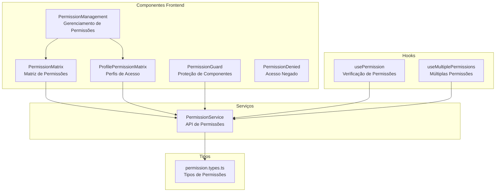
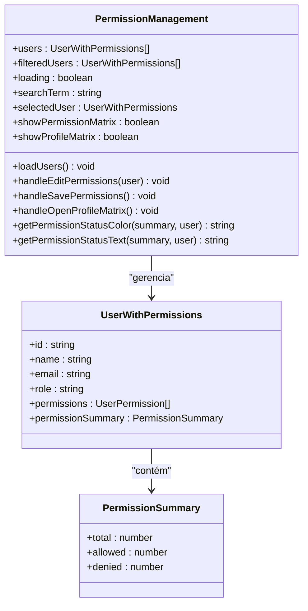
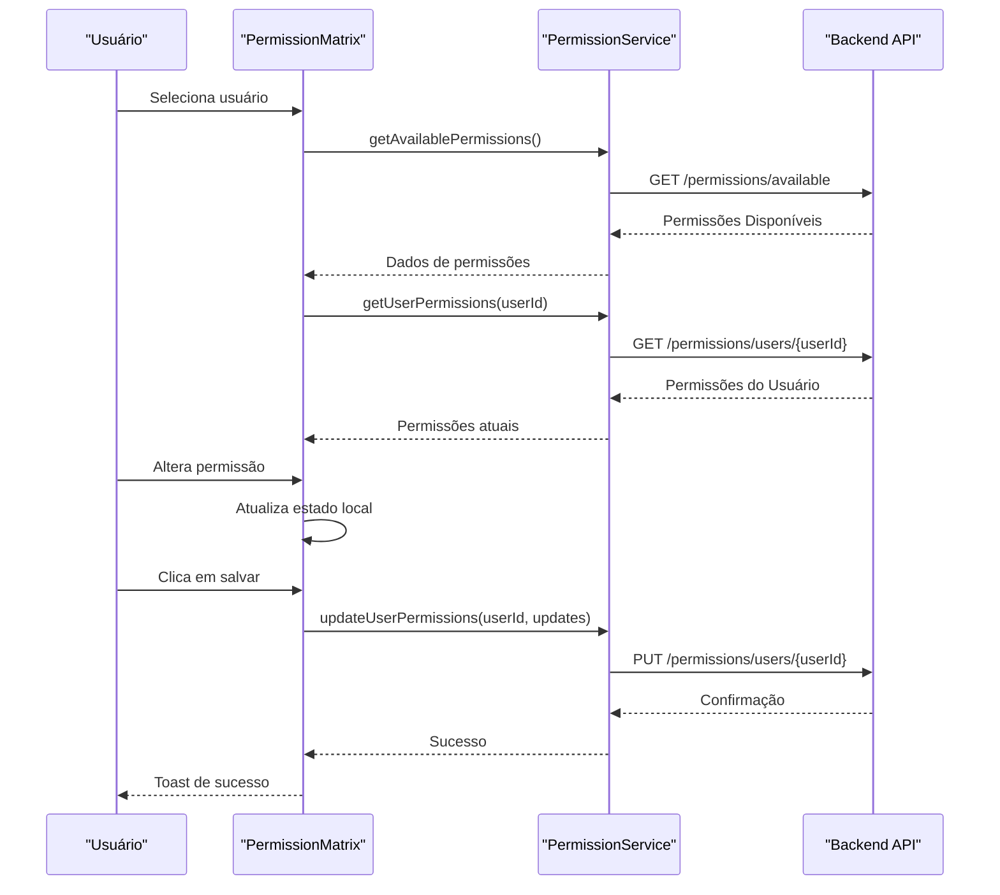
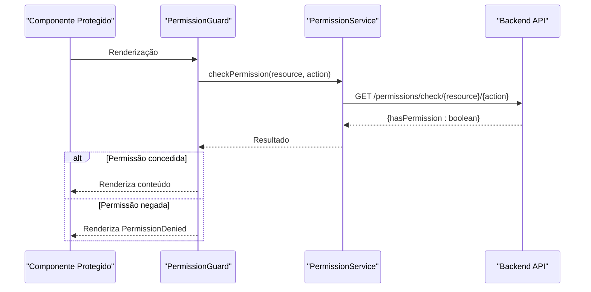
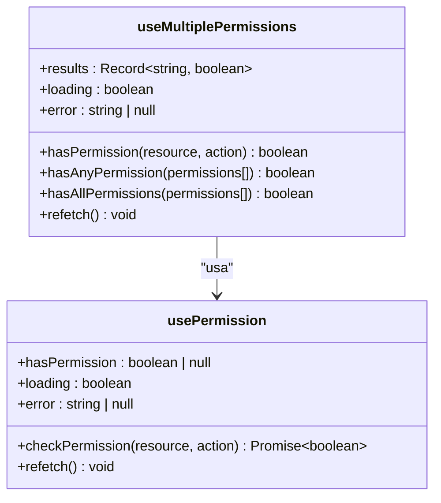
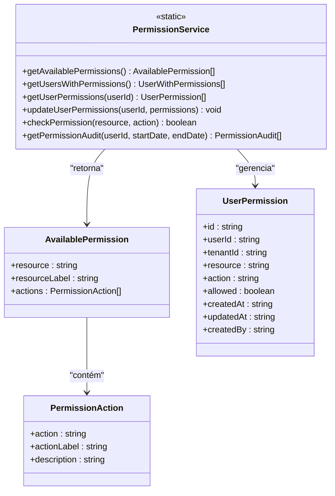
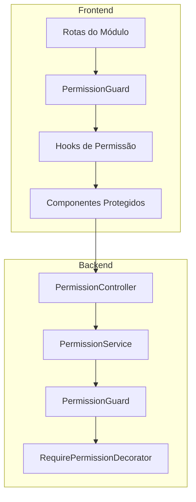

# Gerenciamento de Permissões

<cite>
**Arquivos Referenciados Neste Documento**
- [PermissionManagement.tsx](file://frontend/components/PermissionManagement.tsx)
- [PermissionMatrix.tsx](file://frontend/components/PermissionMatrix.tsx)
- [ProfilePermissionMatrix.tsx](file://frontend/components/ProfilePermissionMatrix.tsx)
- [usePermission.ts](file://frontend/hooks/usePermission.ts)
- [PermissionGuard.tsx](file://frontend/components/PermissionGuard.tsx)
- [permissionService.ts](file://frontend/services/permissionService.ts)
- [permission.types.ts](file://frontend/types/permission.types.ts)
- [PermissionDenied.tsx](file://frontend/components/PermissionDenied.tsx)
- [routes.tsx](file://frontend/routes.tsx)
- [module.json](file://module.json)
</cite>

## Sumário
- Introdução
- Estrutura do Módulo de Permissões
- Componentes Principais
  - PermissionManagement
  - PermissionMatrix
  - ProfilePermissionMatrix
  - PermissionGuard
  - usePermission Hook
- Serviços e Tipos
- Exemplos Práticos
- Casos de Uso e Boas Práticas
- Arquitetura de Permissões
- Conclusão

## Introdução
Este documento apresenta o sistema completo de gerenciamento de permissões no frontend do módulo de Ordem de Serviço. O sistema permite configurar permissões de usuários e perfis, exibir a matriz de permissões e proteger componentes com base nas permissões atuais. Ele oferece uma abordagem prática e escalável para controle de acesso no frontend, integrando-se com os recursos de permissão do backend.

## Estrutura do Módulo de Permissões
O módulo de permissões é composto por componentes de interface, hooks de permissão, serviços de comunicação com a API e tipos de dados para representar permissões. A estrutura segue uma abordagem modular onde cada funcionalidade tem seu próprio componente, permitindo fácil manutenção e expansão.



**Fontes**
- [PermissionManagement.tsx](file://frontend/components/PermissionManagement.tsx#L250-L596)
- [PermissionMatrix.tsx](file://frontend/components/PermissionMatrix.tsx#L156-L427)
- [ProfilePermissionMatrix.tsx](file://frontend/components/ProfilePermissionMatrix.tsx#L393-L719)
- [usePermission.ts](file://frontend/hooks/usePermission.ts#L12-L142)
- [PermissionGuard.tsx](file://frontend/components/PermissionGuard.tsx#L12-L50)

## Componentes Principais

### PermissionManagement - Gerenciamento Central de Permissões
O componente principal que fornece a interface de gerenciamento de permissões. Ele permite visualizar todos os usuários, buscar por usuários e configurar permissões individuais ou por perfis.



**Fontes**
- [PermissionManagement.tsx](file://frontend/components/PermissionManagement.tsx#L250-L596)
- [permission.types.ts](file://frontend/types/permission.types.ts#L31-L42)

### PermissionMatrix - Matriz de Permissões Detalhada
Interface para configurar permissões específicas de um usuário. Exibe todas as permissões disponíveis em grupos e permite alterar individualmente.



**Fontes**
- [PermissionMatrix.tsx](file://frontend/components/PermissionMatrix.tsx#L156-L427)
- [permissionService.ts](file://frontend/services/permissionService.ts#L52-L105)

### ProfilePermissionMatrix - Configuração de Perfis
Interface para configurar permissões por perfil (Administrador, Técnico, Atendente). Permite definir regras de acesso para cada perfil de forma centralizada.

```mermaid
flowchart TD
Start([Início]) --> Load["Carregar Permissões de Perfil"]
Load --> Init["Inicializar Estados"]
Init --> Group["Agrupar Regras por Categoria"]
Group --> Render["Renderizar Tabela de Permissões"]
Render --> UserInput["Usuário Altera Permissões"]
UserInput --> Update["Atualizar Estado Local"]
Update --> Save{"Salvar Alterações?"}
Save --> |Sim| Send["Enviar para Backend"]
Send --> Success["Sucesso"]
Save --> |Não| Wait["Aguardar"}
Wait --> UserInput
Success --> End([Fim])
```

**Fontes**
- [ProfilePermissionMatrix.tsx](file://frontend/components/ProfilePermissionMatrix.tsx#L393-L719)

### PermissionGuard - Proteção de Componentes
Hook que protege componentes verificando permissões antes de renderizar. Permite criar barreiras de acesso baseadas em recursos e ações específicas.



**Fontes**
- [PermissionGuard.tsx](file://frontend/components/PermissionGuard.tsx#L12-L50)
- [permissionService.ts](file://frontend/services/permissionService.ts#L107-L115)

### usePermission Hook - Verificação de Permissões
Hook que fornece funcionalidades para verificar permissões de forma assíncrona, incluindo verificação de múltiplas permissões e cache de resultados.



**Fontes**
- [usePermission.ts](file://frontend/hooks/usePermission.ts#L12-L142)

## Serviços e Tipos

### PermissionService - Comunicação com a API
Serviço que encapsula todas as operações de permissão com o backend, incluindo busca de permissões disponíveis, atualização de permissões e verificação de permissões.



**Fontes**
- [permissionService.ts](file://frontend/services/permissionService.ts#L52-L135)
- [permission.types.ts](file://frontend/types/permission.types.ts#L1-L55)

### Tipos de Permissões
Definição de tipos para representar permissões, usuários e auditoria de permissões.

**Fontes**
- [permission.types.ts](file://frontend/types/permission.types.ts#L1-L55)

## Exemplos Práticos

### Exemplo 1: Configuração de Permissões de Usuário
```typescript
// Exemplo de uso do PermissionMatrix
<PermissionMatrix
  userId={selectedUser.id}
  userName={selectedUser.name}
  onClose={() => setShowMatrix(false)}
  onSave={() => {
    loadUsers();
    showToast('Permissões atualizadas!');
  }}
/>
```

### Exemplo 2: Proteção de Componentes
```typescript
// Exemplo de uso do PermissionGuard
<PermissionGuard resource="orders" action="create">
  <OrderForm />
</PermissionGuard>
```

### Exemplo 3: Verificação de Permissões com Hook
```typescript
// Exemplo de uso do usePermission hook
const { hasPermission, loading, error } = usePermission('orders', 'view');

if (loading) return <div>Carregando...</div>;
if (!hasPermission) return <div>Acesso negado</div>;

return <ProtectedContent />;
```

### Exemplo 4: Verificação de Múltiplas Permissões
```typescript
// Exemplo de uso do useMultiplePermissions hook
const permissions = [
  { resource: 'orders', action: 'create' },
  { resource: 'orders', action: 'edit' },
  { resource: 'orders', action: 'delete' }
];

const { hasAnyPermission, hasAllPermissions } = useMultiplePermissions(permissions);

// Permitir se tiver qualquer permissão
if (hasAnyPermission(permissions)) {
  return <OrderActions />;
}

// Permitir se tiver todas as permissões
if (hasAllPermissions(permissions)) {
  return <AdminOrderActions />;
}
```

### Exemplo 5: Configuração de Perfis
```typescript
// Exemplo de uso do ProfilePermissionMatrix
<ProfilePermissionMatrix
  onClose={() => setShowProfileMatrix(false)}
  onSave={() => {
    showToast('Perfis atualizados!');
    loadPermissions();
  }}
/>
```

## Casos de Uso e Boas Práticas

### Caso de Uso 1: Controle de Acesso Baseado em Perfis
- **Cenário**: Diferentes perfis de usuário (Administrador, Técnico, Atendente)
- **Implementação**: Utilizar ProfilePermissionMatrix para configurar regras de acesso
- **Boa Prática**: Manter regras de acesso padronizadas e documentadas

### Caso de Uso 2: Permissões Específicas por Usuário
- **Cenário**: Ajustes finos de permissões para usuários específicos
- **Implementação**: Utilizar PermissionMatrix para configuração individual
- **Boa Prática**: Manter histórico de alterações e auditoria

### Caso de Uso 3: Proteção de Rotas e Componentes
- **Cenário**: Proteger páginas e componentes com base em permissões
- **Implementação**: Utilizar PermissionGuard para proteção em tempo real
- **Boa Prática**: Implementar fallbacks adequados para acesso negado

### Boas Práticas Gerais
1. **Padronização de Nomes**: Utilizar convenções consistentes para recursos e ações
2. **Auditoria**: Manter registro de todas as alterações de permissões
3. **Cache**: Implementar cache de permissões para melhor performance
4. **Fallbacks**: Sempre fornecer mensagens claras para acesso negado
5. **Testes**: Validar permissões em diferentes cenários e fluxos

## Arquitetura de Permissões



**Fontes**
- [routes.tsx](file://frontend/routes.tsx#L11-L19)
- [module.json](file://module.json#L11-L42)

## Conclusão
O sistema de gerenciamento de permissões oferece uma solução completa e escalável para controle de acesso no frontend. Com a combinação de componentes visuais, hooks de permissão e proteção automática de componentes, o sistema permite uma gestão eficiente de permissões tanto para usuários quanto para perfis. A implementação seguindo as boas práticas descritas garante segurança, usabilidade e manutenibilidade do módulo.