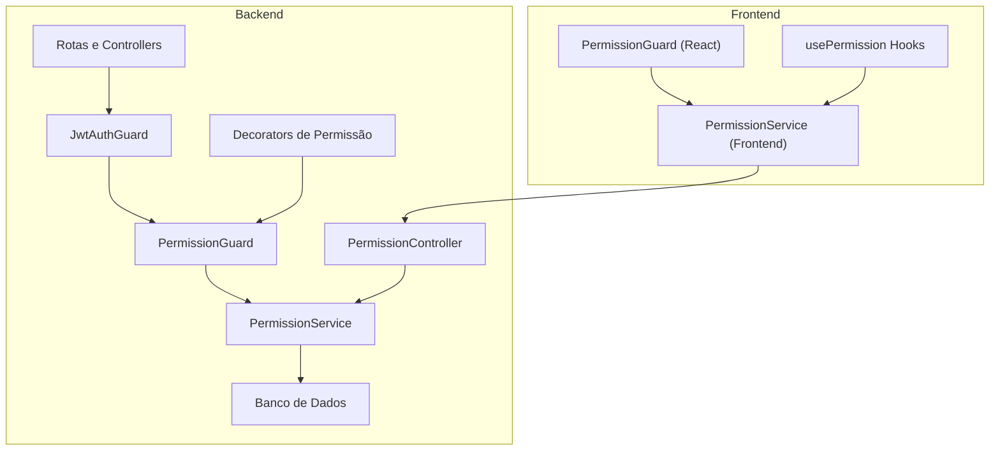
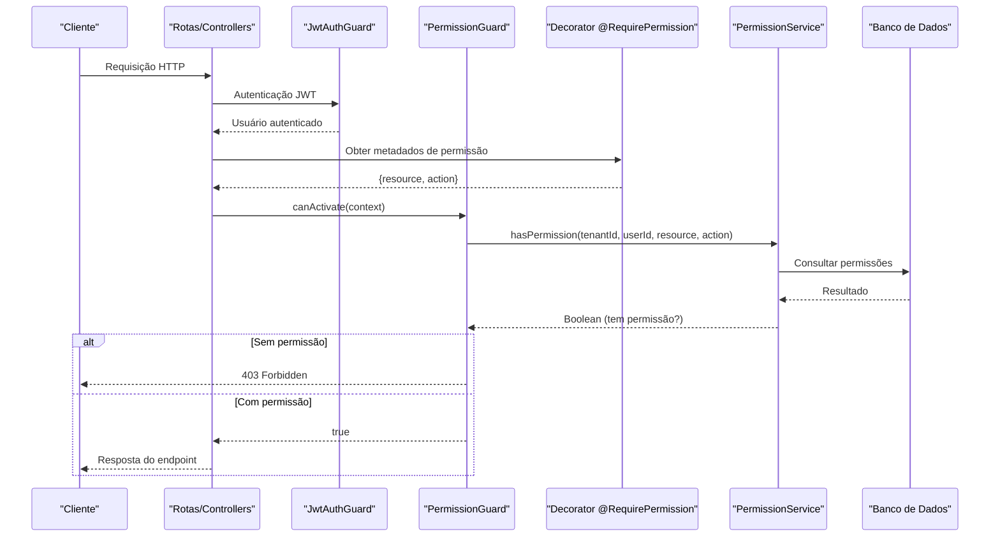
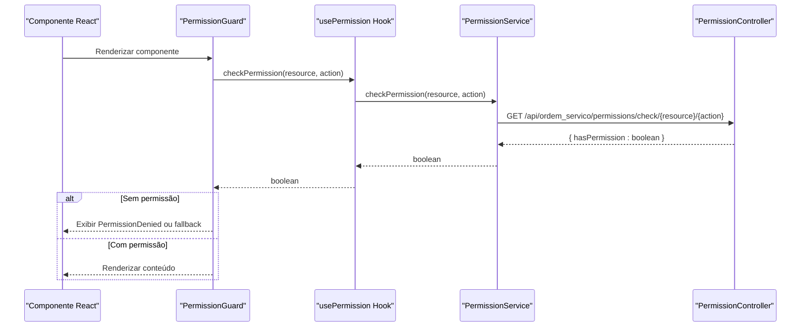

# Guardas de Permissão

<cite>
**Arquivos Referenciados neste Documento**
- [require-permission.decorator.ts](file://backend/shared/decorators/require-permission.decorator.ts)
- [permission.guard.ts](file://backend/shared/guards/permission.guard.ts)
- [permission.service.ts](file://backend/shared/services/permission.service.ts)
- [available-permissions.ts](file://backend/shared/constants/available-permissions.ts)
- [permission.interface.ts](file://backend/shared/interfaces/permission.interface.ts)
- [permission.controller.ts](file://backend/shared/controllers/permission.controller.ts)
- [clientes.controller.ts](file://backend/clientes/clientes.controller.ts)
- [produtos.controller.ts](file://backend/produtos/produtos.controller.ts)
- [ordens.controller.ts](file://backend/ordens/ordens.controller.ts)
- [PermissionGuard.tsx](file://frontend/components/PermissionGuard.tsx)
- [usePermission.ts](file://frontend/hooks/usePermission.ts)
- [permissionService.ts](file://frontend/services/permissionService.ts)
- [shared.module.ts](file://backend/shared/shared.module.ts)
- [routes.ts](file://backend/routes.ts)
- [ordem_servico.module.ts](file://backend/ordem_servico.module.ts)
</cite>

## Sumário
- Apresentação geral do mecanismo de permissões
- Funcionamento do decorator @RequirePermission e sua integração com a guarda
- Fluxo completo de verificação de permissões no backend
- Exemplos práticos de proteção de rotas e métodos
- Tratamento de acesso negado e respostas de erro
- Implementações no frontend com PermissionGuard e hooks
- Considerações de desempenho e segurança

## Introdução
O sistema implementa um mecanismo de permissões baseado em recursos e ações, integrado ao pipeline de requisições NestJS através de guardas e decorators. As permissões são armazenadas no banco de dados e consultadas dinamicamente durante a execução de cada endpoint. Além disso, o frontend disponibiliza componentes e hooks para verificação de permissões em tempo real, melhorando a experiência do usuário ao ocultar ou mostrar elementos com base nas permissões atuais.

## Estrutura Geral do Sistema de Permissões

**Diagrama fonte**
- [permission.guard.ts](file://backend/shared/guards/permission.guard.ts#L1-L58)
- [require-permission.decorator.ts](file://backend/shared/decorators/require-permission.decorator.ts#L1-L25)
- [permission.service.ts](file://backend/shared/services/permission.service.ts#L1-L313)
- [permission.controller.ts](file://backend/shared/controllers/permission.controller.ts#L1-L83)
- [clientes.controller.ts](file://backend/clientes/clientes.controller.ts#L1-L182)
- [produtos.controller.ts](file://backend/produtos/produtos.controller.ts#L1-L144)
- [PermissionGuard.tsx](file://frontend/components/PermissionGuard.tsx#L1-L50)
- [usePermission.ts](file://frontend/hooks/usePermission.ts#L1-L142)
- [permissionService.ts](file://frontend/services/permissionService.ts#L1-L135)

**Seção fonte**
- [permission.guard.ts](file://backend/shared/guards/permission.guard.ts#L1-L58)
- [require-permission.decorator.ts](file://backend/shared/decorators/require-permission.decorator.ts#L1-L25)
- [permission.service.ts](file://backend/shared/services/permission.service.ts#L1-L313)
- [permission.controller.ts](file://backend/shared/controllers/permission.controller.ts#L1-L83)

## Componentes-Chave

### Decorators de Permissão (@RequirePermission e variantes)
- Propósito: Definem quais permissões são necessárias para acessar um endpoint específico.
- Funcionamento: Armazenam metadados no handler da rota contendo o recurso e a ação requerida.
- Variantes específicas: @RequireDashboardPermission, @RequireOrdersPermission, @RequireClientsPermission, @RequireProductsPermission, @RequireConfigPermission.

**Seção fonte**
- [require-permission.decorator.ts](file://backend/shared/decorators/require-permission.decorator.ts#L1-L25)

### Guarda de Permissão (PermissionGuard)
- Propósito: Intercepta requisições e verifica se o usuário possui a permissão necessária.
- Fluxo:
  1. Lê os metadados da rota (decorator).
  2. Verifica se o usuário está autenticado.
  3. Consulta o PermissionService para verificar permissão.
  4. Em caso de falta de permissão, lança ForbiddenException.
  5. Em caso de erro no sistema, nega acesso com mensagem segura.

**Seção fonte**
- [permission.guard.ts](file://backend/shared/guards/permission.guard.ts#L1-L58)

### Serviço de Permissões (PermissionService)
- Propósito: Fornece operações de permissões, incluindo cache, auditoria e verificação.
- Recursos:
  - Cache de permissões por usuário (TTL de 5 minutos).
  - Verificação automática de bypass para ADMIN e SUPER_ADMIN.
  - Auditoria de mudanças de permissões e tentativas de acesso negadas.
  - Listagem de permissões disponíveis.

**Seção fonte**
- [permission.service.ts](file://backend/shared/services/permission.service.ts#L1-L313)

### Controlador de Permissões (PermissionController)
- Propósito: Fornece endpoints para consulta e gerenciamento de permissões.
- Funcionalidades: Listagem de permissões disponíveis, listagem de usuários com permissões, consulta e atualização de permissões de usuários, auditoria de permissões.

**Seção fonte**
- [permission.controller.ts](file://backend/shared/controllers/permission.controller.ts#L1-L83)

## Fluxo de Verificação de Permissões

**Diagrama fonte**
- [permission.guard.ts](file://backend/shared/guards/permission.guard.ts#L12-L57)
- [require-permission.decorator.ts](file://backend/shared/decorators/require-permission.decorator.ts#L8-L9)
- [permission.service.ts](file://backend/shared/services/permission.service.ts#L131-L162)

## Exemplos Práticos de Uso

### Protegendo Rotas no Backend

#### ClientesController
- Aplica a guarda em nível de controller combinada com autenticação JWT.
- Utiliza decorators específicos para cada ação:
  - Listagem: @RequireClientsPermission('view')
  - Detalhe: @RequireClientsPermission('view_details')
  - Criação: @RequireClientsPermission('create')
  - Edição: @RequireClientsPermission('edit')
  - Exclusão: @RequireClientsPermission('delete')

**Seção fonte**
- [clientes.controller.ts](file://backend/clientes/clientes.controller.ts#L13-L72)

#### ProdutosController
- Aplica a guarda em nível de método com decorators específicos:
  - Listagem: @UseGuards(JwtAuthGuard, PermissionGuard) + @RequireProductsPermission('view')
  - Detalhe: @UseGuards(JwtAuthGuard, PermissionGuard) + @RequireProductsPermission('view')
  - Criação: @UseGuards(JwtAuthGuard, PermissionGuard) + @RequireProductsPermission('create')
  - Edição: @UseGuards(JwtAuthGuard, PermissionGuard) + @RequireProductsPermission('edit')
  - Exclusão: @UseGuards(JwtAuthGuard, PermissionGuard) + @RequireProductsPermission('delete')
  - Upload de imagens: @UseGuards(JwtAuthGuard, PermissionGuard) + @RequireProductsPermission('upload_images')

**Seção fonte**
- [produtos.controller.ts](file://backend/produtos/produtos.controller.ts#L21-L61)

#### OrdensController
- Aplica a guarda em nível de controller combinada com autenticação JWT.
- A guarda é aplicada automaticamente a todos os métodos, exceto aqueles que usam decorators específicos de permissão nos próprios métodos.

**Seção fonte**
- [ordens.controller.ts](file://backend/ordens/ordens.controller.ts#L26-L377)

### Exemplo de Decorator Personalizado
- O decorator @RequirePermission permite especificar qualquer recurso e ação.
- Exemplos de uso:
  - @RequirePermission('dashboard', 'view')
  - @RequirePermission('orders', 'create')
  - @RequirePermission('config', 'manage_permissions')

**Seção fonte**
- [require-permission.decorator.ts](file://backend/shared/decorators/require-permission.decorator.ts#L8-L25)

## Níveis de Permissão e Tratamento de Acesso Negado

### Níveis de Permissão Disponíveis
- Recursos e ações disponíveis são definidos em constantes:
  - Dashboard: view, view_statistics
  - Clientes: view, view_details, create, edit, delete, upload_images
  - Produtos/Serviços: view, create, edit, delete, upload_images
  - Ordens de Serviço: view, view_details, create, edit, delete, change_status, approve_budget, view_history
  - Configurações: view, edit, manage_permissions, manage_notifications

**Seção fonte**
- [available-permissions.ts](file://backend/shared/constants/available-permissions.ts#L1-L164)

### Tratamento de Acesso Negado
- Se o usuário não tiver a permissão necessária:
  - Lança ForbiddenException com mensagem indicando a permissão requerida.
  - Registra tentativa de acesso negado na auditoria.
- Se o usuário não estiver autenticado:
  - Lança ForbiddenException com mensagem "Usuário não autenticado".
- Em caso de erro no sistema:
  - Lança ForbiddenException com mensagem segura "Erro ao verificar permissões".

**Seção fonte**
- [permission.guard.ts](file://backend/shared/guards/permission.guard.ts#L28-L56)
- [permission.service.ts](file://backend/shared/services/permission.service.ts#L243-L259)

## Implementações Práticas de Proteção de Rotas e Métodos

### Configuração Global de Guardas
- O SharedModule exporta PermissionGuard, tornando-a disponível para uso em qualquer controller.
- O modulo OrdemServicoModule importa SharedModule, garantindo que as guardas estejam disponíveis em todo o módulo.

**Seção fonte**
- [shared.module.ts](file://backend/shared/shared.module.ts#L9-L16)
- [ordem_servico.module.ts](file://backend/ordem_servico.module.ts#L1-L35)

### Rotas e Módulos
- O arquivo routes.ts define os controladores que compõem o módulo.
- Os controladores estão organizados por funcionalidade (clientes, produtos, ordens, configurações).

**Seção fonte**
- [routes.ts](file://backend/routes.ts#L1-L17)

## Frontend: PermissionGuard e Hooks

### PermissionGuard (Componente React)
- Verifica permissões em tempo real antes de renderizar conteúdo.
- Exibe fallback (padrão ou personalizado) quando o usuário não tem permissão.
- Realiza chamadas assíncronas à API de permissões.

**Seção fonte**
- [PermissionGuard.tsx](file://frontend/components/PermissionGuard.tsx#L1-L50)

### Hooks de Permissão (usePermission, useMultiplePermissions)
- usePermission: Verifica uma única permissão e fornece estado de carregamento e erro.
- useMultiplePermissions: Verifica múltiplas permissões de uma vez e retorna resultados consolidados.
- Funções auxiliares:
  - hasPermission: Verifica se tem uma permissão específica.
  - hasAnyPermission: Verifica se tem ao menos uma permissão de uma lista.
  - hasAllPermissions: Verifica se tem todas as permissões de uma lista.

**Seção fonte**
- [usePermission.ts](file://frontend/hooks/usePermission.ts#L1-L142)

### Serviço de Permissões (Frontend)
- PermissionService: Faz chamadas HTTP para endpoints do backend de permissões.
- Métodos: getAvailablePermissions, getUsersWithPermissions, getUserPermissions, updateUserPermissions, checkPermission, getPermissionAudit.

**Seção fonte**
- [permissionService.ts](file://frontend/services/permissionService.ts#L1-L135)

## Fluxo de Verificação de Permissões no Frontend

**Diagrama fonte**
- [PermissionGuard.tsx](file://frontend/components/PermissionGuard.tsx#L21-L35)
- [usePermission.ts](file://frontend/hooks/usePermission.ts#L17-L35)
- [permissionService.ts](file://frontend/services/permissionService.ts#L107-L115)
- [permission.controller.ts](file://backend/shared/controllers/permission.controller.ts#L1-L83)

## Considerações de Desempenho e Segurança

### Cache de Permissões
- O PermissionService mantém um cache de permissões por usuário com TTL de 5 minutos.
- Isso reduz o número de consultas ao banco de dados e melhora o desempenho.

**Seção fonte**
- [permission.service.ts](file://backend/shared/services/permission.service.ts#L16-L28)

### Bypass Automático para Administradores
- Usuários com papéis ADMIN ou SUPER_ADMIN têm acesso automático a todas as permissões.
- Isso simplifica a gestão de permissões para administradores, mas deve ser usado com cuidado.

**Seção fonte**
- [permission.service.ts](file://backend/shared/services/permission.service.ts#L133-L143)

### Auditoria de Permissões
- O sistema registra auditoria de mudanças de permissões e tentativas de acesso negadas.
- Isso permite rastrear atividades suspeitas e manter conformidade.

**Seção fonte**
- [permission.service.ts](file://backend/shared/services/permission.service.ts#L221-L259)

## Conclusão
O sistema de permissões implementa um modelo robusto e escalável de controle de acesso baseado em recursos e ações. A combinação de decorators, guardas e cache garante eficiência e segurança. A integração com o frontend através de componentes e hooks proporciona uma experiência de usuário responsiva e adaptável às permissões reais do usuário.