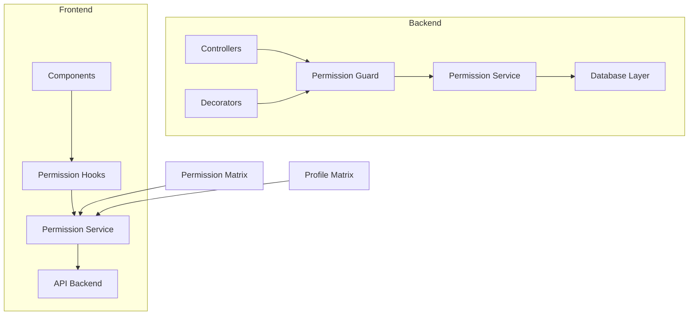
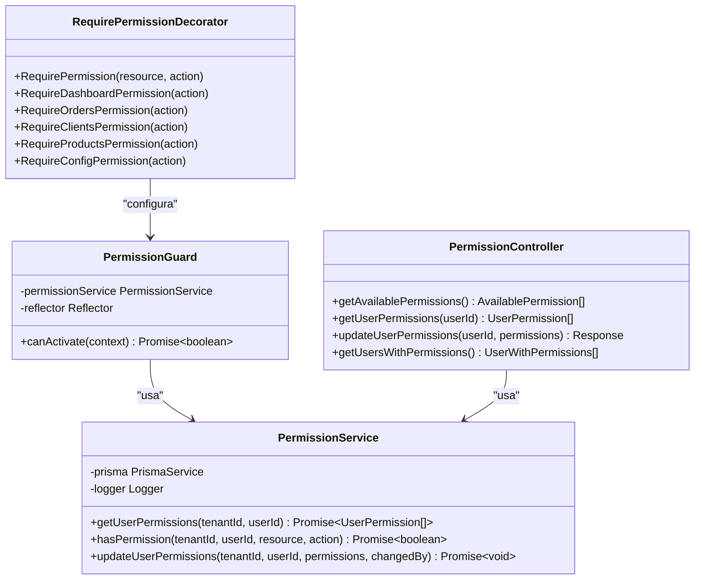
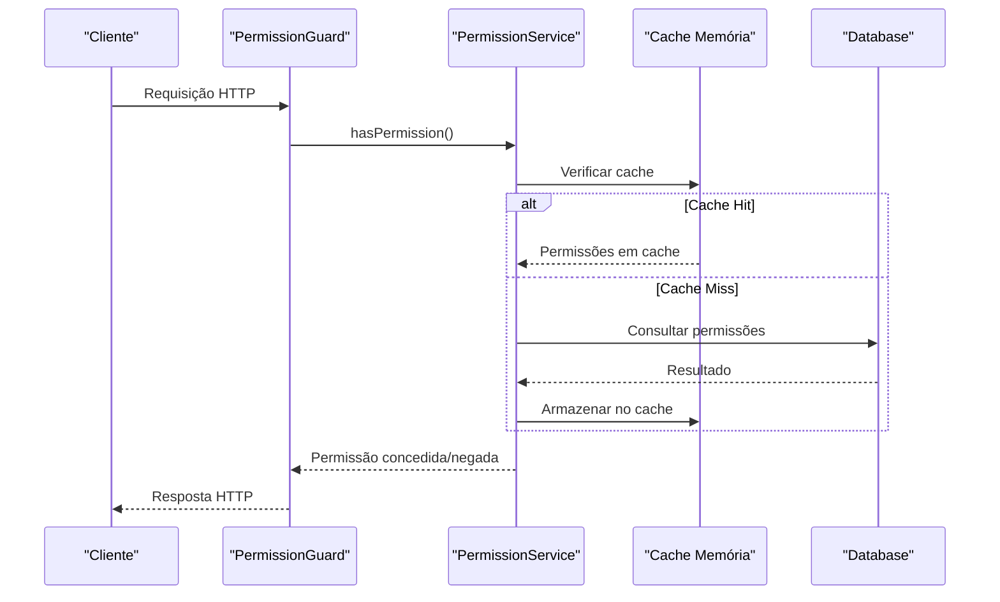
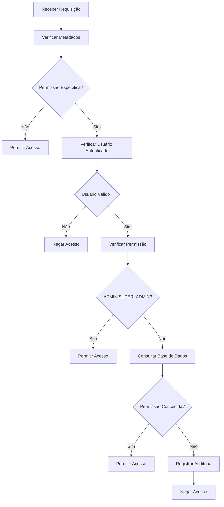
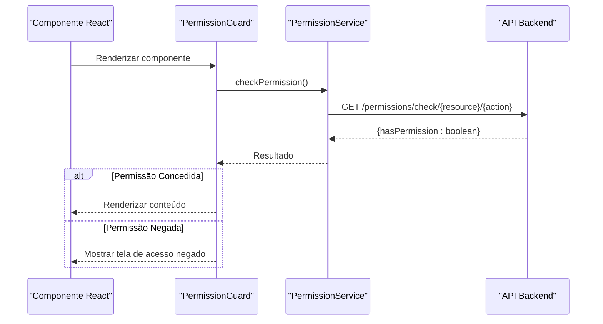
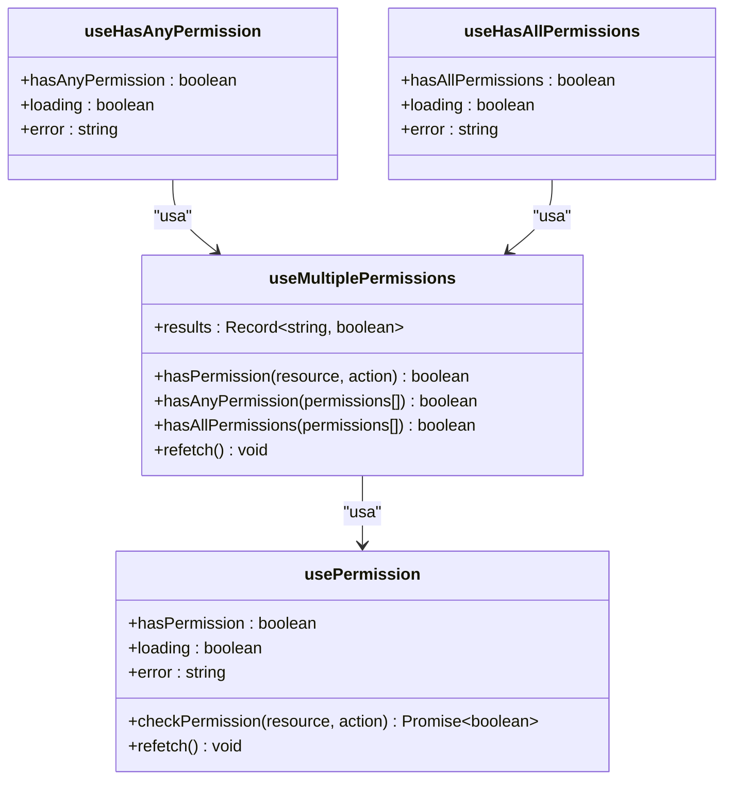
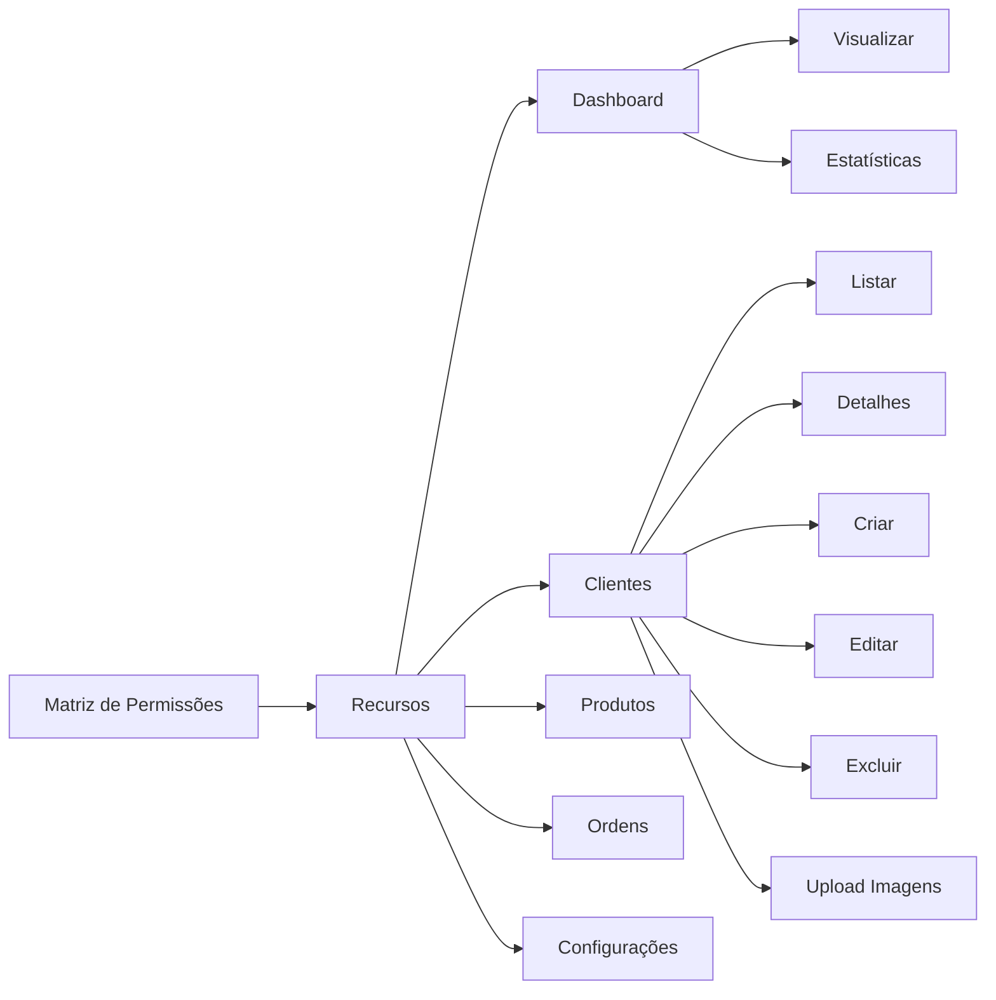

# Sistema de Permissões

<cite>
**Arquivos referenciados neste documento**
- [available-permissions.ts](file://backend/shared/constants/available-permissions.ts)
- [require-permission.decorator.ts](file://backend/shared/decorators/require-permission.decorator.ts)
- [permission.guard.ts](file://backend/shared/guards/permission.guard.ts)
- [permission.interface.ts](file://backend/shared/interfaces/permission.interface.ts)
- [permission.controller.ts](file://backend/shared/controllers/permission.controller.ts)
- [permission.service.ts](file://backend/shared/services/permission.service.ts)
- [routes.ts](file://backend/routes.ts)
- [ordem_servico.module.ts](file://backend/ordem_servico.module.ts)
- [PermissionGuard.tsx](file://frontend/components/PermissionGuard.tsx)
- [PermissionMatrix.tsx](file://frontend/components/PermissionMatrix.tsx)
- [ProfilePermissionMatrix.tsx](file://frontend/components/ProfilePermissionMatrix.tsx)
- [usePermission.ts](file://frontend/hooks/usePermission.ts)
- [permission.types.ts](file://frontend/types/permission.types.ts)
- [permissionService.ts](file://frontend/services/permissionService.ts)
</cite>

## Sumário
1. [Introdução](#introdução)
2. [Estrutura do Projeto](#estrutura-do-projeto)
3. [Recursos e Ações Granulares](#recursos-e-ações-granulares)
4. [Arquitetura do Sistema de Permissões](#arquitetura-do-sistema-de-permissões)
5. [Implementação Backend](#implementação-backend)
6. [Implementação Frontend](#implementação-frontend)
7. [APIs de Permissões](#apis-de-permissões)
8. [Guardas de Rota](#guardas-de-rota)
9. [Matrizes de Permissão](#matrizes-de-permissão)
10. [Exemplos Práticos](#exemplos-práticos)
11. [Considerações de Desempenho](#considerações-de-desempenho)
12. [Guia de Solução de Problemas](#guia-de-solução-de-problemas)
13. [Conclusão](#conclusão)

## Introdução
O módulo de permissões RBAC (Role-Based Access Control) implementa um sistema completo de controle de acesso baseado em recursos e ações granulares. O sistema permite gerenciar permissões de usuários em diferentes módulos do sistema (dashboard, clientes, produtos, ordens de serviço, configurações) com níveis de acesso específicos para cada operação.

O sistema oferece tanto proteção no backend quanto no frontend, garantindo consistência e segurança em todas as camadas da aplicação.

## Estrutura do Projeto
O sistema de permissões é estruturado em duas camadas principais:



**Fontes da seção**
- [ordem_servico.module.ts](file://backend/ordem_servico.module.ts#L11-L35)
- [routes.ts](file://backend/routes.ts#L9-L17)

## Recursos e Ações Granulares
O sistema define permissões através de uma estrutura hierárquica de recursos e ações:

### Recursos Disponíveis
- **Dashboard**: Acesso ao painel principal e estatísticas
- **Clientes**: Gestão completa de clientes (listagem, detalhes, criação, edição, exclusão, uploads)
- **Produtos/Serviços**: Catálogo de produtos e serviços
- **Ordens de Serviço**: Gestão de ordens (visualização, criação, edição, exclusão, alteração de status, aprovação de orçamentos)
- **Configurações**: Configurações do módulo e gerenciamento de permissões

### Níveis de Acesso
Cada recurso possui ações específicas que definem o nível de permissão:
- `view`: Visualização básica
- `view_details`: Detalhamento completo
- `create`: Criação de registros
- `edit`: Edição de registros
- `delete`: Exclusão de registros
- `upload_images`: Upload de mídia
- `change_status`: Alteração de status
- `approve_budget`: Aprovação de orçamentos
- `manage_permissions`: Gerenciamento de permissões

**Fontes da seção**
- [available-permissions.ts](file://backend/shared/constants/available-permissions.ts#L3-L164)

## Arquitetura do Sistema de Permissões
O sistema implementa um modelo de permissão RBAC com as seguintes características:



**Fontes da seção**
- [permission.guard.ts](file://backend/shared/guards/permission.guard.ts#L5-L58)
- [permission.service.ts](file://backend/shared/services/permission.service.ts#L13-L313)
- [permission.controller.ts](file://backend/shared/controllers/permission.controller.ts#L1-L83)
- [require-permission.decorator.ts](file://backend/shared/decorators/require-permission.decorator.ts#L3-L25)

## Implementação Backend
O backend implementa o núcleo do sistema de permissões com as seguintes funcionalidades:

### Cache de Permissões
O sistema utiliza um cache com TTL de 5 minutos para otimizar o desempenho de consultas frequentes:



**Fontes da seção**
- [permission.service.ts](file://backend/shared/services/permission.service.ts#L16-L68)

### Proteção de Acesso
O sistema implementa bypass automático para administradores e registro de auditoria para tentativas de acesso:



**Fontes da seção**
- [permission.guard.ts](file://backend/shared/guards/permission.guard.ts#L12-L57)
- [permission.service.ts](file://backend/shared/services/permission.service.ts#L131-L162)

## Implementação Frontend
O frontend oferece interfaces completas para gerenciamento de permissões:

### Componente PermissionGuard
Fornecimento de proteção em tempo real para componentes React:



**Fontes da seção**
- [PermissionGuard.tsx](file://frontend/components/PermissionGuard.tsx#L12-L50)
- [permissionService.ts](file://frontend/services/permissionService.ts#L107-L115)

### Hooks de Permissão
Hooks especializados para diferentes cenários de verificação:



**Fontes da seção**
- [usePermission.ts](file://frontend/hooks/usePermission.ts#L12-L142)

## APIs de Permissões
O sistema expõe endpoints REST completos para gerenciamento de permissões:

### Endpoints Disponíveis
- `GET /api/ordem_servico/permissions/available`: Retorna todas as permissões disponíveis
- `GET /api/ordem_servico/permissions/users`: Lista usuários com suas permissões
- `GET /api/ordem_servico/permissions/users/:userId`: Obtém permissões de um usuário específico
- `PUT /api/ordem_servico/permissions/users/:userId`: Atualiza permissões de um usuário
- `GET /api/ordem_servico/permissions/audit`: Busca histórico de auditoria

### Exemplo de Uso
Para proteger um endpoint específico, basta adicionar o decorator:

```typescript
@UseGuards(JwtAuthGuard, PermissionGuard)
@RequirePermission('orders', 'view')
@Get('orders')
async getOrders() {
  // Somente usuários com permissão podem acessar
}
```

**Fontes da seção**
- [permission.controller.ts](file://backend/shared/controllers/permission.controller.ts#L13-L83)
- [require-permission.decorator.ts](file://backend/shared/decorators/require-permission.decorator.ts#L8-L25)

## Guardas de Rota
O sistema utiliza guardas para proteger tanto rotas quanto métodos de controller:

### PermissionGuard
A guarda de permissão é responsável por:
- Extrair informações de permissão dos metadados
- Verificar autenticação do usuário
- Consultar permissões no banco de dados
- Gerenciar exceções e auditoria

### Configuração de Guardas
As guardas podem ser aplicadas de várias formas:

```typescript
// Protegendo um método específico
@UseGuards(PermissionGuard)
@RequirePermission('clients', 'create')
@Post('clients')
async createClient() {}

// Protegendo toda uma classe
@Controller('orders')
@UseGuards(PermissionGuard)
export class OrdersController {
  @RequirePermission('orders', 'view')
  @Get()
  async getOrders() {}
}
```

**Fontes da seção**
- [permission.guard.ts](file://backend/shared/guards/permission.guard.ts#L12-L57)

## Matrizes de Permissão
O frontend oferece interfaces visuais para gerenciamento de permissões:

### PermissionMatrix
Interface completa para gerenciamento de permissões individuais:



### ProfilePermissionMatrix
Matriz de permissões por perfil predefinidos:
- **Administrador**: Acesso total ao sistema
- **Técnico**: Acesso limitado às ordens de serviço e clientes
- **Atendente**: Acesso básico ao sistema

**Fontes da seção**
- [PermissionMatrix.tsx](file://frontend/components/PermissionMatrix.tsx#L156-L427)
- [ProfilePermissionMatrix.tsx](file://frontend/components/ProfilePermissionMatrix.tsx#L393-L719)

## Exemplos Práticos
Aqui estão exemplos concretos de implementação:

### Protegendo um Endpoint
```typescript
// Backend - Controller protegido
@UseGuards(JwtAuthGuard, PermissionGuard)
@RequirePermission('orders', 'create')
@Post('orders')
async createOrder(@Body() order) {
  return this.ordersService.create(order);
}
```

### Verificando Permissão em Componente
```tsx
// Frontend - Componente protegido
function OrderForm() {
  const { hasPermission, loading } = usePermission('orders', 'create');
  
  if (loading) return <div>Carregando...</div>;
  
  if (!hasPermission) return <PermissionDenied />;
  
  return <OrderFormComponent />;
}
```

### Gerenciando Permissões de Usuário
```typescript
// Frontend - Interface de gerenciamento
function UserPermissionManager({ userId }) {
  const [permissions, setPermissions] = useState([]);
  
  const handlePermissionChange = async (resource, action, allowed) => {
    const updates = [...permissions];
    const index = updates.findIndex(p => p.action === action);
    
    if (index !== -1) {
      updates[index].allowed = allowed;
    } else {
      updates.push({ resource, action, allowed });
    }
    
    await PermissionService.updateUserPermissions(userId, updates);
    setPermissions(updates);
  };
  
  return (
    <PermissionMatrix 
      userId={userId}
      permissions={permissions}
      onChange={handlePermissionChange}
    />
  );
}
```

**Fontes da seção**
- [permission.controller.ts](file://backend/shared/controllers/permission.controller.ts#L49-L68)
- [PermissionGuard.tsx](file://frontend/components/PermissionGuard.tsx#L21-L35)
- [PermissionMatrix.tsx](file://frontend/components/PermissionMatrix.tsx#L259-L296)

## Considerações de Desempenho
O sistema implementa várias otimizações para garantir alta performance:

### Cache de Permissões
- TTL de 5 minutos para permissões em cache
- Limpeza automática de entradas expiradas
- Cache por usuário e tenant

### Consultas Eficientes
- Uso de consultas SQL otimizadas
- Indexação adequada nas tabelas
- Paginação para grandes conjuntos de dados

### Auditoria Otimizada
- Registro assíncrono de auditoria
- Batch updates para múltiplas permissões
- Filtragem eficiente de logs

**Fontes da seção**
- [permission.service.ts](file://backend/shared/services/permission.service.ts#L16-L17)

## Guia de Solução de Problemas
### Problemas Comuns e Soluções

#### Erro: "Acesso negado. Permissão necessária"
**Causa**: Usuário não possui a permissão específica
**Solução**: 
1. Verificar se o usuário tem a permissão necessária
2. Atualizar permissões através da interface de gerenciamento
3. Verificar se o usuário está no mesmo tenant

#### Erro: "Usuário não autenticado"
**Causa**: Falha na autenticação JWT
**Solução**:
1. Verificar token de acesso
2. Revalidar credenciais
3. Verificar expiração do token

#### Problema: Permissões não estão sendo aplicadas imediatamente
**Causa**: Cache de permissões
**Solução**:
1. Aguardar expiração do cache (5 minutos)
2. Forçar recarga de permissões
3. Verificar cache do servidor

#### Erro: Interface de permissões não carrega
**Causa**: Problemas de comunicação com a API
**Solução**:
1. Verificar conexão com backend
2. Validar CORS e headers
3. Verificar tokens de autenticação

**Fontes da seção**
- [permission.guard.ts](file://backend/shared/guards/permission.guard.ts#L28-L56)
- [permission.service.ts](file://backend/shared/services/permission.service.ts#L243-L259)

## Conclusão
O sistema de permissões RBAC implementado no módulo oferece uma solução completa e robusta para controle de acesso. Com sua abordagem de recursos e ações granulares, proteção tanto no backend quanto no frontend, e interfaces intuitivas de gerenciamento, o sistema proporciona segurança adequada para ambientes corporativos.

As principais vantagens incluem:
- **Flexibilidade**: Permissões específicas para cada recurso e ação
- **Segurança**: Proteção em duas camadas (backend e frontend)
- **Auditoria**: Registro completo de todas as alterações de permissões
- **Desempenho**: Cache otimizado e consultas eficientes
- **Facilidade de uso**: Interfaces visuais intuitivas para gerenciamento

O sistema pode ser facilmente expandido para incluir novos recursos e ações, mantendo a mesma estrutura e padrões de implementação.