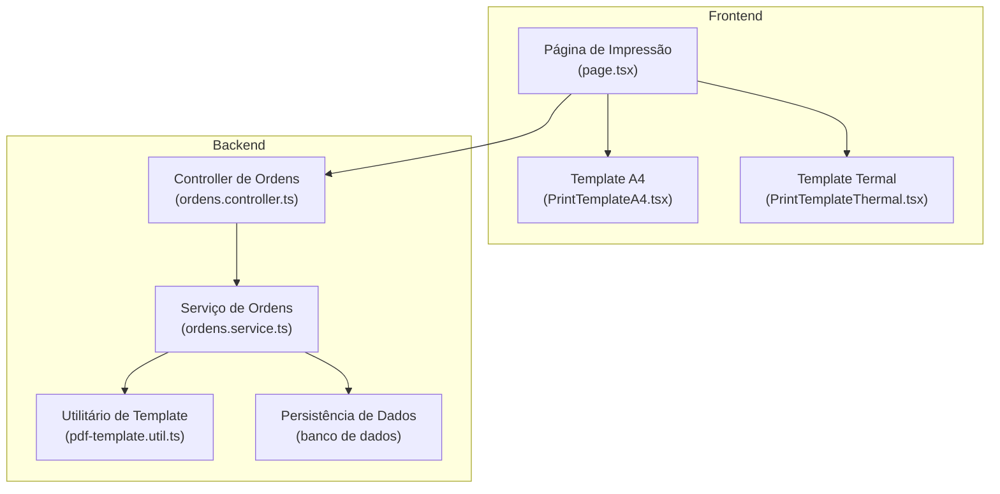
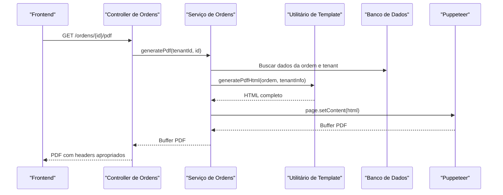
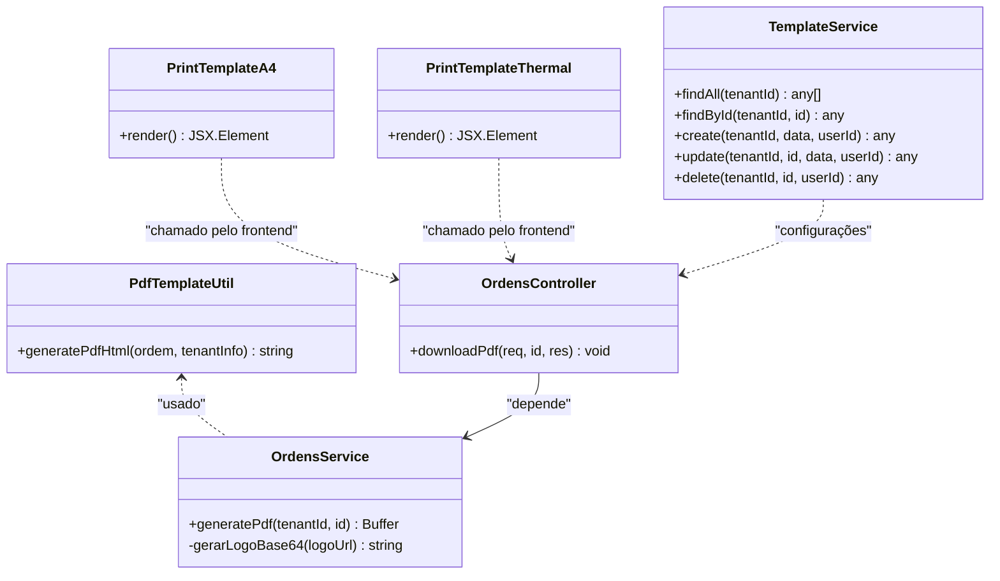
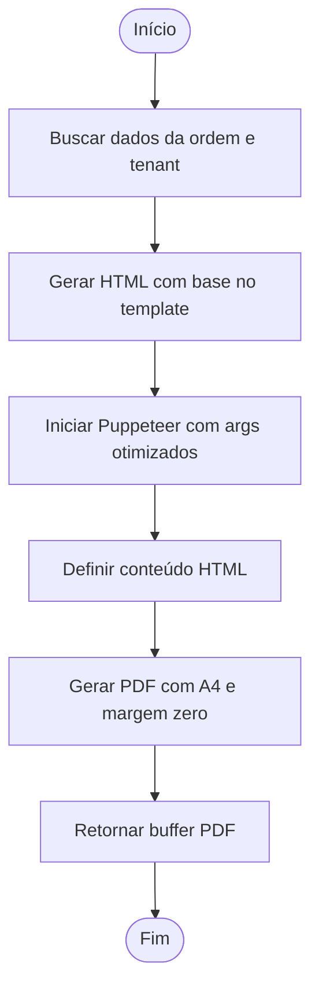
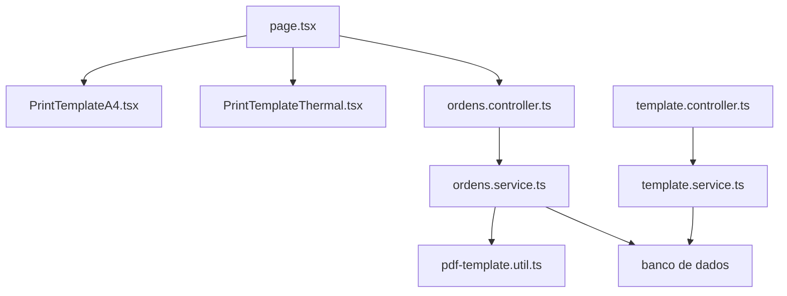

# Geração de PDFs

<cite>
**Arquivos referenciados neste documento**
- [pdf-template.util.ts](file://backend/ordens/pdf-template.util.ts)
- [ordens.service.ts](file://backend/ordens/ordens.service.ts)
- [ordens.controller.ts](file://backend/ordens/ordens.controller.ts)
- [PrintTemplateA4.tsx](file://frontend/components/PrintTemplateA4.tsx)
- [PrintTemplateThermal.tsx](file://frontend/components/PrintTemplateThermal.tsx)
- [page.tsx](file://frontend/pages/ordens/print/page.tsx)
- [template.service.ts](file://backend/shared/services/template.service.ts)
- [template.controller.ts](file://backend/shared/controllers/template.controller.ts)
- [004_add_tables_os.sql](file://backend/migrations/004_add_tables_os.sql)
- [seeds_os.sql](file://backend/seeds/seeds_os.sql)
- [ordem-servico.dto.ts](file://backend/shared/dto/ordem-servico.dto.ts)
</cite>

## Sumário
1. [Introdução](#introdução)
2. [Estrutura do Projeto](#estrutura-do-projeto)
3. [Componentes Principais](#componentes-principais)
4. [Visão Geral da Arquitetura](#visão-geral-da-arquitetura)
5. [Análise Detalhada de Componentes](#análise-detalhada-de-componentes)
6. [Análise de Dependências](#análise-de-dependências)
7. [Considerações de Desempenho](#considerações-de-desempenho)
8. [Guia de Solução de Problemas](#guia-de-solução-de-problemas)
9. [Conclusão](#conclusão)

## Introdução
Este documento apresenta a implementação completa do sistema de geração de PDFs do módulo de ordens de serviço. Ele explica como os templates são convertidos em documentos PDF, quais parâmetros são utilizados, como ocorre a integração com o backend e quais são as opções de formatação, orientação de página, margens e qualidade de impressão. Além disso, aborda questões técnicas como codificação de caracteres, inclusão de imagens e otimização de tamanho de arquivo, com orientações práticas para resolver problemas comuns.

## Estrutura do Projeto
O sistema de geração de PDFs é composto por três camadas principais:
- Frontend: componentes React responsáveis pela visualização e impressão, incluindo templates A4 e termal.
- Backend: serviço que gera o PDF usando Puppeteer com base em templates HTML gerados dinamicamente.
- Persistência: configurações e dados de templates armazenados no banco de dados.

**Fontes do diagrama**
- [page.tsx](file://frontend/pages/ordens/print/page.tsx#L50-L277)
- [PrintTemplateA4.tsx](file://frontend/components/PrintTemplateA4.tsx#L72-L694)
- [PrintTemplateThermal.tsx](file://frontend/components/PrintTemplateThermal.tsx#L10-L273)
- [ordens.controller.ts](file://backend/ordens/ordens.controller.ts#L135-L157)
- [ordens.service.ts](file://backend/ordens/ordens.service.ts#L16-L123)
- [pdf-template.util.ts](file://backend/ordens/pdf-template.util.ts#L2-L461)

**Fontes da seção**
- [page.tsx](file://frontend/pages/ordens/print/page.tsx#L50-L277)
- [ordens.controller.ts](file://backend/ordens/ordens.controller.ts#L135-L157)

## Componentes Principais
- Utilitário de geração de HTML para PDF: gera o conteúdo completo do documento com base nos dados da ordem e informações do tenant.
- Serviço de geração de PDF: converte o HTML em PDF usando Puppeteer, com configurações específicas de página e margem.
- Templates React: permitem visualização e impressão tanto em A4 quanto em formato termal.
- Persistência de configurações: armazena condições de execução e outros parâmetros de impressão.

**Fontes da seção**
- [pdf-template.util.ts](file://backend/ordens/pdf-template.util.ts#L2-L461)
- [ordens.service.ts](file://backend/ordens/ordens.service.ts#L16-L123)
- [PrintTemplateA4.tsx](file://frontend/components/PrintTemplateA4.tsx#L72-L694)
- [PrintTemplateThermal.tsx](file://frontend/components/PrintTemplateThermal.tsx#L10-L273)

## Visão Geral da Arquitetura
O fluxo de geração de PDF segue estas etapas:
1. O frontend solicita os dados da ordem e informações do tenant.
2. O backend busca os dados no banco de dados e prepara as informações do tenant (incluindo logo).
3. Um HTML é gerado dinamicamente com base em um template.
4. O backend utiliza Puppeteer para converter o HTML em PDF com as configurações de página e margem.
5. O PDF é retornado ao frontend para download ou visualização.

**Fontes do diagrama**
- [ordens.controller.ts](file://backend/ordens/ordens.controller.ts#L135-L157)
- [ordens.service.ts](file://backend/ordens/ordens.service.ts#L16-L123)
- [pdf-template.util.ts](file://backend/ordens/pdf-template.util.ts#L2-L461)

## Análise Detalhada de Componentes

### Utilitário de Template (pdf-template.util.ts)
Responsável por gerar o HTML completo do documento PDF, incluindo:
- Formatação de datas e valores monetários no idioma local.
- Geração de conteúdo condicional baseado nos dados da ordem.
- Estilos CSS para A4 com definição de @page e margens.
- Inclusão de logotipo do tenant (com tratamento de URLs públicas).

Principais características:
- Funções auxiliares para formatação de data, hora, moeda e CPF/CNPJ.
- Geração de cópias múltiplas (via função interna) com identificadores únicos.
- Estilos responsivos e compatíveis com impressão.

**Fontes da seção**
- [pdf-template.util.ts](file://backend/ordens/pdf-template.util.ts#L2-L461)

### Serviço de Geração de PDF (ordens.service.ts)
Implementa a lógica de conversão do HTML em PDF:
- Busca dados da ordem e informações do tenant.
- Carrega e converte a logo do tenant para base64 quando disponível.
- Gera o HTML com base no utilitário de template.
- Configura Puppeteer com argumentos otimizados para ambiente server.
- Define formato A4 e margem zero (controladas pelo CSS).
- Habilita impressão de fundos para preservar estilos.

Parâmetros de geração:
- Formato: A4
- Margens: 0 mm (definidas no CSS do template)
- Impressão de fundos: ativada

**Fontes da seção**
- [ordens.service.ts](file://backend/ordens/ordens.service.ts#L16-L123)

### Controller de Ordens (ordens.controller.ts)
Fornece o endpoint para download do PDF:
- Valida permissões e autenticação.
- Chama o serviço de geração de PDF.
- Configura headers adequados para download de PDF.
- Retorna buffer binário do PDF.

**Fontes da seção**
- [ordens.controller.ts](file://backend/ordens/ordens.controller.ts#L135-L157)

### Templates React (PrintTemplateA4.tsx e PrintTemplateThermal.tsx)
Oferecem visualização e impressão no navegador:
- PrintTemplateA4: layout A4 com cabeçalho, seções de dados, tabelas de itens e assinaturas.
- PrintTemplateThermal: layout termal otimizado para impressoras térmicas com QR Code e informações resumidas.
Ambos incluem:
- Media queries específicas para impressão.
- Estilos para garantir cores e formatação corretas.
- Tratamento de conteúdo HTML e quebras de linha.

**Fontes da seção**
- [PrintTemplateA4.tsx](file://frontend/components/PrintTemplateA4.tsx#L72-L694)
- [PrintTemplateThermal.tsx](file://frontend/components/PrintTemplateThermal.tsx#L10-L273)

### Página de Impressão (page.tsx)
Coordena a exibição e download do PDF:
- Carrega dados da ordem e informações do tenant.
- Busca configurações do sistema (como condições de execução).
- Fornece opções de impressão e download do PDF.
- Aplica media queries específicas para impressão.

**Fontes da seção**
- [page.tsx](file://frontend/pages/ordens/print/page.tsx#L50-L277)

### Persistência de Configurações
- Tabelas de configurações: armazenam condições de execução e outras preferências.
- Seeds iniciais: populam valores padrão para novos tenants.
- Migrações: garantem presença de campos necessários para formatação e laudos.

**Fontes da seção**
- [004_add_tables_os.sql](file://backend/migrations/004_add_tables_os.sql#L66-L78)
- [seeds_os.sql](file://backend/seeds/seeds_os.sql#L7-L26)

## Visão Geral da Arquitetura

**Fontes do diagrama**
- [pdf-template.util.ts](file://backend/ordens/pdf-template.util.ts#L2-L461)
- [ordens.service.ts](file://backend/ordens/ordens.service.ts#L16-L123)
- [ordens.controller.ts](file://backend/ordens/ordens.controller.ts#L135-L157)
- [PrintTemplateA4.tsx](file://frontend/components/PrintTemplateA4.tsx#L72-L694)
- [PrintTemplateThermal.tsx](file://frontend/components/PrintTemplateThermal.tsx#L10-L273)
- [template.service.ts](file://backend/shared/services/template.service.ts#L10-L104)

## Análise Detalhada de Componentes

### Conversão de Templates para PDF
A conversão é feita em duas etapas:
1. Geração de HTML: o utilitário monta todo o conteúdo com base nos dados da ordem e informações do tenant.
2. Conversão para PDF: o serviço utiliza Puppeteer para transformar o HTML em PDF com as configurações especificadas.

**Fontes do fluxo**
- [ordens.service.ts](file://backend/ordens/ordens.service.ts#L16-L123)
- [pdf-template.util.ts](file://backend/ordens/pdf-template.util.ts#L2-L461)

### Parâmetros de Geração e Formatação
- Orientação de página: retrato (padrão A4).
- Margens: 0 mm (controladas pelo CSS do template).
- Qualidade de impressão: habilitado impressão de fundos.
- Fontes e cores: definidas no CSS com fallbacks para impressão.

Opções de formatação disponíveis:
- Layout A4 com cabeçalho, seções e tabelas.
- Layout termal com QR Code e informações resumidas.
- Estilos responsivos para impressão.

**Fontes da seção**
- [ordens.service.ts](file://backend/ordens/ordens.service.ts#L104-L113)
- [PrintTemplateA4.tsx](file://frontend/components/PrintTemplateA4.tsx#L341-L376)
- [PrintTemplateThermal.tsx](file://frontend/components/PrintTemplateThermal.tsx#L259-L270)

### Tratamento de Dados e Personalização de Layouts
- Dados da ordem: inclui informações do cliente, itens, valores e campos de formatação.
- Dados do tenant: nome, documento, endereço, telefone, e-mail e logo.
- Condições de execução: carregadas de configurações e injetadas no template.
- Personalização: campos condicionais e formatação de valores monetários.

**Fontes da seção**
- [ordens.service.ts](file://backend/ordens/ordens.service.ts#L33-L76)
- [pdf-template.util.ts](file://backend/ordens/pdf-template.util.ts#L2-L461)

### Codificação de Caracteres e Inclusão de Imagens
- Codificação: o HTML define UTF-8, garantindo exibição correta de caracteres especiais.
- Imagens: logotipos podem ser passados como URLs públicas ou convertidos para base64 antes da geração.

**Fontes da seção**
- [pdf-template.util.ts](file://backend/ordens/pdf-template.util.ts#L209-L210)
- [ordens.service.ts](file://backend/ordens/ordens.service.ts#L51-L71)

### Exemplos de Uso
- Geração de PDF via backend: o endpoint retorna um PDF com headers apropriados para download.
- Visualização e impressão no frontend: os templates A4 e termal permitem impressão direta e download.

**Fontes da seção**
- [ordens.controller.ts](file://backend/ordens/ordens.controller.ts#L135-L157)
- [page.tsx](file://frontend/pages/ordens/print/page.tsx#L142-L179)

## Análise de Dependências

**Fontes do diagrama**
- [page.tsx](file://frontend/pages/ordens/print/page.tsx#L50-L277)
- [PrintTemplateA4.tsx](file://frontend/components/PrintTemplateA4.tsx#L72-L694)
- [PrintTemplateThermal.tsx](file://frontend/components/PrintTemplateThermal.tsx#L10-L273)
- [ordens.controller.ts](file://backend/ordens/ordens.controller.ts#L135-L157)
- [ordens.service.ts](file://backend/ordens/ordens.service.ts#L16-L123)
- [pdf-template.util.ts](file://backend/ordens/pdf-template.util.ts#L2-L461)
- [template.controller.ts](file://backend/shared/controllers/template.controller.ts#L1-L80)
- [template.service.ts](file://backend/shared/services/template.service.ts#L1-L104)

**Fontes da seção**
- [ordem-servico.dto.ts](file://backend/shared/dto/ordem-servico.dto.ts#L1-L397)

## Considerações de Desempenho
- Puppeteer: configurado com argumentos otimizados para ambientes server-side, incluindo desativação de recursos desnecessários.
- Tempo limite: aumentado para evitar timeouts em processos longos.
- Margens: definidas no CSS para evitar sobrecarga de cálculos de layout.
- Tamanho de arquivo: o uso de base64 para logos pode aumentar o tamanho do HTML; considerar URLs públicas quando possível.

[Sem fontes, pois esta seção fornece orientações gerais]

## Guia de Solução de Problemas

### Erros comuns e soluções
- Erro ao gerar PDF: verifique se o Puppeteer está instalado e se há permissões para escrita em diretórios temporários.
- Imagem não carregada: certifique-se de que a URL da logo seja acessível ou converta-a para base64.
- Caracteres incorretos: confirme que o HTML esteja com codificação UTF-8.
- Layout fora do papel: revise as margens CSS e o formato A4.

### Passos para depuração
1. Verifique os logs do backend para erros durante a geração.
2. Confirme se os dados do tenant estão sendo carregados corretamente.
3. Teste a visualização no navegador antes de gerar o PDF.
4. Valide o conteúdo do HTML gerado pelo utilitário.

**Fontes da seção**
- [ordens.service.ts](file://backend/ordens/ordens.service.ts#L119-L122)
- [ordens.controller.ts](file://backend/ordens/ordens.controller.ts#L154-L156)

## Conclusão
O sistema de geração de PDFs do módulo de ordens de serviço combina templates HTML gerados dinamicamente com a biblioteca Puppeteer para produzir documentos imprimíveis com alta fidelidade. A arquitetura permite fácil personalização de layouts, controle de formatação e integração com dados do tenant e configurações do sistema. Com as orientações deste documento, é possível resolver problemas comuns e otimizar a geração de PDFs para diferentes cenários de uso.