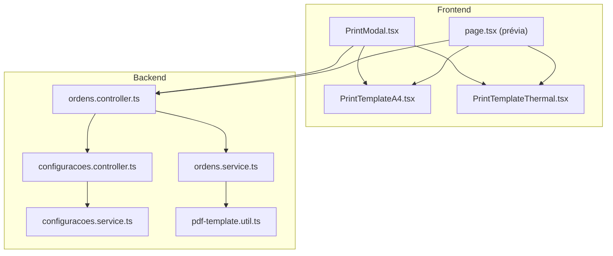
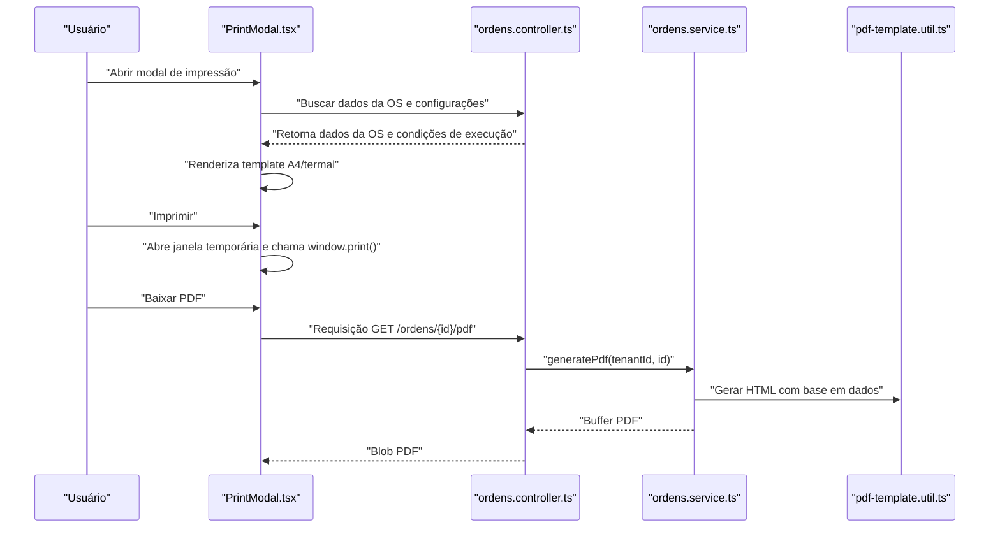
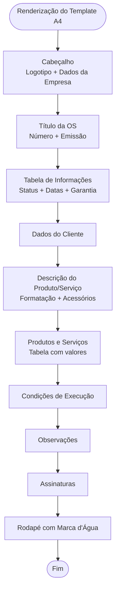
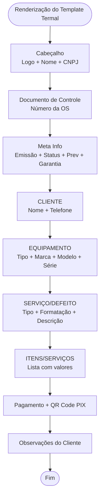
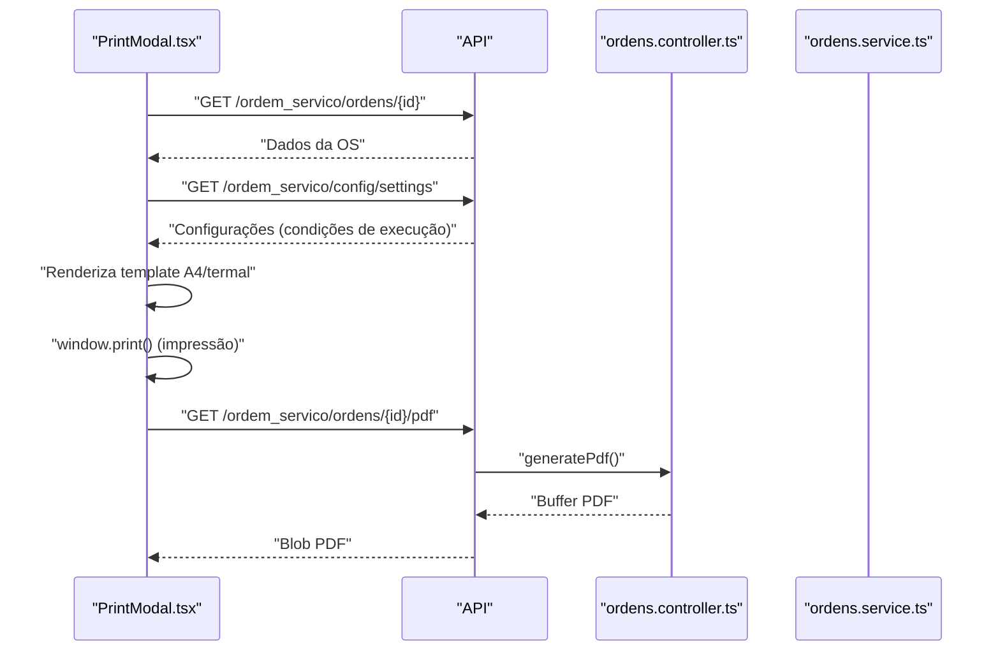
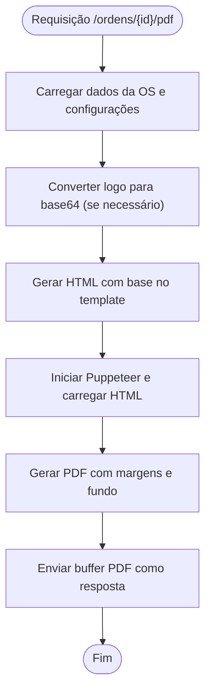
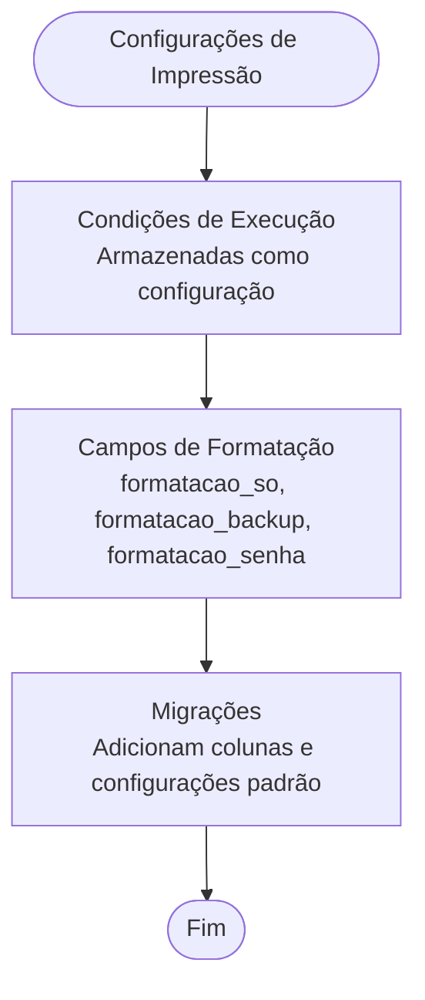
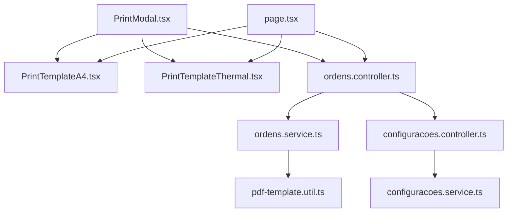

# Personalização de Impressão

<cite>
**Arquivos Referenciados neste Documento**
- [pdf-template.util.ts](file://backend/ordens/pdf-template.util.ts)
- [PrintTemplateA4.tsx](file://frontend/components/PrintTemplateA4.tsx)
- [PrintTemplateThermal.tsx](file://frontend/components/PrintTemplateThermal.tsx)
- [PrintModal.tsx](file://frontend/components/PrintModal.tsx)
- [page.tsx](file://frontend/pages/ordens/print/page.tsx)
- [ordens.controller.ts](file://backend/ordens/ordens.controller.ts)
- [ordens.service.ts](file://backend/ordens/ordens.service.ts)
- [configuracoes.controller.ts](file://backend/configuracoes/configuracoes.controller.ts)
- [configuracoes.service.ts](file://backend/configuracoes/configuracoes.service.ts)
- [003_add_print_fields.sql](file://backend/migrations/003_add_print_fields.sql)
- [004_add_tables_os.sql](file://backend/migrations/004_add_tables_os.sql)
- [template.controller.ts](file://backend/shared/controllers/template.controller.ts)
- [template.service.ts](file://backend/shared/services/template.service.ts)
- [ordem-servico.dto.ts](file://backend/shared/dto/ordem-servico.dto.ts)
</cite>

## Sumário
1. [Introdução](#introdução)
2. [Estrutura do Projeto](#estrutura-do-projeto)
3. [Componentes-Chave](#componentes-chave)
4. [Visão Geral da Arquitetura](#visão-geral-da-arquitetura)
5. [Análise Detalhada dos Componentes](#análise-detalhada-dos-componentes)
6. [Análise de Dependências](#análise-de-dependências)
7. [Considerações de Desempenho](#considerações-de-desempenho)
8. [Guia de Solução de Problemas](#guia-de-solução-de-problemas)
9. [Conclusão](#conclusão)

## Introdução
Este documento apresenta uma visão abrangente do sistema de personalização de impressão do módulo de Ordens de Serviço. Ele explica como os usuários podem customizar layouts de impressão, adicionar marcas d'água, logotipos e informações adicionais, documenta as opções disponíveis nos templates A4 e termal, campos editáveis e configurações de aparência. Além disso, oferece exemplos práticos, boas práticas para manter a legibilidade e eficiência, bem como orientações para criar templates personalizados e manter a integridade do conteúdo durante a impressão.

## Estrutura do Projeto
O sistema de impressão é composto por camadas front-end e back-end que trabalham em conjunto para gerar layouts personalizados e exportar documentos em PDF. As principais partes são:

- Templates de impressão: componentes React que montam o layout visual para A4 e termal.
- Modal de impressão: interface que carrega dados, exibe prévia e permite impressão ou download.
- Backend: serviços que geram PDFs com Puppeteer e disponibilizam APIs para configurações e dados.
- Migrações e configurações: campos de banco de dados e configurações específicas para impressão.

**Diagrama fonte**
- [PrintModal.tsx](file://frontend/components/PrintModal.tsx#L26-L223)
- [PrintTemplateA4.tsx](file://frontend/components/PrintTemplateA4.tsx#L72-L694)
- [PrintTemplateThermal.tsx](file://frontend/components/PrintTemplateThermal.tsx#L10-L273)
- [page.tsx](file://frontend/pages/ordens/print/page.tsx#L50-L277)
- [ordens.controller.ts](file://backend/ordens/ordens.controller.ts#L135-L157)
- [ordens.service.ts](file://backend/ordens/ordens.service.ts#L15-L123)
- [configuracoes.controller.ts](file://backend/configuracoes/configuracoes.controller.ts#L115-L135)
- [configuracoes.service.ts](file://backend/configuracoes/configuracoes.service.ts#L283-L296)
- [pdf-template.util.ts](file://backend/ordens/pdf-template.util.ts#L2-L461)

**Seção fonte**
- [PrintModal.tsx](file://frontend/components/PrintModal.tsx#L26-L223)
- [PrintTemplateA4.tsx](file://frontend/components/PrintTemplateA4.tsx#L72-L694)
- [PrintTemplateThermal.tsx](file://frontend/components/PrintTemplateThermal.tsx#L10-L273)
- [page.tsx](file://frontend/pages/ordens/print/page.tsx#L50-L277)
- [ordens.controller.ts](file://backend/ordens/ordens.controller.ts#L135-L157)
- [ordens.service.ts](file://backend/ordens/ordens.service.ts#L15-L123)
- [configuracoes.controller.ts](file://backend/configuracoes/configuracoes.controller.ts#L115-L135)
- [configuracoes.service.ts](file://backend/configuracoes/configuracoes.service.ts#L283-L296)
- [pdf-template.util.ts](file://backend/ordens/pdf-template.util.ts#L2-L461)

## Componentes-Chave
- Templates de impressão:
  - A4: Layout com cabeçalho, informações da OS, dados do cliente, descrição do serviço, produtos/serviços, condições de execução, observações e assinaturas. Inclui marca d'água no rodapé.
  - Termal: Layout compacto para impressoras térmicas de 80mm, com QR Code PIX, informações resumidas e campos de pagamento.
- Modal de impressão: carrega dados da OS, condições de execução e exibe prévia com opções de impressão e download.
- Backend:
  - Geração de PDF com Puppeteer.
  - APIs para configurações e dados da OS.
  - Migrações que adicionam campos necessários para impressão.

**Seção fonte**
- [PrintTemplateA4.tsx](file://frontend/components/PrintTemplateA4.tsx#L72-L694)
- [PrintTemplateThermal.tsx](file://frontend/components/PrintTemplateThermal.tsx#L10-L273)
- [PrintModal.tsx](file://frontend/components/PrintModal.tsx#L26-L223)
- [ordens.controller.ts](file://backend/ordens/ordens.controller.ts#L135-L157)
- [ordens.service.ts](file://backend/ordens/ordens.service.ts#L15-L123)
- [003_add_print_fields.sql](file://backend/migrations/003_add_print_fields.sql#L1-L24)
- [004_add_tables_os.sql](file://backend/migrations/004_add_tables_os.sql#L34-L44)

## Visão Geral da Arquitetura
O fluxo de impressão segue estas etapas:

1. O usuário abre o modal de impressão e seleciona o formato (A4 ou termal).
2. O modal carrega os dados da OS e as condições de execução.
3. Para impressão direta, o conteúdo é injetado em uma janela temporária e chamado o método de impressão do navegador.
4. Para download em PDF, o backend gera um PDF usando Puppeteer com base em um template HTML gerado dinamicamente.

**Diagrama fonte**
- [PrintModal.tsx](file://frontend/components/PrintModal.tsx#L36-L123)
- [ordens.controller.ts](file://backend/ordens/ordens.controller.ts#L135-L157)
- [ordens.service.ts](file://backend/ordens/ordens.service.ts#L15-L123)
- [pdf-template.util.ts](file://backend/ordens/pdf-template.util.ts#L2-L461)

**Seção fonte**
- [PrintModal.tsx](file://frontend/components/PrintModal.tsx#L36-L123)
- [ordens.controller.ts](file://backend/ordens/ordens.controller.ts#L135-L157)
- [ordens.service.ts](file://backend/ordens/ordens.service.ts#L15-L123)
- [pdf-template.util.ts](file://backend/ordens/pdf-template.util.ts#L2-L461)

## Análise Detalhada dos Componentes

### Template A4
O template A4 organiza o conteúdo em seções com bordas e espaçamento padronizados. Ele inclui:

- Cabeçalho com logotipo, nome da empresa, CNPJ, endereço e contato.
- Título da OS com número e data de emissão.
- Tabela de informações (status, data inicial, data prevista, garantia).
- Dados do cliente.
- Descrição do produto/serviço com campos de formatação.
- Produtos e serviços com valores unitários e totais.
- Condições de execução e observações.
- Assinaturas do atendente e do cliente.
- Rodapé com marca d'água.

**Diagrama fonte**
- [PrintTemplateA4.tsx](file://frontend/components/PrintTemplateA4.tsx#L116-L335)

**Seção fonte**
- [PrintTemplateA4.tsx](file://frontend/components/PrintTemplateA4.tsx#L72-L694)

### Template Termal
O template termal é otimizado para impressoras térmicas de 80mm com:

- Logotipo e informações da empresa.
- Documento de controle com número da OS.
- Informações resumidas de status, previsão e garantia.
- Seção do cliente com nome e telefone.
- Descrição do equipamento com marca, modelo e série.
- Seção de serviço/defeito com campos de formatação.
- Itens/serviços em formato de lista.
- Pagamento com QR Code PIX e valores.
- Observações do cliente.

**Diagrama fonte**
- [PrintTemplateThermal.tsx](file://frontend/components/PrintTemplateThermal.tsx#L76-L271)

**Seção fonte**
- [PrintTemplateThermal.tsx](file://frontend/components/PrintTemplateThermal.tsx#L10-L273)

### Modal de Impressão
O modal de impressão carrega os dados da OS e condições de execução, exibindo a prévia e permitindo:

- Impressão direta via janela temporária.
- Download de PDF através de uma requisição ao backend.
- Controles para cancelar, baixar PDF e imprimir.

**Diagrama fonte**
- [PrintModal.tsx](file://frontend/components/PrintModal.tsx#L36-L143)
- [ordens.controller.ts](file://backend/ordens/ordens.controller.ts#L135-L157)
- [ordens.service.ts](file://backend/ordens/ordens.service.ts#L15-L123)

**Seção fonte**
- [PrintModal.tsx](file://frontend/components/PrintModal.tsx#L26-L223)
- [ordens.controller.ts](file://backend/ordens/ordens.controller.ts#L135-L157)
- [ordens.service.ts](file://backend/ordens/ordens.service.ts#L15-L123)

### Backend: Geração de PDF
O backend gera PDFs usando Puppeteer com base em um HTML construído a partir dos dados da OS e configurações. O processo inclui:

- Busca dos dados da OS e configurações.
- Conversão de logotipo para base64 quando disponível.
- Geração do HTML com o template.
- Criação do PDF com margens e formatação controladas.

**Diagrama fonte**
- [ordens.controller.ts](file://backend/ordens/ordens.controller.ts#L135-L157)
- [ordens.service.ts](file://backend/ordens/ordens.service.ts#L15-L123)
- [pdf-template.util.ts](file://backend/ordens/pdf-template.util.ts#L2-L461)

**Seção fonte**
- [ordens.controller.ts](file://backend/ordens/ordens.controller.ts#L135-L157)
- [ordens.service.ts](file://backend/ordens/ordens.service.ts#L15-L123)
- [pdf-template.util.ts](file://backend/ordens/pdf-template.util.ts#L2-L461)

### Configurações de Impressão
As configurações de impressão incluem:

- Condições de execução: armazenadas como configuração global por tenant e injetadas nos templates.
- Campos de formatação: campos específicos para formatação de equipamentos e senhas.
- Migrações: criação de campos necessários para impressão e configurações padrão.

**Diagrama fonte**
- [configuracoes.controller.ts](file://backend/configuracoes/configuracoes.controller.ts#L115-L135)
- [configuracoes.service.ts](file://backend/configuracoes/configuracoes.service.ts#L283-L296)
- [003_add_print_fields.sql](file://backend/migrations/003_add_print_fields.sql#L1-L24)
- [004_add_tables_os.sql](file://backend/migrations/004_add_tables_os.sql#L34-L44)

**Seção fonte**
- [configuracoes.controller.ts](file://backend/configuracoes/configuracoes.controller.ts#L115-L135)
- [configuracoes.service.ts](file://backend/configuracoes/configuracoes.service.ts#L283-L296)
- [003_add_print_fields.sql](file://backend/migrations/003_add_print_fields.sql#L1-L24)
- [004_add_tables_os.sql](file://backend/migrations/004_add_tables_os.sql#L34-L44)

## Análise de Dependências
O sistema possui dependências claras entre os componentes:

- Frontend:
  - PrintModal.tsx depende de PrintTemplateA4.tsx e PrintTemplateThermal.tsx.
  - page.tsx (prévia) também utiliza os mesmos templates.
  - Ambos fazem requisições à API de ordens e configurações.
- Backend:
  - ordens.controller.ts expõe endpoints para dados e PDF.
  - ordens.service.ts gera PDF com base em pdf-template.util.ts.
  - configurações controller e service gerenciam as configurações de impressão.

**Diagrama fonte**
- [PrintModal.tsx](file://frontend/components/PrintModal.tsx#L14-L15)
- [PrintTemplateA4.tsx](file://frontend/components/PrintTemplateA4.tsx#L72-L694)
- [PrintTemplateThermal.tsx](file://frontend/components/PrintTemplateThermal.tsx#L10-L273)
- [page.tsx](file://frontend/pages/ordens/print/page.tsx#L5-L6)
- [ordens.controller.ts](file://backend/ordens/ordens.controller.ts#L135-L157)
- [ordens.service.ts](file://backend/ordens/ordens.service.ts#L15-L123)
- [pdf-template.util.ts](file://backend/ordens/pdf-template.util.ts#L2-L461)
- [configuracoes.controller.ts](file://backend/configuracoes/configuracoes.controller.ts#L115-L135)
- [configuracoes.service.ts](file://backend/configuracoes/configuracoes.service.ts#L283-L296)

**Seção fonte**
- [PrintModal.tsx](file://frontend/components/PrintModal.tsx#L14-L15)
- [page.tsx](file://frontend/pages/ordens/print/page.tsx#L5-L6)
- [ordens.controller.ts](file://backend/ordens/ordens.controller.ts#L135-L157)
- [ordens.service.ts](file://backend/ordens/ordens.service.ts#L15-L123)
- [pdf-template.util.ts](file://backend/ordens/pdf-template.util.ts#L2-L461)
- [configuracoes.controller.ts](file://backend/configuracoes/configuracoes.controller.ts#L115-L135)
- [configuracoes.service.ts](file://backend/configuracoes/configuracoes.service.ts#L283-L296)

## Considerações de Desempenho
- Geração de PDF com Puppeteer:
  - O serviço inicia o navegador headless, carrega o HTML e gera o PDF com margens controladas.
  - É importante garantir que o ambiente de produção tenha recursos suficientes e que o tempo limite seja adequado.
- Renderização no frontend:
  - Templates A4 e termal utilizam CSS otimizado para impressão, com @media print e @page.
  - Para impressão direta, o modal cria uma janela temporária com os estilos atuais.

[Sem fonte, pois esta seção fornece orientações gerais]

## Guia de Solução de Problemas
- Erro ao carregar dados de impressão:
  - Verifique se as requisições para /ordem_servico/ordens/{id} e /ordem_servico/config/settings estão funcionando.
  - Confirme se o usuário está autenticado e tem permissões para acessar os dados.
- Erro ao gerar PDF:
  - Certifique-se de que o backend consegue acessar o logotipo (se estiver em base64) e que o Puppeteer está instalado e configurado.
  - Verifique se há erros de serialização nos dados da OS.
- Impressão direta não funciona:
  - Confirme que o navegador permite pop-ups e que o método window.print() é chamado corretamente.
  - Verifique se os estilos de impressão (@media print) estão sendo aplicados.

**Seção fonte**
- [PrintModal.tsx](file://frontend/components/PrintModal.tsx#L36-L79)
- [ordens.controller.ts](file://backend/ordens/ordens.controller.ts#L135-L157)
- [ordens.service.ts](file://backend/ordens/ordens.service.ts#L15-L123)

## Conclusão
O sistema de personalização de impressão oferece uma solução robusta e flexível para a geração de layouts A4 e termal, com suporte a marca d'água, logotipos e condições de execução. Com os templates e APIs disponíveis, os usuários podem criar layouts personalizados, manter a consistência visual e garantir a integridade do conteúdo durante a impressão. As boas práticas descritas neste documento ajudam a manter a legibilidade e eficiência, além de padronizar a experiência do usuário.