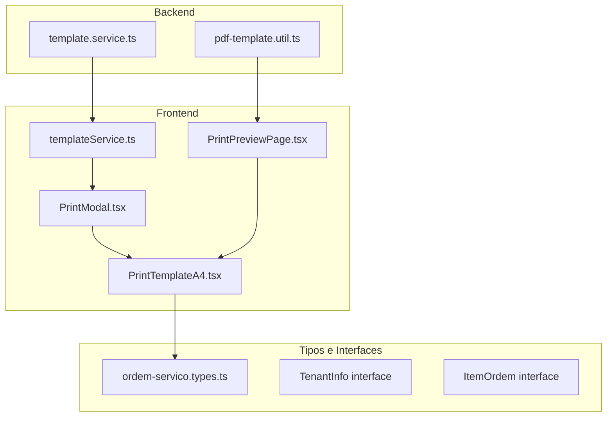
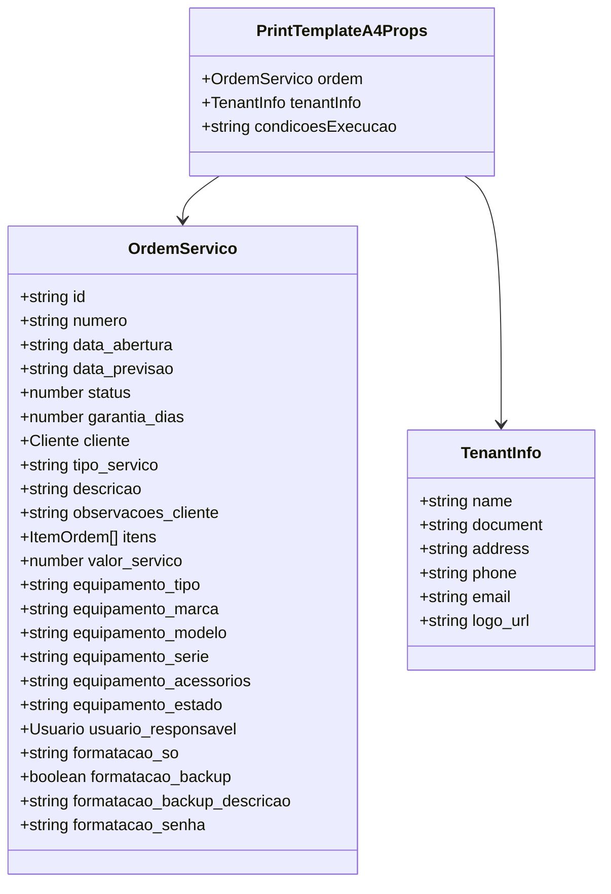
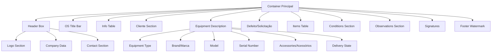
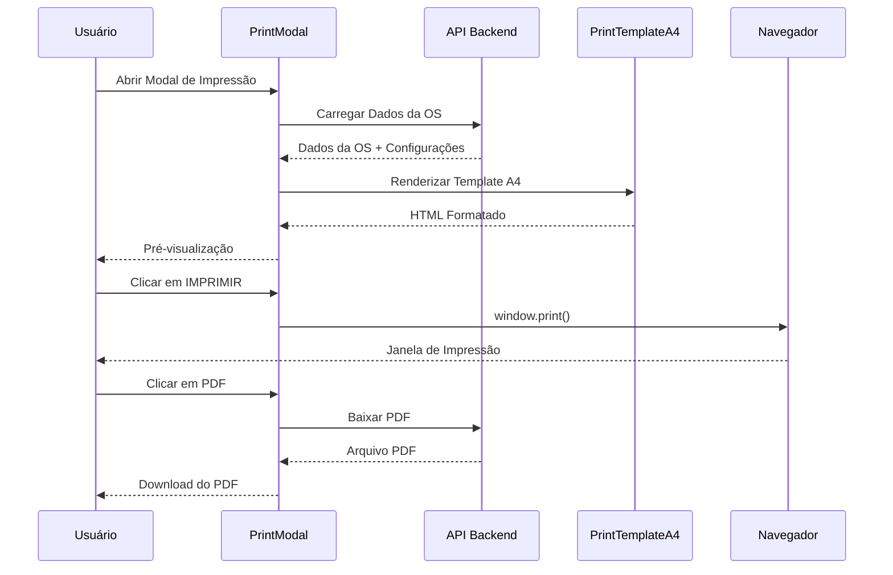
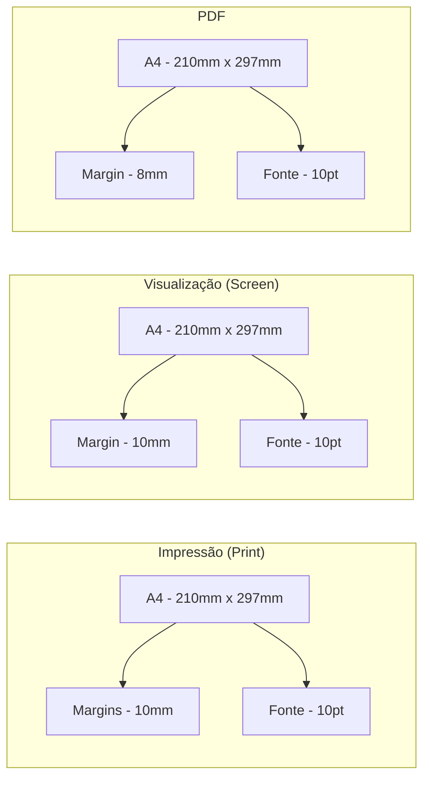

# Templates A4

<cite>
**Arquivos Referenciados Neste Documento**
- [PrintTemplateA4.tsx](file://frontend/components/PrintTemplateA4.tsx)
- [PrintModal.tsx](file://frontend/components/PrintModal.tsx)
- [pdf-template.util.ts](file://backend/ordens/pdf-template.util.ts)
- [ordem-servico.types.ts](file://frontend/types/ordem-servico.types.ts)
- [page.tsx](file://frontend/pages/ordens/print/page.tsx)
- [templateService.ts](file://frontend/services/templateService.ts)
- [template.service.ts](file://backend/shared/services/templateService.ts)
</cite>

## Sumário
- [Introdução](#introdução)
- [Estrutura do Projeto](#estrutura-do-projeto)
- [Componente Principal](#componente-principal)
- [Layout e Design](#layout-e-design)
- [Propriedades e Tipos](#propriedades-e-tipos)
- [Integração com o Modal de Impressão](#integração-com-o-modal-de-impressão)
- [Fluxo de Impressão](#fluxo-de-impressão)
- [Personalização e Adaptação](#personalização-e-adaptação)
- [Dimensionamento e Otimização](#dimensionamento-e-otimização)
- [Exemplos Práticos](#exemplos-práticos)
- [Dicas e Solução de Problemas](#dicas-e-solução-de-problemas)
- [Considerações Técnicas](#considerações-técnicas)

## Introdução

O sistema de impressão do módulo de ordem de serviço oferece um template A4 completo para geração de documentos de impressão profissional. Este template foi projetado para atender às necessidades de impressão de ordens de serviço com formatação adequada para papel A4, incluindo todas as informações relevantes sobre o serviço, cliente, equipamento e itens.

O template A4 implementa uma abordagem moderna de impressão responsiva, utilizando CSS print media queries para garantir que o conteúdo seja formatado corretamente tanto para visualização quanto para impressão física. Ele suporta a geração de duas vias da ordem de serviço, com diferentes layouts para cada via conforme as necessidades legais e operacionais.

## Estrutura do Projeto

O sistema de templates A4 faz parte de um ecossistema maior de impressão que inclui:



**Fonte da Arquitetura**
- [PrintTemplateA4.tsx](file://frontend/components/PrintTemplateA4.tsx#L1-L694)
- [PrintModal.tsx](file://frontend/components/PrintModal.tsx#L1-L223)

## Componente Principal

### PrintTemplateA4 Component

O componente principal é um React functional component que recebe três propriedades principais:



**Fonte da Classe**
- [PrintTemplateA4.tsx](file://frontend/components/PrintTemplateA4.tsx#L55-L59)

### Componente Interno - SingleCopy

O template implementa um componente interno chamado `SingleCopy` que renderiza uma única via da ordem de serviço. Este componente aceita dois parâmetros:

- `isSecondCopy`: Booleano que indica se é a segunda via (com layout diferente)
- `id`: Identificador opcional para facilitar a identificação no processo de geração de PDF

**Fonte do Componente**
- [PrintTemplateA4.tsx](file://frontend/components/PrintTemplateA4.tsx#L114-L335)

## Layout e Design

### Estrutura do Layout A4

O layout A4 segue uma estrutura hierárquica clara com as seguintes seções principais:



**Fonte do Layout**
- [PrintTemplateA4.tsx](file://frontend/components/PrintTemplateA4.tsx#L116-L335)

### Estilos e Media Queries

O template utiliza um sistema de estilos completo com media queries específicas para impressão:

- **Tamanho da Página**: A4 (210mm x 297mm)
- **Margens**: 10mm para impressão, 10mm para visualização
- **Fonte**: Arial, 10pt para impressão, 10pt para tela
- **Cores**: Forçadas para preto (#000) em impressão

**Fonte dos Estilos**
- [PrintTemplateA4.tsx](file://frontend/components/PrintTemplateA4.tsx#L339-L684)

## Propriedades e Tipos

### Tipos de Dados Esperados

O template espera dados estruturados em interfaces bem definidas:

#### Interface OrdemServico

| Propriedade | Tipo | Obrigatório | Descrição |
|-------------|------|-------------|-----------|
| id | string | Sim | Identificador único da ordem de serviço |
| numero | string | Sim | Número sequencial da ordem |
| data_abertura | string | Sim | Data de criação da ordem (formato ISO) |
| data_previsao | string | Não | Data prevista para conclusão |
| status | number | Sim | Status atual da ordem (0-7) |
| garantia_dias | number | Não | Período de garantia em dias |
| cliente | Cliente | Não | Dados do cliente |
| tipo_servico | string | Sim | Tipo de serviço prestado |
| descricao | string | Sim | Descrição detalhada do serviço |
| observacoes_cliente | string | Não | Observações do cliente |
| itens | ItemOrdem[] | Não | Lista de itens/serviços |
| valor_servico | number | Sim | Valor total do serviço |
| equipamento_tipo | string | Não | Tipo de equipamento |
| equipamento_marca | string | Não | Marca do equipamento |
| equipamento_modelo | string | Não | Modelo do equipamento |
| equipamento_serie | string | Não | Número de série |
| equipamento_acessorios | string | Não | Acessórios incluídos |
| equipamento_estado | string | Não | Estado de entrega |
| usuario_responsavel | Usuario | Não | Usuário responsável |
| formatacao_so | string | Não | Sistema operacional |
| formatacao_backup | boolean | Não | Backup realizado |
| formatacao_backup_descricao | string | Não | Descrição do backup |
| formatacao_senha | string | Não | Senha de acesso |

#### Interface TenantInfo

| Propriedade | Tipo | Obrigatório | Descrição |
|-------------|------|-------------|-----------|
| name | string | Sim | Nome da empresa |
| document | string | Não | CNPJ/CPF |
| address | string | Não | Endereço completo |
| phone | string | Não | Telefone de contato |
| email | string | Não | Email de contato |
| logo_url | string | Não | URL da logo |

**Fonte dos Tipos**
- [PrintTemplateA4.tsx](file://frontend/components/PrintTemplateA4.tsx#L5-L59)
- [ordem-servico.types.ts](file://frontend/types/ordem-servico.types.ts#L3-L48)

## Integração com o Modal de Impressão

### PrintModal Component

O PrintModal é um componente de diálogo que fornece a interface para pré-visualização e impressão de ordens de serviço:



**Fonte do Fluxo**
- [PrintModal.tsx](file://frontend/components/PrintModal.tsx#L26-L223)

### Carregamento de Dados

O modal carrega dados de forma assíncrona usando Promise.all para otimizar o tempo de carregamento:

1. **Dados da Ordem de Serviço**: `/api/ordem_servico/ordens/{ordemId}`
2. **Configurações do Sistema**: `/api/ordem_servico/config/settings`

**Fonte do Carregamento**
- [PrintModal.tsx](file://frontend/components/PrintModal.tsx#L50-L79)

## Fluxo de Impressão

### Processo de Impressão Completo

```mermaid
flowchart TD
A[Usuário Solicita Impressão] --> B[PrintModal Abre]
B --> C[Carregar Dados da OS]
C --> D[Gerar HTML do Template]
D --> E[Renderizar Pré-visualização]
E --> F{Opção do Usuário}
F --> |Imprimir| G[window.print()]
F --> |PDF| H[Baixar PDF do Backend]
G --> I[Janela de Impressão Abre]
I --> J[Impressora Selecionada]
J --> K[Documento Impresso]
H --> L[PDF Gerado]
L --> M[Download Iniciado]
M --> N[Arquivo Salvo]
```

**Fonte do Fluxo**
- [PrintModal.tsx](file://frontend/components/PrintModal.tsx#L81-L143)

### Geração de PDF

O sistema oferece duas opções para geração de PDF:

1. **Modal de Impressão**: Gera PDF diretamente do conteúdo renderizado
2. **Página de Pré-visualização**: Gera PDF através do backend

**Fonte da Geração**
- [page.tsx](file://frontend/pages/ordens/print/page.tsx#L142-L179)

## Personalização e Adaptação

### Campos Personalizáveis

O template A4 permite personalização em vários níveis:

#### 1. Informações da Empresa
- Logo da empresa (se disponível)
- Nome fantasia
- CNPJ/CPF
- Endereço completo
- Telefone e email

#### 2. Conteúdo da Ordem de Serviço
- Dados do cliente
- Descrição do equipamento
- Itens/serviços
- Valores e quantidades
- Observações

#### 3. Layout e Estilos
- Cores e tipografia
- Margens e espaçamentos
- Quebras de página

### Exemplos de Personalização

#### Personalizando Informações da Empresa
```typescript
const tenantInfo = {
    name: "Minha Empresa LTDA",
    document: "12.345.678/0001-90",
    address: "Av. Principal, 1000 - São Paulo/SP",
    phone: "(11) 99999-9999",
    email: "contato@minhaempresa.com.br",
    logo_url: "/uploads/logo.png"
};
```

#### Adicionando Informações Especiais
```typescript
const customConditions = `
    <p><strong>Termos e Condições:</strong></p>
    <ul>
        <li>Este serviço está sujeito à garantia de 30 dias</li>
        <li>Equipamentos devem ser retirados dentro de 30 dias</li>
        <li>Peças danificadas durante o transporte são de responsabilidade do cliente</li>
    </ul>
`;
```

**Fonte da Personalização**
- [PrintTemplateA4.tsx](file://frontend/components/PrintTemplateA4.tsx#L116-L335)

## Dimensionamento e Otimização

### Dimensionamento para Impressão

O template foi otimizado para diferentes formatos de saída:



**Fonte do Dimensionamento**
- [PrintTemplateA4.tsx](file://frontend/components/PrintTemplateA4.tsx#L341-L376)

### Otimizações de Impressão

#### Media Queries Específicas
- **@media print**: Configurações para impressão real
- **@media screen**: Configurações para visualização
- **@media print and (max-width: 210mm)**: Otimização específica para A4

#### Forçar Cores e Estilos
- Cores forçadas para preto (#000)
- Estilos de impressão ativados
- Remoção de elementos desnecessários

**Fonte das Otimizações**
- [PrintTemplateA4.tsx](file://frontend/components/PrintTemplateA4.tsx#L347-L354)

## Exemplos Práticos

### Exemplo 1: Impressão Básica

Para imprimir uma ordem de serviço básica:

```typescript
// Componente de chamada
<PrintTemplateA4
    ordem={ordemData}
    tenantInfo={tenantInfo}
    condicoesExecucao={condicoes}
/>
```

### Exemplo 2: Integração com Modal

```typescript
// Modal de impressão
<PrintModal
    isOpen={modalOpen}
    onClose={() => setModalOpen(false)}
    ordemId={ordemId}
    format="a4"
/>
```

### Exemplo 3: Personalização Avançada

```typescript
// Dados personalizados
const customTenantInfo = {
    ...defaultTenantInfo,
    name: "Empresa Personalizada",
    logo_url: "/custom-logo.png"
};

const customConditions = `
    <h3>Termos Personalizados</h3>
    <p>Esta ordem de serviço inclui condições especiais...</p>
`;

<PrintTemplateA4
    ordem={ordemData}
    tenantInfo={customTenantInfo}
    condicoesExecucao={customConditions}
/>
```

**Fonte dos Exemplos**
- [PrintTemplateA4.tsx](file://frontend/components/PrintTemplateA4.tsx#L72-L694)
- [PrintModal.tsx](file://frontend/components/PrintModal.tsx#L182-L187)

## Dicas e Solução de Problemas

### Dicas para Melhor Aparência Visual

#### 1. Otimização de Imagens
- Use imagens com tamanho máximo de 130x55px
- Preferencialmente em formato PNG transparente
- Evite imagens muito pesadas

#### 2. Formatação de Textos
- Use `dangerouslySetInnerHTML` com cuidado
- Evite tags HTML complexas em descrições
- Mantenha textos resumidos e claros

#### 3. Layout Responsivo
- O template já é responsivo para A4
- Evite adicionar elementos que quebrem o layout
- Teste a impressão antes de enviar

### Solução de Problemas Comuns

#### Problema: Textos cortados na impressão
**Solução**: Verifique as margens e tamanho da fonte
- As margens estão configuradas em 10mm
- Fonte padrão é 10pt

#### Problema: Imagens não aparecem
**Solução**: Verifique o caminho da logo
- Use URLs absolutas
- Confirme que o arquivo existe

#### Problema: Layout quebrado em PDF
**Solução**: Verifique o CSS de impressão
- Todos os elementos têm estilo de impressão
- Cores são forçadas para preto

**Fonte das Soluções**
- [PrintTemplateA4.tsx](file://frontend/components/PrintTemplateA4.tsx#L431-L435)

## Considerações Técnicas

### Segurança e Validação

O template implementa várias medidas de segurança:

#### Validação de HTML
- Função `isHtmlEmpty` para verificar conteúdo vazio
- Tratamento seguro de conteúdo HTML
- Evita injeção de scripts maliciosos

#### Formatação de Dados
- Validação de CPF/CNPJ
- Formatação de moeda e datas
- Tratamento de valores nulos

**Fonte da Segurança**
- [PrintTemplateA4.tsx](file://frontend/components/PrintTemplateA4.tsx#L90-L112)

### Performance

#### Otimizações Implementadas
- Componente funcional sem estado interno
- Estilos inline para melhor desempenho
- Media queries otimizadas
- Carregamento assíncrono de dados

#### Recursos de Memória
- Componente limpo após desmontagem
- Estilos removidos automaticamente
- Nenhum estado persistente

**Fonte da Performance**
- [PrintTemplateA4.tsx](file://frontend/components/PrintTemplateA4.tsx#L1-L694)

### Compatibilidade

#### Navegadores Suportados
- Chrome, Firefox, Safari, Edge
- Versões modernas de todos os navegadores
- Funciona com impressoras padrão

#### Limitações Conhecidas
- Navegadores muito antigos podem ter problemas
- Impressoras HP com drivers desatualizados
- Configurações de impressão personalizadas

### Manutenção e Atualização

#### Estrutura de Código
- Componente funcional e modular
- Tipagem TypeScript completa
- Estilos separados do conteúdo
- Fácil de manter e atualizar

#### Melhores Práticas
- Manter os dados organizados
- Atualizar as interfaces quando necessário
- Testar após qualquer alteração
- Documentar mudanças importantes

---

**Fonte Final**
- [PrintTemplateA4.tsx](file://frontend/components/PrintTemplateA4.tsx#L1-L694)
- [PrintModal.tsx](file://frontend/components/PrintModal.tsx#L1-L223)
- [pdf-template.util.ts](file://backend/ordens/pdf-template.util.ts#L1-L462)
- [ordem-servico.types.ts](file://frontend/types/ordem-servico.types.ts#L1-L235)
- [page.tsx](file://frontend/pages/ordens/print/page.tsx#L1-L277)
- [templateService.ts](file://frontend/services/templateService.ts#L1-L146)
- [template.service.ts](file://backend/shared/services/templateService.ts#L1-L104)