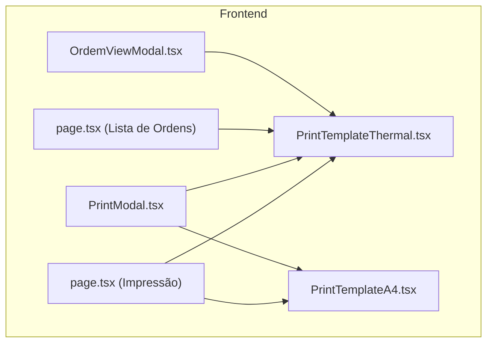
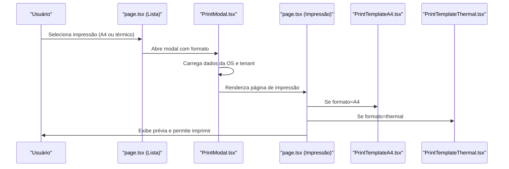
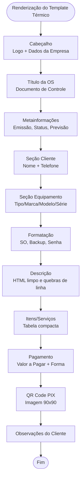
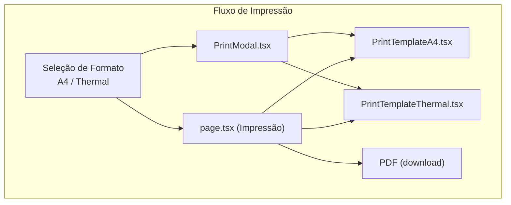
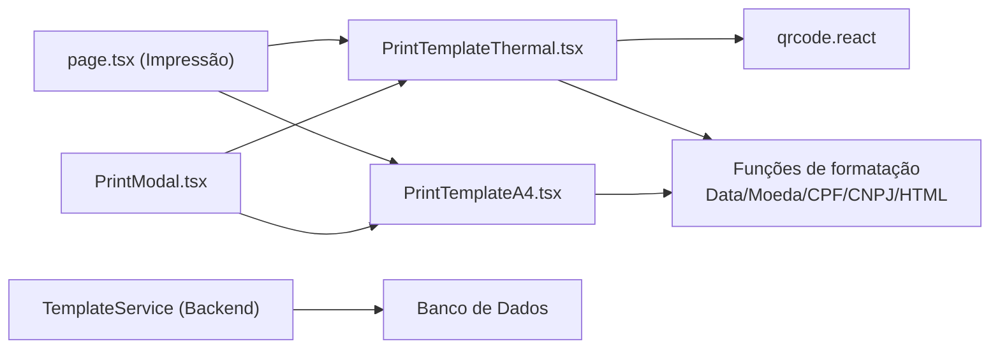

# Templates Termal

<cite>
**Arquivos referenciados neste documento**
- [PrintTemplateThermal.tsx](file://frontend/components/PrintTemplateThermal.tsx)
- [PrintTemplateA4.tsx](file://frontend/components/PrintTemplateA4.tsx)
- [PrintModal.tsx](file://frontend/components/PrintModal.tsx)
- [page.tsx (Impressão)](file://frontend/pages/ordens/print/page.tsx)
- [page.tsx (Lista de Ordens)](file://frontend/pages/ordens/page.tsx)
- [OrdemViewModal.tsx](file://frontend/components/OrdemViewModal.tsx)
- [templateService.ts](file://frontend/services/templateService.ts)
- [template.service.ts](file://backend/shared/services/template.service.ts)
- [003_add_print_fields.sql](file://backend/migrations/003_add_print_fields.sql)
</cite>

## Sumário
1. [Introdução](#introdução)
2. [Estrutura do Projeto](#estrutura-do-projeto)
3. [Componentes-Chave](#componentes-chave)
4. [Visão Geral da Arquitetura](#visão-geral-da-arquitetura)
5. [Análise Detalhada dos Componentes](#análise-detalhada-dos-componentes)
6. [Análise de Dependências](#análise-de-dependências)
7. [Considerações de Desempenho](#considerações-de-desempenho)
8. [Guia de Solução de Problemas](#guia-de-solução-de-problemas)
9. [Conclusão](#conclusão)

## Introdução
Este documento apresenta uma documentação abrangente sobre os templates de impressão térmica do módulo de ordens de serviço. Ele explica a implementação do componente PrintTemplateThermal.tsx, suas especificidades em relação aos templates A4, campos utilizados, formatação adequada para impressoras térmicas, e diferenciais técnicos como largura de papel, densidade de impressão e compatibilidade com modelos diversos. Também inclui orientações práticas para configuração, personalização de layouts, integração com o fluxo de impressão e resolução de problemas comuns.

## Estrutura do Projeto
O módulo de impressão é composto por dois templates principais:
- Template A4: Layout completo com cabeçalho, informações do cliente, equipamento, descrição, itens/serviços, condições de execução, observações e assinaturas.
- Template Térmico: Layout compacto otimizado para papel de 80mm, com foco em informações essenciais, QR Code PIX e campos adaptados para impressoras térmicas.

Ambos são consumidos por componentes de visualização e modal de impressão, e integrados ao fluxo de navegação da página de impressão.

**Diagrama fonte**
- [page.tsx (Impressão)](file://frontend/pages/ordens/print/page.tsx#L228-L242)
- [PrintModal.tsx](file://frontend/components/PrintModal.tsx#L170-L184)
- [PrintTemplateA4.tsx](file://frontend/components/PrintTemplateA4.tsx#L72-L693)
- [PrintTemplateThermal.tsx](file://frontend/components/PrintTemplateThermal.tsx#L10-L272)
- [page.tsx (Lista de Ordens)](file://frontend/pages/ordens/page.tsx#L561-L580)
- [OrdemViewModal.tsx](file://frontend/components/OrdemViewModal.tsx#L124-L132)

**Seção fonte**
- [page.tsx (Impressão)](file://frontend/pages/ordens/print/page.tsx#L228-L242)
- [PrintModal.tsx](file://frontend/components/PrintModal.tsx#L170-L184)
- [PrintTemplateA4.tsx](file://frontend/components/PrintTemplateA4.tsx#L72-L693)
- [PrintTemplateThermal.tsx](file://frontend/components/PrintTemplateThermal.tsx#L10-L272)
- [page.tsx (Lista de Ordens)](file://frontend/pages/ordens/page.tsx#L561-L580)
- [OrdemViewModal.tsx](file://frontend/components/OrdemViewModal.tsx#L124-L132)

## Componentes-Chave
- PrintTemplateThermal.tsx: Componente principal para impressão térmica, com formatação otimizada para 80mm, QR Code PIX, campos de cliente, equipamento, descrição, itens e valores.
- PrintTemplateA4.tsx: Template completo para impressão A4, com tabelas, seções e assinaturas.
- PrintModal.tsx: Modal de prévia de impressão com suporte a ambos os formatos.
- page.tsx (Impressão): Página de visualização de impressão com configurações de @media print e botões de ação.
- page.tsx (Lista de Ordens): Menu de opções de impressão com escolha entre A4 e térmico.
- OrdemViewModal.tsx: Botão de impressão térmica com indicação de largura 80mm.

**Seção fonte**
- [PrintTemplateThermal.tsx](file://frontend/components/PrintTemplateThermal.tsx#L10-L272)
- [PrintTemplateA4.tsx](file://frontend/components/PrintTemplateA4.tsx#L72-L693)
- [PrintModal.tsx](file://frontend/components/PrintModal.tsx#L26-L184)
- [page.tsx (Impressão)](file://frontend/pages/ordens/print/page.tsx#L228-L276)
- [page.tsx (Lista de Ordens)](file://frontend/pages/ordens/page.tsx#L561-L580)
- [OrdemViewModal.tsx](file://frontend/components/OrdemViewModal.tsx#L124-L132)

## Visão Geral da Arquitetura
O fluxo de impressão segue os seguintes passos:
1. O usuário seleciona o formato (A4 ou térmico) nas páginas de visualização.
2. O componente de modal ou página carrega os dados da ordem e informações do tenant.
3. O template apropriado é renderizado com base no formato selecionado.
4. As regras de @media print ajustam a página e o layout para impressão.

**Diagrama fonte**
- [page.tsx (Lista de Ordens)](file://frontend/pages/ordens/page.tsx#L561-L580)
- [PrintModal.tsx](file://frontend/components/PrintModal.tsx#L26-L184)
- [page.tsx (Impressão)](file://frontend/pages/ordens/print/page.tsx#L228-L276)
- [PrintTemplateA4.tsx](file://frontend/components/PrintTemplateA4.tsx#L72-L693)
- [PrintTemplateThermal.tsx](file://frontend/components/PrintTemplateThermal.tsx#L10-L272)

## Análise Detalhada dos Componentes

### PrintTemplateThermal.tsx
- Propósitos:
  - Renderizar um documento de impressão térmica com largura fixa de 80mm.
  - Incluir informações essenciais: cabeçalho com logo e dados da empresa, título da OS, metainformações (abertura, status, previsão), cliente, equipamento, descrição, itens/serviços, valores, QR Code PIX e observações.
- Formatação:
  - Fonte pequena e espaçamento apertado para maximizar conteúdo em 80mm.
  - Estilo @media print que define a largura e remove margens e bordas.
- Campos utilizados:
  - Dados da OS: número, data de abertura, status, data prevista, garantia em dias, valor de serviço, chave PIX.
  - Dados do cliente: nome e telefone principal.
  - Equipamento: tipo, marca, modelo, série, acessórios e estado.
  - Formatação: sistema operacional, backup, senha.
  - Itens: descrição, quantidade, valor unitário e total.
  - Observações do cliente.
- QR Code:
  - Geração de QR Code PIX com qrcode.react, com tamanho 90px e nível de correção M.

**Diagrama fonte**
- [PrintTemplateThermal.tsx](file://frontend/components/PrintTemplateThermal.tsx#L76-L272)

**Seção fonte**
- [PrintTemplateThermal.tsx](file://frontend/components/PrintTemplateThermal.tsx#L10-L272)

### PrintTemplateA4.tsx
- Propósitos:
  - Fornecer um template completo para impressão A4 com seções estruturadas e tabelas.
- Formatação:
  - Layout com @media print que define A4, márgens e cores exatas.
  - Estilização com classes CSS para cabeçalhos, tabelas e seções.
- Campos utilizados:
  - Idênticos aos do template térmico, com variação de apresentação e uso de tabelas.

**Seção fonte**
- [PrintTemplateA4.tsx](file://frontend/components/PrintTemplateA4.tsx#L72-L693)

### PrintModal.tsx
- Propósitos:
  - Modal de prévia de impressão com suporte a ambos os formatos.
  - Carregamento assíncrono de dados da OS e tenant.
  - Renderização condicional do template A4 ou térmico com base no formato.
- Integração:
  - Utiliza a API para buscar dados e montar o conteúdo antes de renderizar.

**Seção fonte**
- [PrintModal.tsx](file://frontend/components/PrintModal.tsx#L26-L184)

### page.tsx (Impressão)
- Propósitos:
  - Página de visualização de impressão com botões de ação (imprimir, download PDF).
  - Aplicação de regras de @media print para formatar a página conforme o formato selecionado.
- Fluxo:
  - Carrega dados da OS e tenant.
  - Renderiza o template correspondente ao formato (thermal/A4).
  - Aplica estilo @media print para margem e tamanho.

**Seção fonte**
- [page.tsx (Impressão)](file://frontend/pages/ordens/print/page.tsx#L228-L276)

### page.tsx (Lista de Ordens)
- Propósitos:
  - Menu de impressão com opções A4 e térmico.
  - Definição do formato atual (a4/thermal) e chamada das funções de impressão.

**Seção fonte**
- [page.tsx (Lista de Ordens)](file://frontend/pages/ordens/page.tsx#L561-L580)

### OrdemViewModal.tsx
- Propósitos:
  - Botão de impressão térmica com indicação de largura 80mm.
  - Integração com o fluxo de visualização de ordem.

**Seção fonte**
- [OrdemViewModal.tsx](file://frontend/components/OrdemViewModal.tsx#L124-L132)

## Visão Geral da Arquitetura
A seguir, o diagrama mostra a interação entre os componentes responsáveis pela impressão térmica e A4, incluindo a paginação e a geração de PDF.

**Diagrama fonte**
- [page.tsx (Impressão)](file://frontend/pages/ordens/print/page.tsx#L228-L276)
- [PrintModal.tsx](file://frontend/components/PrintModal.tsx#L170-L184)
- [PrintTemplateA4.tsx](file://frontend/components/PrintTemplateA4.tsx#L72-L693)
- [PrintTemplateThermal.tsx](file://frontend/components/PrintTemplateThermal.tsx#L10-L272)

## Análise de Dependências
- Frontend:
  - PrintTemplateThermal.tsx depende de qrcode.react para geração do QR Code PIX.
  - page.tsx (Impressão) e PrintModal.tsx dependem de componentes de UI e da API para carregar dados.
  - Ambos os templates compartilham funções de formatação (data, moeda, CPF/CNPJ) e utilitários de limpeza de HTML.
- Backend:
  - Serviços de template permitem gerenciar templates personalizados (criação, atualização, exclusão).
  - Migrações incluem campos relacionados à impressão, como chave PIX e campos de formatação.

**Diagrama fonte**
- [PrintTemplateThermal.tsx](file://frontend/components/PrintTemplateThermal.tsx#L1-L272)
- [PrintTemplateA4.tsx](file://frontend/components/PrintTemplateA4.tsx#L72-L693)
- [page.tsx (Impressão)](file://frontend/pages/ordens/print/page.tsx#L228-L276)
- [PrintModal.tsx](file://frontend/components/PrintModal.tsx#L26-L184)
- [template.service.ts](file://backend/shared/services/template.service.ts#L1-L104)

**Seção fonte**
- [PrintTemplateThermal.tsx](file://frontend/components/PrintTemplateThermal.tsx#L1-L272)
- [PrintTemplateA4.tsx](file://frontend/components/PrintTemplateA4.tsx#L72-L693)
- [page.tsx (Impressão)](file://frontend/pages/ordens/print/page.tsx#L228-L276)
- [PrintModal.tsx](file://frontend/components/PrintModal.tsx#L26-L184)
- [template.service.ts](file://backend/shared/services/template.service.ts#L1-L104)

## Considerações de Desempenho
- Tamanho de papel e densidade:
  - O template térmico foi projetado para papel de 80mm. Evite aumentar o tamanho da fonte ou adicionar elementos muito grandes, pois podem ultrapassar a largura disponível.
  - A densidade de impressão (dpi) varia entre impressoras térmicas. Para garantir legibilidade, utilize fontes com pesos médios e evite negritos excessivos.
- Imagens:
  - O uso de imagens (logo) deve ser otimizado. Reduza o tamanho do arquivo e o tamanho exibido para evitar sobrecarga de processamento.
- QR Code:
  - O QR Code PIX é renderizado como SVG. Mantenha o tamanho recomendado (90px) para leitura adequada em diferentes impressoras.
- Layout:
  - O uso de @media print garante que a largura seja fixa em 80mm e as margens sejam zero, o que melhora a consistência da impressão.

[Sem seção fonte, pois esta seção fornece orientações gerais]

## Guia de Solução de Problemas
- Problema: Conteúdo cortado ou fora da margem ao imprimir.
  - Verifique se o formato está definido como thermal (@page size 80mm auto) e se as margens estão zeradas.
  - Confirme que a largura máxima do container esteja em 80mm.
- Problema: QR Code não reconhecido.
  - Certifique-se de que o campo de chave PIX esteja preenchido e que o QR Code esteja dentro do espaço alocado.
  - Teste com diferentes impressoras térmicas para validar a leitura.
- Problema: Imagem do logo não aparece.
  - Valide o campo logo_url e verifique se a URL é acessível.
  - Em fallback, o componente tenta carregar a imagem como base64; verifique erros de rede.
- Problema: Dados incompletos no template.
  - Confirme que todos os campos obrigatórios estejam presentes nos dados carregados (cliente, equipamento, itens, valores).
- Problema: Layout A4 diferente do esperado.
  - Revise as regras de @media print e as classes CSS aplicadas ao template A4.

**Seção fonte**
- [page.tsx (Impressão)](file://frontend/pages/ordens/print/page.tsx#L244-L273)
- [PrintTemplateThermal.tsx](file://frontend/components/PrintTemplateThermal.tsx#L76-L272)
- [PrintModal.tsx](file://frontend/components/PrintModal.tsx#L45-L184)

## Conclusão
O sistema oferece templates de impressão otimizados para ambos os formatos: A4 e térmico. O template térmico foi desenvolvido com foco em eficiência espacial e legibilidade em papel de 80mm, incluindo QR Code PIX e campos essenciais. A integração com os componentes de visualização e modal garante uma experiência fluida, enquanto as regras de @media print asseguram consistência na impressão. Para melhor desempenho, siga as recomendações de formatação e validação de dados.

[Sem seção fonte, pois esta seção resume sem analisar arquivos específicos]