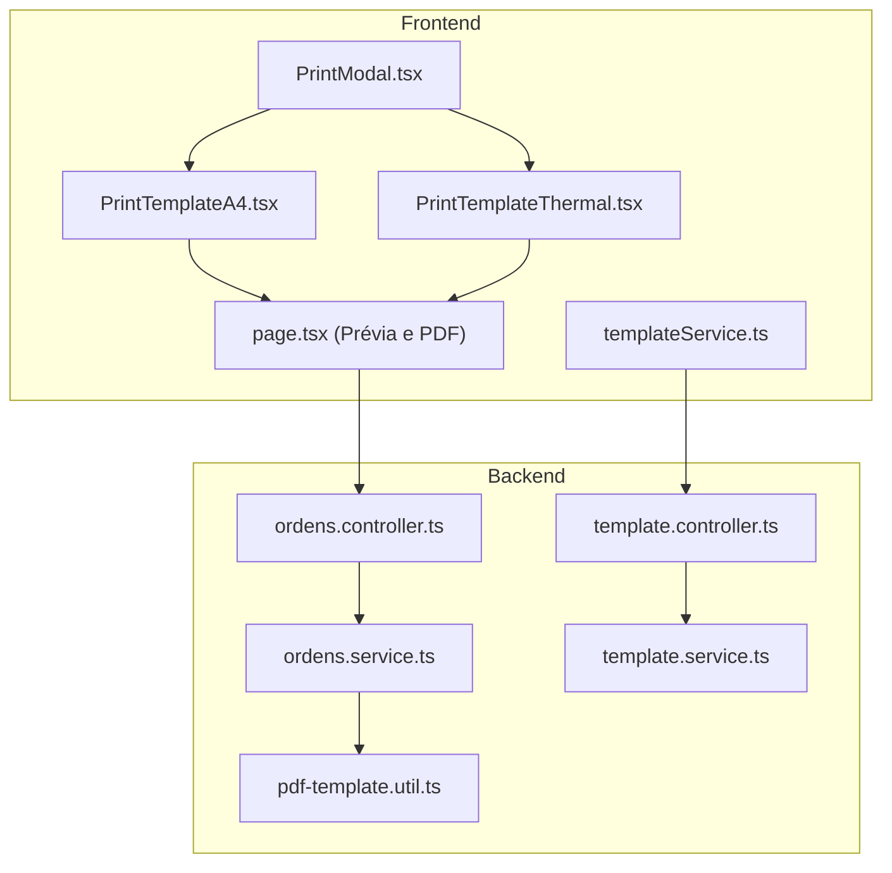
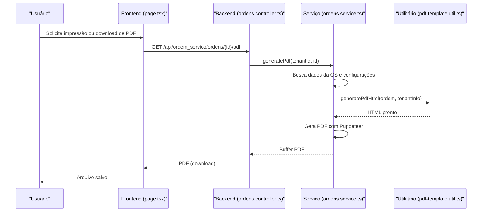
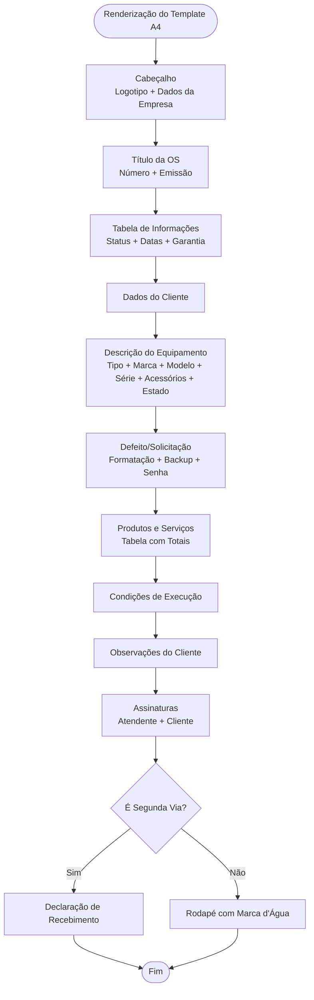
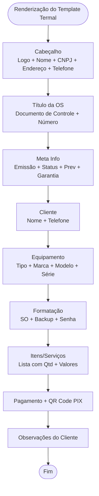
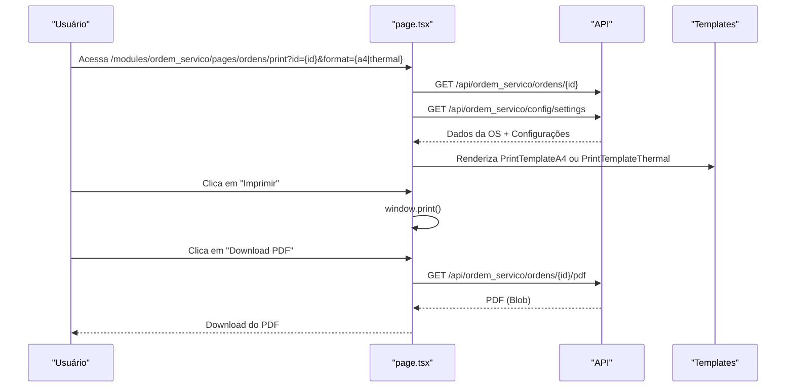
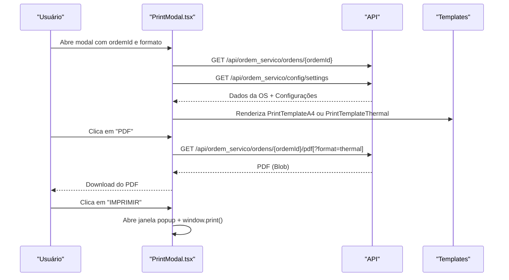
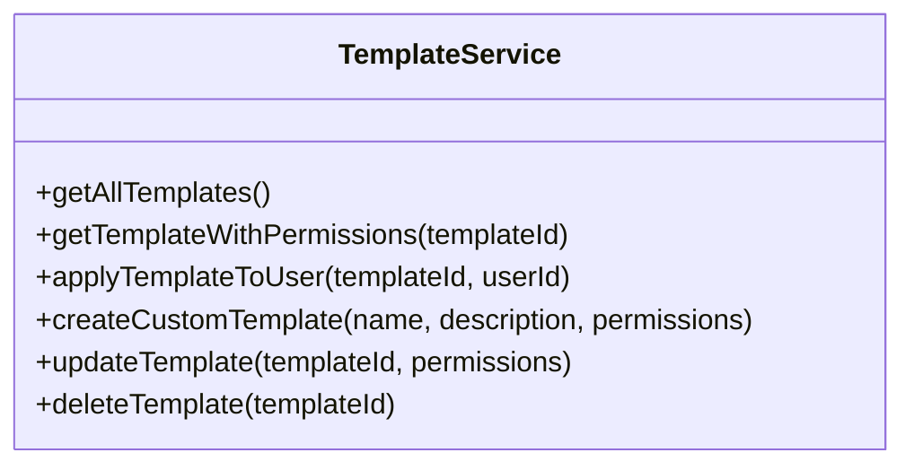
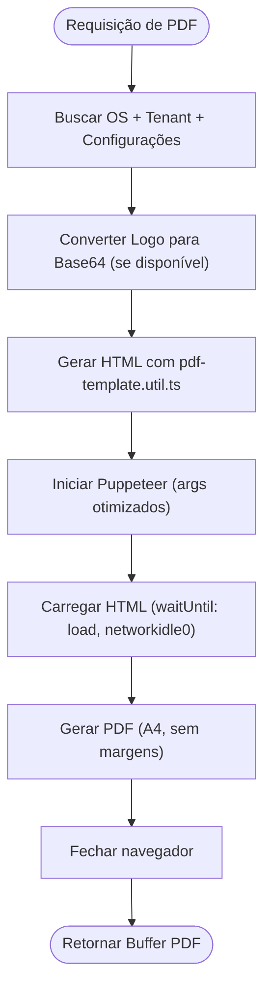
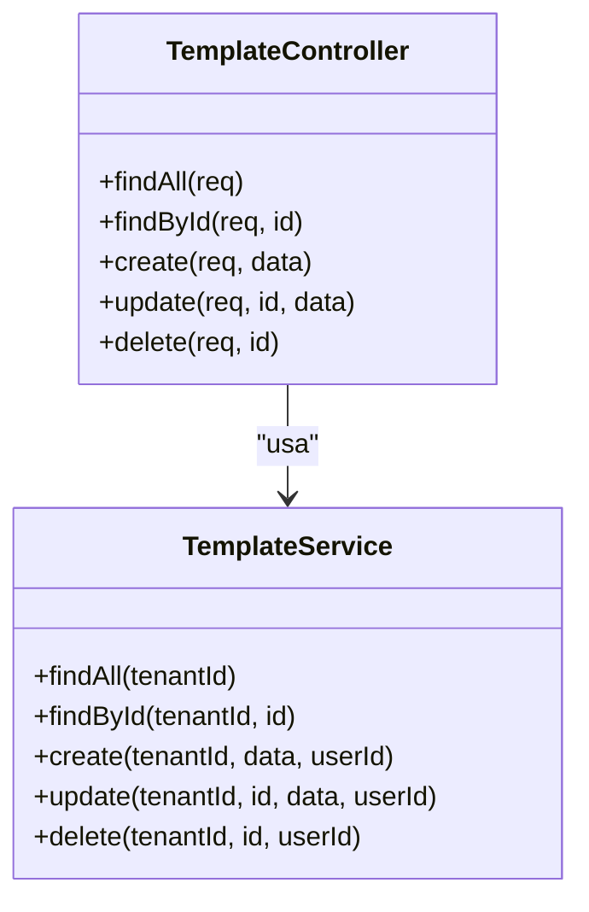
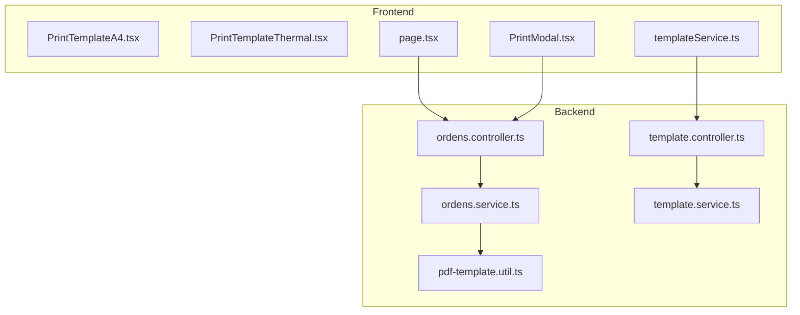

# Templates de Impressão

<cite>
**Arquivos referenciados neste documento**
- [PrintTemplateA4.tsx](file://frontend/components/PrintTemplateA4.tsx)
- [PrintTemplateThermal.tsx](file://frontend/components/PrintTemplateThermal.tsx)
- [page.tsx](file://frontend/pages/ordens/print/page.tsx)
- [PrintModal.tsx](file://frontend/components/PrintModal.tsx)
- [templateService.ts](file://frontend/services/templateService.ts)
- [pdf-template.util.ts](file://backend/ordens/pdf-template.util.ts)
- [ordens.controller.ts](file://backend/ordens/ordens.controller.ts)
- [ordens.service.ts](file://backend/ordens/ordens.service.ts)
- [template.controller.ts](file://backend/shared/controllers/template.controller.ts)
- [template.service.ts](file://backend/shared/services/template.service.ts)
- [003_add_print_fields.sql](file://backend/migrations/003_add_print_fields.sql)
- [004_add_tables_os.sql](file://backend/migrations/004_add_tables_os.sql)
- [seeds_os.sql](file://backend/seeds/seeds_os.sql)
</cite>

## Sumário
1. [Introdução](#introdução)
2. [Estrutura do Projeto](#estrutura-do-projeto)
3. [Componentes Principais](#componentes-principais)
4. [Visão Geral da Arquitetura](#visão-geral-da-arquitetura)
5. [Análise Detalhada dos Componentes](#análise-detalhada-dos-componentes)
6. [Análise de Dependências](#análise-de-dependências)
7. [Considerações de Desempenho](#considerações-de-desempenho)
8. [Guia de Solução de Problemas](#guia-de-solução-de-problemas)
9. [Conclusão](#conclusão)

## Introdução
Este documento apresenta uma visão abrangente dos templates de impressão do módulo de ordem de serviço. Ele explica como são implementados os templates A4 e termal, como personalizar layouts, como gerar PDFs e quais são as interfaces de geração de documentos. Também mostra como os templates são utilizados nas ordens de serviço e quais são os padrões de personalização. O conteúdo foi elaborado para ser acessível para iniciantes e oferecer profundidade técnica para desenvolvedores experientes.

## Estrutura do Projeto
O sistema de templates de impressão é composto por camadas front-end e back-end:

- Front-end: componentes React que montam os templates A4 e termal, interfaces de prévia e download de PDF, e serviços para chamadas à API.
- Back-end: controladores e serviços que geram PDFs com Puppeteer, armazenam e manipulam templates personalizados, e fornecem dados de configuração.

**Diagrama fonte**
- [PrintTemplateA4.tsx](file://frontend/components/PrintTemplateA4.tsx#L1-L694)
- [PrintTemplateThermal.tsx](file://frontend/components/PrintTemplateThermal.tsx#L1-L273)
- [page.tsx](file://frontend/pages/ordens/print/page.tsx#L1-L277)
- [PrintModal.tsx](file://frontend/components/PrintModal.tsx#L1-L223)
- [templateService.ts](file://frontend/services/templateService.ts#L1-L146)
- [ordens.controller.ts](file://backend/ordens/ordens.controller.ts#L135-L157)
- [ordens.service.ts](file://backend/ordens/ordens.service.ts#L16-L123)
- [pdf-template.util.ts](file://backend/ordens/pdf-template.util.ts#L1-L462)
- [template.controller.ts](file://backend/shared/controllers/template.controller.ts#L1-L80)
- [template.service.ts](file://backend/shared/services/template.service.ts#L1-L104)

**Seção fonte**
- [PrintTemplateA4.tsx](file://frontend/components/PrintTemplateA4.tsx#L1-L694)
- [PrintTemplateThermal.tsx](file://frontend/components/PrintTemplateThermal.tsx#L1-L273)
- [page.tsx](file://frontend/pages/ordens/print/page.tsx#L1-L277)
- [PrintModal.tsx](file://frontend/components/PrintModal.tsx#L1-L223)
- [templateService.ts](file://frontend/services/templateService.ts#L1-L146)
- [ordens.controller.ts](file://backend/ordens/ordens.controller.ts#L135-L157)
- [ordens.service.ts](file://backend/ordens/ordens.service.ts#L16-L123)
- [pdf-template.util.ts](file://backend/ordens/pdf-template.util.ts#L1-L462)
- [template.controller.ts](file://backend/shared/controllers/template.controller.ts#L1-L80)
- [template.service.ts](file://backend/shared/services/template.service.ts#L1-L104)

## Componentes Principais
- Templates de impressão:
  - A4: componente React que monta o layout completo de uma OS em formato A4 com cabeçalho, informações da OS, dados do cliente, equipamento, serviços, itens, condições de execução e assinaturas.
  - Termal: componente React otimizado para impressoras térmicas de 80mm, com foco em legibilidade e compactação de informações, incluindo QR Code PIX.
- Interfaces de geração:
  - Página de prévia e impressão: carrega dados da OS, informações do tenant e condições de execução, e permite imprimir ou baixar PDF.
  - Modal de impressão: janela modal com prévia e opções de impressão e download de PDF, com suporte a ambos os formatos.
  - Serviço de templates: API REST para buscar, aplicar, criar e gerenciar templates personalizados.
- Utilitários de PDF:
  - Backend: gera PDFs com Puppeteer a partir de HTML gerado dinamicamente, com configurações de página A4 e margens controladas.
  - Frontend: permite download de PDF diretamente da página de prévia.

**Seção fonte**
- [PrintTemplateA4.tsx](file://frontend/components/PrintTemplateA4.tsx#L72-L694)
- [PrintTemplateThermal.tsx](file://frontend/components/PrintTemplateThermal.tsx#L10-L273)
- [page.tsx](file://frontend/pages/ordens/print/page.tsx#L50-L277)
- [PrintModal.tsx](file://frontend/components/PrintModal.tsx#L26-L223)
- [templateService.ts](file://frontend/services/templateService.ts#L80-L146)
- [pdf-template.util.ts](file://backend/ordens/pdf-template.util.ts#L2-L462)
- [ordens.controller.ts](file://backend/ordens/ordens.controller.ts#L135-L157)
- [ordens.service.ts](file://backend/ordens/ordens.service.ts#L16-L123)

## Visão Geral da Arquitetura
O fluxo de geração de documentos segue estas etapas:

1. O frontend carrega os dados da OS e configurações do tenant.
2. O usuário escolhe o formato (A4 ou termal) e solicita impressão ou download de PDF.
3. Para download de PDF, o frontend chama o backend.
4. O backend gera um HTML com base em um template utilitário e converte para PDF usando Puppeteer.
5. O PDF é retornado ao frontend para download.

**Diagrama fonte**
- [page.tsx](file://frontend/pages/ordens/print/page.tsx#L142-L179)
- [ordens.controller.ts](file://backend/ordens/ordens.controller.ts#L135-L157)
- [ordens.service.ts](file://backend/ordens/ordens.service.ts#L16-L123)
- [pdf-template.util.ts](file://backend/ordens/pdf-template.util.ts#L2-L462)

## Análise Detalhada dos Componentes

### Template A4
O template A4 é um componente React que monta um layout completo e imprimível para ordens de serviço. Ele inclui:

- Cabeçalho com logotipo, nome da empresa, CNPJ, endereço e contato.
- Título da OS com número e data de emissão.
- Tabela de informações com status, data de abertura, data prevista e garantia.
- Dados do cliente.
- Descrição do equipamento (tipo, marca, modelo, série, acessórios, estado).
- Defeito/solicitação, incluindo formatação de SO, backup e senha.
- Produtos e serviços com valores unitários e totais.
- Condições de execução e observações do cliente.
- Assinaturas do atendente e do cliente.
- Declaração de recebimento (apenas para segunda via).
- Estilos específicos para impressão e tela.

**Diagrama fonte**
- [PrintTemplateA4.tsx](file://frontend/components/PrintTemplateA4.tsx#L114-L335)

**Seção fonte**
- [PrintTemplateA4.tsx](file://frontend/components/PrintTemplateA4.tsx#L1-L694)

### Template Termal
O template termal é otimizado para impressoras térmicas de 80mm, com foco em legibilidade e compactação de informações. Ele inclui:

- Cabeçalho com logotipo e dados da empresa.
- Título da OS com número.
- Informações de status, data prevista e garantia.
- Dados do cliente com destaque para telefone.
- Descrição do equipamento e informações de formatação (SO, backup, senha).
- Lista de itens com valores unitários e totais.
- Informações de pagamento e QR Code PIX.
- Observações do cliente.

**Diagrama fonte**
- [PrintTemplateThermal.tsx](file://frontend/components/PrintTemplateThermal.tsx#L76-L272)

**Seção fonte**
- [PrintTemplateThermal.tsx](file://frontend/components/PrintTemplateThermal.tsx#L1-L273)

### Interface de Prévia e Impressão
A página de prévia permite ao usuário visualizar e imprimir os documentos. Ela carrega:

- Dados da OS (número, datas, status, itens, valores).
- Informações do tenant (nome, CNPJ, telefone, e-mail, logotipo).
- Condições de execução configuradas no sistema.

Oferece botões para voltar, imprimir e baixar PDF. O estilo de impressão é controlado por media queries para A4 e termal.

**Diagrama fonte**
- [page.tsx](file://frontend/pages/ordens/print/page.tsx#L74-L179)
- [PrintTemplateA4.tsx](file://frontend/components/PrintTemplateA4.tsx#L72-L694)
- [PrintTemplateThermal.tsx](file://frontend/components/PrintTemplateThermal.tsx#L10-L273)

**Seção fonte**
- [page.tsx](file://frontend/pages/ordens/print/page.tsx#L1-L277)

### Modal de Impressão
O modal de impressão permite pré-visualizar e imprimir documentos dentro de um diálogo modal. Ele carrega os mesmos dados e permite:

- Visualizar o documento em modo de prévia.
- Baixar PDF (com suporte a termal).
- Imprimir diretamente via janela popup com estilos de impressão.

**Diagrama fonte**
- [PrintModal.tsx](file://frontend/components/PrintModal.tsx#L45-L143)
- [PrintTemplateA4.tsx](file://frontend/components/PrintTemplateA4.tsx#L72-L694)
- [PrintTemplateThermal.tsx](file://frontend/components/PrintTemplateThermal.tsx#L10-L273)

**Seção fonte**
- [PrintModal.tsx](file://frontend/components/PrintModal.tsx#L1-L223)

### Serviço de Templates Personalizados
O frontend fornece um serviço para gerenciar templates personalizados, com métodos para:

- Listar todos os templates de um tenant.
- Buscar um template específico com permissões.
- Aplicar um template a um usuário.
- Criar um novo template personalizado.
- Atualizar um template existente.
- Excluir um template.

**Diagrama fonte**
- [templateService.ts](file://frontend/services/templateService.ts#L80-L146)

**Seção fonte**
- [templateService.ts](file://frontend/services/templateService.ts#L1-L146)

### Backend: Geração de PDF
O backend gera PDFs com Puppeteer a partir de HTML gerado dinamicamente. As principais etapas são:

- Buscar dados da OS e informações do tenant.
- Carregar configurações (como condições de execução).
- Converter logotipo para base64 se disponível.
- Gerar HTML com base no utilitário de template.
- Configurar o navegador Puppeteer com argumentos otimizados.
- Carregar o HTML e gerar o PDF com A4 e margens controladas.

**Diagrama fonte**
- [ordens.service.ts](file://backend/ordens/ordens.service.ts#L16-L123)
- [pdf-template.util.ts](file://backend/ordens/pdf-template.util.ts#L2-L462)

**Seção fonte**
- [ordens.controller.ts](file://backend/ordens/ordens.controller.ts#L135-L157)
- [ordens.service.ts](file://backend/ordens/ordens.service.ts#L16-L123)
- [pdf-template.util.ts](file://backend/ordens/pdf-template.util.ts#L1-L462)

### Templates Personalizados no Backend
O backend também permite gerenciar templates personalizados:

- Controlador expõe endpoints para listar, buscar, criar, atualizar e excluir templates.
- Serviço realiza operações no banco de dados com segurança e tratamento de erros.

**Diagrama fonte**
- [template.controller.ts](file://backend/shared/controllers/template.controller.ts#L1-L80)
- [template.service.ts](file://backend/shared/services/template.service.ts#L1-L104)

**Seção fonte**
- [template.controller.ts](file://backend/shared/controllers/template.controller.ts#L1-L80)
- [template.service.ts](file://backend/shared/services/template.service.ts#L1-L104)

## Análise de Dependências
- Frontend:
  - Templates dependem de dados de OS e tenant, além de configurações de condições de execução.
  - Página e modal dependem de chamadas à API para carregar dados e gerar PDF.
  - Serviço de templates depende de endpoints REST no backend.
- Backend:
  - Controlador de ordens depende do serviço de ordens para gerar PDF.
  - Serviço de ordens depende do utilitário de template e do Puppeteer.
  - Templates personalizados dependem de tabelas de configurações e de permissões.

**Diagrama fonte**
- [page.tsx](file://frontend/pages/ordens/print/page.tsx#L1-L277)
- [PrintModal.tsx](file://frontend/components/PrintModal.tsx#L1-L223)
- [templateService.ts](file://frontend/services/templateService.ts#L1-L146)
- [ordens.controller.ts](file://backend/ordens/ordens.controller.ts#L135-L157)
- [ordens.service.ts](file://backend/ordens/ordens.service.ts#L16-L123)
- [pdf-template.util.ts](file://backend/ordens/pdf-template.util.ts#L1-L462)
- [template.controller.ts](file://backend/shared/controllers/template.controller.ts#L1-L80)
- [template.service.ts](file://backend/shared/services/template.service.ts#L1-L104)

**Seção fonte**
- [page.tsx](file://frontend/pages/ordens/print/page.tsx#L1-L277)
- [PrintModal.tsx](file://frontend/components/PrintModal.tsx#L1-L223)
- [templateService.ts](file://frontend/services/templateService.ts#L1-L146)
- [ordens.controller.ts](file://backend/ordens/ordens.controller.ts#L135-L157)
- [ordens.service.ts](file://backend/ordens/ordens.service.ts#L16-L123)
- [pdf-template.util.ts](file://backend/ordens/pdf-template.util.ts#L1-L462)
- [template.controller.ts](file://backend/shared/controllers/template.controller.ts#L1-L80)
- [template.service.ts](file://backend/shared/services/template.service.ts#L1-L104)

## Considerações de Desempenho
- Geração de PDF com Puppeteer:
  - O serviço inicia o navegador com argumentos otimizados para ambientes Windows/Server e define timeouts elevados para evitar falhas.
  - O carregamento do conteúdo HTML aguarda eventos de load e networkidle0 para garantir renderização completa.
  - Margens são controladas via CSS do @page para evitar problemas de alinhamento.
- Frontend:
  - Templates A4 e termal usam media queries para otimizar a visualização em tela e impressão.
  - O modal de impressão carrega dados assíncronos e exibe feedback de carregamento.

[Sem seção fonte, pois esta seção fornece orientações gerais]

## Guia de Solução de Problemas
- Erro ao carregar dados da OS:
  - Verifique se o ID da OS está correto e se o usuário tem permissões para acessar.
  - Confirme se as rotas de API estão disponíveis e se há credenciais válidas.
- Erro ao gerar PDF:
  - Certifique-se de que o backend consegue acessar o logotipo (se usar URL relativa, converta para base64).
  - Verifique se Puppeteer está instalado e se há permissões para criar arquivos temporários.
  - Confirme se o ambiente permite a inicialização de navegadores headless.
- Impressão em termal:
  - O template termal é otimizado para 80mm. Verifique se a impressora aceita essa largura.
  - Confirme se o QR Code PIX está sendo gerado corretamente e se o campo de chave está preenchido.
- Condições de execução:
  - As condições são carregadas da configuração do tenant. Verifique se o campo "condicoes_execucao" está preenchido.

**Seção fonte**
- [page.tsx](file://frontend/pages/ordens/print/page.tsx#L130-L136)
- [ordens.service.ts](file://backend/ordens/ordens.service.ts#L52-L62)
- [PrintTemplateThermal.tsx](file://frontend/components/PrintTemplateThermal.tsx#L236-L241)

## Conclusão
O sistema de templates de impressão oferece uma solução completa e flexível para geração de documentos de ordens de serviço tanto em papel A4 quanto em impressoras térmicas. Com templates bem estruturados, interfaces intuitivas e geração de PDFs robusta, o módulo atende às necessidades de impressão e documentação de forma eficiente. A arquitetura modular permite fácil manutenção e expansão, incluindo a possibilidade de criar e gerenciar templates personalizados.