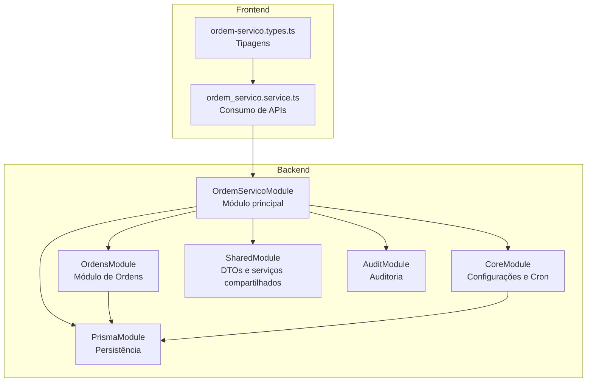
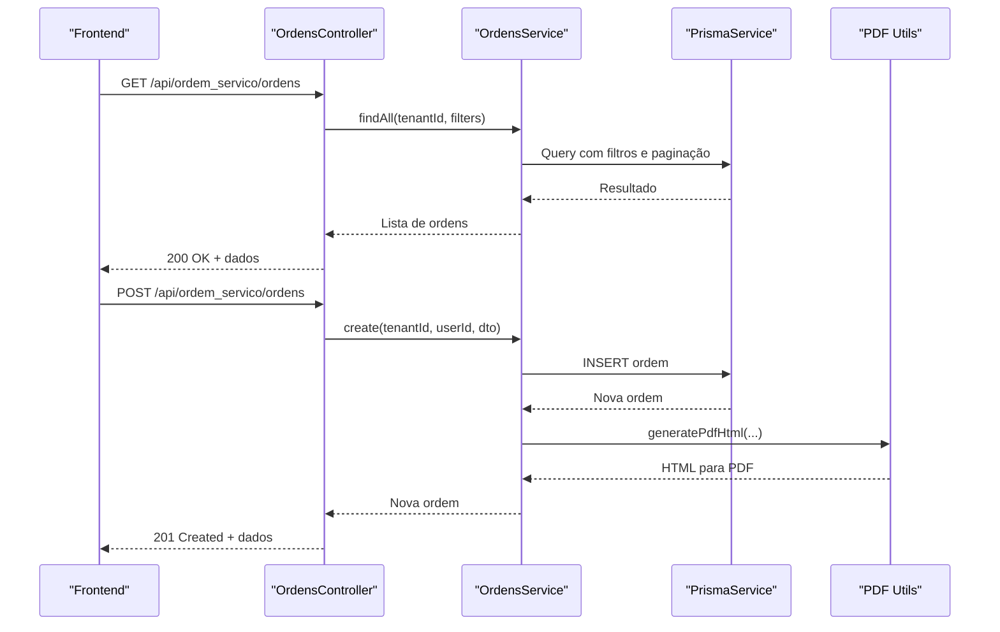
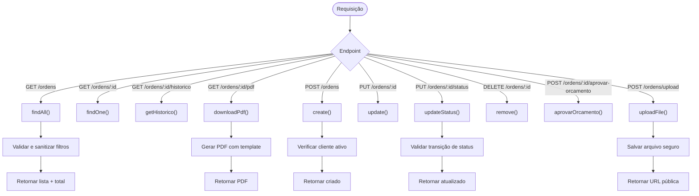
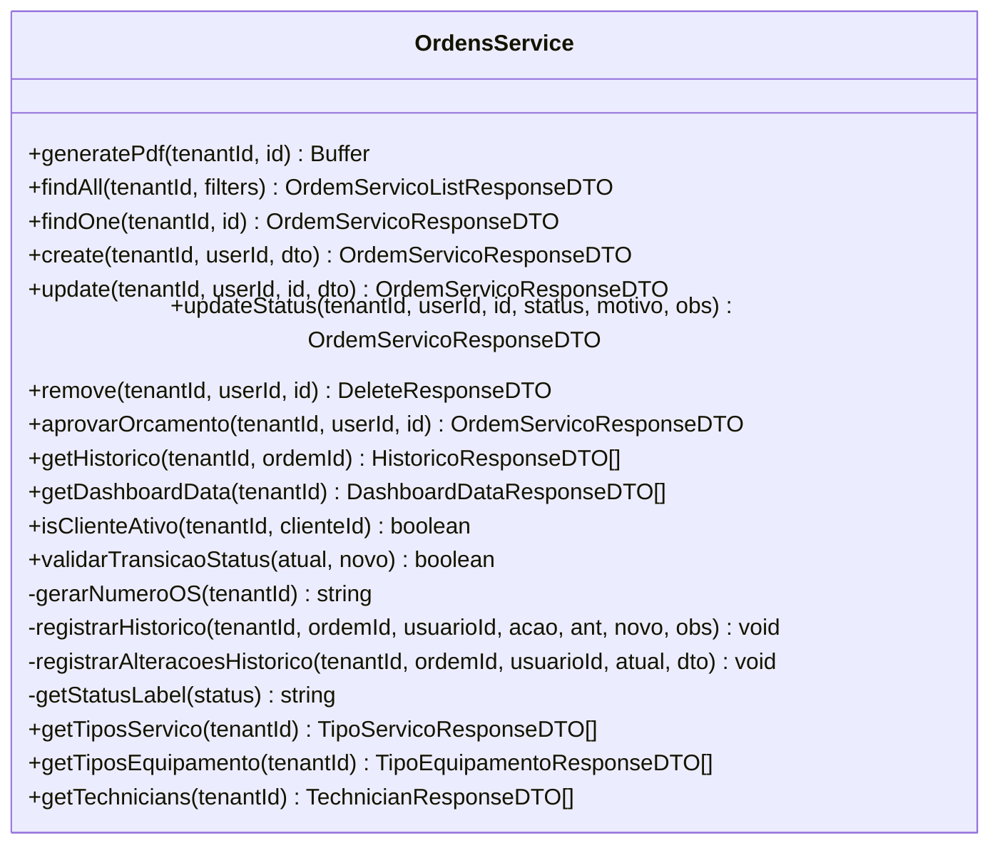
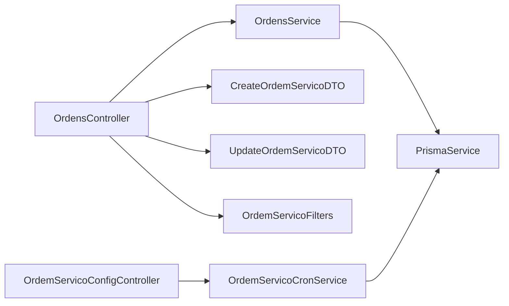

# Visão Geral

<cite>
**Arquivos referenciados neste documento**
- [backend/ordens/ordens.module.ts](file://backend/ordens/ordens.module.ts)
- [backend/ordens/ordens.controller.ts](file://backend/ordens/ordens.controller.ts)
- [backend/ordens/ordens.service.ts](file://backend/ordens/ordens.service.ts)
- [backend/ordens/pdf-template.util.ts](file://backend/ordens/pdf-template.util.ts)
- [backend/shared/dto/ordem-servico.dto.ts](file://backend/shared/dto/ordem-servico.dto.ts)
- [backend/core/ordem-servico-config.controller.ts](file://backend/core/ordem-servico-config.controller.ts)
- [backend/core/ordem-servico-cron.service.ts](file://backend/core/ordem-servico-cron.service.ts)
- [backend/ordem_servico.module.ts](file://backend/ordem_servico.module.ts)
- [backend/routes.ts](file://backend/routes.ts)
- [backend/migrations/004_add_tables_os.sql](file://backend/migrations/004_add_tables_os.sql)
- [backend/module.config.json](file://backend/module.config.json)
- [backend/module.json](file://backend/module.json)
- [frontend/services/ordem_servico.service.ts](file://frontend/services/ordem_servico.service.ts)
- [frontend/types/ordem-servico.types.ts](file://frontend/types/ordem-servico.types.ts)
</cite>

## Sumário
1. [Introdução](#introdução)
2. [Estrutura do Projeto](#estrutura-do-projeto)
3. [Componentes Principais](#componentes-principais)
4. [Visão Geral da Arquitetura](#visão-geral-da-arquitetura)
5. [Análise Detalhada dos Componentes](#análise-detalhada-dos-componentes)
6. [Análise de Dependências](#análise-de-dependências)
7. [Considerações de Desempenho](#considerações-de-desempenho)
8. [Guia de Solução de Problemas](#guia-de-solução-de-problemas)
9. [Conclusão](#conclusão)
10. [Apêndices](#apêndices)

## Introdução
O módulo de Ordens de Serviço é um componente central do sistema que gerencia todo o ciclo de vida de uma ordem: criação, acompanhamento, histórico, geração de PDF e integração com configurações e notificações automáticas. Ele oferece:
- Controle rigoroso de transições de status com validações
- Persistência de dados estruturados com suporte a equipamentos, formatações e itens
- Geração de PDF com templates otimizados
- Histórico detalhado de todas as alterações
- Integração com configurações globais e notificações agendadas

O módulo é composto por camadas bem definidas: módulo principal, controlador, serviço, DTOs, utilitários de PDF e configurações de módulo.

## Estrutura do Projeto
O módulo segue uma arquitetura modular com separação clara entre backend e frontend. O backend é uma aplicação NestJS com:
- Um módulo principal que agrupa todos os subsistemas
- Um módulo de ordens com controller, service e DTOs
- Um módulo de configurações com controladores e serviços de cron
- Migrações e configurações de módulo

O frontend fornece serviços e tipos para consumir os recursos do backend.

**Fontes do diagrama**
- [backend/ordem_servico.module.ts](file://backend/ordem_servico.module.ts#L11-L31)
- [backend/ordens/ordens.module.ts](file://backend/ordens/ordens.module.ts#L7-L12)
- [backend/core/ordem-servico-config.controller.ts](file://backend/core/ordem-servico-config.controller.ts#L9-L16)
- [frontend/services/ordem_servico.service.ts](file://frontend/services/ordem_servico.service.ts#L1-L20)
- [frontend/types/ordem-servico.types.ts](file://frontend/types/ordem-servico.types.ts#L1-L235)

**Seções fonte**
- [backend/ordem_servico.module.ts](file://backend/ordem_servico.module.ts#L1-L35)
- [backend/ordens/ordens.module.ts](file://backend/ordens/ordens.module.ts#L1-L13)
- [backend/routes.ts](file://backend/routes.ts#L1-L17)

## Componentes Principais
- Módulo principal: OrdemServicoModule
- Módulo de Ordens: OrdensModule
- Controlador de Ordens: OrdensController
- Serviço de Ordens: OrdensService
- DTOs de Ordens: CreateOrdemServicoDTO, UpdateOrdemServicoDTO, OrdemServicoFilters, etc.
- Utilitário de PDF: generatePdfHtml
- Configurações do módulo: OrdemServicoConfigController e OrdemServicoCronService
- Frontend: ordem_servico.service.ts e ordem-servico.types.ts

**Seções fonte**
- [backend/ordens/ordens.controller.ts](file://backend/ordens/ordens.controller.ts#L25-L377)
- [backend/ordens/ordens.service.ts](file://backend/ordens/ordens.service.ts#L1-L1148)
- [backend/shared/dto/ordem-servico.dto.ts](file://backend/shared/dto/ordem-servico.dto.ts#L1-L397)
- [backend/ordens/pdf-template.util.ts](file://backend/ordens/pdf-template.util.ts#L1-L462)
- [backend/core/ordem-servico-config.controller.ts](file://backend/core/ordem-servico-config.controller.ts#L1-L254)
- [backend/core/ordem-servico-cron.service.ts](file://backend/core/ordem-servico-cron.service.ts#L1-L84)
- [frontend/services/ordem_servico.service.ts](file://frontend/services/ordem_servico.service.ts#L1-L20)
- [frontend/types/ordem-servico.types.ts](file://frontend/types/ordem-servico.types.ts#L1-L235)

## Visão Geral da Arquitetura
O fluxo típico de uma operação de ordem segue:
- Requisição HTTP chega ao controlador
- Controlador aplica validações e regras de negócio
- Serviço realiza consultas ao banco e gera PDF quando necessário
- Histórico é registrado para auditoria
- Resposta é retornada ao frontend

**Fontes do diagrama**
- [backend/ordens/ordens.controller.ts](file://backend/ordens/ordens.controller.ts#L34-L179)
- [backend/ordens/ordens.service.ts](file://backend/ordens/ordens.service.ts#L137-L473)
- [backend/ordens/pdf-template.util.ts](file://backend/ordens/pdf-template.util.ts#L2-L462)

## Análise Detalhada dos Componentes

### Módulo de Ordens
Responsável por agrupar o controlador e serviço de ordens, além de integrar com o módulo de persistência e compartilhado.

**Seções fonte**
- [backend/ordens/ordens.module.ts](file://backend/ordens/ordens.module.ts#L1-L13)

### Controlador de Ordens
Fornece endpoints REST para:
- Listagem com filtros e paginação
- Detalhe, histórico e PDF
- Criação, atualização, aprovação de orçamento e exclusão
- Atualização de status com validações de transição
- Upload de arquivos anexos

**Fontes do diagrama**
- [backend/ordens/ordens.controller.ts](file://backend/ordens/ordens.controller.ts#L34-L377)
- [backend/ordens/ordens.service.ts](file://backend/ordens/ordens.service.ts#L125-L135)

**Seções fonte**
- [backend/ordens/ordens.controller.ts](file://backend/ordens/ordens.controller.ts#L25-L377)

### Serviço de Ordens
Implementa a lógica de negócio:
- Geração de PDF com Puppeteer e template HTML
- Validação de transições de status
- Histórico de alterações
- Busca com filtros avançados e paginação
- Criação e atualização com tratamento robusto de dados

**Fontes do diagrama**
- [backend/ordens/ordens.service.ts](file://backend/ordens/ordens.service.ts#L9-L1148)

**Seções fonte**
- [backend/ordens/ordens.service.ts](file://backend/ordens/ordens.service.ts#L15-L123)
- [backend/ordens/ordens.service.ts](file://backend/ordens/ordens.service.ts#L125-L991)
- [backend/ordens/ordens.service.ts](file://backend/ordens/ordens.service.ts#L993-L1148)

### DTOs de Ordens
Define os contratos de entrada, saída e filtros com validações e enums para status e origem.

**Seções fonte**
- [backend/shared/dto/ordem-servico.dto.ts](file://backend/shared/dto/ordem-servico.dto.ts#L1-L397)
- [frontend/types/ordem-servico.types.ts](file://frontend/types/ordem-servico.types.ts#L87-L235)

### Utilitário de PDF
Gera HTML com base em um template e converte para PDF usando Puppeteer com configurações otimizadas.

**Seções fonte**
- [backend/ordens/pdf-template.util.ts](file://backend/ordens/pdf-template.util.ts#L1-L462)

### Configurações do Módulo
Controlador e serviço de configuração:
- Notificações automáticas com cron
- Tipos de serviço e equipamento
- Papéis de usuários (técnicos, atendentes, administradores)
- Consultas de técnicos e usuários

**Seções fonte**
- [backend/core/ordem-servico-config.controller.ts](file://backend/core/ordem-servico-config.controller.ts#L1-L254)
- [backend/core/ordem-servico-cron.service.ts](file://backend/core/ordem-servico-cron.service.ts#L1-L84)

### Frontend
- Serviço para consumir endpoints do backend
- Tipagens TypeScript para entidades e filtros

**Seções fonte**
- [frontend/services/ordem_servico.service.ts](file://frontend/services/ordem_servico.service.ts#L1-L20)
- [frontend/types/ordem-servico.types.ts](file://frontend/types/ordem-servico.types.ts#L1-L235)

## Análise de Dependências
O módulo de ordens depende de:
- PrismaModule para persistência
- SharedModule para DTOs e serviços compartilhados
- CoreModule para configurações e cron
- ClientesModule e ProdutosModule para relacionamentos

**Fontes do diagrama**
- [backend/ordens/ordens.module.ts](file://backend/ordens/ordens.module.ts#L1-L13)
- [backend/ordens/ordens.controller.ts](file://backend/ordens/ordens.controller.ts#L1-L30)
- [backend/ordens/ordens.service.ts](file://backend/ordens/ordens.service.ts#L1-L13)
- [backend/core/ordem-servico-config.controller.ts](file://backend/core/ordem-servico-config.controller.ts#L1-L16)
- [backend/core/ordem-servico-cron.service.ts](file://backend/core/ordem-servico-cron.service.ts#L1-L12)

**Seções fonte**
- [backend/ordem_servico.module.ts](file://backend/ordem_servico.module.ts#L11-L31)
- [backend/routes.ts](file://backend/routes.ts#L1-L17)

## Considerações de Desempenho
- Paginação e limites de resultados configuráveis
- Sanitização de entradas e validações manuais para evitar injeção
- Uso de consultas parametrizadas e raw queries otimizadas
- Geração de PDF com Puppeteer em modo headless e argumentos otimizados
- Validação de transições de status para evitar estados inconsistentes

[Sem fontes específicas, pois esta seção fornece orientações gerais]

## Guia de Solução de Problemas
- Erros de serialização JSON: verifique campos aninhados e arrays antes de retornar
- Upload de arquivos: certifique-se de que o buffer seja um Buffer válido e que o diretório de uploads esteja criado
- PDF não gera: verifique permissões de escrita e configurações do Puppeteer
- Status inválido: confirme que a transição está dentro do conjunto permitido

**Seções fonte**
- [backend/ordens/ordens.controller.ts](file://backend/ordens/ordens.controller.ts#L310-L355)
- [backend/ordens/ordens.service.ts](file://backend/ordens/ordens.service.ts#L117-L123)
- [backend/ordens/ordens.service.ts](file://backend/ordens/ordens.service.ts#L988-L991)

## Conclusão
O módulo de Ordens de Serviço oferece uma implementação robusta e escalável, com:
- Controle rigoroso de estados e transições
- Histórico completo de auditoria
- Geração de PDF profissional
- Integração com notificações automáticas
- Tipagem forte tanto no backend quanto no frontend

[Sem fontes específicas, pois esta seção resume sem análise de arquivos]

## Apêndices

### Exemplos de Casos de Uso
- Criar uma ordem de serviço com cliente ativo e dados do equipamento
- Aprovar um orçamento e atualizar o status para aberta
- Finalizar uma ordem com valor definido e registrar histórico
- Gerar PDF para impressão com logotipo e condições de execução
- Filtrar ordens por status, cliente e período

**Seções fonte**
- [backend/ordens/ordens.controller.ts](file://backend/ordens/ordens.controller.ts#L159-L179)
- [backend/ordens/ordens.controller.ts](file://backend/ordens/ordens.controller.ts#L286-L308)
- [backend/ordens/ordens.controller.ts](file://backend/ordens/ordens.controller.ts#L135-L157)
- [backend/ordens/ordens.service.ts](file://backend/ordens/ordens.service.ts#L557-L654)
- [backend/ordens/ordens.service.ts](file://backend/ordens/ordens.service.ts#L772-L829)

### Interfaces Públicas e Parâmetros
- GET /api/ordem_servico/ordens
  - Parâmetros de consulta: search, status[], cliente_id, usuario_responsavel_id, data_inicio, data_fim, origem_solicitacao, tipo_servico, page, limit
  - Retorno: OrdemServicoListResponseDTO
- POST /api/ordem_servico/ordens
  - Corpo: CreateOrdemServicoDTO
  - Retorno: OrdemServicoResponseDTO
- PUT /api/ordem_servico/ordens/:id
  - Corpo: UpdateOrdemServicoDTO
  - Retorno: OrdemServicoResponseDTO
- PUT /api/ordem_servico/ordens/:id/status
  - Corpo: UpdateStatusDTO
  - Retorno: OrdemServicoResponseDTO
- GET /api/ordem_servico/ordens/:id/pdf
  - Retorno: PDF binário
- POST /api/ordem_servico/ordens/upload
  - FormData: file
  - Retorno: UploadResponseDTO

**Seções fonte**
- [backend/ordens/ordens.controller.ts](file://backend/ordens/ordens.controller.ts#L34-L377)
- [backend/shared/dto/ordem-servico.dto.ts](file://backend/shared/dto/ordem-servico.dto.ts#L249-L291)

### Configurações do Módulo
- Permissões: view, create, edit, delete, admin
- Rotas protegidas: dashboard, lista, configurações
- Itens de menu: Dashboard, Ordens de Serviço, Clientes, Produtos/Serviços, Configurações
- Configurações padrão: notificações, widgets, máximo de itens

**Seções fonte**
- [backend/module.config.json](file://backend/module.config.json#L24-L79)
- [backend/module.json](file://backend/module.json#L11-L48)

### Migrações e Tabelas
- Tabelas principais: mod_ordem_servico_ordens, mod_ordem_servico_configs, mod_ordem_servico_historico
- Ajustes: colunas de formatação e laudo técnico
- Triggers: atualização automática de updated_at

**Seções fonte**
- [backend/migrations/004_add_tables_os.sql](file://backend/migrations/004_add_tables_os.sql#L6-L80)